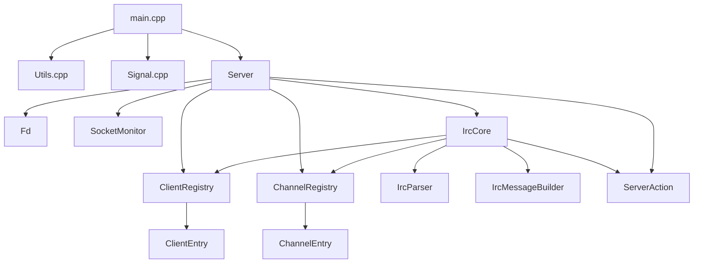
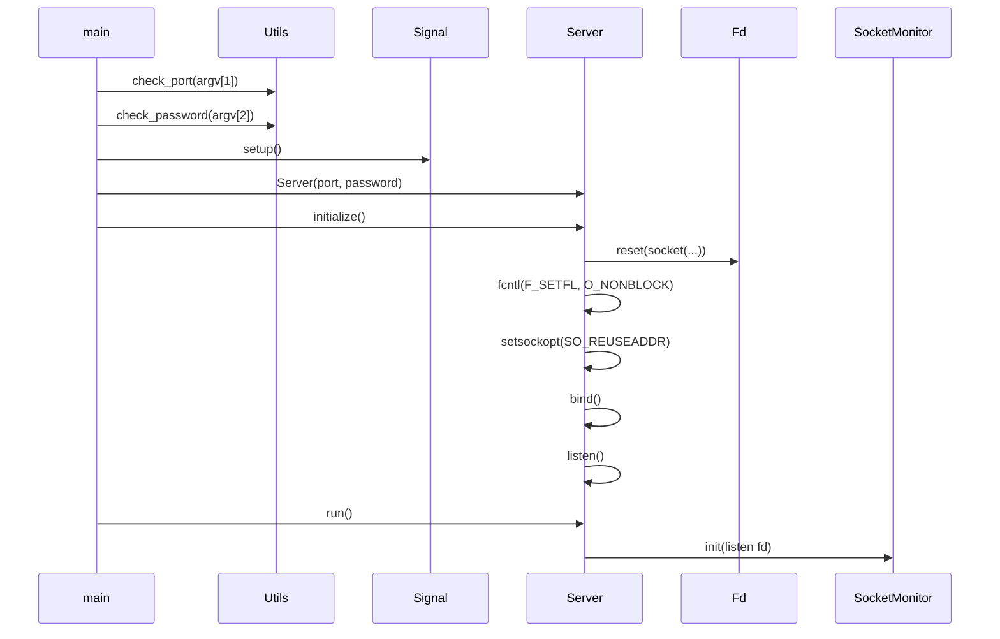
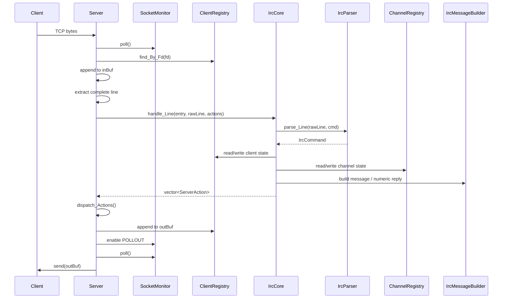
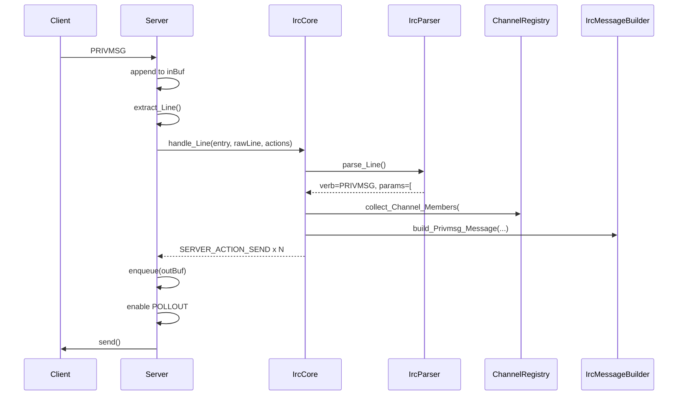
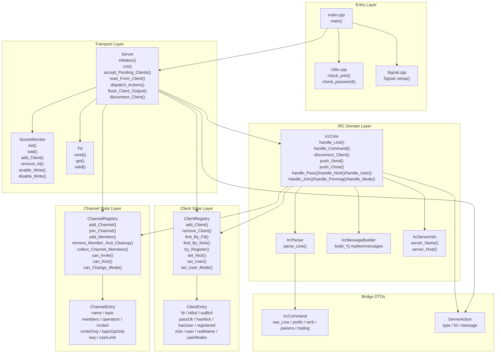
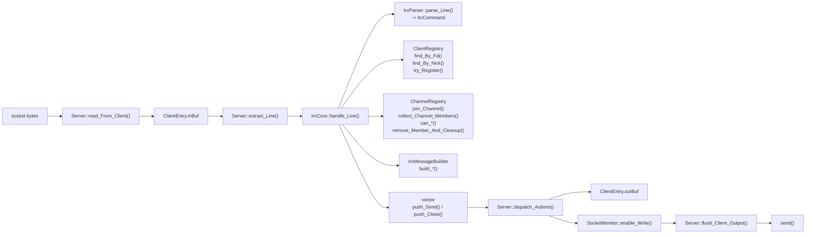
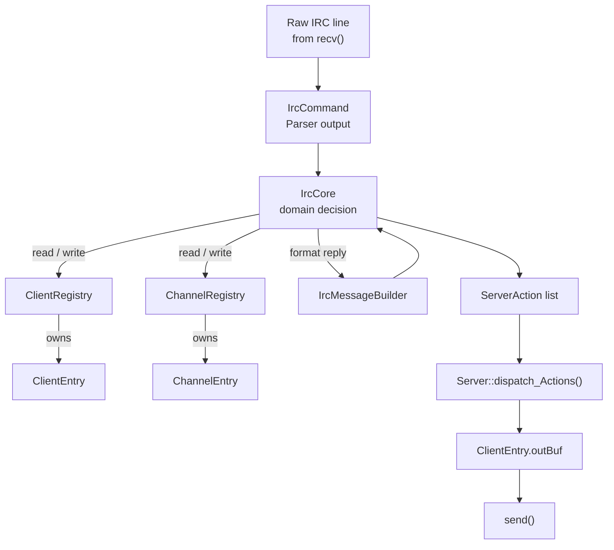

# ft_irc Architecture Guide

> 목적: 현재 코드 기준으로 `ft_irc`의 전체 구조, 레이어 분리, 데이터 흐름, 책임 경계,
> 그리고 앞으로 코드를 읽거나 수정할 때 어디를 먼저 봐야 하는지를 한 파일에서 이해하기 위한 문서입니다.

---

## 1. 한눈에 보는 구조

### 1.1 핵심 요약

현재 구조는 아래 한 문장으로 요약할 수 있습니다.

- `main`이 서버를 시작한다.
- `Server`가 소켓과 이벤트 루프를 돌린다.
- `IrcCore`가 IRC 규칙을 판단한다.
- `ClientRegistry`와 `ChannelRegistry`가 상태를 보관한다.
- `ServerAction`이 `IrcCore -> Server` 사이의 실행 지시 역할을 한다.

즉, 이 프로젝트는 크게 아래 두 레이어로 나뉩니다.

- **Transport / Runtime 레이어**: 소켓, `poll()`, `recv()`, `send()`, 버퍼, 연결 종료
- **IRC Domain 레이어**: `PASS`, `NICK`, `USER`, `JOIN`, `PRIVMSG`, `MODE` 같은 프로토콜 규칙

이 둘 사이를 이어 주는 것이 `ServerAction`입니다.

### 1.2 설계 목표

이 코드가 지향하는 기준은 다음과 같습니다.

1. 과하게 추상화하지 않는다.
2. 하지만 소켓 처리와 IRC 규칙 처리는 섞지 않는다.
3. 작은 DTO와 registry를 사용해서 데이터 흐름을 눈으로 따라가기 쉽게 만든다.
4. 지금은 `poll()` 기반이지만, 나중에 `epoll`로 옮길 수 있도록 이벤트 감시 계층은 분리해 둔다.

---

## 2. 레이어 구조



### 2.1 레이어별 책임

| 레이어 | 핵심 타입 | 책임 |
|---|---|---|
| Entry | `main`, `Utils`, `Signal` | 실행 인자 검증, 시그널 처리, 서버 시작 |
| Transport | `Server`, `SocketMonitor`, `Fd` | 소켓 생성, `poll()`, accept/read/write, 종료 처리 |
| Client State | `ClientEntry`, `ClientRegistry` | 클라이언트별 fd, 버퍼, 등록 상태, 닉/유저 상태 보관 |
| Channel State | `ChannelEntry`, `ChannelRegistry` | 채널 멤버/오퍼레이터/초대/키/리밋 상태 보관 |
| IRC Domain | `IrcParser`, `IrcCore`, `IrcMessageBuilder`, `IrcServerInfo` | 명령 파싱, 규칙 처리, 응답 문자열 생성 |
| Bridge DTO | `IrcCommand`, `ServerAction` | 레이어 사이에서 의미 있는 데이터를 전달 |

---

## 3. 디렉터리와 파일 역할

### 3.1 시작 / 유틸리티

| 파일 | 역할 |
|---|---|
| [srcs/main.cpp](srcs/main.cpp) | 프로그램 진입점, 인자 검증, `Server.initialize()`, `Server.run()` 호출 |
| [srcs/Utils.cpp](srcs/Utils.cpp) | 포트와 비밀번호 검증 |
| [srcs/Signal.cpp](srcs/Signal.cpp) | 종료 시그널 처리, `SIGPIPE` 무시 |

### 3.2 Transport / Event Loop

| 파일 | 역할 |
|---|---|
| [include/Server.hpp](include/Server.hpp), [srcs/Server.cpp](srcs/Server.cpp) | 서버 전체 수명주기, 이벤트 루프, 입력/출력 버퍼, 연결 종료 |
| [include/SocketMonitor.hpp](include/SocketMonitor.hpp), [srcs/SocketMonitor.cpp](srcs/SocketMonitor.cpp) | `pollfd` 저장, `poll()` 호출, write event on/off |
| [include/Fd.hpp](include/Fd.hpp), [srcs/Fd.cpp](srcs/Fd.cpp) | listen fd RAII 래퍼 |

### 3.3 상태 저장소

| 파일 | 역할 |
|---|---|
| [include/ClientEntry.hpp](include/ClientEntry.hpp) | 한 클라이언트의 소켓 정보 + IRC 등록 상태 |
| [include/ClientRegistry.hpp](include/ClientRegistry.hpp), [srcs/ClientRegistry.cpp](srcs/ClientRegistry.cpp) | `fd -> ClientEntry` 저장, 닉 조회, 등록 상태 변경 |
| [include/ChannelEntry.hpp](include/ChannelEntry.hpp) | 한 채널의 멤버/모드/초대 상태 |
| [include/ChannelRegistry.hpp](include/ChannelRegistry.hpp), [srcs/ChannelRegistry.cpp](srcs/ChannelRegistry.cpp) | `channel -> ChannelEntry` 저장, 채널 정책/멤버십/모드 관리 |

### 3.4 IRC 도메인

| 파일 | 역할 |
|---|---|
| [include/IrcCommand.hpp](include/IrcCommand.hpp) | 파싱된 IRC 명령 DTO |
| [include/ServerAction.hpp](include/ServerAction.hpp) | `IrcCore -> Server` 실행 지시 DTO |
| [include/IrcParser.hpp](include/IrcParser.hpp), [srcs/IrcParser.cpp](srcs/IrcParser.cpp) | raw line을 `IrcCommand`로 변환 |
| [include/IrcCore.hpp](include/IrcCore.hpp) | IRC command 엔진의 전체 인터페이스 |
| [srcs/IrcCore.cpp](srcs/IrcCore.cpp) | `handle_Line`, 공통 action push, disconnect flow |
| [srcs/IrcCoreSupport.cpp](srcs/IrcCoreSupport.cpp) | 공통 검증, 라우팅, 에러 helper, MODE support |
| [srcs/IrcCoreRegistration.cpp](srcs/IrcCoreRegistration.cpp) | `PASS`, `NICK`, `USER` |
| [srcs/IrcCoreProtocol.cpp](srcs/IrcCoreProtocol.cpp) | `CAP`, `PING`, `PONG`, `WHO`, unknown |
| [srcs/IrcCoreChannel.cpp](srcs/IrcCoreChannel.cpp) | `JOIN`, `PART`, `PRIVMSG`, `TOPIC`, `INVITE`, `KICK`, `MODE`, `QUIT` |
| [include/IrcMessageBuilder.hpp](include/IrcMessageBuilder.hpp), [srcs/IrcMessageBuilder.cpp](srcs/IrcMessageBuilder.cpp) | numeric reply 및 user-facing message 조립 |
| [include/IrcServerInfo.hpp](include/IrcServerInfo.hpp), [srcs/IrcServerInfo.cpp](srcs/IrcServerInfo.cpp) | 서버 이름/호스트 문자열 제공 |

---

## 4. 핵심 데이터 모델

### 4.1 `ClientEntry`

현재는 클라이언트 관련 상태를 하나의 구조체에 모아두었습니다.

```cpp
struct ClientEntry
{
    int         fd;
    std::string inBuf;
    std::string outBuf;

    bool        passOk;
    bool        hasNick;
    bool        hasUser;
    bool        registered;

    std::string nick;
    std::string user;
    std::string realName;
    std::string userModes;
};
```

### 왜 하나로 합쳤는가?

예전처럼 transport 상태와 IRC 상태를 따로 두면 이론적으로는 더 “정교해” 보일 수 있습니다.
하지만 현재 프로젝트 크기에서는 다음 문제가 더 컸습니다.

- 한 클라이언트를 이해하려면 여러 구조체를 왔다 갔다 봐야 한다.
- `entry.io.fd`, `entry.state.nick` 같은 접근이 반복되어 가독성이 떨어진다.
- 실제로는 “한 클라이언트의 현재 상태”를 나타내는 정보인데 지나치게 쪼개져 있었다.

그래서 지금은 **한 클라이언트의 읽기/쓰기/등록 상태를 `ClientEntry` 하나에 모으는 편이 더 적절한 수준**입니다.

### 4.2 `ChannelEntry`

```cpp
struct ChannelEntry
{
    std::string     name;
    std::string     topic;

    std::set<int>   members;
    std::set<int>   operators;
    std::set<int>   invited;

    bool            inviteOnly;
    bool            topicOpOnly;

    bool            hasKey;
    std::string     key;

    bool            hasLimit;
    size_t          userLimit;
};
```

채널은 결국 “fd 집합 + 모드 상태”이기 때문에 현재 구조가 프로젝트 크기에 잘 맞습니다.

### 4.3 `IrcCommand`

`IrcCommand`는 parser가 만든 결과물입니다.

- `raw_Line`: 원본 라인
- `prefix`: optional prefix
- `verb`: `PASS`, `JOIN`, `PRIVMSG` 같은 명령어
- `params`: 공백 단위 파라미터
- `trailing`: `:` 뒤의 trailing text
- `hasTrailing`: trailing 존재 여부

이 구조가 있는 덕분에 `IrcCore`는 문자열 잘라내기 대신 **이미 파싱된 의미 단위**를 기준으로 로직을 처리합니다.

### 4.4 `ServerAction`

`ServerAction`은 `IrcCore`가 직접 `send()`/`close()`하지 않기 위해 존재합니다.

```cpp
struct ServerAction
{
    ServerActionType type;
    int              fd;
    std::string      message;
};
```

현재는 아래 두 동작만 있으면 충분합니다.

- `SERVER_ACTION_SEND`
- `SERVER_ACTION_CLOSE`

즉 `IrcCore`는 “무슨 일이 일어나야 하는가”만 결정하고,
실제로 네트워크에 쓰는 일은 `Server`가 담당합니다.

---

## 5. 시작 흐름



### 세부 설명

1. `main`이 인자 수를 확인합니다.
2. `check_port()`로 포트를 검증합니다.
3. `check_password()`로 비밀번호를 검증합니다.
4. `Signal::setup()`이 종료 시그널과 `SIGPIPE`를 처리합니다.
5. `Server.initialize()`가 소켓을 생성하고 listen 가능한 상태로 만듭니다.
6. `Server.run()`이 이벤트 루프를 시작합니다.

---

## 6. 런타임 데이터 흐름

### 6.1 가장 중요한 전체 흐름



### 6.2 실제 의미

이 서버는 계속 아래 세 단계를 반복합니다.

1. `Server`가 네트워크 입력을 받는다.
2. `IrcCore`가 입력을 해석하고 규칙을 적용한다.
3. `Server`가 그 결과를 실제 소켓 I/O로 실행한다.

즉, **입력 수집과 도메인 판단과 실제 전송이 단계별로 분리**되어 있습니다.

---

## 7. Transport 레이어 상세

### 7.1 `Server`

`Server`의 책임은 아래로 제한되어 있습니다.

- listen socket 생성
- accepted client socket non-blocking 설정
- `poll()` 대기
- 새 연결 accept
- `recv()`로 입력 읽기
- `inBuf`에 누적
- 줄 단위로 분리
- `IrcCore` 호출
- `ServerAction` 실행
- `outBuf`를 `send()`로 비우기
- 에러/종료/정리 처리

즉, `Server`는 **네트워크 실행기**입니다.

### 7.2 입력 처리 흐름

`read_From_Client()`는 아래 순서로 동작합니다.

1. fd로 `ClientEntry`를 찾습니다.
2. `recv()`를 반복 호출합니다.
3. 받은 바이트를 `entry.inBuf`에 append합니다.
4. `extract_Line()`으로 완성된 한 줄씩 꺼냅니다.
5. 각 줄을 `IrcCore.handle_Line()`에 넘깁니다.
6. `IrcCore`가 만든 `ServerAction`을 `dispatch_Actions()`로 실행합니다.

### 7.3 출력 처리 흐름

`flush_Client_Output()`는 아래 순서로 동작합니다.

1. `entry.outBuf`가 비어 있으면 `POLLOUT`을 끕니다.
2. 비어 있지 않으면 `send()`를 반복 시도합니다.
3. 일부만 보내졌으면 남은 데이터를 `outBuf`에 유지합니다.
4. 전부 보내면 `POLLOUT`을 끕니다.

### 7.4 backpressure 정책

출력 버퍼는 무한정 커지지 않습니다.

- `MAX_OUTBUF`를 넘기면 `ENQUEUE_BUFFER_FULL`
- 해당 클라이언트는 `Send queue full` 이유로 disconnect

이 정책 덕분에 느린 수신자 때문에 서버 전체가 조용히 메모리를 계속 잡아먹는 상황을 막습니다.

### 7.5 `SocketMonitor`

`SocketMonitor`는 아래 역할만 합니다.

- `pollfd` 배열 보관
- listen fd와 client fd 관리
- `poll()` 호출
- 특정 fd의 write event on/off

즉, `Server`가 `std::vector<pollfd>`를 직접 만지지 않게 해주는 작은 adapter입니다.

### 왜 필요한가?

현재도 `Server`는 `POLLIN`, `POLLOUT`, `POLLERR` 의미를 알고 있습니다.
따라서 완전한 backend 추상화는 아닙니다.
하지만 아래 두 가지 점에서 여전히 가치가 있습니다.

- `pollfd` 저장/삽입/삭제 로직이 `Server`에서 빠진다.
- 나중에 `epoll`로 옮길 때 바꾸기 시작할 지점이 분명해진다.

즉, **지금 수준에서는 유지 가치가 충분합니다.**

### 7.6 `Fd`

`Fd`는 listen socket 하나를 RAII로 닫아 주는 매우 작은 래퍼입니다.

### 유지해도 되는 이유

- 소멸 시 close 책임이 분명합니다.
- `Server` 내부에서 listen fd lifecycle이 읽기 쉽습니다.

### 굳이 없애도 되는 이유

- 현재는 listen fd 하나에만 쓰입니다.
- 추상화 비용 대비 기능이 매우 작습니다.

### 현재 판단

- `SocketMonitor`는 유지 추천
- `Fd`는 **유지해도 무방하지만, 더 단순화를 원하면 `int _listenFd`로 되돌려도 큰 문제는 없음**

즉 `Fd`는 선택이고, `SocketMonitor`는 구조상 유지 가치가 더 큽니다.

---

## 8. 상태 저장소 상세

### 8.1 `ClientRegistry`

`ClientRegistry`는 `fd -> ClientEntry`를 소유합니다.

핵심 역할은 다음과 같습니다.

- client 추가/삭제
- fd로 client 찾기
- nick으로 client 찾기
- 등록 상태 판단
- PASS/NICK/USER 결과 반영
- user mode(`+i`, `+w` 등) 저장

즉, 클라이언트 상태의 single source of truth 역할입니다.

### 8.2 `ChannelRegistry`

`ChannelRegistry`는 `channel name -> ChannelEntry`를 소유합니다.

핵심 역할은 다음과 같습니다.

- 채널 생성/삭제
- 멤버 추가/삭제
- operator 추가/삭제
- invite 상태 관리
- key/limit/topic/mode 상태 관리
- channel policy 판단
  - invite-only 여부
  - topic 변경 권한
  - kick/invite/mode 변경 가능 여부

즉, 채널 관련 도메인 규칙의 많은 부분이 registry 안쪽으로 내려가 있습니다.
이는 `IrcCore`가 채널 내부 자료구조를 직접 만지는 범위를 줄여 줍니다.

---

## 9. IRC Domain 레이어 상세

### 9.1 `IrcParser`

`IrcParser`는 raw IRC line을 `IrcCommand`로 바꿉니다.

이 레이어가 담당하는 것은 순수하게 문자열 해석입니다.

- CR 제거
- leading spaces skip
- optional prefix 파싱
- verb 파싱
- params / trailing 분리

따라서 `IrcCore`는 “문자열 자르기”가 아니라 “명령 의미 처리”에 집중할 수 있습니다.

### 9.2 `IrcCore`

`IrcCore`는 이 프로젝트의 도메인 엔진입니다.

핵심 책임은 다음과 같습니다.

- 등록 전/후 허용 명령 판단
- `PASS`, `NICK`, `USER`, `JOIN`, `PRIVMSG`, `MODE` 규칙 처리
- `ClientRegistry`, `ChannelRegistry` 상태 변경
- `IrcMessageBuilder`를 통한 응답 문자열 생성
- 결과를 `ServerAction`으로 반환

중요한 점은 아래입니다.

- `IrcCore`는 직접 `send()`를 호출하지 않습니다.
- `IrcCore`는 직접 `close(fd)`를 호출하지 않습니다.
- 대신 `ServerAction`을 쌓아 `Server`에 넘깁니다.

이게 현재 구조의 가장 중요한 경계입니다.

### 파일 분리 이유

`IrcCore`는 기능이 많기 때문에 역할별로 파일이 나뉘어 있습니다.

- `IrcCore.cpp`: 진입점, 공통 action push, disconnect flow
- `IrcCoreSupport.cpp`: 공통 검증, routing helper, MODE helper
- `IrcCoreRegistration.cpp`: 등록 명령
- `IrcCoreProtocol.cpp`: 프로토콜성 명령
- `IrcCoreChannel.cpp`: 채널/메시징/운영자 명령

이 분리는 “클래스를 늘린 것”이 아니라 **한 클래스의 구현을 읽기 좋은 파일 단위로 나눈 것**에 가깝습니다.

### 9.3 `IrcMessageBuilder`

문자열 reply 생성은 `IrcCore` 안에 직접 섞지 않고 `IrcMessageBuilder`로 분리했습니다.

이 분리의 장점은 다음과 같습니다.

- 규칙 처리 코드와 출력 형식 코드를 분리한다.
- numeric reply와 user-facing message를 한 곳에서 관리한다.
- prefix/server name 등 포맷 실수를 줄인다.

즉, `IrcCore`는 “무슨 메시지를 보내야 하는가”를 결정하고,
`IrcMessageBuilder`는 “그 메시지를 어떻게 문자열로 만들 것인가”를 담당합니다.

---

## 10. end-to-end 예시

### 10.1 `PRIVMSG #room :hello`

아래는 실제 흐름을 가장 잘 보여 주는 대표 예시입니다.



### 10.2 연결 종료 흐름

연결 종료도 공통 경로를 타도록 정리되어 있습니다.

1. `Server`가 read/write error 또는 EOF를 감지합니다.
2. `disconnect_Client()`를 호출합니다.
3. `IrcCore.disconnect_Client()`가 shared peers를 찾습니다.
4. 필요한 `QUIT` 메시지를 `ServerAction`으로 만듭니다.
5. `Server`가 이를 실행하고 최종적으로 fd를 닫고 registry/monitor에서 제거합니다.

이 구조 덕분에 정상 `QUIT`과 비정상 소켓 종료가 최대한 비슷한 의미 흐름을 가집니다.

---

## 11. `poll()`과 non-blocking에 대한 정확한 설명

이 질문은 자주 헷갈리기 때문에 명확히 적어 둡니다.

### 결론

- `poll()` 자체는 blocking이어도 됩니다.
- 중요한 것은 **감시 대상 fd들이 non-blocking** 이어야 한다는 점입니다.
- 현재 구현은 그 기준을 만족합니다.

### 현재 코드의 의미

- listen fd: `fcntl(fd, F_SETFL, O_NONBLOCK)`
- accepted client fd: `fcntl(fd, F_SETFL, O_NONBLOCK)`
- 이벤트 대기: `_monitor.wait(-1)` -> 내부 `poll()`

즉, 구조는 아래와 같습니다.

1. `poll()`이 “지금 읽을 수 있나 / 쓸 수 있나”를 기다린다.
2. 준비된 fd에 대해서만 `recv()`/`send()`를 시도한다.
3. 실제 소켓은 non-blocking이므로 한 fd 때문에 프로세스 전체가 멈추지 않는다.

이건 subject의 의도와 맞는 구현입니다.

---

## 12. 왜 `IrcCommand`와 `ServerAction`이 필요한가?

### 12.1 `IrcCommand`

유지하는 것이 맞습니다.

없애면 결국 각 handler가 raw string을 직접 다시 해석해야 해서,
파싱 책임과 도메인 로직이 섞이게 됩니다.

즉 `IrcCommand`는 **Parser -> Core 경계 DTO**로서 가치가 분명합니다.

### 12.2 `ServerAction`

이것도 현재 구조에서는 유지하는 것이 맞습니다.

없애면 아래 둘 중 하나가 필요해집니다.

- `IrcCore`가 `Server`나 소켓 API를 직접 안다.
- callback / interface / executor 추상화를 새로 만든다.

둘 다 지금 프로젝트 크기에서는 오히려 더 과합니다.

즉 `ServerAction`은 작지만 의미 있는 DTO이고,
현재 레이어 분리를 유지하는 가장 간단한 방법입니다.

---

## 13. 현재 구조에서 잘된 점

- `Server`와 `IrcCore` 역할이 분리되어 있다.
- `ClientEntry` 통합으로 한 클라이언트 상태를 따라가기 쉬워졌다.
- `ChannelRegistry`가 채널 정책을 많이 캡슐화하고 있다.
- `IrcMessageBuilder` 덕분에 문자열 포맷 책임이 분리되어 있다.
- `SocketMonitor`가 있어서 이벤트 감시 계층의 교체 지점이 있다.
- `ServerAction`을 통해 Core가 socket syscall에 직접 의존하지 않는다.

---

## 14. 앞으로 수정할 때의 기준

### 유지하면 좋은 경계

- `Server`는 소켓과 버퍼만 책임진다.
- `IrcCore`는 규칙 판단만 책임진다.
- Registry는 상태 저장과 상태 질의를 책임진다.
- Builder는 문자열 포맷만 책임진다.

### 가능하면 피할 것

- `IrcCore`에서 직접 `send()`/`recv()`/`close()` 호출하기
- `Server`에서 IRC command별 규칙을 처리하기
- `ChannelEntry` 내부 자료구조를 `IrcCore`가 직접 만지기
- 문자열 reply 포맷 코드를 여러 handler에 중복해서 넣기

---

## 15. 코드를 처음 읽을 때 추천 순서

처음 구조를 다시 잡고 싶다면 아래 순서가 가장 편합니다.

1. [srcs/main.cpp](srcs/main.cpp)
2. [include/Server.hpp](include/Server.hpp)
3. [srcs/Server.cpp](srcs/Server.cpp)
4. [include/ClientEntry.hpp](include/ClientEntry.hpp)
5. [include/ClientRegistry.hpp](include/ClientRegistry.hpp)
6. [include/ChannelEntry.hpp](include/ChannelEntry.hpp)
7. [include/ChannelRegistry.hpp](include/ChannelRegistry.hpp)
8. [include/IrcCore.hpp](include/IrcCore.hpp)
9. [srcs/IrcCore.cpp](srcs/IrcCore.cpp)
10. [srcs/IrcCoreRegistration.cpp](srcs/IrcCoreRegistration.cpp)
11. [srcs/IrcCoreChannel.cpp](srcs/IrcCoreChannel.cpp)
12. [srcs/IrcMessageBuilder.cpp](srcs/IrcMessageBuilder.cpp)

이 순서로 보면 “서버가 어떻게 돌고, 데이터가 어디서 어디로 흐르는지”가 가장 빨리 잡힙니다.

---

## 16. 최종 판단

현재 구조는 이 프로젝트 크기에 대해 **과하지 않으면서도 레이어가 보이는 편**입니다.

특히 아래 선택은 현재 기준에서 적절합니다.

- `ClientEntry` 통합: 적절함
- `ServerAction` 유지: 적절함
- `IrcCommand` 유지: 적절함
- `SocketMonitor` 유지: 적절함
- `Fd`: 유지 가능, 다만 가장 제거해도 되는 후보

즉 지금 코드는 “필수 과제만 겨우 통과하려는 구조”보다는,
**누가 읽어도 역할과 데이터 흐름이 보이도록 정리된 small IRC server 구조**에 가깝습니다.

---

## 17. 한 장으로 다시 보는 전체 아키텍처

이 섹션은 문서 전체를 읽고 난 뒤 마지막에 다시 보는 요약판입니다.
핵심 목표는 아래 세 가지입니다.

- 어느 레이어에 어떤 클래스와 함수가 있는지
- 어떤 데이터가 어떤 형태로 이동하는지
- 실제 런타임에서 어떤 순서로 호출이 이어지는지

### 17.1 레이어별 함수 지도



#### ASCII 버전

```text
[Entry Layer]
  main()
   |- check_port()
   |- check_password()
   |- Signal::setup()
   `- Server.initialize() / Server.run()

[Transport Layer]
  Server
   |- init_Socket() / init_Bind() / init_Listen()
   |- accept_Pending_Clients()
   |- read_From_Client()
   |- dispatch_Actions()
   `- flush_Client_Output()

  SocketMonitor
   |- init()
   |- wait()
   |- add_Client() / remove_At()
   `- enable_Write() / disable_Write()

  Fd
   `- reset() / get() / valid()

[Client State Layer]
  ClientRegistry
   |- add_Client() / remove_Client()
   |- find_By_Fd() / find_By_Nick()
   |- try_Register()
   `- set_Nick() / set_User() / set_User_Mode()

  ClientEntry
   `- fd / inBuf / outBuf / passOk / hasNick / hasUser / registered
      nick / user / realName / userModes

[Channel State Layer]
  ChannelRegistry
   |- add_Channel() / join_Channel()
   |- add_Member() / remove_Member_And_Cleanup()
   |- collect_Channel_Members()
   `- can_Invite() / can_Kick() / can_Change_Mode()

  ChannelEntry
   `- name / topic / members / operators / invited / modes / key / limit

[IRC Domain Layer]
  IrcParser          -> parse_Line()
  IrcCore            -> handle_Line() / handle_Command() / handle_*()
  IrcMessageBuilder  -> build_*()
  IrcServerInfo      -> server_Name() / server_Host()

[Bridge DTOs]
  IrcCommand   -> raw_Line / prefix / verb / params / trailing
  ServerAction -> type / fd / message
```

### 17.2 런타임 호출 흐름



#### ASCII 버전

```text
socket bytes
    |
    v
Server::read_From_Client()
    |
    v
ClientEntry.inBuf
    |
    v
Server::extract_Line()
    |
    v
IrcCore::handle_Line()
    |
    +--> IrcParser::parse_Line()
    |       `-> IrcCommand
    |
    +--> ClientRegistry
    |       |- find_By_Fd()
    |       |- find_By_Nick()
    |       `- try_Register()
    |
    +--> ChannelRegistry
    |       |- join_Channel()
    |       |- collect_Channel_Members()
    |       `- can_*() / remove_Member_And_Cleanup()
    |
    +--> IrcMessageBuilder
    |       `- build_*()
    |
    `-> vector<ServerAction>
            |- push_Send()
            `- push_Close()
                    |
                    v
           Server::dispatch_Actions()
                    |
                    +--> ClientEntry.outBuf
                    +--> SocketMonitor::enable_Write()
                    `--> Server::flush_Client_Output()
                              |
                              v
                            send()
```

### 17.3 데이터 흐름 지도



#### ASCII 버전

```text
Raw IRC line from recv()
    |
    v
IrcCommand  (Parser output)
    |
    v
IrcCore     (domain decision)
    |
    +--> read/write ClientRegistry
    |       `-> owns ClientEntry
    |
    +--> read/write ChannelRegistry
    |       `-> owns ChannelEntry
    |
    +--> ask IrcMessageBuilder to format reply
    |
    `-> produce ServerAction list
             |
             v
       Server::dispatch_Actions()
             |
             v
       ClientEntry.outBuf
             |
             v
            send()
```

### 17.4 층별 관점에서 다시 정리

| 레이어 | 들어오는 데이터 | 처리 함수 | 나가는 데이터 |
|---|---|---|---|
| Entry | argv, signal | `main()`, `check_port()`, `check_password()`, `Signal::setup()` | `Server` 시작 |
| Transport | socket bytes, poll events | `run()`, `accept_Pending_Clients()`, `read_From_Client()`, `flush_Client_Output()` | raw line, disconnect event, sent bytes |
| Parser | raw line | `IrcParser::parse_Line()` | `IrcCommand` |
| Domain | `ClientEntry`, `IrcCommand`, registries | `handle_Line()`, `handle_Command()`, 각 `handle_*()` | `ServerAction` 목록 |
| State | fd, nick, channel name, mode param | `find_By_*()`, `try_Register()`, `join_Channel()`, `can_*()` | 갱신된 client/channel 상태 |
| Message | semantic reply intent | `build_*()` | IRC protocol string |
| Transport execute | `ServerAction` | `dispatch_Actions()`, `enqueue()` | `outBuf` 적재, close 실행 |

### 17.5 가장 중요한 흐름을 한 문장으로 요약

현재 아키텍처는 아래 문장으로 기억하면 됩니다.

> `Server`가 네트워크에서 줄을 꺼내고, `IrcCore`가 그 줄을 해석해서 `ServerAction`으로 바꾸고,
> 다시 `Server`가 그 action을 실제 소켓 I/O로 실행한다.

이 한 문장이 지금 코드의 레이어 분리와 데이터 흐름을 가장 정확하게 설명합니다.
