# ft_irc 아키텍처 / 전체 흐름 정리

이 문서는 현재 제출된 `mandatory.zip` 코드베이스를 기준으로,
`ft_irc`의 **전체 구조**, **런타임 흐름**, **클래스 책임 분리**, **명령 처리 경로**를
한눈에 파악할 수 있도록 정리한 아키텍처 문서다.

기준 파일:
- `srcs/Server.cpp`
- `srcs/IrcCore.cpp`
- `srcs/IrcCoreRegistration.cpp`
- `srcs/IrcCoreProtocol.cpp`
- `srcs/IrcCoreChannel.cpp`
- `srcs/IrcCoreSupport.cpp`
- `srcs/ClientRegistry.cpp`
- `srcs/ChannelRegistry.cpp`
- `srcs/IrcParser.cpp`
- `srcs/IrcMessageBuilder.cpp`

---

## 1. 한 줄 요약

이 서버는 크게 아래 4축으로 움직인다.

1. **Server**
   - 소켓 생성
   - `poll()` 이벤트 루프 관리
   - accept / recv / send / close 담당
   - 실제 네트워크 I/O 실행 주체

2. **IrcCore**
   - IRC line 파싱 결과를 해석
   - 등록 상태 확인
   - 권한 / 채널 규칙 / 명령 처리
   - 직접 `send()` 하지 않고 `ServerAction`만 생성

3. **Registry 계층**
   - `ClientRegistry`: 클라이언트 상태 저장
   - `ChannelRegistry`: 채널 상태 저장

4. **Protocol 보조 계층**
   - `IrcParser`: raw line → `IrcCommand`
   - `IrcMessageBuilder`: numeric / command 메시지 직렬화

즉, 이 코드는

> **Transport(Server) / Domain(IrcCore) / State(Registry) / Protocol(Parser, Builder)**

형태로 나뉜 구조다.

---

## 2. 최상위 아키텍처

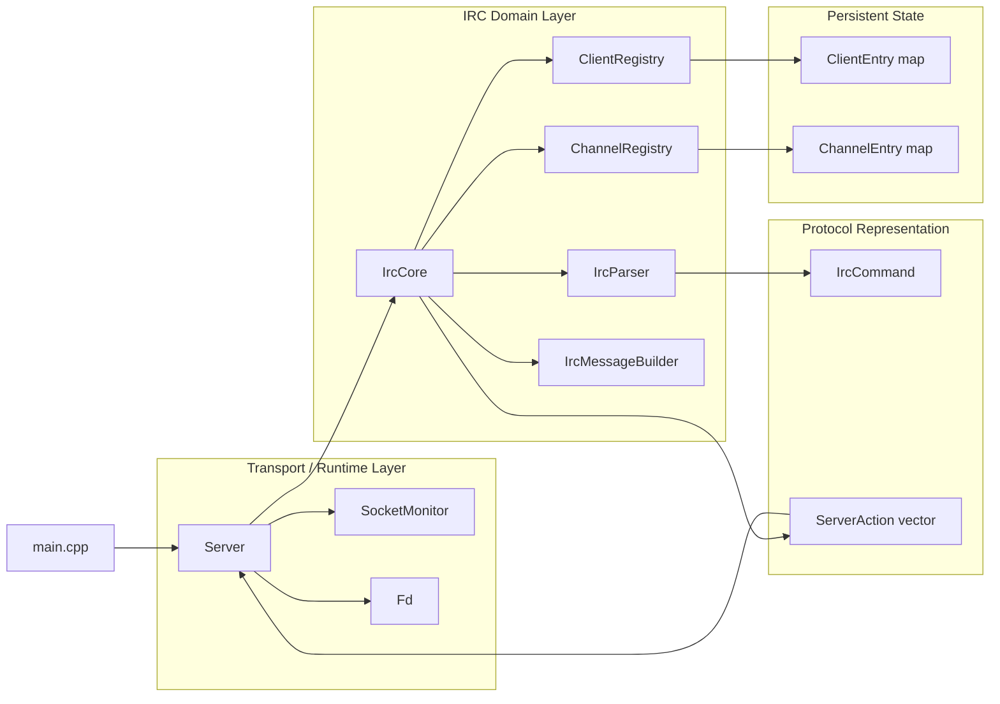

### 해석

- `main.cpp`는 거의 조립만 한다.
- `Server`가 중심 런타임이다.
- `IrcCore`는 도메인 규칙 담당이다.
- `ClientRegistry`, `ChannelRegistry`는 상태 저장소다.
- `IrcParser`, `IrcMessageBuilder`는 wire format 입출력 보조다.
- `IrcCore`는 네트워크 호출 대신 `ServerAction`을 만든다.
- `Server`가 그 action을 실제 I/O로 실행한다.

이게 이 코드의 핵심 아키텍처 포인트다.

---

## 3. 주요 파일 책임 맵

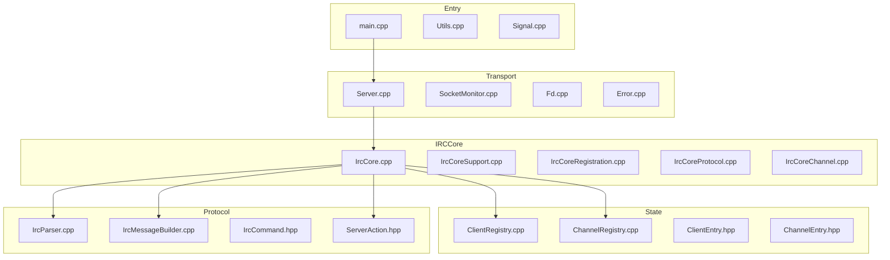

### 파일 역할 요약

| 구역 | 핵심 파일 | 역할 |
|---|---|---|
| Entry | `main.cpp` | 인자 검증 후 `Server` 실행 |
| Runtime | `Server.cpp` | socket/poll/accept/read/write/close |
| Runtime | `SocketMonitor.cpp` | `pollfd` 목록 관리 |
| Runtime | `Fd.cpp` | listen fd 래퍼 |
| State | `ClientRegistry.cpp` | 클라이언트 등록/닉/유저/버퍼 상태 |
| State | `ChannelRegistry.cpp` | 채널 멤버/오퍼레이터/mode/topic 상태 |
| Domain | `IrcCore*.cpp` | IRC 명령 처리 로직 |
| Protocol | `IrcParser.cpp` | line 파싱 |
| Protocol | `IrcMessageBuilder.cpp` | reply/message 생성 |
| Action | `ServerAction.hpp` | Core → Server 작업 요청 |

---

## 4. 서버 시작 흐름

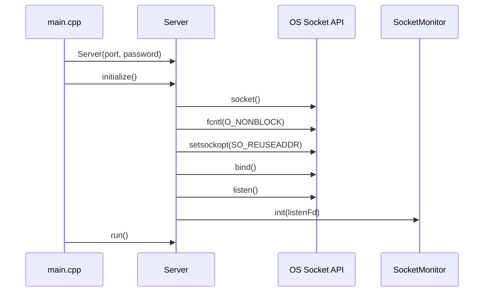

### 포인트

- listening socket을 만들고 바로 non-blocking으로 바꾼다.
- `SocketMonitor`에 listen fd를 등록한다.
- 이후 `run()`에서 이벤트 루프가 시작된다.

---

## 5. 런타임 이벤트 루프

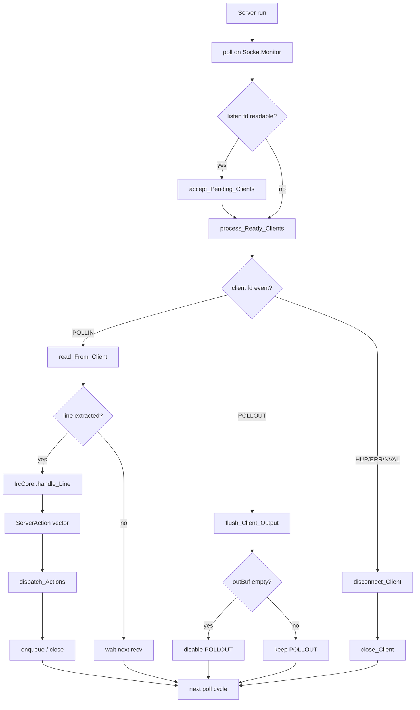

### 해석

이 구조의 핵심은 다음 두 가지다.

1. **입력은 누적 버퍼 기반**
   - `recv()` 한 번에 명령 하나가 온다고 가정하지 않는다.
   - `inBuf`에 누적한 뒤 줄 단위로 뽑는다.

2. **출력은 큐 기반**
   - `send()`를 바로 때리는 구조가 아니라 `outBuf`에 쌓는다.
   - `POLLOUT` 준비가 되었을 때만 밀어낸다.

즉, 이 서버는 mandatory 수준 치고 꽤 정석적인
**non-blocking buffered I/O** 구조를 갖고 있다.

---

## 6. 입력 처리 세부 흐름

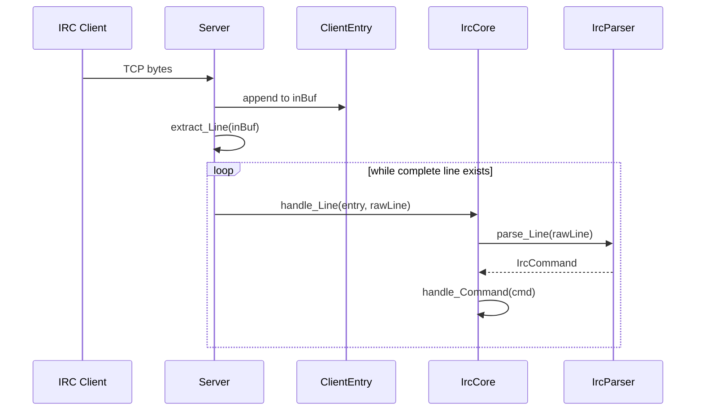

### 여기서 중요한 데이터

`ClientEntry` 안에 transport + registration state가 같이 들어 있다.

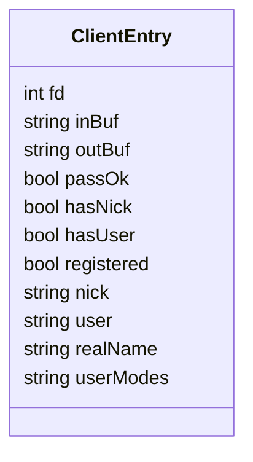

### 의미

- `inBuf`, `outBuf`는 transport 상태
- `passOk`, `hasNick`, `hasUser`, `registered`는 등록 상태
- `nick`, `user`, `realName`, `userModes`는 IRC 사용자 상태

이 프로젝트는 규모상 이 둘을 분리하지 않고 `ClientEntry` 하나에 모아두었다.

---

## 7. Core 명령 처리 구조

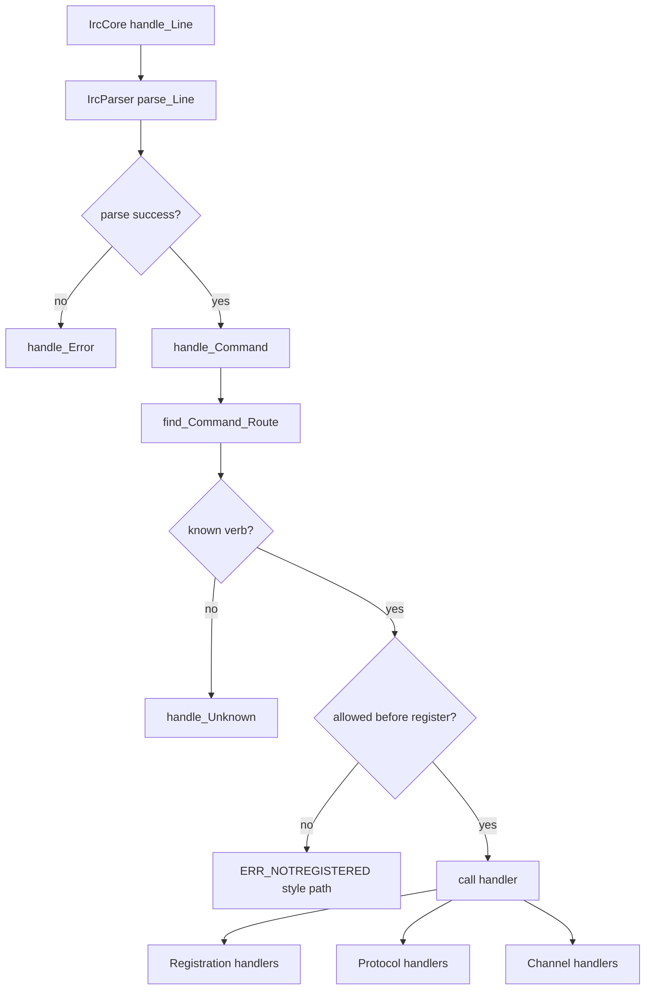

### 실제 핸들러 분리

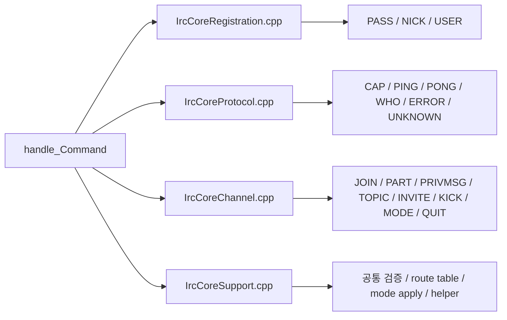

### 구조적으로 보면

- `IrcCore.cpp`는 진입점 / action push / 공통 송신 헬퍼
- `IrcCoreRegistration.cpp`는 등록 단계 명령
- `IrcCoreProtocol.cpp`는 보조 프로토콜
- `IrcCoreChannel.cpp`는 채널/메시징 명령
- `IrcCoreSupport.cpp`는 공통 검증과 helper

즉, 도메인 로직은 한 클래스(`IrcCore`)에 있지만,
**구현 파일 단위로는 역할 분할**을 해 둔 상태다.

---

## 8. 등록(Registration) 흐름

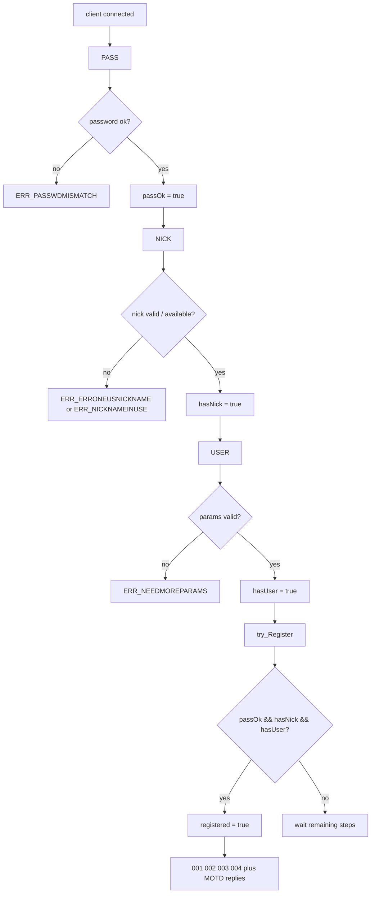

### 이 코드의 특징

- `PASS`를 먼저 받아야 `NICK`, `USER`가 허용되는 구조다.
- 즉, registration state machine이 꽤 보수적이다.
- mandatory 기준으로는 통제하기 쉽지만, 일반적인 IRC 호환성은 약간 좁아진다.

---

## 9. 채널 상태 구조

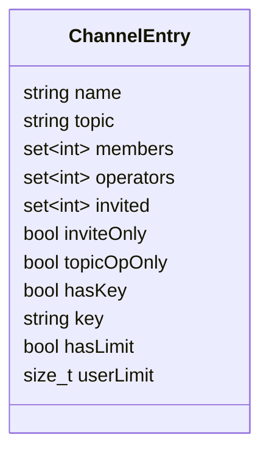

### 의미

- `members`: 채널 참가자
- `operators`: 채널 op
- `invited`: 초대 대상
- `inviteOnly`: `+i`
- `topicOpOnly`: `+t`
- `hasKey/key`: `+k`
- `hasLimit/userLimit`: `+l`

채널 정보는 전부 `ChannelRegistry`의
`map<string, ChannelEntry>` 안에서 관리된다.

---

## 10. JOIN / PRIVMSG / TOPIC / MODE 흐름

### 10-1. JOIN

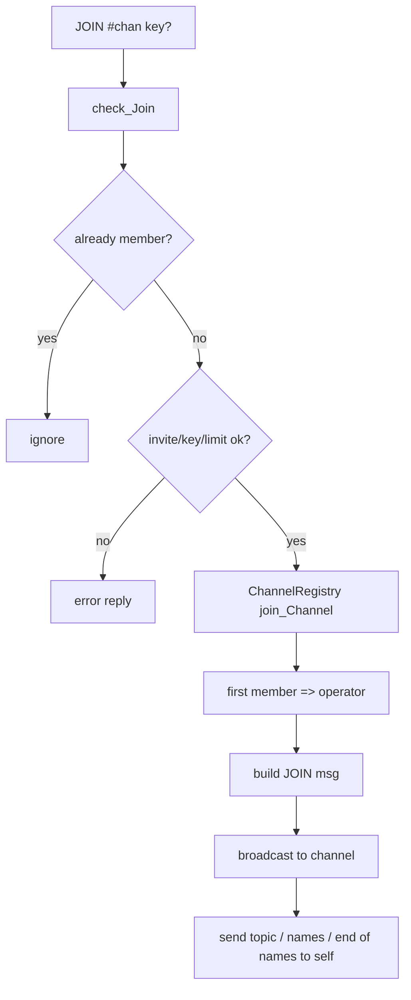

### 10-2. PRIVMSG

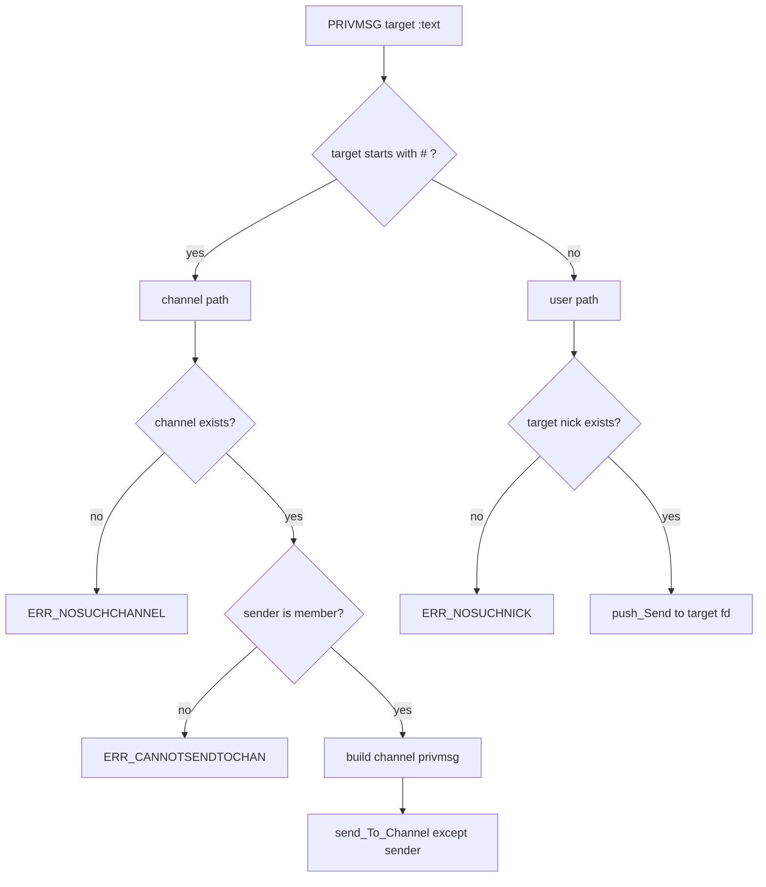

### 10-3. TOPIC

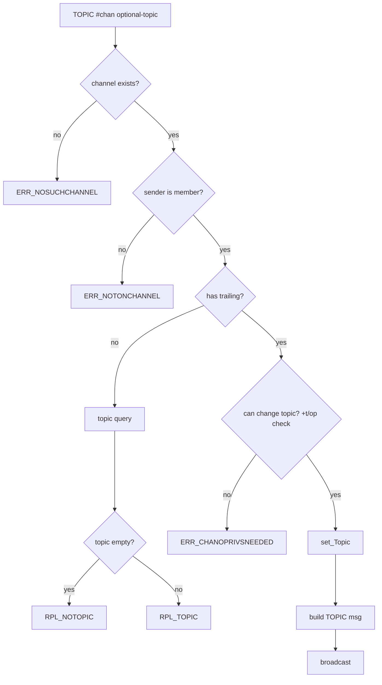

### 10-4. MODE

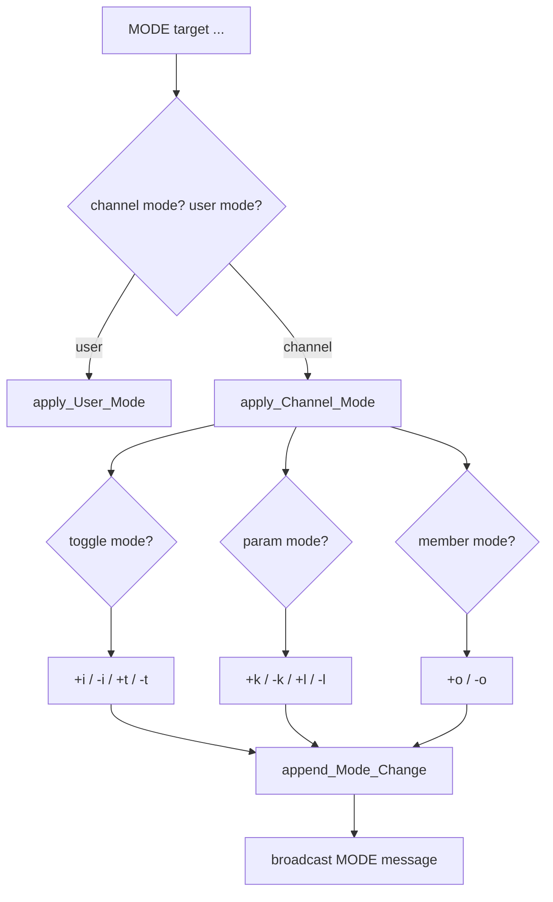

---

## 11. 메시지 생성과 전송 분리

이 코드의 중요한 설계 포인트 중 하나는
`IrcCore`가 직접 socket I/O를 하지 않는다는 점이다.

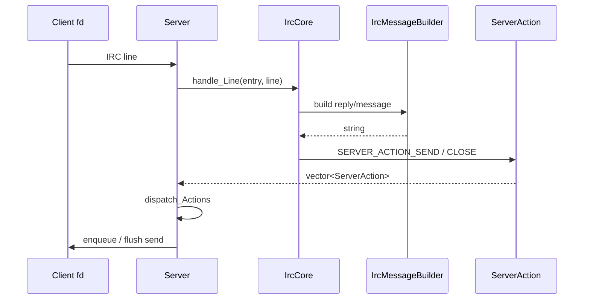

### 의미

- `IrcCore`는 도메인 규칙 담당
- `Server`는 실행 담당
- 이 분리 덕분에 `IrcCore`가 소켓 계층에 덜 묶인다

이건 이 코드에서 꽤 괜찮은 부분이다.

---

## 12. 출력 버퍼 구조

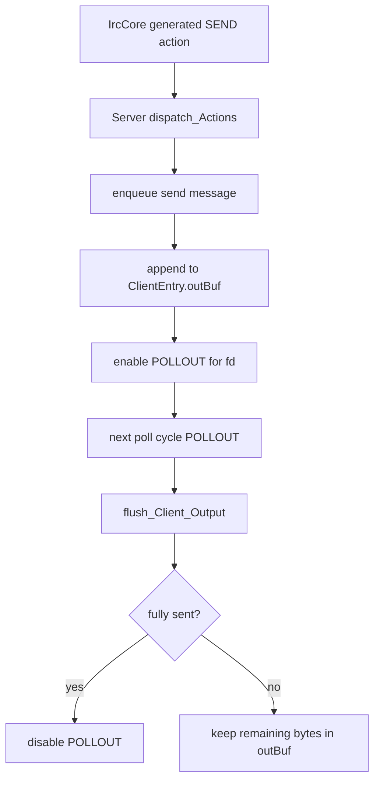

### 핵심

- 느린 클라이언트도 바로 서버를 멈추게 하지 않는다.
- 쓰기 준비 시점에만 실제 송신한다.
- `MAX_OUTBUF`를 넘기면 해당 클라이언트를 끊는 보호 로직도 있다.

---

## 13. Disconnect / QUIT 흐름

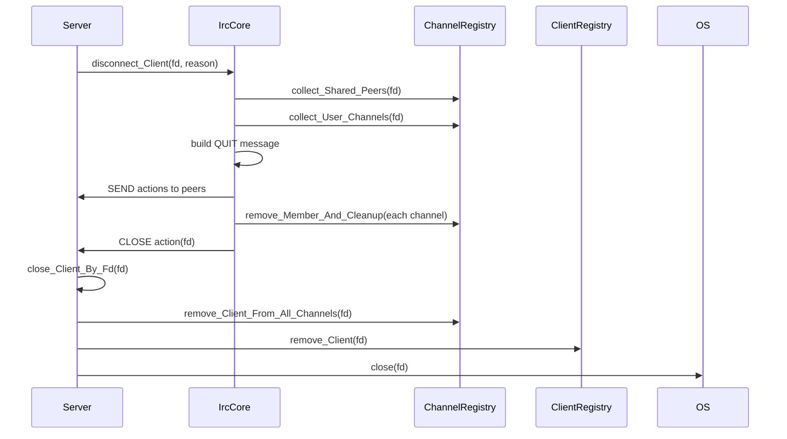

### 여기서 보이는 구조적 특징

- `IrcCore`도 채널 탈퇴 정리를 한다.
- `Server`도 `close_Client()`에서 채널 정리를 한 번 더 한다.

즉, disconnect cleanup의 책임이
**Core와 Server 양쪽에 걸쳐 있다.**

이건 현재 구조를 이해할 때 꼭 알아야 하는 포인트다.

---

## 14. Registry 중심 데이터 흐름

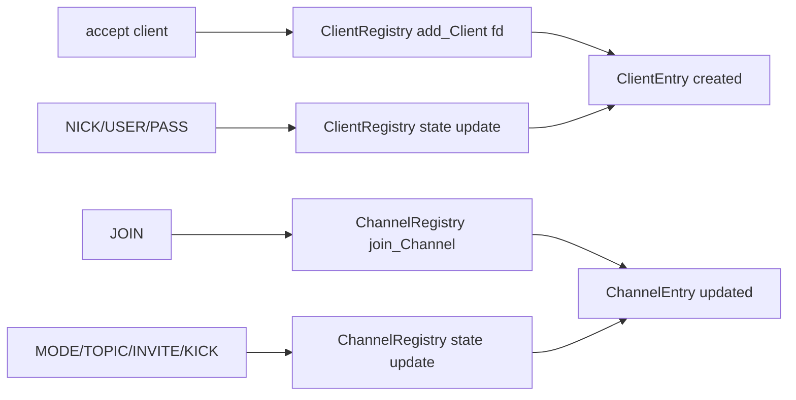

### 정리

이 프로젝트는 거의 모든 실제 상태가
Registry에 들어 있다.

- `Server`: 런타임 제어
- `IrcCore`: 상태를 읽고 쓰는 규칙 엔진
- `Registry`: 실제 데이터 저장소

즉, 상태 중심으로 보면
`ClientRegistry`, `ChannelRegistry`가 사실상 서버의 메모리 DB다.

---

## 15. 이 아키텍처의 장점

### 15-1. 과설계가 아니다
- 클래스 수가 지나치게 많지 않다.
- mandatory 프로젝트 규모에 맞는 분리다.

### 15-2. transport / domain 분리가 있다
- `IrcCore`가 `send()`를 직접 호출하지 않는다.
- `ServerAction` 기반으로 실행과 판단을 분리했다.

### 15-3. non-blocking 구조가 비교적 탄탄하다
- 입력 누적 버퍼
- 출력 누적 버퍼
- `POLLOUT` 제어

### 15-4. Registry 구조가 읽기 쉽다
- client / channel 상태가 한눈에 보인다.

---

## 16. 이 아키텍처를 볼 때 같이 기억해야 할 약점

이 문서는 구조 설명 문서지만,
현재 구조를 정확히 이해하려면 약점도 같이 알아야 한다.

### 16-1. channel operator lifecycle이 완전하지 않다
- `MODE -o`에서는 마지막 operator 제거를 막으려 한다.
- 하지만 `PART`, `QUIT`, disconnect 경로에서는
  operator가 0명이 되는 orphan channel이 생길 수 있다.

### 16-2. disconnect cleanup 책임이 중복된다
- `IrcCore::disconnect_Client()`가 채널 탈퇴를 처리하고,
- `Server::close_Client()`도 채널 정리를 수행한다.

### 16-3. input model과 output model이 완전히 대칭적이지 않다
- parser는 `hasTrailing`을 보존한다.
- builder는 `empty trailing`과 `no trailing`을 완전히 구분하지 못한다.
- 그래서 `TOPIC #chan :` 같은 케이스 직렬화가 정확하지 않다.

즉,
구조는 꽤 괜찮지만 **불변식/직렬화 디테일**은 덜 마감된 상태다.

---

## 17. 코드 읽기 추천 순서

이 프로젝트를 처음부터 다시 읽는다면 이 순서가 제일 좋다.

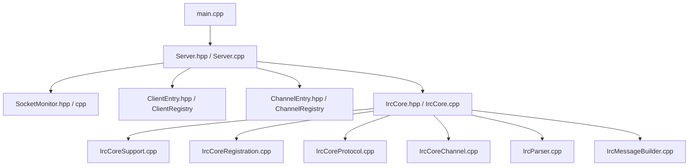

### 이유

- 먼저 **런타임 축(Server)** 을 잡아야 전체 데이터 흐름이 보인다.
- 그 다음 **상태 저장소(Registry)** 를 봐야 도메인 로직이 이해된다.
- 마지막에 **Core / Parser / Builder** 를 보면 명령 처리 전체가 연결된다.

---

## 18. 최종 요약

이 코드의 전체 그림을 짧게 정리하면 아래와 같다.

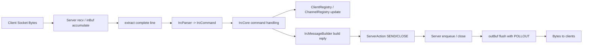

즉,

> **입력 바이트 → 라인 파싱 → 명령 해석 → 상태 변경 → 메시지 생성 → action 반환 → 실제 송신**

이게 이 서버의 전체 파이프라인이다.

---

## 19. 한 문장 평가

이 구조는

- mandatory 과제 치고는 **꽤 괜찮게 분리된 구조**이고,
- `poll` 기반 non-blocking 서버의 기본기를 잘 잡았으며,
- 다만 **채널 불변식과 일부 protocol 직렬화 디테일은 아직 덜 다듬어진 상태**라고 볼 수 있다.
