# S32K 박스/화살표 호출 다이어그램

이 문서는 [`s32k_call_flow_report.md`](./s32k_call_flow_report.md)를 바탕으로 다시 그린 다이어그램 전용 요약본이다.

- 목적: 함수 관계를 글보다 박스/화살표로 한눈에 보기
- 방식: `main -> runtime -> app -> services -> drivers -> isosdk` 흐름과 이벤트 흐름을 나눠서 표시
- 참고: 세부 caller/callee 전수표는 기존 [`s32k_call_flow_report.md`](./s32k_call_flow_report.md)에 그대로 있다.

## 전체 3노드 상호작용

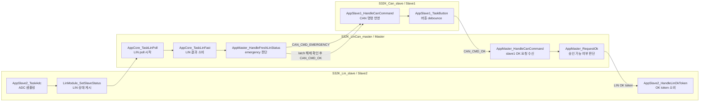

## S32K_Can_slave

### 1. 초기화 흐름

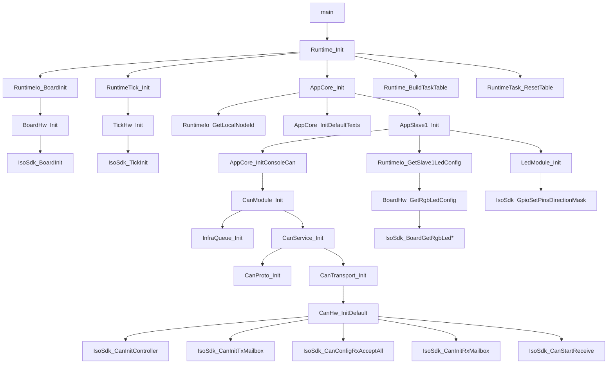

### 2. Super-loop와 task 분기

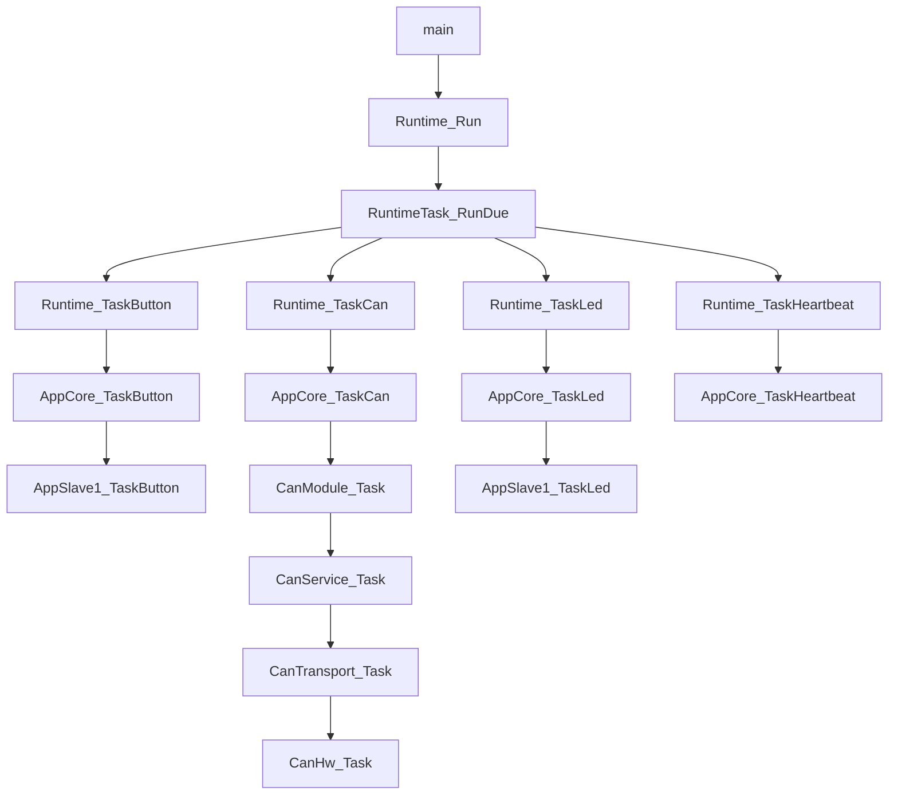

### 3. 버튼 입력이 master로 `CAN_CMD_OK` 가는 흐름

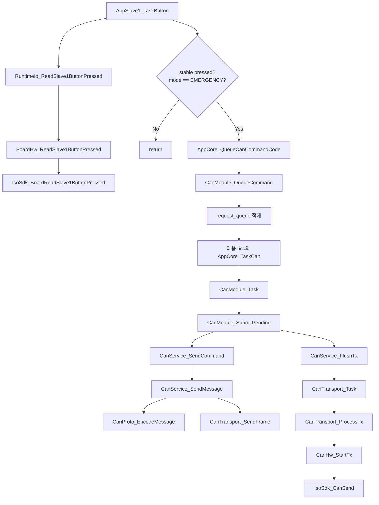

### 4. CAN 수신 명령이 LED/응답으로 반영되는 흐름

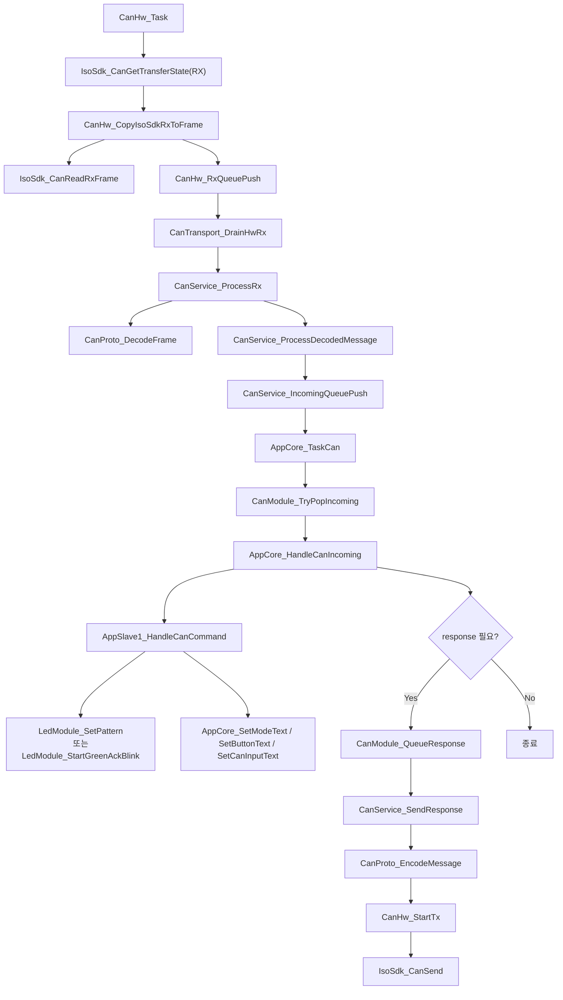

## S32K_LinCan_master

### 1. 초기화 흐름

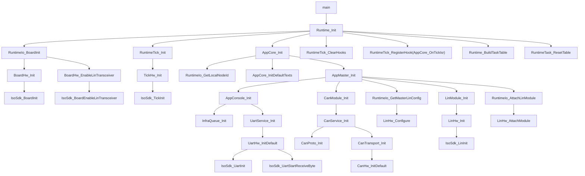

### 2. Super-loop와 task 분기

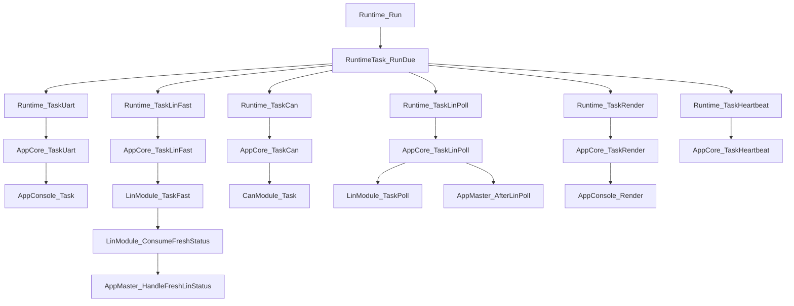

### 3. UART 콘솔 명령이 CAN 송신으로 이어지는 흐름

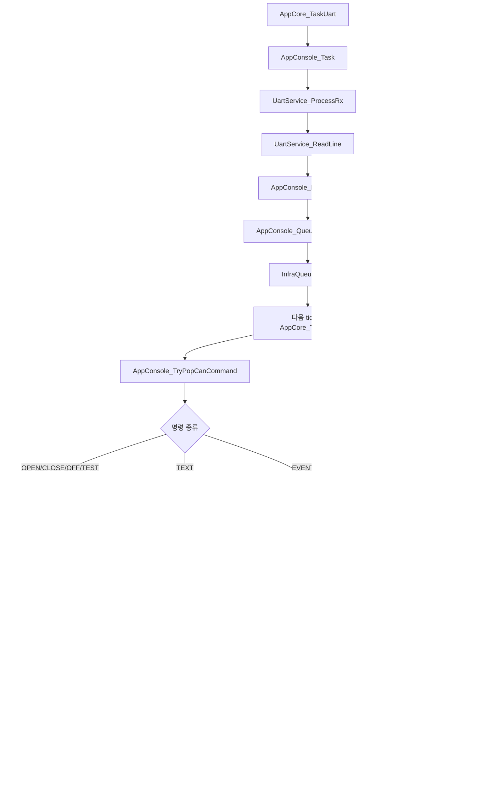

### 4. LIN status polling과 emergency 판단 흐름

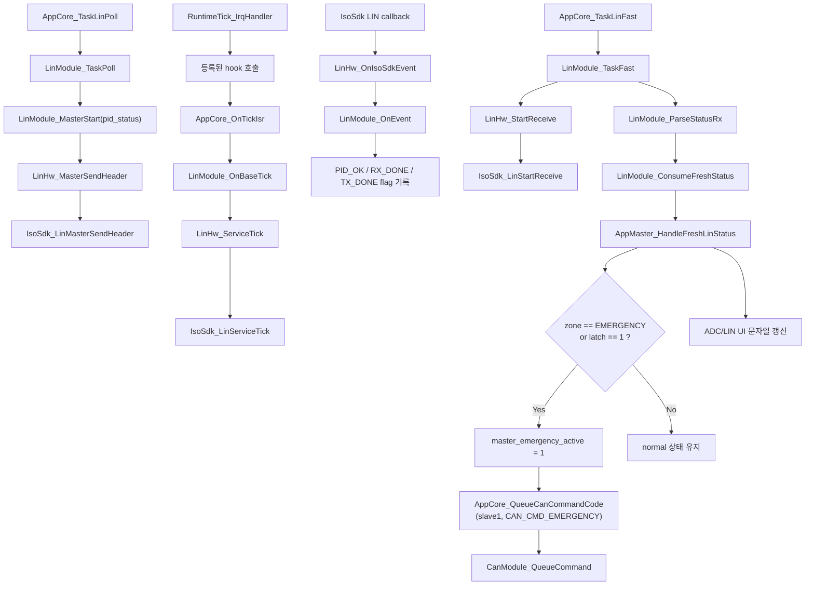

### 5. slave1 OK 요청 -> slave2 OK token -> slave1 승인 흐름

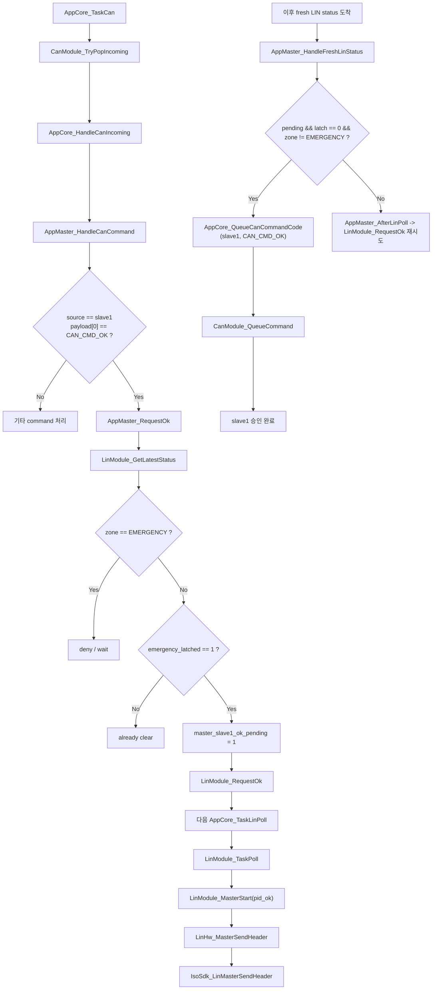

## S32K_Lin_slave

### 1. 초기화 흐름

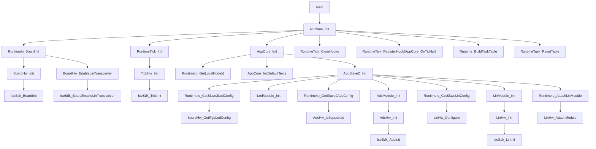

### 2. Super-loop와 task 분기

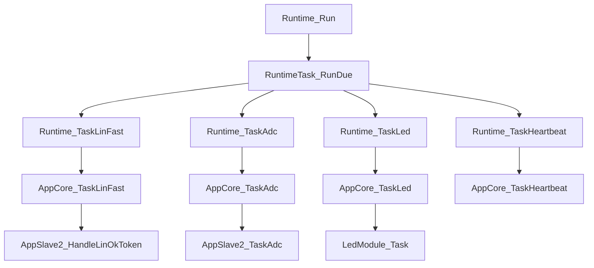

### 3. ADC 샘플링 -> zone 분류 -> LIN 상태 게시 흐름

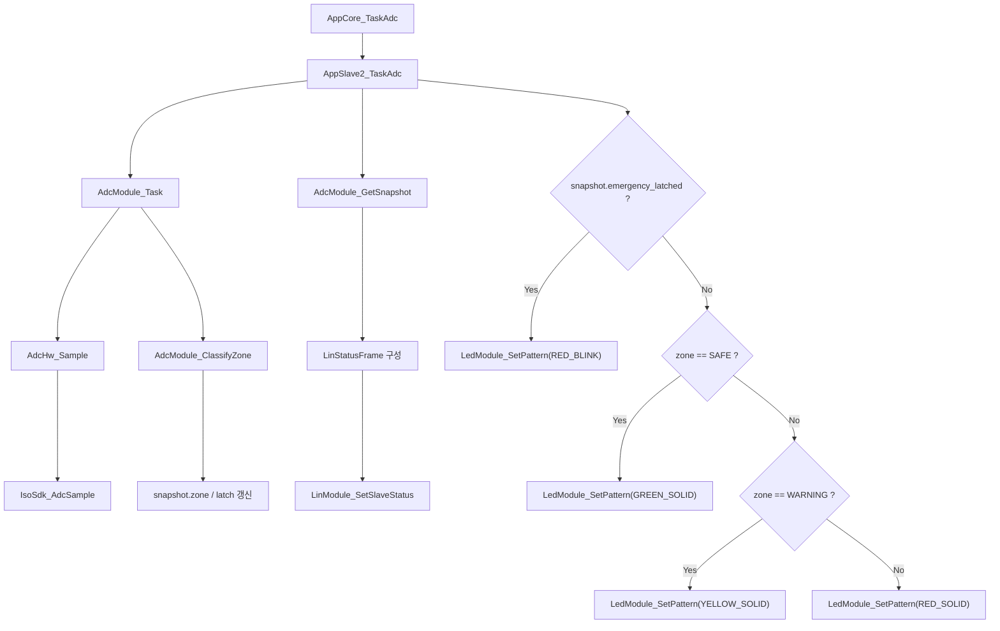

### 4. master의 status poll에 slave2가 응답하는 흐름

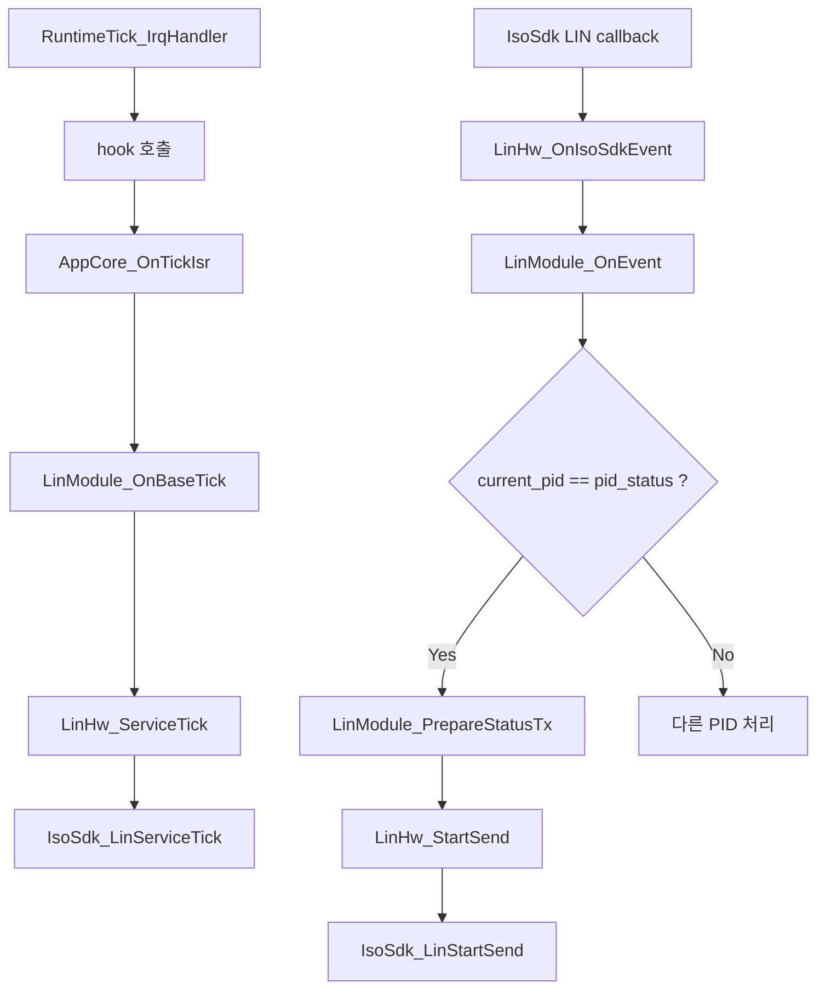

### 5. master의 OK token을 받아 latch 해제하는 흐름

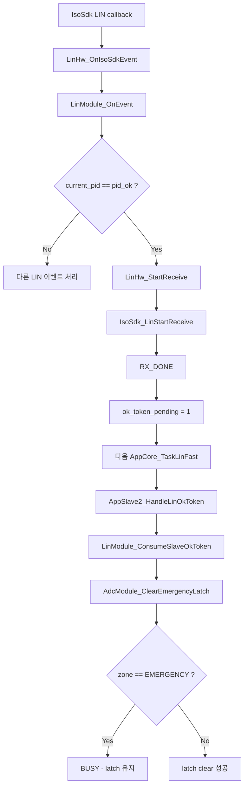

## 같이 보면 좋은 파일

- 다이어그램 요약: [`s32k_call_flow_diagram.md`](./s32k_call_flow_diagram.md)
- 상세 caller/callee 리포트: [`s32k_call_flow_report.md`](./s32k_call_flow_report.md)

