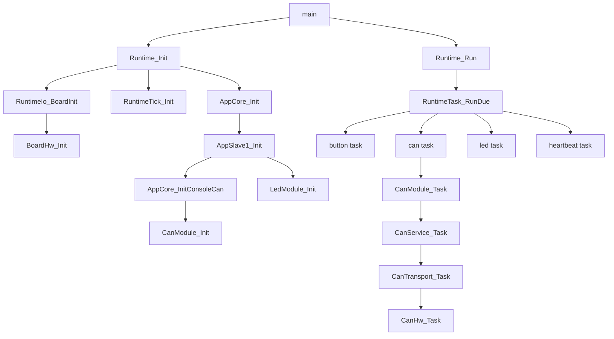

# S32K 3개 프로젝트 함수 호출 흐름도

## 분석 범위
- 요청하신 대상은 워크스페이스 안의 `s32k_sdk`를 포함한 3개 프로젝트다.
- 정확한 caller/callee 추적을 위해 각 프로젝트를 `main.c`부터 `runtime`, `app`, `services`, `drivers`, `platform/s32k_sdk`까지 함께 따라갔다.
- `platform/generated` 내부 vendor 원본 구현은 wrapper 바깥 영역이라 세부 전개하지 않았다. 대신 `IsoSdk_*` 함수의 외부 의존 호출로 표기했다.
- `platform/s32k_sdk/*.c`에는 `#ifdef ISOSDK_SDK_HAS_*`에 따라 실제 구현과 fallback stub가 함께 들어있는 경우가 있어, 인덱스는 API 관계 중심으로 정리하고 첫 정의 위치를 기준으로 적었다.
- 자동 인덱스의 caller/callee는 직접 호출 기준이다. `RuntimeTask_RunDue`, tick hook 등록, LIN/UART callback 등록, binding 함수 포인터처럼 간접 호출로 이어지는 경로는 상단 흐름도와 호출 트리에서 수동으로 보강했다.

## 3개 프로젝트 상호작용 흐름

```mermaid
flowchart LR
  A[Slave2 ADC sample] --> B[Slave2 publishes LIN status]
  B --> C[Master LIN poll / status consume]
  C --> D{Emergency or latch active?}
  D -- yes --> E[Master sends CAN_CMD_EMERGENCY to Slave1]
  E --> F[Slave1 enters emergency mode and waits for button]
  F --> G[Slave1 local button debounce]
  G --> H[Slave1 sends CAN_CMD_OK to Master]
  H --> I[Master approval policy checks latest LIN status]
  I --> J{Emergency cleared?}
  J -- yes --> K[Master queues LIN OK token to Slave2]
  K --> L[Slave2 consumes OK token]
  L --> M[Slave2 clears emergency latch if zone is safe/warning/danger]
  J -- no --> N[Master keeps waiting / retries after next LIN poll]
```

## 읽는 방법
- `핵심 호출 트리`는 각 프로젝트의 대표 실행 경로와 중요한 함수들의 연결을 먼저 보여준다.
- `비동기 / 콜백 진입점`은 super-loop 밖에서 들어오는 ISR/callback 경로를 따로 묶어 보여준다.
- `전체 함수 관계 인덱스`는 함수별 caller, callee, 직접 보이는 외부 API 호출을 빠짐없이 참조할 수 있는 표다.

## S32K_Can_slave
Slave1 CAN 반응 노드다. 로컬 버튼과 LED 동작이 CAN 명령과 버튼 debounce 로직에 의해 제어된다.

### 메인 흐름

### 역할 요약
- `button task`는 slave1 로컬 버튼을 debounce해서 안정된 emergency 승인 입력을 `CAN_CMD_OK`로 master에 올린다.
- `can task`는 request/response transport를 진행시키고, 수신 CAN 프레임을 비우며, command 메시지를 `AppSlave1_HandleCanCommand`로 넘긴다.
- `led task`는 로컬 LED 상태기계를 진행시키고 ACK blink가 끝나면 정상 상태로 복귀시킨다.

### 핵심 호출 트리
#### `main`
```text
main [S32K_Can_slave/main.c:8]
  Runtime_Init [S32K_Can_slave/runtime/runtime.c:77]
    RuntimeIo_BoardInit [S32K_Can_slave/runtime/runtime_io.c:11]
      BoardHw_Init [S32K_Can_slave/drivers/board_hw.c:8]
        IsoSdk_BoardInit [S32K_Can_slave/platform/s32k_sdk/isosdk_board.c:10]
    RuntimeTick_Init [S32K_Can_slave/core/runtime_tick.c:27]
      TickHw_Init [S32K_Can_slave/drivers/tick_hw.c:7]
        IsoSdk_TickInit [S32K_Can_slave/platform/s32k_sdk/isosdk_tick.c:9]
    AppCore_Init [S32K_Can_slave/app/app_core.c:144]
      RuntimeIo_GetLocalNodeId [S32K_Can_slave/runtime/runtime_io.c:16]
      AppCore_InitDefaultTexts [S32K_Can_slave/app/app_core.c:64]
        AppCore_SetModeText [S32K_Can_slave/app/app_core.c:26]
          AppCore_SetText [S32K_Can_slave/app/app_core.c:16]
        AppCore_SetButtonText [S32K_Can_slave/app/app_core.c:34]
          AppCore_SetText [S32K_Can_slave/app/app_core.c:16]
        AppCore_SetAdcText [S32K_Can_slave/app/app_core.c:42]
          AppCore_SetText [S32K_Can_slave/app/app_core.c:16]
        AppCore_SetCanInputText [S32K_Can_slave/app/app_core.c:50]
          AppCore_SetText [S32K_Can_slave/app/app_core.c:16]
      AppSlave1_Init [S32K_Can_slave/app/app_slave1.c:20]
        AppCore_InitConsoleCan [S32K_Can_slave/app/app_core.c:95]
          CanModule_Init [S32K_Can_slave/services/can_module.c:111]
        RuntimeIo_GetSlave1LedConfig [S32K_Can_slave/runtime/runtime_io.c:21]
          BoardHw_GetRgbLedConfig [S32K_Can_slave/drivers/board_hw.c:18]
        LedModule_Init [S32K_Can_slave/drivers/led_module.c:70]
          IsoSdk_GpioSetPinsDirectionMask [S32K_Can_slave/platform/s32k_sdk/isosdk_board.c:81]
          LedModule_ApplyPattern [S32K_Can_slave/drivers/led_module.c:39]
    Runtime_BuildTaskTable [S32K_Can_slave/runtime/runtime.c:43]
    RuntimeTick_GetMs [S32K_Can_slave/core/runtime_tick.c:44]
    RuntimeTask_ResetTable [S32K_Can_slave/core/runtime_task.c:15]
  Runtime_Run [S32K_Can_slave/runtime/runtime.c:117]
    Runtime_FaultLoop [S32K_Can_slave/runtime/runtime.c:70]
    RuntimeTask_RunDue [S32K_Can_slave/core/runtime_task.c:37]
    RuntimeTick_GetMs [S32K_Can_slave/core/runtime_tick.c:44]
```
#### `RuntimeTick_IrqHandler`
```text
RuntimeTick_IrqHandler [S32K_Can_slave/core/runtime_tick.c:87]
  TickHw_ClearCompareFlag [S32K_Can_slave/drivers/tick_hw.c:17]
    IsoSdk_TickClearCompareFlag [S32K_Can_slave/platform/s32k_sdk/isosdk_tick.c:23]
```
#### `Runtime_Init`
```text
Runtime_Init [S32K_Can_slave/runtime/runtime.c:77]
  RuntimeIo_BoardInit [S32K_Can_slave/runtime/runtime_io.c:11]
    BoardHw_Init [S32K_Can_slave/drivers/board_hw.c:8]
      IsoSdk_BoardInit [S32K_Can_slave/platform/s32k_sdk/isosdk_board.c:10]
  RuntimeTick_Init [S32K_Can_slave/core/runtime_tick.c:27]
    TickHw_Init [S32K_Can_slave/drivers/tick_hw.c:7]
      IsoSdk_TickInit [S32K_Can_slave/platform/s32k_sdk/isosdk_tick.c:9]
  AppCore_Init [S32K_Can_slave/app/app_core.c:144]
    RuntimeIo_GetLocalNodeId [S32K_Can_slave/runtime/runtime_io.c:16]
    AppCore_InitDefaultTexts [S32K_Can_slave/app/app_core.c:64]
      AppCore_SetModeText [S32K_Can_slave/app/app_core.c:26]
        AppCore_SetText [S32K_Can_slave/app/app_core.c:16]
      AppCore_SetButtonText [S32K_Can_slave/app/app_core.c:34]
        AppCore_SetText [S32K_Can_slave/app/app_core.c:16]
      AppCore_SetAdcText [S32K_Can_slave/app/app_core.c:42]
        AppCore_SetText [S32K_Can_slave/app/app_core.c:16]
      AppCore_SetCanInputText [S32K_Can_slave/app/app_core.c:50]
        AppCore_SetText [S32K_Can_slave/app/app_core.c:16]
    AppSlave1_Init [S32K_Can_slave/app/app_slave1.c:20]
      AppCore_InitConsoleCan [S32K_Can_slave/app/app_core.c:95]
        CanModule_Init [S32K_Can_slave/services/can_module.c:111]
          InfraQueue_Init [S32K_Can_slave/core/infra_queue.c:32]
          CanService_Init [S32K_Can_slave/services/can_service.c:561]
      RuntimeIo_GetSlave1LedConfig [S32K_Can_slave/runtime/runtime_io.c:21]
        BoardHw_GetRgbLedConfig [S32K_Can_slave/drivers/board_hw.c:18]
          IsoSdk_BoardGetRgbLedPort [S32K_Can_slave/platform/s32k_sdk/isosdk_board.c:43]
          IsoSdk_BoardGetRgbLedRedPin [S32K_Can_slave/platform/s32k_sdk/isosdk_board.c:48]
          IsoSdk_BoardGetRgbLedGreenPin [S32K_Can_slave/platform/s32k_sdk/isosdk_board.c:53]
          IsoSdk_BoardGetRgbLedActiveOnLevel [S32K_Can_slave/platform/s32k_sdk/isosdk_board.c:58]
      LedModule_Init [S32K_Can_slave/drivers/led_module.c:70]
        IsoSdk_GpioSetPinsDirectionMask [S32K_Can_slave/platform/s32k_sdk/isosdk_board.c:81]
        LedModule_ApplyPattern [S32K_Can_slave/drivers/led_module.c:39]
          LedModule_ApplyOutputs [S32K_Can_slave/drivers/led_module.c:28]
  Runtime_BuildTaskTable [S32K_Can_slave/runtime/runtime.c:43]
  RuntimeTick_GetMs [S32K_Can_slave/core/runtime_tick.c:44]
  RuntimeTask_ResetTable [S32K_Can_slave/core/runtime_task.c:15]
```
#### `Runtime_Run`
```text
Runtime_Run [S32K_Can_slave/runtime/runtime.c:117]
  Runtime_FaultLoop [S32K_Can_slave/runtime/runtime.c:70]
  RuntimeTask_RunDue [S32K_Can_slave/core/runtime_task.c:37]
  RuntimeTick_GetMs [S32K_Can_slave/core/runtime_tick.c:44]
```
#### `AppCore_Init`
```text
AppCore_Init [S32K_Can_slave/app/app_core.c:144]
  RuntimeIo_GetLocalNodeId [S32K_Can_slave/runtime/runtime_io.c:16]
  AppCore_InitDefaultTexts [S32K_Can_slave/app/app_core.c:64]
    AppCore_SetModeText [S32K_Can_slave/app/app_core.c:26]
      AppCore_SetText [S32K_Can_slave/app/app_core.c:16]
    AppCore_SetButtonText [S32K_Can_slave/app/app_core.c:34]
      AppCore_SetText [S32K_Can_slave/app/app_core.c:16]
    AppCore_SetAdcText [S32K_Can_slave/app/app_core.c:42]
      AppCore_SetText [S32K_Can_slave/app/app_core.c:16]
    AppCore_SetCanInputText [S32K_Can_slave/app/app_core.c:50]
      AppCore_SetText [S32K_Can_slave/app/app_core.c:16]
  AppSlave1_Init [S32K_Can_slave/app/app_slave1.c:20]
    AppCore_InitConsoleCan [S32K_Can_slave/app/app_core.c:95]
      CanModule_Init [S32K_Can_slave/services/can_module.c:111]
        InfraQueue_Init [S32K_Can_slave/core/infra_queue.c:32]
        CanService_Init [S32K_Can_slave/services/can_service.c:561]
          CanService_ClearPending [S32K_Can_slave/services/can_service.c:32]
          CanProto_Init [S32K_Can_slave/services/can_proto.c:120]
          CanTransport_Init [S32K_Can_slave/services/can_service.c:249]
    RuntimeIo_GetSlave1LedConfig [S32K_Can_slave/runtime/runtime_io.c:21]
      BoardHw_GetRgbLedConfig [S32K_Can_slave/drivers/board_hw.c:18]
        IsoSdk_BoardGetRgbLedPort [S32K_Can_slave/platform/s32k_sdk/isosdk_board.c:43]
        IsoSdk_BoardGetRgbLedRedPin [S32K_Can_slave/platform/s32k_sdk/isosdk_board.c:48]
        IsoSdk_BoardGetRgbLedGreenPin [S32K_Can_slave/platform/s32k_sdk/isosdk_board.c:53]
        IsoSdk_BoardGetRgbLedActiveOnLevel [S32K_Can_slave/platform/s32k_sdk/isosdk_board.c:58]
    LedModule_Init [S32K_Can_slave/drivers/led_module.c:70]
      IsoSdk_GpioSetPinsDirectionMask [S32K_Can_slave/platform/s32k_sdk/isosdk_board.c:81]
      LedModule_ApplyPattern [S32K_Can_slave/drivers/led_module.c:39]
        LedModule_ApplyOutputs [S32K_Can_slave/drivers/led_module.c:28]
          LedModule_WritePin [S32K_Can_slave/drivers/led_module.c:13]
```
#### `AppCore_TaskCan`
```text
AppCore_TaskCan [S32K_Can_slave/app/app_core.c:177]
  CanModule_Task [S32K_Can_slave/services/can_module.c:151]
    CanService_Task [S32K_Can_slave/services/can_service.c:605]
      CanTransport_Task [S32K_Can_slave/services/can_service.c:266]
        CanHw_Task [S32K_Can_slave/drivers/can_hw.c:141]
          IsoSdk_CanGetTransferState [S32K_Can_slave/platform/s32k_sdk/isosdk_can.c:85]
          CanHw_CopyIsoSdkRxToFrame [S32K_Can_slave/drivers/can_hw.c:50]
          CanHw_RxQueuePush [S32K_Can_slave/drivers/can_hw.c:32]
          CanHw_StartReceive [S32K_Can_slave/drivers/can_hw.c:77]
        CanTransport_DrainHwRx [S32K_Can_slave/services/can_service.c:189]
          CanHw_TryPopRx [S32K_Can_slave/drivers/can_hw.c:255]
          CanTransport_RxPush [S32K_Can_slave/services/can_service.c:171]
        CanTransport_ProcessTx [S32K_Can_slave/services/can_service.c:207]
          CanHw_IsTxBusy [S32K_Can_slave/drivers/can_hw.c:279]
          CanTransport_OnTxComplete [S32K_Can_slave/services/can_service.c:139]
          CanTransport_TxPeek [S32K_Can_slave/services/can_service.c:116]
          CanHw_StartTx [S32K_Can_slave/drivers/can_hw.c:213]
          CanTransport_TxDropFront [S32K_Can_slave/services/can_service.c:127]
      CanService_ProcessRx [S32K_Can_slave/services/can_service.c:509]
        CanTransport_PopRx [S32K_Can_slave/services/can_service.c:301]
          CanTransport_ClearFrame [S32K_Can_slave/services/can_service.c:98]
          CanService_NextIndex [S32K_Can_slave/services/can_service.c:40]
        CanProto_DecodeFrame [S32K_Can_slave/services/can_proto.c:217]
          CanProto_ClearMessage [S32K_Can_slave/services/can_proto.c:24]
          CanProto_IdToMessageType [S32K_Can_slave/services/can_proto.c:85]
          CanProto_IsValidNodeId [S32K_Can_slave/services/can_proto.c:32]
          CanProto_IsPrintableAscii [S32K_Can_slave/services/can_proto.c:42]
        CanService_ProcessDecodedMessage [S32K_Can_slave/services/can_service.c:493]
          CanService_ProcessResponse [S32K_Can_slave/services/can_service.c:477]
          CanService_IsAcceptedTarget [S32K_Can_slave/services/can_service.c:61]
          CanService_IncomingQueuePush [S32K_Can_slave/services/can_service.c:320]
      CanService_ProcessTimeouts [S32K_Can_slave/services/can_service.c:529]
        CanService_FillTimeoutResult [S32K_Can_slave/services/can_service.c:450]
          CanService_ClearResult [S32K_Can_slave/services/can_service.c:24]
        CanService_ResultQueuePush [S32K_Can_slave/services/can_service.c:339]
          CanService_NextIndex [S32K_Can_slave/services/can_service.c:40]
    CanModule_SubmitPending [S32K_Can_slave/services/can_module.c:31]
      InfraQueue_Peek [S32K_Can_slave/core/infra_queue.c:130]
      CanService_SendCommand [S32K_Can_slave/services/can_service.c:634]
        CanService_IsValidTarget [S32K_Can_slave/services/can_service.c:51]
        CanService_FindFreePendingSlot [S32K_Can_slave/services/can_service.c:376]
        CanService_AllocateRequestId [S32K_Can_slave/services/can_service.c:358]
        CanService_SendMessage [S32K_Can_slave/services/can_service.c:418]
          CanProto_EncodeMessage [S32K_Can_slave/services/can_proto.c:138]
          CanTransport_SendFrame [S32K_Can_slave/services/can_service.c:278]
      CanService_SendResponse [S32K_Can_slave/services/can_service.c:710]
        CanService_IsValidTarget [S32K_Can_slave/services/can_service.c:51]
        CanService_SendMessage [S32K_Can_slave/services/can_service.c:418]
          CanProto_EncodeMessage [S32K_Can_slave/services/can_proto.c:138]
          CanTransport_SendFrame [S32K_Can_slave/services/can_service.c:278]
      CanService_SendEvent [S32K_Can_slave/services/can_service.c:746]
        CanService_IsValidTarget [S32K_Can_slave/services/can_service.c:51]
        CanService_SendMessage [S32K_Can_slave/services/can_service.c:418]
          CanProto_EncodeMessage [S32K_Can_slave/services/can_proto.c:138]
          CanTransport_SendFrame [S32K_Can_slave/services/can_service.c:278]
      CanService_SendText [S32K_Can_slave/services/can_service.c:782]
        CanService_IsValidTarget [S32K_Can_slave/services/can_service.c:51]
        CanService_IsPrintableAscii [S32K_Can_slave/services/can_service.c:76]
        CanService_SendMessage [S32K_Can_slave/services/can_service.c:418]
          CanProto_EncodeMessage [S32K_Can_slave/services/can_proto.c:138]
          CanTransport_SendFrame [S32K_Can_slave/services/can_service.c:278]
      InfraQueue_Pop [S32K_Can_slave/core/infra_queue.c:106]
        InfraQueue_NextIndex [S32K_Can_slave/core/infra_queue.c:16]
      CanService_FlushTx [S32K_Can_slave/services/can_service.c:618]
        CanTransport_Task [S32K_Can_slave/services/can_service.c:266]
          CanHw_Task [S32K_Can_slave/drivers/can_hw.c:141]
          CanTransport_DrainHwRx [S32K_Can_slave/services/can_service.c:189]
          CanTransport_ProcessTx [S32K_Can_slave/services/can_service.c:207]
  CanModule_TryPopResult [S32K_Can_slave/services/can_module.c:265]
    CanService_PopResult [S32K_Can_slave/services/can_service.c:849]
      CanService_ClearResult [S32K_Can_slave/services/can_service.c:24]
      CanService_NextIndex [S32K_Can_slave/services/can_service.c:40]
  CanModule_TryPopIncoming [S32K_Can_slave/services/can_module.c:255]
    CanService_PopReceivedMessage [S32K_Can_slave/services/can_service.c:830]
      CanService_ClearMessage [S32K_Can_slave/services/can_service.c:16]
      CanService_NextIndex [S32K_Can_slave/services/can_service.c:40]
  AppCore_HandleCanIncoming [S32K_Can_slave/app/app_core.c:117]
    AppSlave1_HandleCanCommand [S32K_Can_slave/app/app_slave1.c:49]
      LedModule_SetPattern [S32K_Can_slave/drivers/led_module.c:92]
        LedModule_ApplyPattern [S32K_Can_slave/drivers/led_module.c:39]
          LedModule_ApplyOutputs [S32K_Can_slave/drivers/led_module.c:28]
      AppCore_SetModeText [S32K_Can_slave/app/app_core.c:26]
        AppCore_SetText [S32K_Can_slave/app/app_core.c:16]
      AppCore_SetButtonText [S32K_Can_slave/app/app_core.c:34]
        AppCore_SetText [S32K_Can_slave/app/app_core.c:16]
      AppCore_SetAdcText [S32K_Can_slave/app/app_core.c:42]
        AppCore_SetText [S32K_Can_slave/app/app_core.c:16]
      AppCore_SetCanInputText [S32K_Can_slave/app/app_core.c:50]
        AppCore_SetText [S32K_Can_slave/app/app_core.c:16]
      LedModule_StartGreenAckBlink [S32K_Can_slave/drivers/led_module.c:108]
        LedModule_ApplyPattern [S32K_Can_slave/drivers/led_module.c:39]
          LedModule_ApplyOutputs [S32K_Can_slave/drivers/led_module.c:28]
    CanModule_QueueResponse [S32K_Can_slave/services/can_module.c:192]
      CanModule_PushRequest [S32K_Can_slave/services/can_module.c:16]
        InfraQueue_Push [S32K_Can_slave/core/infra_queue.c:78]
          InfraQueue_NextIndex [S32K_Can_slave/core/infra_queue.c:16]
```
#### `AppCore_TaskButton`
```text
AppCore_TaskButton [S32K_Can_slave/app/app_core.c:200]
  AppSlave1_TaskButton [S32K_Can_slave/app/app_slave1.c:116]
    RuntimeIo_ReadSlave1ButtonPressed [S32K_Can_slave/runtime/runtime_io.c:26]
      BoardHw_ReadSlave1ButtonPressed [S32K_Can_slave/drivers/board_hw.c:33]
        IsoSdk_BoardReadSlave1ButtonPressed [S32K_Can_slave/platform/s32k_sdk/isosdk_board.c:63]
    AppCore_SetButtonText [S32K_Can_slave/app/app_core.c:34]
      AppCore_SetText [S32K_Can_slave/app/app_core.c:16]
    AppCore_QueueCanCommandCode [S32K_Can_slave/app/app_core.c:77]
      CanModule_QueueCommand [S32K_Can_slave/services/can_module.c:168]
        CanModule_PushRequest [S32K_Can_slave/services/can_module.c:16]
          InfraQueue_Push [S32K_Can_slave/core/infra_queue.c:78]
    AppCore_SetResultText [S32K_Can_slave/app/app_core.c:58]
```
#### `AppCore_TaskLed`
```text
AppCore_TaskLed [S32K_Can_slave/app/app_core.c:210]
  AppSlave1_TaskLed [S32K_Can_slave/app/app_slave1.c:170]
    LedModule_Task [S32K_Can_slave/drivers/led_module.c:123]
      LedModule_ApplyPattern [S32K_Can_slave/drivers/led_module.c:39]
        LedModule_ApplyOutputs [S32K_Can_slave/drivers/led_module.c:28]
          LedModule_WritePin [S32K_Can_slave/drivers/led_module.c:13]
    LedModule_GetPattern [S32K_Can_slave/drivers/led_module.c:160]
    AppCore_SetModeText [S32K_Can_slave/app/app_core.c:26]
      AppCore_SetText [S32K_Can_slave/app/app_core.c:16]
    AppCore_SetButtonText [S32K_Can_slave/app/app_core.c:34]
      AppCore_SetText [S32K_Can_slave/app/app_core.c:16]
```
#### `AppSlave1_HandleCanCommand`
```text
AppSlave1_HandleCanCommand [S32K_Can_slave/app/app_slave1.c:49]
  LedModule_SetPattern [S32K_Can_slave/drivers/led_module.c:92]
    LedModule_ApplyPattern [S32K_Can_slave/drivers/led_module.c:39]
      LedModule_ApplyOutputs [S32K_Can_slave/drivers/led_module.c:28]
        LedModule_WritePin [S32K_Can_slave/drivers/led_module.c:13]
          IsoSdk_GpioWritePin [S32K_Can_slave/platform/s32k_sdk/isosdk_board.c:71]
  AppCore_SetModeText [S32K_Can_slave/app/app_core.c:26]
    AppCore_SetText [S32K_Can_slave/app/app_core.c:16]
  AppCore_SetButtonText [S32K_Can_slave/app/app_core.c:34]
    AppCore_SetText [S32K_Can_slave/app/app_core.c:16]
  AppCore_SetAdcText [S32K_Can_slave/app/app_core.c:42]
    AppCore_SetText [S32K_Can_slave/app/app_core.c:16]
  AppCore_SetCanInputText [S32K_Can_slave/app/app_core.c:50]
    AppCore_SetText [S32K_Can_slave/app/app_core.c:16]
  LedModule_StartGreenAckBlink [S32K_Can_slave/drivers/led_module.c:108]
    LedModule_ApplyPattern [S32K_Can_slave/drivers/led_module.c:39]
      LedModule_ApplyOutputs [S32K_Can_slave/drivers/led_module.c:28]
        LedModule_WritePin [S32K_Can_slave/drivers/led_module.c:13]
          IsoSdk_GpioWritePin [S32K_Can_slave/platform/s32k_sdk/isosdk_board.c:71]
```
#### `AppSlave1_TaskButton`
```text
AppSlave1_TaskButton [S32K_Can_slave/app/app_slave1.c:116]
  RuntimeIo_ReadSlave1ButtonPressed [S32K_Can_slave/runtime/runtime_io.c:26]
    BoardHw_ReadSlave1ButtonPressed [S32K_Can_slave/drivers/board_hw.c:33]
      IsoSdk_BoardReadSlave1ButtonPressed [S32K_Can_slave/platform/s32k_sdk/isosdk_board.c:63]
  AppCore_SetButtonText [S32K_Can_slave/app/app_core.c:34]
    AppCore_SetText [S32K_Can_slave/app/app_core.c:16]
  AppCore_QueueCanCommandCode [S32K_Can_slave/app/app_core.c:77]
    CanModule_QueueCommand [S32K_Can_slave/services/can_module.c:168]
      CanModule_PushRequest [S32K_Can_slave/services/can_module.c:16]
        InfraQueue_Push [S32K_Can_slave/core/infra_queue.c:78]
          InfraQueue_NextIndex [S32K_Can_slave/core/infra_queue.c:16]
  AppCore_SetResultText [S32K_Can_slave/app/app_core.c:58]
```
#### `CanModule_Task`
```text
CanModule_Task [S32K_Can_slave/services/can_module.c:151]
  CanService_Task [S32K_Can_slave/services/can_service.c:605]
    CanTransport_Task [S32K_Can_slave/services/can_service.c:266]
      CanHw_Task [S32K_Can_slave/drivers/can_hw.c:141]
        IsoSdk_CanGetTransferState [S32K_Can_slave/platform/s32k_sdk/isosdk_can.c:85]
        CanHw_CopyIsoSdkRxToFrame [S32K_Can_slave/drivers/can_hw.c:50]
          CanHw_ClearFrame [S32K_Can_slave/drivers/can_hw.c:13]
          IsoSdk_CanReadRxFrame [S32K_Can_slave/platform/s32k_sdk/isosdk_can.c:103]
        CanHw_RxQueuePush [S32K_Can_slave/drivers/can_hw.c:32]
          CanHw_NextIndex [S32K_Can_slave/drivers/can_hw.c:21]
        CanHw_StartReceive [S32K_Can_slave/drivers/can_hw.c:77]
          IsoSdk_CanStartReceive [S32K_Can_slave/platform/s32k_sdk/isosdk_can.c:79]
      CanTransport_DrainHwRx [S32K_Can_slave/services/can_service.c:189]
        CanHw_TryPopRx [S32K_Can_slave/drivers/can_hw.c:255]
          CanHw_ClearFrame [S32K_Can_slave/drivers/can_hw.c:13]
          CanHw_NextIndex [S32K_Can_slave/drivers/can_hw.c:21]
        CanTransport_RxPush [S32K_Can_slave/services/can_service.c:171]
          CanTransport_RxIsFull [S32K_Can_slave/services/can_service.c:111]
          CanService_NextIndex [S32K_Can_slave/services/can_service.c:40]
      CanTransport_ProcessTx [S32K_Can_slave/services/can_service.c:207]
        CanHw_IsTxBusy [S32K_Can_slave/drivers/can_hw.c:279]
        CanTransport_OnTxComplete [S32K_Can_slave/services/can_service.c:139]
          CanTransport_TxDropFront [S32K_Can_slave/services/can_service.c:127]
          CanTransport_ClearFrame [S32K_Can_slave/services/can_service.c:98]
        CanTransport_TxPeek [S32K_Can_slave/services/can_service.c:116]
        CanHw_StartTx [S32K_Can_slave/drivers/can_hw.c:213]
          IsoSdk_CanSend [S32K_Can_slave/platform/s32k_sdk/isosdk_can.c:135]
        CanTransport_TxDropFront [S32K_Can_slave/services/can_service.c:127]
          CanTransport_ClearFrame [S32K_Can_slave/services/can_service.c:98]
          CanService_NextIndex [S32K_Can_slave/services/can_service.c:40]
    CanService_ProcessRx [S32K_Can_slave/services/can_service.c:509]
      CanTransport_PopRx [S32K_Can_slave/services/can_service.c:301]
        CanTransport_ClearFrame [S32K_Can_slave/services/can_service.c:98]
        CanService_NextIndex [S32K_Can_slave/services/can_service.c:40]
      CanProto_DecodeFrame [S32K_Can_slave/services/can_proto.c:217]
        CanProto_ClearMessage [S32K_Can_slave/services/can_proto.c:24]
        CanProto_IdToMessageType [S32K_Can_slave/services/can_proto.c:85]
        CanProto_IsValidNodeId [S32K_Can_slave/services/can_proto.c:32]
        CanProto_IsPrintableAscii [S32K_Can_slave/services/can_proto.c:42]
      CanService_ProcessDecodedMessage [S32K_Can_slave/services/can_service.c:493]
        CanService_ProcessResponse [S32K_Can_slave/services/can_service.c:477]
          CanService_FindPendingByResponse [S32K_Can_slave/services/can_service.c:391]
          CanService_FillResponseResult [S32K_Can_slave/services/can_service.c:463]
          CanService_ResultQueuePush [S32K_Can_slave/services/can_service.c:339]
        CanService_IsAcceptedTarget [S32K_Can_slave/services/can_service.c:61]
        CanService_IncomingQueuePush [S32K_Can_slave/services/can_service.c:320]
          CanService_NextIndex [S32K_Can_slave/services/can_service.c:40]
    CanService_ProcessTimeouts [S32K_Can_slave/services/can_service.c:529]
      CanService_FillTimeoutResult [S32K_Can_slave/services/can_service.c:450]
        CanService_ClearResult [S32K_Can_slave/services/can_service.c:24]
      CanService_ResultQueuePush [S32K_Can_slave/services/can_service.c:339]
        CanService_NextIndex [S32K_Can_slave/services/can_service.c:40]
  CanModule_SubmitPending [S32K_Can_slave/services/can_module.c:31]
    InfraQueue_Peek [S32K_Can_slave/core/infra_queue.c:130]
    CanService_SendCommand [S32K_Can_slave/services/can_service.c:634]
      CanService_IsValidTarget [S32K_Can_slave/services/can_service.c:51]
      CanService_FindFreePendingSlot [S32K_Can_slave/services/can_service.c:376]
      CanService_AllocateRequestId [S32K_Can_slave/services/can_service.c:358]
      CanService_SendMessage [S32K_Can_slave/services/can_service.c:418]
        CanProto_EncodeMessage [S32K_Can_slave/services/can_proto.c:138]
          CanProto_IsValidNodeId [S32K_Can_slave/services/can_proto.c:32]
          CanProto_MessageTypeToId [S32K_Can_slave/services/can_proto.c:64]
          CanProto_ClearFrame [S32K_Can_slave/services/can_proto.c:16]
          CanProto_IsPrintableAscii [S32K_Can_slave/services/can_proto.c:42]
        CanTransport_SendFrame [S32K_Can_slave/services/can_service.c:278]
          CanTransport_TxIsFull [S32K_Can_slave/services/can_service.c:106]
          CanService_NextIndex [S32K_Can_slave/services/can_service.c:40]
    CanService_SendResponse [S32K_Can_slave/services/can_service.c:710]
      CanService_IsValidTarget [S32K_Can_slave/services/can_service.c:51]
      CanService_SendMessage [S32K_Can_slave/services/can_service.c:418]
        CanProto_EncodeMessage [S32K_Can_slave/services/can_proto.c:138]
          CanProto_IsValidNodeId [S32K_Can_slave/services/can_proto.c:32]
          CanProto_MessageTypeToId [S32K_Can_slave/services/can_proto.c:64]
          CanProto_ClearFrame [S32K_Can_slave/services/can_proto.c:16]
          CanProto_IsPrintableAscii [S32K_Can_slave/services/can_proto.c:42]
        CanTransport_SendFrame [S32K_Can_slave/services/can_service.c:278]
          CanTransport_TxIsFull [S32K_Can_slave/services/can_service.c:106]
          CanService_NextIndex [S32K_Can_slave/services/can_service.c:40]
    CanService_SendEvent [S32K_Can_slave/services/can_service.c:746]
      CanService_IsValidTarget [S32K_Can_slave/services/can_service.c:51]
      CanService_SendMessage [S32K_Can_slave/services/can_service.c:418]
        CanProto_EncodeMessage [S32K_Can_slave/services/can_proto.c:138]
          CanProto_IsValidNodeId [S32K_Can_slave/services/can_proto.c:32]
          CanProto_MessageTypeToId [S32K_Can_slave/services/can_proto.c:64]
          CanProto_ClearFrame [S32K_Can_slave/services/can_proto.c:16]
          CanProto_IsPrintableAscii [S32K_Can_slave/services/can_proto.c:42]
        CanTransport_SendFrame [S32K_Can_slave/services/can_service.c:278]
          CanTransport_TxIsFull [S32K_Can_slave/services/can_service.c:106]
          CanService_NextIndex [S32K_Can_slave/services/can_service.c:40]
    CanService_SendText [S32K_Can_slave/services/can_service.c:782]
      CanService_IsValidTarget [S32K_Can_slave/services/can_service.c:51]
      CanService_IsPrintableAscii [S32K_Can_slave/services/can_service.c:76]
      CanService_SendMessage [S32K_Can_slave/services/can_service.c:418]
        CanProto_EncodeMessage [S32K_Can_slave/services/can_proto.c:138]
          CanProto_IsValidNodeId [S32K_Can_slave/services/can_proto.c:32]
          CanProto_MessageTypeToId [S32K_Can_slave/services/can_proto.c:64]
          CanProto_ClearFrame [S32K_Can_slave/services/can_proto.c:16]
          CanProto_IsPrintableAscii [S32K_Can_slave/services/can_proto.c:42]
        CanTransport_SendFrame [S32K_Can_slave/services/can_service.c:278]
          CanTransport_TxIsFull [S32K_Can_slave/services/can_service.c:106]
          CanService_NextIndex [S32K_Can_slave/services/can_service.c:40]
    InfraQueue_Pop [S32K_Can_slave/core/infra_queue.c:106]
      InfraQueue_NextIndex [S32K_Can_slave/core/infra_queue.c:16]
    CanService_FlushTx [S32K_Can_slave/services/can_service.c:618]
      CanTransport_Task [S32K_Can_slave/services/can_service.c:266]
        CanHw_Task [S32K_Can_slave/drivers/can_hw.c:141]
          IsoSdk_CanGetTransferState [S32K_Can_slave/platform/s32k_sdk/isosdk_can.c:85]
          CanHw_CopyIsoSdkRxToFrame [S32K_Can_slave/drivers/can_hw.c:50]
          CanHw_RxQueuePush [S32K_Can_slave/drivers/can_hw.c:32]
          CanHw_StartReceive [S32K_Can_slave/drivers/can_hw.c:77]
        CanTransport_DrainHwRx [S32K_Can_slave/services/can_service.c:189]
          CanHw_TryPopRx [S32K_Can_slave/drivers/can_hw.c:255]
          CanTransport_RxPush [S32K_Can_slave/services/can_service.c:171]
        CanTransport_ProcessTx [S32K_Can_slave/services/can_service.c:207]
          CanHw_IsTxBusy [S32K_Can_slave/drivers/can_hw.c:279]
          CanTransport_OnTxComplete [S32K_Can_slave/services/can_service.c:139]
          CanTransport_TxPeek [S32K_Can_slave/services/can_service.c:116]
          CanHw_StartTx [S32K_Can_slave/drivers/can_hw.c:213]
          CanTransport_TxDropFront [S32K_Can_slave/services/can_service.c:127]
```
#### `CanService_Task`
```text
CanService_Task [S32K_Can_slave/services/can_service.c:605]
  CanTransport_Task [S32K_Can_slave/services/can_service.c:266]
    CanHw_Task [S32K_Can_slave/drivers/can_hw.c:141]
      IsoSdk_CanGetTransferState [S32K_Can_slave/platform/s32k_sdk/isosdk_can.c:85]
      CanHw_CopyIsoSdkRxToFrame [S32K_Can_slave/drivers/can_hw.c:50]
        CanHw_ClearFrame [S32K_Can_slave/drivers/can_hw.c:13]
        IsoSdk_CanReadRxFrame [S32K_Can_slave/platform/s32k_sdk/isosdk_can.c:103]
      CanHw_RxQueuePush [S32K_Can_slave/drivers/can_hw.c:32]
        CanHw_NextIndex [S32K_Can_slave/drivers/can_hw.c:21]
      CanHw_StartReceive [S32K_Can_slave/drivers/can_hw.c:77]
        IsoSdk_CanStartReceive [S32K_Can_slave/platform/s32k_sdk/isosdk_can.c:79]
    CanTransport_DrainHwRx [S32K_Can_slave/services/can_service.c:189]
      CanHw_TryPopRx [S32K_Can_slave/drivers/can_hw.c:255]
        CanHw_ClearFrame [S32K_Can_slave/drivers/can_hw.c:13]
        CanHw_NextIndex [S32K_Can_slave/drivers/can_hw.c:21]
      CanTransport_RxPush [S32K_Can_slave/services/can_service.c:171]
        CanTransport_RxIsFull [S32K_Can_slave/services/can_service.c:111]
        CanService_NextIndex [S32K_Can_slave/services/can_service.c:40]
    CanTransport_ProcessTx [S32K_Can_slave/services/can_service.c:207]
      CanHw_IsTxBusy [S32K_Can_slave/drivers/can_hw.c:279]
      CanTransport_OnTxComplete [S32K_Can_slave/services/can_service.c:139]
        CanTransport_TxDropFront [S32K_Can_slave/services/can_service.c:127]
          CanTransport_ClearFrame [S32K_Can_slave/services/can_service.c:98]
          CanService_NextIndex [S32K_Can_slave/services/can_service.c:40]
        CanTransport_ClearFrame [S32K_Can_slave/services/can_service.c:98]
      CanTransport_TxPeek [S32K_Can_slave/services/can_service.c:116]
      CanHw_StartTx [S32K_Can_slave/drivers/can_hw.c:213]
        IsoSdk_CanSend [S32K_Can_slave/platform/s32k_sdk/isosdk_can.c:135]
          IsoSdk_CanInitDataInfo [S32K_Can_slave/platform/s32k_sdk/isosdk_can.c:15]
      CanTransport_TxDropFront [S32K_Can_slave/services/can_service.c:127]
        CanTransport_ClearFrame [S32K_Can_slave/services/can_service.c:98]
        CanService_NextIndex [S32K_Can_slave/services/can_service.c:40]
  CanService_ProcessRx [S32K_Can_slave/services/can_service.c:509]
    CanTransport_PopRx [S32K_Can_slave/services/can_service.c:301]
      CanTransport_ClearFrame [S32K_Can_slave/services/can_service.c:98]
      CanService_NextIndex [S32K_Can_slave/services/can_service.c:40]
    CanProto_DecodeFrame [S32K_Can_slave/services/can_proto.c:217]
      CanProto_ClearMessage [S32K_Can_slave/services/can_proto.c:24]
      CanProto_IdToMessageType [S32K_Can_slave/services/can_proto.c:85]
      CanProto_IsValidNodeId [S32K_Can_slave/services/can_proto.c:32]
      CanProto_IsPrintableAscii [S32K_Can_slave/services/can_proto.c:42]
    CanService_ProcessDecodedMessage [S32K_Can_slave/services/can_service.c:493]
      CanService_ProcessResponse [S32K_Can_slave/services/can_service.c:477]
        CanService_FindPendingByResponse [S32K_Can_slave/services/can_service.c:391]
        CanService_FillResponseResult [S32K_Can_slave/services/can_service.c:463]
          CanService_ClearResult [S32K_Can_slave/services/can_service.c:24]
        CanService_ResultQueuePush [S32K_Can_slave/services/can_service.c:339]
          CanService_NextIndex [S32K_Can_slave/services/can_service.c:40]
      CanService_IsAcceptedTarget [S32K_Can_slave/services/can_service.c:61]
      CanService_IncomingQueuePush [S32K_Can_slave/services/can_service.c:320]
        CanService_NextIndex [S32K_Can_slave/services/can_service.c:40]
  CanService_ProcessTimeouts [S32K_Can_slave/services/can_service.c:529]
    CanService_FillTimeoutResult [S32K_Can_slave/services/can_service.c:450]
      CanService_ClearResult [S32K_Can_slave/services/can_service.c:24]
    CanService_ResultQueuePush [S32K_Can_slave/services/can_service.c:339]
      CanService_NextIndex [S32K_Can_slave/services/can_service.c:40]
```
#### `CanTransport_Task`
```text
CanTransport_Task [S32K_Can_slave/services/can_service.c:266]
  CanHw_Task [S32K_Can_slave/drivers/can_hw.c:141]
    IsoSdk_CanGetTransferState [S32K_Can_slave/platform/s32k_sdk/isosdk_can.c:85]
    CanHw_CopyIsoSdkRxToFrame [S32K_Can_slave/drivers/can_hw.c:50]
      CanHw_ClearFrame [S32K_Can_slave/drivers/can_hw.c:13]
      IsoSdk_CanReadRxFrame [S32K_Can_slave/platform/s32k_sdk/isosdk_can.c:103]
    CanHw_RxQueuePush [S32K_Can_slave/drivers/can_hw.c:32]
      CanHw_NextIndex [S32K_Can_slave/drivers/can_hw.c:21]
    CanHw_StartReceive [S32K_Can_slave/drivers/can_hw.c:77]
      IsoSdk_CanStartReceive [S32K_Can_slave/platform/s32k_sdk/isosdk_can.c:79]
  CanTransport_DrainHwRx [S32K_Can_slave/services/can_service.c:189]
    CanHw_TryPopRx [S32K_Can_slave/drivers/can_hw.c:255]
      CanHw_ClearFrame [S32K_Can_slave/drivers/can_hw.c:13]
      CanHw_NextIndex [S32K_Can_slave/drivers/can_hw.c:21]
    CanTransport_RxPush [S32K_Can_slave/services/can_service.c:171]
      CanTransport_RxIsFull [S32K_Can_slave/services/can_service.c:111]
      CanService_NextIndex [S32K_Can_slave/services/can_service.c:40]
  CanTransport_ProcessTx [S32K_Can_slave/services/can_service.c:207]
    CanHw_IsTxBusy [S32K_Can_slave/drivers/can_hw.c:279]
    CanTransport_OnTxComplete [S32K_Can_slave/services/can_service.c:139]
      CanTransport_TxDropFront [S32K_Can_slave/services/can_service.c:127]
        CanTransport_ClearFrame [S32K_Can_slave/services/can_service.c:98]
        CanService_NextIndex [S32K_Can_slave/services/can_service.c:40]
      CanTransport_ClearFrame [S32K_Can_slave/services/can_service.c:98]
    CanTransport_TxPeek [S32K_Can_slave/services/can_service.c:116]
    CanHw_StartTx [S32K_Can_slave/drivers/can_hw.c:213]
      IsoSdk_CanSend [S32K_Can_slave/platform/s32k_sdk/isosdk_can.c:135]
        IsoSdk_CanInitDataInfo [S32K_Can_slave/platform/s32k_sdk/isosdk_can.c:15]
    CanTransport_TxDropFront [S32K_Can_slave/services/can_service.c:127]
      CanTransport_ClearFrame [S32K_Can_slave/services/can_service.c:98]
      CanService_NextIndex [S32K_Can_slave/services/can_service.c:40]
```
#### `CanHw_Task`
```text
CanHw_Task [S32K_Can_slave/drivers/can_hw.c:141]
  IsoSdk_CanGetTransferState [S32K_Can_slave/platform/s32k_sdk/isosdk_can.c:85]
  CanHw_CopyIsoSdkRxToFrame [S32K_Can_slave/drivers/can_hw.c:50]
    CanHw_ClearFrame [S32K_Can_slave/drivers/can_hw.c:13]
    IsoSdk_CanReadRxFrame [S32K_Can_slave/platform/s32k_sdk/isosdk_can.c:103]
  CanHw_RxQueuePush [S32K_Can_slave/drivers/can_hw.c:32]
    CanHw_NextIndex [S32K_Can_slave/drivers/can_hw.c:21]
  CanHw_StartReceive [S32K_Can_slave/drivers/can_hw.c:77]
    IsoSdk_CanStartReceive [S32K_Can_slave/platform/s32k_sdk/isosdk_can.c:79]
```

### 비동기 / 콜백 진입점
- `RuntimeTick_IrqHandler` (`S32K_Can_slave/core/runtime_tick.c:87`) -> `TickHw_ClearCompareFlag`

### 프로젝트 내부 caller가 없는 루트 함수
- `BoardHw_EnableLinTransceiver` (`S32K_Can_slave/drivers/board_hw.c:13`)
- `CanHw_GetLastError` (`S32K_Can_slave/drivers/can_hw.c:284`)
- `CanHw_IsReady` (`S32K_Can_slave/drivers/can_hw.c:274`)
- `CanModule_QueueEvent` (`S32K_Can_slave/services/can_module.c:214`)
- `CanModule_QueueText` (`S32K_Can_slave/services/can_module.c:236`)
- `InfraQueue_GetCapacity` (`S32K_Can_slave/core/infra_queue.c:160`)
- `InfraQueue_GetCount` (`S32K_Can_slave/core/infra_queue.c:150`)
- `InfraQueue_IsEmpty` (`S32K_Can_slave/core/infra_queue.c:170`)
- `InfraQueue_IsFull` (`S32K_Can_slave/core/infra_queue.c:180`)
- `InfraQueue_Reset` (`S32K_Can_slave/core/infra_queue.c:54`)
- `IsoSdk_AdcInit` (`S32K_Can_slave/platform/s32k_sdk/isosdk_adc.c:19`)
- `IsoSdk_AdcIsSupported` (`S32K_Can_slave/platform/s32k_sdk/isosdk_adc.c:14`)
- `IsoSdk_AdcSample` (`S32K_Can_slave/platform/s32k_sdk/isosdk_adc.c:36`)
- `IsoSdk_LinGotoIdle` (`S32K_Can_slave/platform/s32k_sdk/isosdk_lin.c:166`)
- `IsoSdk_LinInit` (`S32K_Can_slave/platform/s32k_sdk/isosdk_lin.c:97`)
- `IsoSdk_LinIsSupported` (`S32K_Can_slave/platform/s32k_sdk/isosdk_lin.c:92`)
- `IsoSdk_LinMasterSendHeader` (`S32K_Can_slave/platform/s32k_sdk/isosdk_lin.c:134`)
- `IsoSdk_LinSdkCallback` (`S32K_Can_slave/platform/s32k_sdk/isosdk_lin.c:26`)
- `IsoSdk_LinServiceTick` (`S32K_Can_slave/platform/s32k_sdk/isosdk_lin.c:187`)
- `IsoSdk_LinSetTimeout` (`S32K_Can_slave/platform/s32k_sdk/isosdk_lin.c:176`)
- `IsoSdk_LinStartReceive` (`S32K_Can_slave/platform/s32k_sdk/isosdk_lin.c:144`)
- `IsoSdk_LinStartSend` (`S32K_Can_slave/platform/s32k_sdk/isosdk_lin.c:155`)
- `IsoSdk_UartContinueReceiveByte` (`S32K_Can_slave/platform/s32k_sdk/isosdk_uart.c:78`)
- `IsoSdk_UartGetDefaultInstance` (`S32K_Can_slave/platform/s32k_sdk/isosdk_uart.c:41`)
- `IsoSdk_UartGetTransmitState` (`S32K_Can_slave/platform/s32k_sdk/isosdk_uart.c:99`)
- `IsoSdk_UartInit` (`S32K_Can_slave/platform/s32k_sdk/isosdk_uart.c:46`)
- `IsoSdk_UartIsSupported` (`S32K_Can_slave/platform/s32k_sdk/isosdk_uart.c:36`)
- `IsoSdk_UartRxCallback` (`S32K_Can_slave/platform/s32k_sdk/isosdk_uart.c:14`)
- `IsoSdk_UartStartReceiveByte` (`S32K_Can_slave/platform/s32k_sdk/isosdk_uart.c:67`)
- `IsoSdk_UartStartTransmit` (`S32K_Can_slave/platform/s32k_sdk/isosdk_uart.c:89`)
- `RuntimeTick_ClearHooks` (`S32K_Can_slave/core/runtime_tick.c:54`)
- `RuntimeTick_GetBaseCount` (`S32K_Can_slave/core/runtime_tick.c:49`)
- `RuntimeTick_IrqHandler` (`S32K_Can_slave/core/runtime_tick.c:87`)
- `RuntimeTick_RegisterHook` (`S32K_Can_slave/core/runtime_tick.c:65`)
- `Runtime_GetApp` (`S32K_Can_slave/runtime/runtime.c:132`)
- `Runtime_TaskButton` (`S32K_Can_slave/runtime/runtime.c:33`)
- `Runtime_TaskCan` (`S32K_Can_slave/runtime/runtime.c:28`)
- `Runtime_TaskHeartbeat` (`S32K_Can_slave/runtime/runtime.c:23`)
- `Runtime_TaskLed` (`S32K_Can_slave/runtime/runtime.c:38`)
- `main` (`S32K_Can_slave/main.c:8`)

### 전체 함수 관계 인덱스
#### `S32K_Can_slave/app/app_core.c`
- `AppCore_SetText` (`S32K_Can_slave/app/app_core.c:16`, static) | caller: `AppCore_SetAdcText`, `AppCore_SetButtonText`, `AppCore_SetCanInputText`, `AppCore_SetModeText` | callee: 없음 | 외부/하위 API 호출: `snprintf`
- `AppCore_SetModeText` (`S32K_Can_slave/app/app_core.c:26`, public) | caller: `AppCore_InitDefaultTexts`, `AppSlave1_HandleCanCommand`, `AppSlave1_TaskLed` | callee: `AppCore_SetText` | 외부/하위 API 호출: 없음
- `AppCore_SetButtonText` (`S32K_Can_slave/app/app_core.c:34`, public) | caller: `AppCore_InitDefaultTexts`, `AppSlave1_HandleCanCommand`, `AppSlave1_TaskButton`, `AppSlave1_TaskLed` | callee: `AppCore_SetText` | 외부/하위 API 호출: 없음
- `AppCore_SetAdcText` (`S32K_Can_slave/app/app_core.c:42`, public) | caller: `AppCore_InitDefaultTexts`, `AppSlave1_HandleCanCommand` | callee: `AppCore_SetText` | 외부/하위 API 호출: 없음
- `AppCore_SetCanInputText` (`S32K_Can_slave/app/app_core.c:50`, public) | caller: `AppCore_InitDefaultTexts`, `AppSlave1_HandleCanCommand` | callee: `AppCore_SetText` | 외부/하위 API 호출: 없음
- `AppCore_SetResultText` (`S32K_Can_slave/app/app_core.c:58`, public) | caller: `AppSlave1_TaskButton` | callee: 없음 | 외부/하위 API 호출: 없음
- `AppCore_InitDefaultTexts` (`S32K_Can_slave/app/app_core.c:64`, static) | caller: `AppCore_Init` | callee: `AppCore_SetModeText`, `AppCore_SetButtonText`, `AppCore_SetAdcText`, `AppCore_SetCanInputText` | 외부/하위 API 호출: 없음
- `AppCore_QueueCanCommandCode` (`S32K_Can_slave/app/app_core.c:77`, public) | caller: `AppSlave1_TaskButton` | callee: `CanModule_QueueCommand` | 외부/하위 API 호출: 없음
- `AppCore_InitConsoleCan` (`S32K_Can_slave/app/app_core.c:95`, public) | caller: `AppSlave1_Init` | callee: `CanModule_Init` | 외부/하위 API 호출: `memset`
- `AppCore_HandleCanIncoming` (`S32K_Can_slave/app/app_core.c:117`, static) | caller: `AppCore_TaskCan` | callee: `AppSlave1_HandleCanCommand`, `CanModule_QueueResponse` | 외부/하위 API 호출: 없음
- `AppCore_Init` (`S32K_Can_slave/app/app_core.c:144`, public) | caller: `Runtime_Init` | callee: `RuntimeIo_GetLocalNodeId`, `AppCore_InitDefaultTexts`, `AppSlave1_Init` | 외부/하위 API 호출: `memset`
- `AppCore_TaskHeartbeat` (`S32K_Can_slave/app/app_core.c:167`, public) | caller: `Runtime_TaskHeartbeat` | callee: 없음 | 외부/하위 API 호출: 없음
- `AppCore_TaskCan` (`S32K_Can_slave/app/app_core.c:177`, public) | caller: `Runtime_TaskCan` | callee: `CanModule_Task`, `CanModule_TryPopResult`, `CanModule_TryPopIncoming`, `AppCore_HandleCanIncoming` | 외부/하위 API 호출: 없음
- `AppCore_TaskButton` (`S32K_Can_slave/app/app_core.c:200`, public) | caller: `Runtime_TaskButton` | callee: `AppSlave1_TaskButton` | 외부/하위 API 호출: 없음
- `AppCore_TaskLed` (`S32K_Can_slave/app/app_core.c:210`, public) | caller: `Runtime_TaskLed` | callee: `AppSlave1_TaskLed` | 외부/하위 API 호출: 없음
#### `S32K_Can_slave/app/app_slave1.c`
- `AppSlave1_Init` (`S32K_Can_slave/app/app_slave1.c:20`, public) | caller: `AppCore_Init` | callee: `AppCore_InitConsoleCan`, `RuntimeIo_GetSlave1LedConfig`, `LedModule_Init` | 외부/하위 API 호출: 없음
- `AppSlave1_HandleCanCommand` (`S32K_Can_slave/app/app_slave1.c:49`, public) | caller: `AppCore_HandleCanIncoming` | callee: `LedModule_SetPattern`, `AppCore_SetModeText`, `AppCore_SetButtonText`, `AppCore_SetAdcText`, `AppCore_SetCanInputText`, `LedModule_StartGreenAckBlink` | 외부/하위 API 호출: `snprintf`
- `AppSlave1_TaskButton` (`S32K_Can_slave/app/app_slave1.c:116`, public) | caller: `AppCore_TaskButton` | callee: `RuntimeIo_ReadSlave1ButtonPressed`, `AppCore_SetButtonText`, `AppCore_QueueCanCommandCode`, `AppCore_SetResultText` | 외부/하위 API 호출: 없음
- `AppSlave1_TaskLed` (`S32K_Can_slave/app/app_slave1.c:170`, public) | caller: `AppCore_TaskLed` | callee: `LedModule_Task`, `LedModule_GetPattern`, `AppCore_SetModeText`, `AppCore_SetButtonText` | 외부/하위 API 호출: 없음
#### `S32K_Can_slave/core/infra_queue.c`
- `InfraQueue_NextIndex` (`S32K_Can_slave/core/infra_queue.c:16`, static) | caller: `InfraQueue_Pop`, `InfraQueue_Push` | callee: 없음 | 외부/하위 API 호출: 없음
- `InfraQueue_Init` (`S32K_Can_slave/core/infra_queue.c:32`, public) | caller: `CanModule_Init` | callee: 없음 | 외부/하위 API 호출: `memset`
- `InfraQueue_Reset` (`S32K_Can_slave/core/infra_queue.c:54`, public) | caller: 이 프로젝트 내부 caller 없음 | callee: 없음 | 외부/하위 API 호출: `memset`
- `InfraQueue_Push` (`S32K_Can_slave/core/infra_queue.c:78`, public) | caller: `CanModule_PushRequest` | callee: `InfraQueue_NextIndex` | 외부/하위 API 호출: `memcpy`
- `InfraQueue_Pop` (`S32K_Can_slave/core/infra_queue.c:106`, public) | caller: `CanModule_SubmitPending` | callee: `InfraQueue_NextIndex` | 외부/하위 API 호출: `memcpy`, `memset`
- `InfraQueue_Peek` (`S32K_Can_slave/core/infra_queue.c:130`, public) | caller: `CanModule_SubmitPending` | callee: 없음 | 외부/하위 API 호출: `memcpy`
- `InfraQueue_GetCount` (`S32K_Can_slave/core/infra_queue.c:150`, public) | caller: 이 프로젝트 내부 caller 없음 | callee: 없음 | 외부/하위 API 호출: 없음
- `InfraQueue_GetCapacity` (`S32K_Can_slave/core/infra_queue.c:160`, public) | caller: 이 프로젝트 내부 caller 없음 | callee: 없음 | 외부/하위 API 호출: 없음
- `InfraQueue_IsEmpty` (`S32K_Can_slave/core/infra_queue.c:170`, public) | caller: 이 프로젝트 내부 caller 없음 | callee: 없음 | 외부/하위 API 호출: 없음
- `InfraQueue_IsFull` (`S32K_Can_slave/core/infra_queue.c:180`, public) | caller: 이 프로젝트 내부 caller 없음 | callee: 없음 | 외부/하위 API 호출: 없음
#### `S32K_Can_slave/core/runtime_task.c`
- `RuntimeTask_ResetTable` (`S32K_Can_slave/core/runtime_task.c:15`, public) | caller: `Runtime_Init` | callee: 없음 | 외부/하위 API 호출: 없음
- `RuntimeTask_RunDue` (`S32K_Can_slave/core/runtime_task.c:37`, public) | caller: `Runtime_Run` | callee: 없음 | 외부/하위 API 호출: `Infra_TimeIsDue`, `task_fn`
#### `S32K_Can_slave/core/runtime_tick.c`
- `RuntimeTick_Init` (`S32K_Can_slave/core/runtime_tick.c:27`, public) | caller: `Runtime_Init` | callee: `TickHw_Init` | 외부/하위 API 호출: 없음
- `RuntimeTick_GetMs` (`S32K_Can_slave/core/runtime_tick.c:44`, public) | caller: `Runtime_Init`, `Runtime_Run` | callee: 없음 | 외부/하위 API 호출: 없음
- `RuntimeTick_GetBaseCount` (`S32K_Can_slave/core/runtime_tick.c:49`, public) | caller: 이 프로젝트 내부 caller 없음 | callee: 없음 | 외부/하위 API 호출: 없음
- `RuntimeTick_ClearHooks` (`S32K_Can_slave/core/runtime_tick.c:54`, public) | caller: 이 프로젝트 내부 caller 없음 | callee: 없음 | 외부/하위 API 호출: 없음
- `RuntimeTick_RegisterHook` (`S32K_Can_slave/core/runtime_tick.c:65`, public) | caller: 이 프로젝트 내부 caller 없음 | callee: 없음 | 외부/하위 API 호출: 없음
- `RuntimeTick_IrqHandler` (`S32K_Can_slave/core/runtime_tick.c:87`, static) | caller: 이 프로젝트 내부 caller 없음 | callee: `TickHw_ClearCompareFlag` | 외부/하위 API 호출: `hook`
#### `S32K_Can_slave/drivers/board_hw.c`
- `BoardHw_Init` (`S32K_Can_slave/drivers/board_hw.c:8`, public) | caller: `RuntimeIo_BoardInit` | callee: `IsoSdk_BoardInit` | 외부/하위 API 호출: 없음
- `BoardHw_EnableLinTransceiver` (`S32K_Can_slave/drivers/board_hw.c:13`, public) | caller: 이 프로젝트 내부 caller 없음 | callee: `IsoSdk_BoardEnableLinTransceiver` | 외부/하위 API 호출: 없음
- `BoardHw_GetRgbLedConfig` (`S32K_Can_slave/drivers/board_hw.c:18`, public) | caller: `RuntimeIo_GetSlave1LedConfig` | callee: `IsoSdk_BoardGetRgbLedPort`, `IsoSdk_BoardGetRgbLedRedPin`, `IsoSdk_BoardGetRgbLedGreenPin`, `IsoSdk_BoardGetRgbLedActiveOnLevel` | 외부/하위 API 호출: `memset`
- `BoardHw_ReadSlave1ButtonPressed` (`S32K_Can_slave/drivers/board_hw.c:33`, public) | caller: `RuntimeIo_ReadSlave1ButtonPressed` | callee: `IsoSdk_BoardReadSlave1ButtonPressed` | 외부/하위 API 호출: 없음
#### `S32K_Can_slave/drivers/can_hw.c`
- `CanHw_ClearFrame` (`S32K_Can_slave/drivers/can_hw.c:13`, static) | caller: `CanHw_CopyIsoSdkRxToFrame`, `CanHw_TryPopRx` | callee: 없음 | 외부/하위 API 호출: `memset`
- `CanHw_NextIndex` (`S32K_Can_slave/drivers/can_hw.c:21`, static) | caller: `CanHw_RxQueuePush`, `CanHw_TryPopRx` | callee: 없음 | 외부/하위 API 호출: 없음
- `CanHw_RxQueuePush` (`S32K_Can_slave/drivers/can_hw.c:32`, static) | caller: `CanHw_Task` | callee: `CanHw_NextIndex` | 외부/하위 API 호출: 없음
- `CanHw_CopyIsoSdkRxToFrame` (`S32K_Can_slave/drivers/can_hw.c:50`, static) | caller: `CanHw_Task` | callee: `CanHw_ClearFrame`, `IsoSdk_CanReadRxFrame` | 외부/하위 API 호출: 없음
- `CanHw_StartReceive` (`S32K_Can_slave/drivers/can_hw.c:77`, static) | caller: `CanHw_InitDefault`, `CanHw_Task` | callee: `IsoSdk_CanStartReceive` | 외부/하위 API 호출: 없음
- `CanHw_InitDefault` (`S32K_Can_slave/drivers/can_hw.c:87`, public) | caller: `CanTransport_Init` | callee: `IsoSdk_CanIsSupported`, `IsoSdk_CanGetDefaultInstance`, `IsoSdk_CanInitController`, `IsoSdk_CanInitTxMailbox`, `IsoSdk_CanConfigRxAcceptAll`, `IsoSdk_CanInitRxMailbox`, `CanHw_StartReceive` | 외부/하위 API 호출: `memset`
- `CanHw_Task` (`S32K_Can_slave/drivers/can_hw.c:141`, public) | caller: `CanTransport_Task` | callee: `IsoSdk_CanGetTransferState`, `CanHw_CopyIsoSdkRxToFrame`, `CanHw_RxQueuePush`, `CanHw_StartReceive` | 외부/하위 API 호출: 없음
- `CanHw_StartTx` (`S32K_Can_slave/drivers/can_hw.c:213`, public) | caller: `CanTransport_ProcessTx` | callee: `IsoSdk_CanSend` | 외부/하위 API 호출: 없음
- `CanHw_TryPopRx` (`S32K_Can_slave/drivers/can_hw.c:255`, public) | caller: `CanTransport_DrainHwRx` | callee: `CanHw_ClearFrame`, `CanHw_NextIndex` | 외부/하위 API 호출: 없음
- `CanHw_IsReady` (`S32K_Can_slave/drivers/can_hw.c:274`, public) | caller: 이 프로젝트 내부 caller 없음 | callee: 없음 | 외부/하위 API 호출: 없음
- `CanHw_IsTxBusy` (`S32K_Can_slave/drivers/can_hw.c:279`, public) | caller: `CanTransport_ProcessTx` | callee: 없음 | 외부/하위 API 호출: 없음
- `CanHw_GetLastError` (`S32K_Can_slave/drivers/can_hw.c:284`, public) | caller: 이 프로젝트 내부 caller 없음 | callee: 없음 | 외부/하위 API 호출: 없음
#### `S32K_Can_slave/drivers/led_module.c`
- `LedModule_WritePin` (`S32K_Can_slave/drivers/led_module.c:13`, static) | caller: `LedModule_ApplyOutputs` | callee: `IsoSdk_GpioWritePin` | 외부/하위 API 호출: 없음
- `LedModule_ApplyOutputs` (`S32K_Can_slave/drivers/led_module.c:28`, static) | caller: `LedModule_ApplyPattern` | callee: `LedModule_WritePin` | 외부/하위 API 호출: 없음
- `LedModule_ApplyPattern` (`S32K_Can_slave/drivers/led_module.c:39`, static) | caller: `LedModule_Init`, `LedModule_SetPattern`, `LedModule_StartGreenAckBlink`, `LedModule_Task` | callee: `LedModule_ApplyOutputs` | 외부/하위 API 호출: 없음
- `LedModule_Init` (`S32K_Can_slave/drivers/led_module.c:70`, public) | caller: `AppSlave1_Init` | callee: `IsoSdk_GpioSetPinsDirectionMask`, `LedModule_ApplyPattern` | 외부/하위 API 호출: `memset`
- `LedModule_SetPattern` (`S32K_Can_slave/drivers/led_module.c:92`, public) | caller: `AppSlave1_HandleCanCommand` | callee: `LedModule_ApplyPattern` | 외부/하위 API 호출: 없음
- `LedModule_StartGreenAckBlink` (`S32K_Can_slave/drivers/led_module.c:108`, public) | caller: `AppSlave1_HandleCanCommand` | callee: `LedModule_ApplyPattern` | 외부/하위 API 호출: 없음
- `LedModule_Task` (`S32K_Can_slave/drivers/led_module.c:123`, public) | caller: `AppSlave1_TaskLed` | callee: `LedModule_ApplyPattern` | 외부/하위 API 호출: 없음
- `LedModule_GetPattern` (`S32K_Can_slave/drivers/led_module.c:160`, public) | caller: `AppSlave1_TaskLed` | callee: 없음 | 외부/하위 API 호출: 없음
#### `S32K_Can_slave/drivers/tick_hw.c`
- `TickHw_Init` (`S32K_Can_slave/drivers/tick_hw.c:7`, public) | caller: `RuntimeTick_Init` | callee: `IsoSdk_TickInit` | 외부/하위 API 호출: 없음
- `TickHw_ClearCompareFlag` (`S32K_Can_slave/drivers/tick_hw.c:17`, public) | caller: `RuntimeTick_IrqHandler` | callee: `IsoSdk_TickClearCompareFlag` | 외부/하위 API 호출: 없음
#### `S32K_Can_slave/main.c`
- `main` (`S32K_Can_slave/main.c:8`, public) | caller: 이 프로젝트 내부 caller 없음 | callee: `Runtime_Init`, `Runtime_Run` | 외부/하위 API 호출: 없음
#### `S32K_Can_slave/platform/s32k_sdk/isosdk_adc.c`
- `IsoSdk_AdcIsSupported` (`S32K_Can_slave/platform/s32k_sdk/isosdk_adc.c:14`, public) | caller: 이 프로젝트 내부 caller 없음 | callee: 없음 | 외부/하위 API 호출: 없음
- `IsoSdk_AdcInit` (`S32K_Can_slave/platform/s32k_sdk/isosdk_adc.c:19`, public) | caller: 이 프로젝트 내부 caller 없음 | callee: 없음 | 외부/하위 API 호출: `memset`, `ADC_DRV_ConfigConverter`, `ADC_DRV_AutoCalibration`
- `IsoSdk_AdcSample` (`S32K_Can_slave/platform/s32k_sdk/isosdk_adc.c:36`, public) | caller: 이 프로젝트 내부 caller 없음 | callee: 없음 | 외부/하위 API 호출: `ADC_DRV_ConfigChan`, `ADC_DRV_WaitConvDone`, `ADC_DRV_GetChanResult`
- `IsoSdk_AdcIsSupported` (`S32K_Can_slave/platform/s32k_sdk/isosdk_adc.c:61`, public) | caller: 이 프로젝트 내부 caller 없음 | callee: 없음 | 외부/하위 API 호출: 없음
- `IsoSdk_AdcInit` (`S32K_Can_slave/platform/s32k_sdk/isosdk_adc.c:66`, public) | caller: 이 프로젝트 내부 caller 없음 | callee: 없음 | 외부/하위 API 호출: 없음
- `IsoSdk_AdcSample` (`S32K_Can_slave/platform/s32k_sdk/isosdk_adc.c:72`, public) | caller: 이 프로젝트 내부 caller 없음 | callee: 없음 | 외부/하위 API 호출: 없음
#### `S32K_Can_slave/platform/s32k_sdk/isosdk_board.c`
- `IsoSdk_BoardInit` (`S32K_Can_slave/platform/s32k_sdk/isosdk_board.c:10`, public) | caller: `BoardHw_Init` | callee: 없음 | 외부/하위 API 호출: `CLOCK_SYS_Init`, `CLOCK_SYS_UpdateConfiguration`, `PINS_DRV_Init`
- `IsoSdk_BoardEnableLinTransceiver` (`S32K_Can_slave/platform/s32k_sdk/isosdk_board.c:33`, public) | caller: `BoardHw_EnableLinTransceiver` | callee: 없음 | 외부/하위 API 호출: `PINS_DRV_SetPinsDirection`, `PINS_DRV_SetPins`
- `IsoSdk_BoardGetRgbLedPort` (`S32K_Can_slave/platform/s32k_sdk/isosdk_board.c:43`, public) | caller: `BoardHw_GetRgbLedConfig` | callee: 없음 | 외부/하위 API 호출: 없음
- `IsoSdk_BoardGetRgbLedRedPin` (`S32K_Can_slave/platform/s32k_sdk/isosdk_board.c:48`, public) | caller: `BoardHw_GetRgbLedConfig` | callee: 없음 | 외부/하위 API 호출: 없음
- `IsoSdk_BoardGetRgbLedGreenPin` (`S32K_Can_slave/platform/s32k_sdk/isosdk_board.c:53`, public) | caller: `BoardHw_GetRgbLedConfig` | callee: 없음 | 외부/하위 API 호출: 없음
- `IsoSdk_BoardGetRgbLedActiveOnLevel` (`S32K_Can_slave/platform/s32k_sdk/isosdk_board.c:58`, public) | caller: `BoardHw_GetRgbLedConfig` | callee: 없음 | 외부/하위 API 호출: 없음
- `IsoSdk_BoardReadSlave1ButtonPressed` (`S32K_Can_slave/platform/s32k_sdk/isosdk_board.c:63`, public) | caller: `BoardHw_ReadSlave1ButtonPressed` | callee: 없음 | 외부/하위 API 호출: `PINS_DRV_ReadPins`
- `IsoSdk_GpioWritePin` (`S32K_Can_slave/platform/s32k_sdk/isosdk_board.c:71`, public) | caller: `LedModule_WritePin` | callee: 없음 | 외부/하위 API 호출: `PINS_DRV_WritePin`
- `IsoSdk_GpioSetPinsDirectionMask` (`S32K_Can_slave/platform/s32k_sdk/isosdk_board.c:81`, public) | caller: `LedModule_Init` | callee: 없음 | 외부/하위 API 호출: `PINS_DRV_SetPinsDirection`
#### `S32K_Can_slave/platform/s32k_sdk/isosdk_can.c`
- `IsoSdk_CanInitDataInfo` (`S32K_Can_slave/platform/s32k_sdk/isosdk_can.c:15`, static) | caller: `IsoSdk_CanInitRxMailbox`, `IsoSdk_CanInitTxMailbox`, `IsoSdk_CanSend` | callee: 없음 | 외부/하위 API 호출: `memset`
- `IsoSdk_CanIsSupported` (`S32K_Can_slave/platform/s32k_sdk/isosdk_can.c:34`, public) | caller: `CanHw_InitDefault` | callee: 없음 | 외부/하위 API 호출: 없음
- `IsoSdk_CanGetDefaultInstance` (`S32K_Can_slave/platform/s32k_sdk/isosdk_can.c:39`, public) | caller: `CanHw_InitDefault` | callee: 없음 | 외부/하위 API 호출: 없음
- `IsoSdk_CanInitController` (`S32K_Can_slave/platform/s32k_sdk/isosdk_can.c:44`, public) | caller: `CanHw_InitDefault` | callee: 없음 | 외부/하위 API 호출: `FLEXCAN_DRV_Init`
- `IsoSdk_CanInitTxMailbox` (`S32K_Can_slave/platform/s32k_sdk/isosdk_can.c:51`, public) | caller: `CanHw_InitDefault` | callee: `IsoSdk_CanInitDataInfo` | 외부/하위 API 호출: `FLEXCAN_DRV_ConfigTxMb`
- `IsoSdk_CanInitRxMailbox` (`S32K_Can_slave/platform/s32k_sdk/isosdk_can.c:59`, public) | caller: `CanHw_InitDefault` | callee: `IsoSdk_CanInitDataInfo` | 외부/하위 API 호출: `FLEXCAN_DRV_ConfigRxMb`
- `IsoSdk_CanConfigRxAcceptAll` (`S32K_Can_slave/platform/s32k_sdk/isosdk_can.c:67`, public) | caller: `CanHw_InitDefault` | callee: 없음 | 외부/하위 API 호출: `FLEXCAN_DRV_SetRxMaskType`, `FLEXCAN_DRV_SetRxIndividualMask`
- `IsoSdk_CanStartReceive` (`S32K_Can_slave/platform/s32k_sdk/isosdk_can.c:79`, public) | caller: `CanHw_StartReceive` | callee: 없음 | 외부/하위 API 호출: `memset`, `FLEXCAN_DRV_Receive`
- `IsoSdk_CanGetTransferState` (`S32K_Can_slave/platform/s32k_sdk/isosdk_can.c:85`, public) | caller: `CanHw_Task` | callee: 없음 | 외부/하위 API 호출: `FLEXCAN_DRV_GetTransferStatus`
- `IsoSdk_CanReadRxFrame` (`S32K_Can_slave/platform/s32k_sdk/isosdk_can.c:103`, public) | caller: `CanHw_CopyIsoSdkRxToFrame` | callee: 없음 | 외부/하위 API 호출: `memcpy`
- `IsoSdk_CanSend` (`S32K_Can_slave/platform/s32k_sdk/isosdk_can.c:135`, public) | caller: `CanHw_StartTx` | callee: `IsoSdk_CanInitDataInfo` | 외부/하위 API 호출: `FLEXCAN_DRV_Send`
- `IsoSdk_CanIsSupported` (`S32K_Can_slave/platform/s32k_sdk/isosdk_can.c:160`, public) | caller: `CanHw_InitDefault` | callee: 없음 | 외부/하위 API 호출: 없음
- `IsoSdk_CanGetDefaultInstance` (`S32K_Can_slave/platform/s32k_sdk/isosdk_can.c:165`, public) | caller: `CanHw_InitDefault` | callee: 없음 | 외부/하위 API 호출: 없음
- `IsoSdk_CanInitController` (`S32K_Can_slave/platform/s32k_sdk/isosdk_can.c:170`, public) | caller: `CanHw_InitDefault` | callee: 없음 | 외부/하위 API 호출: 없음
- `IsoSdk_CanInitTxMailbox` (`S32K_Can_slave/platform/s32k_sdk/isosdk_can.c:176`, public) | caller: `CanHw_InitDefault` | callee: 없음 | 외부/하위 API 호출: 없음
- `IsoSdk_CanInitRxMailbox` (`S32K_Can_slave/platform/s32k_sdk/isosdk_can.c:183`, public) | caller: `CanHw_InitDefault` | callee: 없음 | 외부/하위 API 호출: 없음
- `IsoSdk_CanConfigRxAcceptAll` (`S32K_Can_slave/platform/s32k_sdk/isosdk_can.c:190`, public) | caller: `CanHw_InitDefault` | callee: 없음 | 외부/하위 API 호출: 없음
- `IsoSdk_CanStartReceive` (`S32K_Can_slave/platform/s32k_sdk/isosdk_can.c:197`, public) | caller: `CanHw_StartReceive` | callee: 없음 | 외부/하위 API 호출: 없음
- `IsoSdk_CanGetTransferState` (`S32K_Can_slave/platform/s32k_sdk/isosdk_can.c:204`, public) | caller: `CanHw_Task` | callee: 없음 | 외부/하위 API 호출: 없음
- `IsoSdk_CanReadRxFrame` (`S32K_Can_slave/platform/s32k_sdk/isosdk_can.c:211`, public) | caller: `CanHw_CopyIsoSdkRxToFrame` | callee: 없음 | 외부/하위 API 호출: 없음
- `IsoSdk_CanSend` (`S32K_Can_slave/platform/s32k_sdk/isosdk_can.c:229`, public) | caller: `CanHw_StartTx` | callee: 없음 | 외부/하위 API 호출: 없음
#### `S32K_Can_slave/platform/s32k_sdk/isosdk_lin.c`
- `IsoSdk_LinDispatchEvent` (`S32K_Can_slave/platform/s32k_sdk/isosdk_lin.c:13`, static) | caller: `IsoSdk_LinSdkCallback` | callee: 없음 | 외부/하위 API 호출: `event_cb`
- `IsoSdk_LinSdkCallback` (`S32K_Can_slave/platform/s32k_sdk/isosdk_lin.c:26`, static) | caller: 이 프로젝트 내부 caller 없음 | callee: `IsoSdk_LinDispatchEvent` | 외부/하위 API 호출: `LIN_DRV_SetTimeoutCounter`
- `IsoSdk_LinIsSupported` (`S32K_Can_slave/platform/s32k_sdk/isosdk_lin.c:92`, public) | caller: 이 프로젝트 내부 caller 없음 | callee: 없음 | 외부/하위 API 호출: 없음
- `IsoSdk_LinInit` (`S32K_Can_slave/platform/s32k_sdk/isosdk_lin.c:97`, public) | caller: 이 프로젝트 내부 caller 없음 | callee: 없음 | 외부/하위 API 호출: `memset`, `LIN_DRV_Init`, `LIN_DRV_InstallCallback`
- `IsoSdk_LinMasterSendHeader` (`S32K_Can_slave/platform/s32k_sdk/isosdk_lin.c:134`, public) | caller: 이 프로젝트 내부 caller 없음 | callee: 없음 | 외부/하위 API 호출: `LIN_DRV_MasterSendHeader`
- `IsoSdk_LinStartReceive` (`S32K_Can_slave/platform/s32k_sdk/isosdk_lin.c:144`, public) | caller: 이 프로젝트 내부 caller 없음 | callee: 없음 | 외부/하위 API 호출: `LIN_DRV_ReceiveFrameData`
- `IsoSdk_LinStartSend` (`S32K_Can_slave/platform/s32k_sdk/isosdk_lin.c:155`, public) | caller: 이 프로젝트 내부 caller 없음 | callee: 없음 | 외부/하위 API 호출: `LIN_DRV_SendFrameData`
- `IsoSdk_LinGotoIdle` (`S32K_Can_slave/platform/s32k_sdk/isosdk_lin.c:166`, public) | caller: 이 프로젝트 내부 caller 없음 | callee: 없음 | 외부/하위 API 호출: `LIN_DRV_GotoIdleState`
- `IsoSdk_LinSetTimeout` (`S32K_Can_slave/platform/s32k_sdk/isosdk_lin.c:176`, public) | caller: 이 프로젝트 내부 caller 없음 | callee: 없음 | 외부/하위 API 호출: `LIN_DRV_SetTimeoutCounter`
- `IsoSdk_LinServiceTick` (`S32K_Can_slave/platform/s32k_sdk/isosdk_lin.c:187`, public) | caller: 이 프로젝트 내부 caller 없음 | callee: 없음 | 외부/하위 API 호출: `LIN_DRV_TimeoutService`
- `IsoSdk_LinIsSupported` (`S32K_Can_slave/platform/s32k_sdk/isosdk_lin.c:199`, public) | caller: 이 프로젝트 내부 caller 없음 | callee: 없음 | 외부/하위 API 호출: 없음
- `IsoSdk_LinInit` (`S32K_Can_slave/platform/s32k_sdk/isosdk_lin.c:204`, public) | caller: 이 프로젝트 내부 caller 없음 | callee: 없음 | 외부/하위 API 호출: 없음
- `IsoSdk_LinMasterSendHeader` (`S32K_Can_slave/platform/s32k_sdk/isosdk_lin.c:218`, public) | caller: 이 프로젝트 내부 caller 없음 | callee: 없음 | 외부/하위 API 호출: 없음
- `IsoSdk_LinStartReceive` (`S32K_Can_slave/platform/s32k_sdk/isosdk_lin.c:225`, public) | caller: 이 프로젝트 내부 caller 없음 | callee: 없음 | 외부/하위 API 호출: 없음
- `IsoSdk_LinStartSend` (`S32K_Can_slave/platform/s32k_sdk/isosdk_lin.c:233`, public) | caller: 이 프로젝트 내부 caller 없음 | callee: 없음 | 외부/하위 API 호출: 없음
- `IsoSdk_LinGotoIdle` (`S32K_Can_slave/platform/s32k_sdk/isosdk_lin.c:241`, public) | caller: 이 프로젝트 내부 caller 없음 | callee: 없음 | 외부/하위 API 호출: 없음
- `IsoSdk_LinSetTimeout` (`S32K_Can_slave/platform/s32k_sdk/isosdk_lin.c:246`, public) | caller: 이 프로젝트 내부 caller 없음 | callee: 없음 | 외부/하위 API 호출: 없음
- `IsoSdk_LinServiceTick` (`S32K_Can_slave/platform/s32k_sdk/isosdk_lin.c:252`, public) | caller: 이 프로젝트 내부 caller 없음 | callee: 없음 | 외부/하위 API 호출: 없음
#### `S32K_Can_slave/platform/s32k_sdk/isosdk_tick.c`
- `IsoSdk_TickInit` (`S32K_Can_slave/platform/s32k_sdk/isosdk_tick.c:9`, public) | caller: `TickHw_Init` | callee: 없음 | 외부/하위 API 호출: `LPTMR_DRV_Init`, `INT_SYS_InstallHandler`, `INT_SYS_EnableIRQ`, `LPTMR_DRV_StartCounter`
- `IsoSdk_TickClearCompareFlag` (`S32K_Can_slave/platform/s32k_sdk/isosdk_tick.c:23`, public) | caller: `TickHw_ClearCompareFlag` | callee: 없음 | 외부/하위 API 호출: `LPTMR_DRV_ClearCompareFlag`
#### `S32K_Can_slave/platform/s32k_sdk/isosdk_uart.c`
- `IsoSdk_UartRxCallback` (`S32K_Can_slave/platform/s32k_sdk/isosdk_uart.c:14`, static) | caller: 이 프로젝트 내부 caller 없음 | callee: 없음 | 외부/하위 API 호출: `s_iso_sdk_uart_event_cb`
- `IsoSdk_UartIsSupported` (`S32K_Can_slave/platform/s32k_sdk/isosdk_uart.c:36`, public) | caller: 이 프로젝트 내부 caller 없음 | callee: 없음 | 외부/하위 API 호출: 없음
- `IsoSdk_UartGetDefaultInstance` (`S32K_Can_slave/platform/s32k_sdk/isosdk_uart.c:41`, public) | caller: 이 프로젝트 내부 caller 없음 | callee: 없음 | 외부/하위 API 호출: 없음
- `IsoSdk_UartInit` (`S32K_Can_slave/platform/s32k_sdk/isosdk_uart.c:46`, public) | caller: 이 프로젝트 내부 caller 없음 | callee: 없음 | 외부/하위 API 호출: `LPUART_DRV_Init`, `LPUART_DRV_InstallRxCallback`
- `IsoSdk_UartStartReceiveByte` (`S32K_Can_slave/platform/s32k_sdk/isosdk_uart.c:67`, public) | caller: 이 프로젝트 내부 caller 없음 | callee: 없음 | 외부/하위 API 호출: `LPUART_DRV_ReceiveData`
- `IsoSdk_UartContinueReceiveByte` (`S32K_Can_slave/platform/s32k_sdk/isosdk_uart.c:78`, public) | caller: 이 프로젝트 내부 caller 없음 | callee: 없음 | 외부/하위 API 호출: `LPUART_DRV_SetRxBuffer`
- `IsoSdk_UartStartTransmit` (`S32K_Can_slave/platform/s32k_sdk/isosdk_uart.c:89`, public) | caller: 이 프로젝트 내부 caller 없음 | callee: 없음 | 외부/하위 API 호출: `LPUART_DRV_SendData`
- `IsoSdk_UartGetTransmitState` (`S32K_Can_slave/platform/s32k_sdk/isosdk_uart.c:99`, public) | caller: 이 프로젝트 내부 caller 없음 | callee: 없음 | 외부/하위 API 호출: `LPUART_DRV_GetTransmitStatus`
- `IsoSdk_UartIsSupported` (`S32K_Can_slave/platform/s32k_sdk/isosdk_uart.c:126`, public) | caller: 이 프로젝트 내부 caller 없음 | callee: 없음 | 외부/하위 API 호출: 없음
- `IsoSdk_UartGetDefaultInstance` (`S32K_Can_slave/platform/s32k_sdk/isosdk_uart.c:131`, public) | caller: 이 프로젝트 내부 caller 없음 | callee: 없음 | 외부/하위 API 호출: 없음
- `IsoSdk_UartInit` (`S32K_Can_slave/platform/s32k_sdk/isosdk_uart.c:136`, public) | caller: 이 프로젝트 내부 caller 없음 | callee: 없음 | 외부/하위 API 호출: 없음
- `IsoSdk_UartStartReceiveByte` (`S32K_Can_slave/platform/s32k_sdk/isosdk_uart.c:146`, public) | caller: 이 프로젝트 내부 caller 없음 | callee: 없음 | 외부/하위 API 호출: 없음
- `IsoSdk_UartContinueReceiveByte` (`S32K_Can_slave/platform/s32k_sdk/isosdk_uart.c:153`, public) | caller: 이 프로젝트 내부 caller 없음 | callee: 없음 | 외부/하위 API 호출: 없음
- `IsoSdk_UartStartTransmit` (`S32K_Can_slave/platform/s32k_sdk/isosdk_uart.c:160`, public) | caller: 이 프로젝트 내부 caller 없음 | callee: 없음 | 외부/하위 API 호출: 없음
- `IsoSdk_UartGetTransmitState` (`S32K_Can_slave/platform/s32k_sdk/isosdk_uart.c:168`, public) | caller: 이 프로젝트 내부 caller 없음 | callee: 없음 | 외부/하위 API 호출: 없음
#### `S32K_Can_slave/runtime/runtime.c`
- `Runtime_TaskHeartbeat` (`S32K_Can_slave/runtime/runtime.c:23`, static) | caller: 이 프로젝트 내부 caller 없음 | callee: `AppCore_TaskHeartbeat` | 외부/하위 API 호출: 없음
- `Runtime_TaskCan` (`S32K_Can_slave/runtime/runtime.c:28`, static) | caller: 이 프로젝트 내부 caller 없음 | callee: `AppCore_TaskCan` | 외부/하위 API 호출: 없음
- `Runtime_TaskButton` (`S32K_Can_slave/runtime/runtime.c:33`, static) | caller: 이 프로젝트 내부 caller 없음 | callee: `AppCore_TaskButton` | 외부/하위 API 호출: 없음
- `Runtime_TaskLed` (`S32K_Can_slave/runtime/runtime.c:38`, static) | caller: 이 프로젝트 내부 caller 없음 | callee: `AppCore_TaskLed` | 외부/하위 API 호출: 없음
- `Runtime_BuildTaskTable` (`S32K_Can_slave/runtime/runtime.c:43`, static) | caller: `Runtime_Init` | callee: 없음 | 외부/하위 API 호출: 없음
- `Runtime_FaultLoop` (`S32K_Can_slave/runtime/runtime.c:70`, static) | caller: `Runtime_Run` | callee: 없음 | 외부/하위 API 호출: 없음
- `Runtime_Init` (`S32K_Can_slave/runtime/runtime.c:77`, public) | caller: `main` | callee: `RuntimeIo_BoardInit`, `RuntimeTick_Init`, `AppCore_Init`, `Runtime_BuildTaskTable`, `RuntimeTick_GetMs`, `RuntimeTask_ResetTable` | 외부/하위 API 호출: 없음
- `Runtime_Run` (`S32K_Can_slave/runtime/runtime.c:117`, public) | caller: `main` | callee: `Runtime_FaultLoop`, `RuntimeTask_RunDue`, `RuntimeTick_GetMs` | 외부/하위 API 호출: 없음
- `Runtime_GetApp` (`S32K_Can_slave/runtime/runtime.c:132`, public) | caller: 이 프로젝트 내부 caller 없음 | callee: 없음 | 외부/하위 API 호출: 없음
#### `S32K_Can_slave/runtime/runtime_io.c`
- `RuntimeIo_BoardInit` (`S32K_Can_slave/runtime/runtime_io.c:11`, public) | caller: `Runtime_Init` | callee: `BoardHw_Init` | 외부/하위 API 호출: 없음
- `RuntimeIo_GetLocalNodeId` (`S32K_Can_slave/runtime/runtime_io.c:16`, public) | caller: `AppCore_Init` | callee: 없음 | 외부/하위 API 호출: 없음
- `RuntimeIo_GetSlave1LedConfig` (`S32K_Can_slave/runtime/runtime_io.c:21`, public) | caller: `AppSlave1_Init` | callee: `BoardHw_GetRgbLedConfig` | 외부/하위 API 호출: 없음
- `RuntimeIo_ReadSlave1ButtonPressed` (`S32K_Can_slave/runtime/runtime_io.c:26`, public) | caller: `AppSlave1_TaskButton` | callee: `BoardHw_ReadSlave1ButtonPressed` | 외부/하위 API 호출: 없음
#### `S32K_Can_slave/services/can_module.c`
- `CanModule_PushRequest` (`S32K_Can_slave/services/can_module.c:16`, static) | caller: `CanModule_QueueCommand`, `CanModule_QueueEvent`, `CanModule_QueueResponse`, `CanModule_QueueText` | callee: `InfraQueue_Push` | 외부/하위 API 호출: 없음
- `CanModule_SubmitPending` (`S32K_Can_slave/services/can_module.c:31`, static) | caller: `CanModule_Task` | callee: `InfraQueue_Peek`, `CanService_SendCommand`, `CanService_SendResponse`, `CanService_SendEvent`, `CanService_SendText`, `InfraQueue_Pop`, `CanService_FlushTx` | 외부/하위 API 호출: 없음
- `CanModule_Init` (`S32K_Can_slave/services/can_module.c:111`, public) | caller: `AppCore_InitConsoleCan` | callee: `InfraQueue_Init`, `CanService_Init` | 외부/하위 API 호출: `memset`
- `CanModule_Task` (`S32K_Can_slave/services/can_module.c:151`, public) | caller: `AppCore_TaskCan` | callee: `CanService_Task`, `CanModule_SubmitPending` | 외부/하위 API 호출: 없음
- `CanModule_QueueCommand` (`S32K_Can_slave/services/can_module.c:168`, public) | caller: `AppCore_QueueCanCommandCode` | callee: `CanModule_PushRequest` | 외부/하위 API 호출: `memset`
- `CanModule_QueueResponse` (`S32K_Can_slave/services/can_module.c:192`, public) | caller: `AppCore_HandleCanIncoming` | callee: `CanModule_PushRequest` | 외부/하위 API 호출: `memset`
- `CanModule_QueueEvent` (`S32K_Can_slave/services/can_module.c:214`, public) | caller: 이 프로젝트 내부 caller 없음 | callee: `CanModule_PushRequest` | 외부/하위 API 호출: `memset`
- `CanModule_QueueText` (`S32K_Can_slave/services/can_module.c:236`, public) | caller: 이 프로젝트 내부 caller 없음 | callee: `CanModule_PushRequest` | 외부/하위 API 호출: `memset`, `strncpy`
- `CanModule_TryPopIncoming` (`S32K_Can_slave/services/can_module.c:255`, public) | caller: `AppCore_TaskCan` | callee: `CanService_PopReceivedMessage` | 외부/하위 API 호출: 없음
- `CanModule_TryPopResult` (`S32K_Can_slave/services/can_module.c:265`, public) | caller: `AppCore_TaskCan` | callee: `CanService_PopResult` | 외부/하위 API 호출: 없음
#### `S32K_Can_slave/services/can_proto.c`
- `CanProto_ClearFrame` (`S32K_Can_slave/services/can_proto.c:16`, static) | caller: `CanProto_EncodeMessage` | callee: 없음 | 외부/하위 API 호출: `memset`
- `CanProto_ClearMessage` (`S32K_Can_slave/services/can_proto.c:24`, static) | caller: `CanProto_DecodeFrame` | callee: 없음 | 외부/하위 API 호출: `memset`
- `CanProto_IsValidNodeId` (`S32K_Can_slave/services/can_proto.c:32`, static) | caller: `CanProto_DecodeFrame`, `CanProto_EncodeMessage` | callee: 없음 | 외부/하위 API 호출: 없음
- `CanProto_IsPrintableAscii` (`S32K_Can_slave/services/can_proto.c:42`, static) | caller: `CanProto_DecodeFrame`, `CanProto_EncodeMessage` | callee: 없음 | 외부/하위 API 호출: 없음
- `CanProto_MessageTypeToId` (`S32K_Can_slave/services/can_proto.c:64`, static) | caller: `CanProto_EncodeMessage` | callee: 없음 | 외부/하위 API 호출: 없음
- `CanProto_IdToMessageType` (`S32K_Can_slave/services/can_proto.c:85`, static) | caller: `CanProto_DecodeFrame` | callee: 없음 | 외부/하위 API 호출: 없음
- `CanProto_Init` (`S32K_Can_slave/services/can_proto.c:120`, public) | caller: `CanService_Init` | callee: 없음 | 외부/하위 API 호출: `memset`
- `CanProto_EncodeMessage` (`S32K_Can_slave/services/can_proto.c:138`, public) | caller: `CanService_SendMessage` | callee: `CanProto_IsValidNodeId`, `CanProto_MessageTypeToId`, `CanProto_ClearFrame`, `CanProto_IsPrintableAscii` | 외부/하위 API 호출: `memset`, `memcpy`
- `CanProto_DecodeFrame` (`S32K_Can_slave/services/can_proto.c:217`, public) | caller: `CanService_ProcessRx` | callee: `CanProto_ClearMessage`, `CanProto_IdToMessageType`, `CanProto_IsValidNodeId`, `CanProto_IsPrintableAscii` | 외부/하위 API 호출: `memcpy`
#### `S32K_Can_slave/services/can_service.c`
- `CanService_ClearMessage` (`S32K_Can_slave/services/can_service.c:16`, static) | caller: `CanService_PopReceivedMessage` | callee: 없음 | 외부/하위 API 호출: `memset`
- `CanService_ClearResult` (`S32K_Can_slave/services/can_service.c:24`, static) | caller: `CanService_FillResponseResult`, `CanService_FillTimeoutResult`, `CanService_PopResult` | callee: 없음 | 외부/하위 API 호출: `memset`
- `CanService_ClearPending` (`S32K_Can_slave/services/can_service.c:32`, static) | caller: `CanService_Init` | callee: 없음 | 외부/하위 API 호출: `memset`
- `CanService_NextIndex` (`S32K_Can_slave/services/can_service.c:40`, static) | caller: `CanService_IncomingQueuePush`, `CanService_PopReceivedMessage`, `CanService_PopResult`, `CanService_ResultQueuePush`, `CanTransport_PopRx`, `CanTransport_RxPush`, `CanTransport_SendFrame`, `CanTransport_TxDropFront` | callee: 없음 | 외부/하위 API 호출: 없음
- `CanService_IsValidTarget` (`S32K_Can_slave/services/can_service.c:51`, static) | caller: `CanService_SendCommand`, `CanService_SendEvent`, `CanService_SendResponse`, `CanService_SendText` | callee: 없음 | 외부/하위 API 호출: 없음
- `CanService_IsAcceptedTarget` (`S32K_Can_slave/services/can_service.c:61`, static) | caller: `CanService_ProcessDecodedMessage` | callee: 없음 | 외부/하위 API 호출: 없음
- `CanService_IsPrintableAscii` (`S32K_Can_slave/services/can_service.c:76`, static) | caller: `CanService_SendText` | callee: 없음 | 외부/하위 API 호출: 없음
- `CanTransport_ClearFrame` (`S32K_Can_slave/services/can_service.c:98`, static) | caller: `CanTransport_OnTxComplete`, `CanTransport_PopRx`, `CanTransport_TxDropFront` | callee: 없음 | 외부/하위 API 호출: `memset`
- `CanTransport_TxIsFull` (`S32K_Can_slave/services/can_service.c:106`, static) | caller: `CanTransport_SendFrame` | callee: 없음 | 외부/하위 API 호출: 없음
- `CanTransport_RxIsFull` (`S32K_Can_slave/services/can_service.c:111`, static) | caller: `CanTransport_RxPush` | callee: 없음 | 외부/하위 API 호출: 없음
- `CanTransport_TxPeek` (`S32K_Can_slave/services/can_service.c:116`, static) | caller: `CanTransport_ProcessTx` | callee: 없음 | 외부/하위 API 호출: 없음
- `CanTransport_TxDropFront` (`S32K_Can_slave/services/can_service.c:127`, static) | caller: `CanTransport_OnTxComplete`, `CanTransport_ProcessTx` | callee: `CanTransport_ClearFrame`, `CanService_NextIndex` | 외부/하위 API 호출: 없음
- `CanTransport_OnTxComplete` (`S32K_Can_slave/services/can_service.c:139`, static) | caller: `CanTransport_ProcessTx` | callee: `CanTransport_TxDropFront`, `CanTransport_ClearFrame` | 외부/하위 API 호출: 없음
- `CanTransport_RxPush` (`S32K_Can_slave/services/can_service.c:171`, static) | caller: `CanTransport_DrainHwRx` | callee: `CanTransport_RxIsFull`, `CanService_NextIndex` | 외부/하위 API 호출: 없음
- `CanTransport_DrainHwRx` (`S32K_Can_slave/services/can_service.c:189`, static) | caller: `CanTransport_Task` | callee: `CanHw_TryPopRx`, `CanTransport_RxPush` | 외부/하위 API 호출: 없음
- `CanTransport_ProcessTx` (`S32K_Can_slave/services/can_service.c:207`, static) | caller: `CanTransport_Task` | callee: `CanHw_IsTxBusy`, `CanTransport_OnTxComplete`, `CanTransport_TxPeek`, `CanHw_StartTx`, `CanTransport_TxDropFront` | 외부/하위 API 호출: 없음
- `CanTransport_Init` (`S32K_Can_slave/services/can_service.c:249`, static) | caller: `CanService_Init` | callee: `CanHw_InitDefault` | 외부/하위 API 호출: `memset`
- `CanTransport_Task` (`S32K_Can_slave/services/can_service.c:266`, static) | caller: `CanService_FlushTx`, `CanService_Task` | callee: `CanHw_Task`, `CanTransport_DrainHwRx`, `CanTransport_ProcessTx` | 외부/하위 API 호출: 없음
- `CanTransport_SendFrame` (`S32K_Can_slave/services/can_service.c:278`, static) | caller: `CanService_SendMessage` | callee: `CanTransport_TxIsFull`, `CanService_NextIndex` | 외부/하위 API 호출: 없음
- `CanTransport_PopRx` (`S32K_Can_slave/services/can_service.c:301`, static) | caller: `CanService_ProcessRx` | callee: `CanTransport_ClearFrame`, `CanService_NextIndex` | 외부/하위 API 호출: 없음
- `CanService_IncomingQueuePush` (`S32K_Can_slave/services/can_service.c:320`, static) | caller: `CanService_ProcessDecodedMessage` | callee: `CanService_NextIndex` | 외부/하위 API 호출: 없음
- `CanService_ResultQueuePush` (`S32K_Can_slave/services/can_service.c:339`, static) | caller: `CanService_ProcessResponse`, `CanService_ProcessTimeouts` | callee: `CanService_NextIndex` | 외부/하위 API 호출: 없음
- `CanService_AllocateRequestId` (`S32K_Can_slave/services/can_service.c:358`, static) | caller: `CanService_SendCommand` | callee: 없음 | 외부/하위 API 호출: 없음
- `CanService_FindFreePendingSlot` (`S32K_Can_slave/services/can_service.c:376`, static) | caller: `CanService_SendCommand` | callee: 없음 | 외부/하위 API 호출: 없음
- `CanService_FindPendingByResponse` (`S32K_Can_slave/services/can_service.c:391`, static) | caller: `CanService_ProcessResponse` | callee: 없음 | 외부/하위 API 호출: 없음
- `CanService_SendMessage` (`S32K_Can_slave/services/can_service.c:418`, static) | caller: `CanService_SendCommand`, `CanService_SendEvent`, `CanService_SendResponse`, `CanService_SendText` | callee: `CanProto_EncodeMessage`, `CanTransport_SendFrame` | 외부/하위 API 호출: 없음
- `CanService_FillTimeoutResult` (`S32K_Can_slave/services/can_service.c:450`, static) | caller: `CanService_ProcessTimeouts` | callee: `CanService_ClearResult` | 외부/하위 API 호출: 없음
- `CanService_FillResponseResult` (`S32K_Can_slave/services/can_service.c:463`, static) | caller: `CanService_ProcessResponse` | callee: `CanService_ClearResult` | 외부/하위 API 호출: 없음
- `CanService_ProcessResponse` (`S32K_Can_slave/services/can_service.c:477`, static) | caller: `CanService_ProcessDecodedMessage` | callee: `CanService_FindPendingByResponse`, `CanService_FillResponseResult`, `CanService_ResultQueuePush` | 외부/하위 API 호출: 없음
- `CanService_ProcessDecodedMessage` (`S32K_Can_slave/services/can_service.c:493`, static) | caller: `CanService_ProcessRx` | callee: `CanService_ProcessResponse`, `CanService_IsAcceptedTarget`, `CanService_IncomingQueuePush` | 외부/하위 API 호출: 없음
- `CanService_ProcessRx` (`S32K_Can_slave/services/can_service.c:509`, static) | caller: `CanService_Task` | callee: `CanTransport_PopRx`, `CanProto_DecodeFrame`, `CanService_ProcessDecodedMessage` | 외부/하위 API 호출: 없음
- `CanService_ProcessTimeouts` (`S32K_Can_slave/services/can_service.c:529`, static) | caller: `CanService_Task` | callee: `CanService_FillTimeoutResult`, `CanService_ResultQueuePush` | 외부/하위 API 호출: `Infra_TimeIsExpired`
- `CanService_Init` (`S32K_Can_slave/services/can_service.c:561`, public) | caller: `CanModule_Init` | callee: `CanService_ClearPending`, `CanProto_Init`, `CanTransport_Init` | 외부/하위 API 호출: `memset`
- `CanService_Task` (`S32K_Can_slave/services/can_service.c:605`, public) | caller: `CanModule_Task` | callee: `CanTransport_Task`, `CanService_ProcessRx`, `CanService_ProcessTimeouts` | 외부/하위 API 호출: 없음
- `CanService_FlushTx` (`S32K_Can_slave/services/can_service.c:618`, public) | caller: `CanModule_SubmitPending` | callee: `CanTransport_Task` | 외부/하위 API 호출: 없음
- `CanService_SendCommand` (`S32K_Can_slave/services/can_service.c:634`, public) | caller: `CanModule_SubmitPending` | callee: `CanService_IsValidTarget`, `CanService_FindFreePendingSlot`, `CanService_AllocateRequestId`, `CanService_SendMessage` | 외부/하위 API 호출: `memset`
- `CanService_SendResponse` (`S32K_Can_slave/services/can_service.c:710`, public) | caller: `CanModule_SubmitPending` | callee: `CanService_IsValidTarget`, `CanService_SendMessage` | 외부/하위 API 호출: `memset`
- `CanService_SendEvent` (`S32K_Can_slave/services/can_service.c:746`, public) | caller: `CanModule_SubmitPending` | callee: `CanService_IsValidTarget`, `CanService_SendMessage` | 외부/하위 API 호출: `memset`
- `CanService_SendText` (`S32K_Can_slave/services/can_service.c:782`, public) | caller: `CanModule_SubmitPending` | callee: `CanService_IsValidTarget`, `CanService_IsPrintableAscii`, `CanService_SendMessage` | 외부/하위 API 호출: `strlen`, `memset`, `memcpy`
- `CanService_PopReceivedMessage` (`S32K_Can_slave/services/can_service.c:830`, public) | caller: `CanModule_TryPopIncoming` | callee: `CanService_ClearMessage`, `CanService_NextIndex` | 외부/하위 API 호출: 없음
- `CanService_PopResult` (`S32K_Can_slave/services/can_service.c:849`, public) | caller: `CanModule_TryPopResult` | callee: `CanService_ClearResult`, `CanService_NextIndex` | 외부/하위 API 호출: 없음

## S32K_LinCan_master
Coordinator(master) 노드다. UART 콘솔, CAN 제어, LIN polling/승인 로직을 연결한다.

### 메인 흐름
```mermaid
flowchart TD
  A[main] --> B[Runtime_Init]
  B --> C[RuntimeIo_BoardInit]
  C --> D[BoardHw_Init + LIN transceiver on]
  B --> E[RuntimeTick_Init]
  B --> F[AppCore_Init]
  F --> G[AppMaster_Init]
  G --> H[AppConsole_Init]
  G --> I[CanModule_Init]
  G --> J[LinModule_Init]
  J --> K[RuntimeIo_AttachLinModule]
  B --> L[RuntimeTick_RegisterHook(AppCore_OnTickIsr)]
  A --> M[Runtime_Run]
  M --> N[RuntimeTask_RunDue]
  N --> O[uart task]
  N --> P[lin_fast task]
  N --> Q[can task]
  N --> R[lin_poll task]
  N --> S[render task]
  O --> T[AppConsole_Task]
  T --> U[UartService_ProcessRx/ProcessTx]
  Q --> V[CanModule_Task]
  P --> W[LinModule_TaskFast]
  R --> X[LinModule_TaskPoll]
```
### 역할 요약
- `uart task`는 오퍼레이터 콘솔을 돌리면서 명령행을 파싱하고 상위 수준 CAN 요청을 queue에 적재한다.
- `can task`는 queue된 CAN command/text/event를 제출하고, response를 소비하며, 원격 command를 master policy로 전달한다.
- `lin_fast task`는 ISR 기반 상태기계가 transaction을 끝내자마자 fresh LIN status를 소비한다.
- `lin_poll task`는 status poll과 LIN OK token 전송 중 무엇을 할지 결정하고 승인 재시도를 이어간다.
- `render task`는 현재 task/source/value 화면을 UART로 다시 렌더링한다.

### 핵심 호출 트리
#### `main`
```text
main [S32K_LinCan_master/main.c:8]
  Runtime_Init [S32K_LinCan_master/runtime/runtime.c:99]
    RuntimeIo_BoardInit [S32K_LinCan_master/runtime/runtime_io.c:22]
      BoardHw_Init [S32K_LinCan_master/drivers/board_hw.c:8]
        IsoSdk_BoardInit [S32K_LinCan_master/platform/s32k_sdk/isosdk_board.c:10]
      BoardHw_EnableLinTransceiver [S32K_LinCan_master/drivers/board_hw.c:13]
        IsoSdk_BoardEnableLinTransceiver [S32K_LinCan_master/platform/s32k_sdk/isosdk_board.c:33]
    RuntimeTick_Init [S32K_LinCan_master/core/runtime_tick.c:27]
      TickHw_Init [S32K_LinCan_master/drivers/tick_hw.c:7]
        IsoSdk_TickInit [S32K_LinCan_master/platform/s32k_sdk/isosdk_tick.c:9]
    AppCore_Init [S32K_LinCan_master/app/app_core.c:301]
      RuntimeIo_GetLocalNodeId [S32K_LinCan_master/runtime/runtime_io.c:36]
      AppCore_InitDefaultTexts [S32K_LinCan_master/app/app_core.c:104]
        AppCore_SetModeText [S32K_LinCan_master/app/app_core.c:27]
          AppCore_SetText [S32K_LinCan_master/app/app_core.c:17]
        AppCore_SetButtonText [S32K_LinCan_master/app/app_core.c:35]
          AppCore_SetText [S32K_LinCan_master/app/app_core.c:17]
        AppCore_SetAdcText [S32K_LinCan_master/app/app_core.c:43]
          AppCore_SetText [S32K_LinCan_master/app/app_core.c:17]
        AppCore_SetCanInputText [S32K_LinCan_master/app/app_core.c:51]
          AppCore_SetText [S32K_LinCan_master/app/app_core.c:17]
        AppCore_SetLinInputText [S32K_LinCan_master/app/app_core.c:59]
          AppCore_SetText [S32K_LinCan_master/app/app_core.c:17]
        AppCore_SetLinLinkText [S32K_LinCan_master/app/app_core.c:67]
          AppCore_SetText [S32K_LinCan_master/app/app_core.c:17]
      AppMaster_Init [S32K_LinCan_master/app/app_master.c:20]
        AppCore_InitConsoleCan [S32K_LinCan_master/app/app_core.c:137]
          AppConsole_Init [S32K_LinCan_master/app/app_console.c:837]
          CanModule_Init [S32K_LinCan_master/services/can_module.c:111]
        RuntimeIo_GetMasterLinConfig [S32K_LinCan_master/runtime/runtime_io.c:57]
          LinHw_Configure [S32K_LinCan_master/drivers/lin_hw.c:56]
          LinHw_IsSupported [S32K_LinCan_master/drivers/lin_hw.c:51]
        LinModule_Init [S32K_LinCan_master/services/lin_module.c:146]
        RuntimeIo_AttachLinModule [S32K_LinCan_master/runtime/runtime_io.c:41]
          LinHw_AttachModule [S32K_LinCan_master/drivers/lin_hw.c:64]
        AppCore_SetLinLinkText [S32K_LinCan_master/app/app_core.c:67]
          AppCore_SetText [S32K_LinCan_master/app/app_core.c:17]
    RuntimeTick_ClearHooks [S32K_LinCan_master/core/runtime_tick.c:54]
    RuntimeTick_RegisterHook [S32K_LinCan_master/core/runtime_tick.c:65]
    Runtime_BuildTaskTable [S32K_LinCan_master/runtime/runtime.c:53]
    RuntimeTick_GetMs [S32K_LinCan_master/core/runtime_tick.c:44]
    RuntimeTask_ResetTable [S32K_LinCan_master/core/runtime_task.c:15]
  Runtime_Run [S32K_LinCan_master/runtime/runtime.c:147]
    Runtime_FaultLoop [S32K_LinCan_master/runtime/runtime.c:92]
    RuntimeTask_RunDue [S32K_LinCan_master/core/runtime_task.c:37]
    RuntimeTick_GetMs [S32K_LinCan_master/core/runtime_tick.c:44]
```
#### `RuntimeTick_IrqHandler`
```text
RuntimeTick_IrqHandler [S32K_LinCan_master/core/runtime_tick.c:87]
  TickHw_ClearCompareFlag [S32K_LinCan_master/drivers/tick_hw.c:17]
    IsoSdk_TickClearCompareFlag [S32K_LinCan_master/platform/s32k_sdk/isosdk_tick.c:23]
```
#### `AppCore_OnTickIsr`
```text
AppCore_OnTickIsr [S32K_LinCan_master/app/app_core.c:326]
  LinModule_OnBaseTick [S32K_LinCan_master/services/lin_module.c:174]
```
#### `LinHw_OnIsoSdkEvent`
```text
LinHw_OnIsoSdkEvent [S32K_LinCan_master/drivers/lin_hw.c:39]
  LinHw_EventFromIsoSdk [S32K_LinCan_master/drivers/lin_hw.c:18]
  LinModule_OnEvent [S32K_LinCan_master/services/lin_module.c:192]
    LinModule_SetTimeout [S32K_LinCan_master/services/lin_module.c:42]
    LinModule_PrepareStatusTx [S32K_LinCan_master/services/lin_module.c:58]
    LinModule_GotoIdle [S32K_LinCan_master/services/lin_module.c:26]
```
#### `UartHw_OnIsoSdkEvent`
```text
UartHw_OnIsoSdkEvent [S32K_LinCan_master/drivers/uart_hw.c:84]
  UartHw_PushPendingByte [S32K_LinCan_master/drivers/uart_hw.c:41]
    UartHw_IsPendingFull [S32K_LinCan_master/drivers/uart_hw.c:28]
      UartHw_NextPendingIndex [S32K_LinCan_master/drivers/uart_hw.c:17]
    UartHw_NextPendingIndex [S32K_LinCan_master/drivers/uart_hw.c:17]
  UartHw_ContinueReceiveByte [S32K_LinCan_master/drivers/uart_hw.c:73]
    UartHw_StatusFromBool [S32K_LinCan_master/drivers/uart_hw.c:12]
    IsoSdk_UartContinueReceiveByte [S32K_LinCan_master/platform/s32k_sdk/isosdk_uart.c:78]
```
#### `Runtime_Init`
```text
Runtime_Init [S32K_LinCan_master/runtime/runtime.c:99]
  RuntimeIo_BoardInit [S32K_LinCan_master/runtime/runtime_io.c:22]
    BoardHw_Init [S32K_LinCan_master/drivers/board_hw.c:8]
      IsoSdk_BoardInit [S32K_LinCan_master/platform/s32k_sdk/isosdk_board.c:10]
    BoardHw_EnableLinTransceiver [S32K_LinCan_master/drivers/board_hw.c:13]
      IsoSdk_BoardEnableLinTransceiver [S32K_LinCan_master/platform/s32k_sdk/isosdk_board.c:33]
  RuntimeTick_Init [S32K_LinCan_master/core/runtime_tick.c:27]
    TickHw_Init [S32K_LinCan_master/drivers/tick_hw.c:7]
      IsoSdk_TickInit [S32K_LinCan_master/platform/s32k_sdk/isosdk_tick.c:9]
  AppCore_Init [S32K_LinCan_master/app/app_core.c:301]
    RuntimeIo_GetLocalNodeId [S32K_LinCan_master/runtime/runtime_io.c:36]
    AppCore_InitDefaultTexts [S32K_LinCan_master/app/app_core.c:104]
      AppCore_SetModeText [S32K_LinCan_master/app/app_core.c:27]
        AppCore_SetText [S32K_LinCan_master/app/app_core.c:17]
      AppCore_SetButtonText [S32K_LinCan_master/app/app_core.c:35]
        AppCore_SetText [S32K_LinCan_master/app/app_core.c:17]
      AppCore_SetAdcText [S32K_LinCan_master/app/app_core.c:43]
        AppCore_SetText [S32K_LinCan_master/app/app_core.c:17]
      AppCore_SetCanInputText [S32K_LinCan_master/app/app_core.c:51]
        AppCore_SetText [S32K_LinCan_master/app/app_core.c:17]
      AppCore_SetLinInputText [S32K_LinCan_master/app/app_core.c:59]
        AppCore_SetText [S32K_LinCan_master/app/app_core.c:17]
      AppCore_SetLinLinkText [S32K_LinCan_master/app/app_core.c:67]
        AppCore_SetText [S32K_LinCan_master/app/app_core.c:17]
    AppMaster_Init [S32K_LinCan_master/app/app_master.c:20]
      AppCore_InitConsoleCan [S32K_LinCan_master/app/app_core.c:137]
        AppConsole_Init [S32K_LinCan_master/app/app_console.c:837]
          InfraQueue_Init [S32K_LinCan_master/core/infra_queue.c:32]
          UartService_Init [S32K_LinCan_master/services/uart_service.c:241]
          AppConsole_RequestFullRefresh [S32K_LinCan_master/app/app_console.c:110]
        CanModule_Init [S32K_LinCan_master/services/can_module.c:111]
          InfraQueue_Init [S32K_LinCan_master/core/infra_queue.c:32]
          CanService_Init [S32K_LinCan_master/services/can_service.c:561]
      RuntimeIo_GetMasterLinConfig [S32K_LinCan_master/runtime/runtime_io.c:57]
        LinHw_Configure [S32K_LinCan_master/drivers/lin_hw.c:56]
        LinHw_IsSupported [S32K_LinCan_master/drivers/lin_hw.c:51]
          IsoSdk_LinIsSupported [S32K_LinCan_master/platform/s32k_sdk/isosdk_lin.c:92]
      LinModule_Init [S32K_LinCan_master/services/lin_module.c:146]
      RuntimeIo_AttachLinModule [S32K_LinCan_master/runtime/runtime_io.c:41]
        LinHw_AttachModule [S32K_LinCan_master/drivers/lin_hw.c:64]
      AppCore_SetLinLinkText [S32K_LinCan_master/app/app_core.c:67]
        AppCore_SetText [S32K_LinCan_master/app/app_core.c:17]
  RuntimeTick_ClearHooks [S32K_LinCan_master/core/runtime_tick.c:54]
  RuntimeTick_RegisterHook [S32K_LinCan_master/core/runtime_tick.c:65]
  Runtime_BuildTaskTable [S32K_LinCan_master/runtime/runtime.c:53]
  RuntimeTick_GetMs [S32K_LinCan_master/core/runtime_tick.c:44]
  RuntimeTask_ResetTable [S32K_LinCan_master/core/runtime_task.c:15]
```
#### `Runtime_Run`
```text
Runtime_Run [S32K_LinCan_master/runtime/runtime.c:147]
  Runtime_FaultLoop [S32K_LinCan_master/runtime/runtime.c:92]
  RuntimeTask_RunDue [S32K_LinCan_master/core/runtime_task.c:37]
  RuntimeTick_GetMs [S32K_LinCan_master/core/runtime_tick.c:44]
```
#### `AppCore_Init`
```text
AppCore_Init [S32K_LinCan_master/app/app_core.c:301]
  RuntimeIo_GetLocalNodeId [S32K_LinCan_master/runtime/runtime_io.c:36]
  AppCore_InitDefaultTexts [S32K_LinCan_master/app/app_core.c:104]
    AppCore_SetModeText [S32K_LinCan_master/app/app_core.c:27]
      AppCore_SetText [S32K_LinCan_master/app/app_core.c:17]
    AppCore_SetButtonText [S32K_LinCan_master/app/app_core.c:35]
      AppCore_SetText [S32K_LinCan_master/app/app_core.c:17]
    AppCore_SetAdcText [S32K_LinCan_master/app/app_core.c:43]
      AppCore_SetText [S32K_LinCan_master/app/app_core.c:17]
    AppCore_SetCanInputText [S32K_LinCan_master/app/app_core.c:51]
      AppCore_SetText [S32K_LinCan_master/app/app_core.c:17]
    AppCore_SetLinInputText [S32K_LinCan_master/app/app_core.c:59]
      AppCore_SetText [S32K_LinCan_master/app/app_core.c:17]
    AppCore_SetLinLinkText [S32K_LinCan_master/app/app_core.c:67]
      AppCore_SetText [S32K_LinCan_master/app/app_core.c:17]
  AppMaster_Init [S32K_LinCan_master/app/app_master.c:20]
    AppCore_InitConsoleCan [S32K_LinCan_master/app/app_core.c:137]
      AppConsole_Init [S32K_LinCan_master/app/app_console.c:837]
        InfraQueue_Init [S32K_LinCan_master/core/infra_queue.c:32]
        UartService_Init [S32K_LinCan_master/services/uart_service.c:241]
          UartService_Reset [S32K_LinCan_master/services/uart_service.c:75]
          UartHw_InitDefault [S32K_LinCan_master/drivers/uart_hw.c:122]
          UartService_SetError [S32K_LinCan_master/services/uart_service.c:21]
        AppConsole_RequestFullRefresh [S32K_LinCan_master/app/app_console.c:110]
      CanModule_Init [S32K_LinCan_master/services/can_module.c:111]
        InfraQueue_Init [S32K_LinCan_master/core/infra_queue.c:32]
        CanService_Init [S32K_LinCan_master/services/can_service.c:561]
          CanService_ClearPending [S32K_LinCan_master/services/can_service.c:32]
          CanProto_Init [S32K_LinCan_master/services/can_proto.c:120]
          CanTransport_Init [S32K_LinCan_master/services/can_service.c:249]
    RuntimeIo_GetMasterLinConfig [S32K_LinCan_master/runtime/runtime_io.c:57]
      LinHw_Configure [S32K_LinCan_master/drivers/lin_hw.c:56]
      LinHw_IsSupported [S32K_LinCan_master/drivers/lin_hw.c:51]
        IsoSdk_LinIsSupported [S32K_LinCan_master/platform/s32k_sdk/isosdk_lin.c:92]
    LinModule_Init [S32K_LinCan_master/services/lin_module.c:146]
    RuntimeIo_AttachLinModule [S32K_LinCan_master/runtime/runtime_io.c:41]
      LinHw_AttachModule [S32K_LinCan_master/drivers/lin_hw.c:64]
    AppCore_SetLinLinkText [S32K_LinCan_master/app/app_core.c:67]
      AppCore_SetText [S32K_LinCan_master/app/app_core.c:17]
```
#### `AppCore_TaskUart`
```text
AppCore_TaskUart [S32K_LinCan_master/app/app_core.c:349]
  AppConsole_Task [S32K_LinCan_master/app/app_console.c:892]
    UartService_ProcessRx [S32K_LinCan_master/services/uart_service.c:282]
      UartService_ResetRx [S32K_LinCan_master/services/uart_service.c:38]
      UartService_SetError [S32K_LinCan_master/services/uart_service.c:21]
      UartService_PopPendingByte [S32K_LinCan_master/services/uart_service.c:111]
        UartService_IsPendingEmpty [S32K_LinCan_master/services/uart_service.c:101]
        UartService_NextPendingIndex [S32K_LinCan_master/services/uart_service.c:90]
      UartService_OnRxByte [S32K_LinCan_master/services/uart_service.c:133]
    UartService_HasError [S32K_LinCan_master/services/uart_service.c:539]
    AppConsole_SetResultText [S32K_LinCan_master/app/app_console.c:185]
      AppConsole_SetViewText [S32K_LinCan_master/app/app_console.c:165]
      AppConsole_RequestResultRefresh [S32K_LinCan_master/app/app_console.c:149]
    AppConsole_GetUartErrorText [S32K_LinCan_master/app/app_console.c:86]
    UartService_GetErrorCode [S32K_LinCan_master/services/uart_service.c:549]
    UartService_HasLine [S32K_LinCan_master/services/uart_service.c:428]
    UartService_ReadLine [S32K_LinCan_master/services/uart_service.c:443]
      UartService_ResetRx [S32K_LinCan_master/services/uart_service.c:38]
    UartService_Recover [S32K_LinCan_master/services/uart_service.c:272]
      UartService_Init [S32K_LinCan_master/services/uart_service.c:241]
        UartService_Reset [S32K_LinCan_master/services/uart_service.c:75]
          UartService_ResetRx [S32K_LinCan_master/services/uart_service.c:38]
          UartService_ResetTx [S32K_LinCan_master/services/uart_service.c:56]
          UartService_SetError [S32K_LinCan_master/services/uart_service.c:21]
        UartHw_InitDefault [S32K_LinCan_master/drivers/uart_hw.c:122]
          IsoSdk_UartIsSupported [S32K_LinCan_master/platform/s32k_sdk/isosdk_uart.c:36]
          IsoSdk_UartGetDefaultInstance [S32K_LinCan_master/platform/s32k_sdk/isosdk_uart.c:41]
          IsoSdk_UartInit [S32K_LinCan_master/platform/s32k_sdk/isosdk_uart.c:46]
          UartHw_StartReceiveByte [S32K_LinCan_master/drivers/uart_hw.c:62]
        UartService_SetError [S32K_LinCan_master/services/uart_service.c:21]
    AppConsole_RequestFullRefresh [S32K_LinCan_master/app/app_console.c:110]
    AppConsole_HandleLine [S32K_LinCan_master/app/app_console.c:657]
      AppConsole_SetResultText [S32K_LinCan_master/app/app_console.c:185]
        AppConsole_SetViewText [S32K_LinCan_master/app/app_console.c:165]
        AppConsole_RequestResultRefresh [S32K_LinCan_master/app/app_console.c:149]
      UartService_HasError [S32K_LinCan_master/services/uart_service.c:539]
      UartService_GetCurrentInputLength [S32K_LinCan_master/services/uart_service.c:499]
      UartService_IsTxBusy [S32K_LinCan_master/services/uart_service.c:529]
      InfraQueue_GetCount [S32K_LinCan_master/core/infra_queue.c:150]
      InfraQueue_GetCapacity [S32K_LinCan_master/core/infra_queue.c:160]
      AppConsole_Tokenize [S32K_LinCan_master/app/app_console.c:562]
        AppConsole_IsSpaceChar [S32K_LinCan_master/app/app_console.c:496]
      AppConsole_ParseTarget [S32K_LinCan_master/app/app_console.c:531]
        AppConsole_ParseU8 [S32K_LinCan_master/app/app_console.c:501]
      AppConsole_QueueCanCommand [S32K_LinCan_master/app/app_console.c:618]
        InfraQueue_Push [S32K_LinCan_master/core/infra_queue.c:78]
          InfraQueue_NextIndex [S32K_LinCan_master/core/infra_queue.c:16]
        AppConsole_SetResultText [S32K_LinCan_master/app/app_console.c:185]
          AppConsole_SetViewText [S32K_LinCan_master/app/app_console.c:165]
          AppConsole_RequestResultRefresh [S32K_LinCan_master/app/app_console.c:149]
      AppConsole_ParseU8 [S32K_LinCan_master/app/app_console.c:501]
    UartService_ProcessTx [S32K_LinCan_master/services/uart_service.c:321]
      InfraQueue_Pop [S32K_LinCan_master/core/infra_queue.c:106]
        InfraQueue_NextIndex [S32K_LinCan_master/core/infra_queue.c:16]
      UartService_SetError [S32K_LinCan_master/services/uart_service.c:21]
      UartHw_StartTransmit [S32K_LinCan_master/drivers/uart_hw.c:143]
        UartHw_StatusFromBool [S32K_LinCan_master/drivers/uart_hw.c:12]
        IsoSdk_UartStartTransmit [S32K_LinCan_master/platform/s32k_sdk/isosdk_uart.c:89]
      UartHw_GetTransmitStatus [S32K_LinCan_master/drivers/uart_hw.c:153]
        IsoSdk_UartGetTransmitState [S32K_LinCan_master/platform/s32k_sdk/isosdk_uart.c:99]
```
#### `AppCore_TaskCan`
```text
AppCore_TaskCan [S32K_LinCan_master/app/app_core.c:360]
  AppConsole_TryPopCanCommand [S32K_LinCan_master/app/app_console.c:975]
    InfraQueue_Pop [S32K_LinCan_master/core/infra_queue.c:106]
      InfraQueue_NextIndex [S32K_LinCan_master/core/infra_queue.c:16]
  CanModule_QueueCommand [S32K_LinCan_master/services/can_module.c:168]
    CanModule_PushRequest [S32K_LinCan_master/services/can_module.c:16]
      InfraQueue_Push [S32K_LinCan_master/core/infra_queue.c:78]
        InfraQueue_NextIndex [S32K_LinCan_master/core/infra_queue.c:16]
  CanModule_QueueText [S32K_LinCan_master/services/can_module.c:236]
    CanModule_PushRequest [S32K_LinCan_master/services/can_module.c:16]
      InfraQueue_Push [S32K_LinCan_master/core/infra_queue.c:78]
        InfraQueue_NextIndex [S32K_LinCan_master/core/infra_queue.c:16]
  CanModule_QueueEvent [S32K_LinCan_master/services/can_module.c:214]
    CanModule_PushRequest [S32K_LinCan_master/services/can_module.c:16]
      InfraQueue_Push [S32K_LinCan_master/core/infra_queue.c:78]
        InfraQueue_NextIndex [S32K_LinCan_master/core/infra_queue.c:16]
  CanModule_Task [S32K_LinCan_master/services/can_module.c:151]
    CanService_Task [S32K_LinCan_master/services/can_service.c:605]
      CanTransport_Task [S32K_LinCan_master/services/can_service.c:266]
        CanHw_Task [S32K_LinCan_master/drivers/can_hw.c:141]
          IsoSdk_CanGetTransferState [S32K_LinCan_master/platform/s32k_sdk/isosdk_can.c:85]
          CanHw_CopyIsoSdkRxToFrame [S32K_LinCan_master/drivers/can_hw.c:50]
          CanHw_RxQueuePush [S32K_LinCan_master/drivers/can_hw.c:32]
          CanHw_StartReceive [S32K_LinCan_master/drivers/can_hw.c:77]
        CanTransport_DrainHwRx [S32K_LinCan_master/services/can_service.c:189]
          CanHw_TryPopRx [S32K_LinCan_master/drivers/can_hw.c:247]
          CanTransport_RxPush [S32K_LinCan_master/services/can_service.c:171]
        CanTransport_ProcessTx [S32K_LinCan_master/services/can_service.c:207]
          CanHw_IsTxBusy [S32K_LinCan_master/drivers/can_hw.c:271]
          CanTransport_OnTxComplete [S32K_LinCan_master/services/can_service.c:139]
          CanTransport_TxPeek [S32K_LinCan_master/services/can_service.c:116]
          CanHw_StartTx [S32K_LinCan_master/drivers/can_hw.c:205]
          CanTransport_TxDropFront [S32K_LinCan_master/services/can_service.c:127]
      CanService_ProcessRx [S32K_LinCan_master/services/can_service.c:509]
        CanTransport_PopRx [S32K_LinCan_master/services/can_service.c:301]
          CanTransport_ClearFrame [S32K_LinCan_master/services/can_service.c:98]
          CanService_NextIndex [S32K_LinCan_master/services/can_service.c:40]
        CanProto_DecodeFrame [S32K_LinCan_master/services/can_proto.c:217]
          CanProto_ClearMessage [S32K_LinCan_master/services/can_proto.c:24]
          CanProto_IdToMessageType [S32K_LinCan_master/services/can_proto.c:85]
          CanProto_IsValidNodeId [S32K_LinCan_master/services/can_proto.c:32]
          CanProto_IsPrintableAscii [S32K_LinCan_master/services/can_proto.c:42]
        CanService_ProcessDecodedMessage [S32K_LinCan_master/services/can_service.c:493]
          CanService_ProcessResponse [S32K_LinCan_master/services/can_service.c:477]
          CanService_IsAcceptedTarget [S32K_LinCan_master/services/can_service.c:61]
          CanService_IncomingQueuePush [S32K_LinCan_master/services/can_service.c:320]
      CanService_ProcessTimeouts [S32K_LinCan_master/services/can_service.c:529]
        CanService_FillTimeoutResult [S32K_LinCan_master/services/can_service.c:450]
          CanService_ClearResult [S32K_LinCan_master/services/can_service.c:24]
        CanService_ResultQueuePush [S32K_LinCan_master/services/can_service.c:339]
          CanService_NextIndex [S32K_LinCan_master/services/can_service.c:40]
    CanModule_SubmitPending [S32K_LinCan_master/services/can_module.c:31]
      InfraQueue_Peek [S32K_LinCan_master/core/infra_queue.c:130]
      CanService_SendCommand [S32K_LinCan_master/services/can_service.c:634]
        CanService_IsValidTarget [S32K_LinCan_master/services/can_service.c:51]
        CanService_FindFreePendingSlot [S32K_LinCan_master/services/can_service.c:376]
        CanService_AllocateRequestId [S32K_LinCan_master/services/can_service.c:358]
        CanService_SendMessage [S32K_LinCan_master/services/can_service.c:418]
          CanProto_EncodeMessage [S32K_LinCan_master/services/can_proto.c:138]
          CanTransport_SendFrame [S32K_LinCan_master/services/can_service.c:278]
      CanService_SendResponse [S32K_LinCan_master/services/can_service.c:710]
        CanService_IsValidTarget [S32K_LinCan_master/services/can_service.c:51]
        CanService_SendMessage [S32K_LinCan_master/services/can_service.c:418]
          CanProto_EncodeMessage [S32K_LinCan_master/services/can_proto.c:138]
          CanTransport_SendFrame [S32K_LinCan_master/services/can_service.c:278]
      CanService_SendEvent [S32K_LinCan_master/services/can_service.c:746]
        CanService_IsValidTarget [S32K_LinCan_master/services/can_service.c:51]
        CanService_SendMessage [S32K_LinCan_master/services/can_service.c:418]
          CanProto_EncodeMessage [S32K_LinCan_master/services/can_proto.c:138]
          CanTransport_SendFrame [S32K_LinCan_master/services/can_service.c:278]
      CanService_SendText [S32K_LinCan_master/services/can_service.c:782]
        CanService_IsValidTarget [S32K_LinCan_master/services/can_service.c:51]
        CanService_IsPrintableAscii [S32K_LinCan_master/services/can_service.c:76]
        CanService_SendMessage [S32K_LinCan_master/services/can_service.c:418]
          CanProto_EncodeMessage [S32K_LinCan_master/services/can_proto.c:138]
          CanTransport_SendFrame [S32K_LinCan_master/services/can_service.c:278]
      InfraQueue_Pop [S32K_LinCan_master/core/infra_queue.c:106]
        InfraQueue_NextIndex [S32K_LinCan_master/core/infra_queue.c:16]
      CanService_FlushTx [S32K_LinCan_master/services/can_service.c:618]
        CanTransport_Task [S32K_LinCan_master/services/can_service.c:266]
          CanHw_Task [S32K_LinCan_master/drivers/can_hw.c:141]
          CanTransport_DrainHwRx [S32K_LinCan_master/services/can_service.c:189]
          CanTransport_ProcessTx [S32K_LinCan_master/services/can_service.c:207]
  CanModule_TryPopResult [S32K_LinCan_master/services/can_module.c:265]
    CanService_PopResult [S32K_LinCan_master/services/can_service.c:849]
      CanService_ClearResult [S32K_LinCan_master/services/can_service.c:24]
      CanService_NextIndex [S32K_LinCan_master/services/can_service.c:40]
  AppCore_FormatCanResult [S32K_LinCan_master/app/app_core.c:164]
  AppCore_SetResultText [S32K_LinCan_master/app/app_core.c:75]
    AppConsole_SetResultText [S32K_LinCan_master/app/app_console.c:185]
      AppConsole_SetViewText [S32K_LinCan_master/app/app_console.c:165]
      AppConsole_RequestResultRefresh [S32K_LinCan_master/app/app_console.c:149]
  CanModule_TryPopIncoming [S32K_LinCan_master/services/can_module.c:255]
    CanService_PopReceivedMessage [S32K_LinCan_master/services/can_service.c:830]
      CanService_ClearMessage [S32K_LinCan_master/services/can_service.c:16]
      CanService_NextIndex [S32K_LinCan_master/services/can_service.c:40]
  AppCore_HandleCanIncoming [S32K_LinCan_master/app/app_core.c:242]
    AppCore_SetResultText [S32K_LinCan_master/app/app_core.c:75]
      AppConsole_SetResultText [S32K_LinCan_master/app/app_console.c:185]
        AppConsole_SetViewText [S32K_LinCan_master/app/app_console.c:165]
        AppConsole_RequestResultRefresh [S32K_LinCan_master/app/app_console.c:149]
    AppMaster_HandleCanCommand [S32K_LinCan_master/app/app_master.c:185]
      AppCore_SetCanInputText [S32K_LinCan_master/app/app_core.c:51]
        AppCore_SetText [S32K_LinCan_master/app/app_core.c:17]
      AppCore_SetButtonText [S32K_LinCan_master/app/app_core.c:35]
        AppCore_SetText [S32K_LinCan_master/app/app_core.c:17]
      AppMaster_RequestOk [S32K_LinCan_master/app/app_master.c:53]
        AppCore_SetResultText [S32K_LinCan_master/app/app_core.c:75]
          AppConsole_SetResultText [S32K_LinCan_master/app/app_console.c:185]
        LinModule_GetLatestStatus [S32K_LinCan_master/services/lin_module.c:430]
        AppCore_SetButtonText [S32K_LinCan_master/app/app_core.c:35]
          AppCore_SetText [S32K_LinCan_master/app/app_core.c:17]
        LinModule_RequestOk [S32K_LinCan_master/services/lin_module.c:413]
        AppCore_SetLinLinkText [S32K_LinCan_master/app/app_core.c:67]
          AppCore_SetText [S32K_LinCan_master/app/app_core.c:17]
    CanModule_QueueResponse [S32K_LinCan_master/services/can_module.c:192]
      CanModule_PushRequest [S32K_LinCan_master/services/can_module.c:16]
        InfraQueue_Push [S32K_LinCan_master/core/infra_queue.c:78]
          InfraQueue_NextIndex [S32K_LinCan_master/core/infra_queue.c:16]
```
#### `AppCore_TaskLinFast`
```text
AppCore_TaskLinFast [S32K_LinCan_master/app/app_core.c:460]
  LinModule_TaskFast [S32K_LinCan_master/services/lin_module.c:300]
    LinModule_GotoIdle [S32K_LinCan_master/services/lin_module.c:26]
    LinModule_SetTimeout [S32K_LinCan_master/services/lin_module.c:42]
    LinModule_ParseStatusRx [S32K_LinCan_master/services/lin_module.c:89]
  LinModule_ConsumeFreshStatus [S32K_LinCan_master/services/lin_module.c:441]
  AppMaster_HandleFreshLinStatus [S32K_LinCan_master/app/app_master.c:96]
    AppCore_GetLinZoneText [S32K_LinCan_master/app/app_core.c:83]
    AppCore_SetAdcText [S32K_LinCan_master/app/app_core.c:43]
      AppCore_SetText [S32K_LinCan_master/app/app_core.c:17]
    AppCore_SetLinInputText [S32K_LinCan_master/app/app_core.c:59]
      AppCore_SetText [S32K_LinCan_master/app/app_core.c:17]
    AppCore_SetLinLinkText [S32K_LinCan_master/app/app_core.c:67]
      AppCore_SetText [S32K_LinCan_master/app/app_core.c:17]
    AppCore_SetModeText [S32K_LinCan_master/app/app_core.c:27]
      AppCore_SetText [S32K_LinCan_master/app/app_core.c:17]
    AppCore_SetResultText [S32K_LinCan_master/app/app_core.c:75]
      AppConsole_SetResultText [S32K_LinCan_master/app/app_console.c:185]
        AppConsole_SetViewText [S32K_LinCan_master/app/app_console.c:165]
        AppConsole_RequestResultRefresh [S32K_LinCan_master/app/app_console.c:149]
    AppCore_SetButtonText [S32K_LinCan_master/app/app_core.c:35]
      AppCore_SetText [S32K_LinCan_master/app/app_core.c:17]
    AppCore_QueueCanCommandCode [S32K_LinCan_master/app/app_core.c:119]
      CanModule_QueueCommand [S32K_LinCan_master/services/can_module.c:168]
        CanModule_PushRequest [S32K_LinCan_master/services/can_module.c:16]
          InfraQueue_Push [S32K_LinCan_master/core/infra_queue.c:78]
```
#### `AppCore_TaskLinPoll`
```text
AppCore_TaskLinPoll [S32K_LinCan_master/app/app_core.c:476]
  AppConsole_ConsumeLocalOk [S32K_LinCan_master/app/app_console.c:985]
  AppMaster_RequestOk [S32K_LinCan_master/app/app_master.c:53]
    AppCore_SetResultText [S32K_LinCan_master/app/app_core.c:75]
      AppConsole_SetResultText [S32K_LinCan_master/app/app_console.c:185]
        AppConsole_SetViewText [S32K_LinCan_master/app/app_console.c:165]
        AppConsole_RequestResultRefresh [S32K_LinCan_master/app/app_console.c:149]
    LinModule_GetLatestStatus [S32K_LinCan_master/services/lin_module.c:430]
    AppCore_SetButtonText [S32K_LinCan_master/app/app_core.c:35]
      AppCore_SetText [S32K_LinCan_master/app/app_core.c:17]
    LinModule_RequestOk [S32K_LinCan_master/services/lin_module.c:413]
    AppCore_SetLinLinkText [S32K_LinCan_master/app/app_core.c:67]
      AppCore_SetText [S32K_LinCan_master/app/app_core.c:17]
  LinModule_TaskPoll [S32K_LinCan_master/services/lin_module.c:381]
    LinModule_MasterStart [S32K_LinCan_master/services/lin_module.c:118]
      LinModule_GotoIdle [S32K_LinCan_master/services/lin_module.c:26]
  AppMaster_AfterLinPoll [S32K_LinCan_master/app/app_master.c:209]
    LinModule_GetLatestStatus [S32K_LinCan_master/services/lin_module.c:430]
    LinModule_RequestOk [S32K_LinCan_master/services/lin_module.c:413]
    AppCore_SetLinLinkText [S32K_LinCan_master/app/app_core.c:67]
      AppCore_SetText [S32K_LinCan_master/app/app_core.c:17]
```
#### `AppCore_TaskRender`
```text
AppCore_TaskRender [S32K_LinCan_master/app/app_core.c:499]
  UartService_HasError [S32K_LinCan_master/services/uart_service.c:539]
  AppConsole_SetTaskText [S32K_LinCan_master/app/app_console.c:204]
    AppConsole_SetViewText [S32K_LinCan_master/app/app_console.c:165]
    AppConsole_RequestTaskRefresh [S32K_LinCan_master/app/app_console.c:133]
  AppConsole_SetSourceText [S32K_LinCan_master/app/app_console.c:223]
    AppConsole_SetViewText [S32K_LinCan_master/app/app_console.c:165]
    AppConsole_RequestSourceRefresh [S32K_LinCan_master/app/app_console.c:141]
  AppConsole_SetValueText [S32K_LinCan_master/app/app_console.c:242]
    AppConsole_SetViewText [S32K_LinCan_master/app/app_console.c:165]
    AppConsole_RequestValueRefresh [S32K_LinCan_master/app/app_console.c:157]
  AppConsole_Render [S32K_LinCan_master/app/app_console.c:949]
    AppConsole_UpdateInputView [S32K_LinCan_master/app/app_console.c:261]
      UartService_GetCurrentInputText [S32K_LinCan_master/services/uart_service.c:473]
      AppConsole_SetViewText [S32K_LinCan_master/app/app_console.c:165]
      AppConsole_RequestInputRefresh [S32K_LinCan_master/app/app_console.c:125]
    AppConsole_RenderLayout [S32K_LinCan_master/app/app_console.c:288]
      UartService_RequestTx [S32K_LinCan_master/services/uart_service.c:410]
        UartService_RequestTxBytes [S32K_LinCan_master/services/uart_service.c:196]
          InfraQueue_Push [S32K_LinCan_master/core/infra_queue.c:78]
          UartService_SetError [S32K_LinCan_master/services/uart_service.c:21]
    AppConsole_RenderDirtyLines [S32K_LinCan_master/app/app_console.c:381]
      AppConsole_ExtractTextLine [S32K_LinCan_master/app/app_console.c:332]
      UartService_RequestTx [S32K_LinCan_master/services/uart_service.c:410]
        UartService_RequestTxBytes [S32K_LinCan_master/services/uart_service.c:196]
          InfraQueue_Push [S32K_LinCan_master/core/infra_queue.c:78]
          UartService_SetError [S32K_LinCan_master/services/uart_service.c:21]
```
#### `AppMaster_RequestOk`
```text
AppMaster_RequestOk [S32K_LinCan_master/app/app_master.c:53]
  AppCore_SetResultText [S32K_LinCan_master/app/app_core.c:75]
    AppConsole_SetResultText [S32K_LinCan_master/app/app_console.c:185]
      AppConsole_SetViewText [S32K_LinCan_master/app/app_console.c:165]
      AppConsole_RequestResultRefresh [S32K_LinCan_master/app/app_console.c:149]
  LinModule_GetLatestStatus [S32K_LinCan_master/services/lin_module.c:430]
  AppCore_SetButtonText [S32K_LinCan_master/app/app_core.c:35]
    AppCore_SetText [S32K_LinCan_master/app/app_core.c:17]
  LinModule_RequestOk [S32K_LinCan_master/services/lin_module.c:413]
  AppCore_SetLinLinkText [S32K_LinCan_master/app/app_core.c:67]
    AppCore_SetText [S32K_LinCan_master/app/app_core.c:17]
```
#### `AppMaster_HandleFreshLinStatus`
```text
AppMaster_HandleFreshLinStatus [S32K_LinCan_master/app/app_master.c:96]
  AppCore_GetLinZoneText [S32K_LinCan_master/app/app_core.c:83]
  AppCore_SetAdcText [S32K_LinCan_master/app/app_core.c:43]
    AppCore_SetText [S32K_LinCan_master/app/app_core.c:17]
  AppCore_SetLinInputText [S32K_LinCan_master/app/app_core.c:59]
    AppCore_SetText [S32K_LinCan_master/app/app_core.c:17]
  AppCore_SetLinLinkText [S32K_LinCan_master/app/app_core.c:67]
    AppCore_SetText [S32K_LinCan_master/app/app_core.c:17]
  AppCore_SetModeText [S32K_LinCan_master/app/app_core.c:27]
    AppCore_SetText [S32K_LinCan_master/app/app_core.c:17]
  AppCore_SetResultText [S32K_LinCan_master/app/app_core.c:75]
    AppConsole_SetResultText [S32K_LinCan_master/app/app_console.c:185]
      AppConsole_SetViewText [S32K_LinCan_master/app/app_console.c:165]
      AppConsole_RequestResultRefresh [S32K_LinCan_master/app/app_console.c:149]
  AppCore_SetButtonText [S32K_LinCan_master/app/app_core.c:35]
    AppCore_SetText [S32K_LinCan_master/app/app_core.c:17]
  AppCore_QueueCanCommandCode [S32K_LinCan_master/app/app_core.c:119]
    CanModule_QueueCommand [S32K_LinCan_master/services/can_module.c:168]
      CanModule_PushRequest [S32K_LinCan_master/services/can_module.c:16]
        InfraQueue_Push [S32K_LinCan_master/core/infra_queue.c:78]
          InfraQueue_NextIndex [S32K_LinCan_master/core/infra_queue.c:16]
```
#### `AppMaster_HandleCanCommand`
```text
AppMaster_HandleCanCommand [S32K_LinCan_master/app/app_master.c:185]
  AppCore_SetCanInputText [S32K_LinCan_master/app/app_core.c:51]
    AppCore_SetText [S32K_LinCan_master/app/app_core.c:17]
  AppCore_SetButtonText [S32K_LinCan_master/app/app_core.c:35]
    AppCore_SetText [S32K_LinCan_master/app/app_core.c:17]
  AppMaster_RequestOk [S32K_LinCan_master/app/app_master.c:53]
    AppCore_SetResultText [S32K_LinCan_master/app/app_core.c:75]
      AppConsole_SetResultText [S32K_LinCan_master/app/app_console.c:185]
        AppConsole_SetViewText [S32K_LinCan_master/app/app_console.c:165]
        AppConsole_RequestResultRefresh [S32K_LinCan_master/app/app_console.c:149]
    LinModule_GetLatestStatus [S32K_LinCan_master/services/lin_module.c:430]
    AppCore_SetButtonText [S32K_LinCan_master/app/app_core.c:35]
      AppCore_SetText [S32K_LinCan_master/app/app_core.c:17]
    LinModule_RequestOk [S32K_LinCan_master/services/lin_module.c:413]
    AppCore_SetLinLinkText [S32K_LinCan_master/app/app_core.c:67]
      AppCore_SetText [S32K_LinCan_master/app/app_core.c:17]
```
#### `AppMaster_AfterLinPoll`
```text
AppMaster_AfterLinPoll [S32K_LinCan_master/app/app_master.c:209]
  LinModule_GetLatestStatus [S32K_LinCan_master/services/lin_module.c:430]
  LinModule_RequestOk [S32K_LinCan_master/services/lin_module.c:413]
  AppCore_SetLinLinkText [S32K_LinCan_master/app/app_core.c:67]
    AppCore_SetText [S32K_LinCan_master/app/app_core.c:17]
```
#### `AppConsole_Task`
```text
AppConsole_Task [S32K_LinCan_master/app/app_console.c:892]
  UartService_ProcessRx [S32K_LinCan_master/services/uart_service.c:282]
    UartService_ResetRx [S32K_LinCan_master/services/uart_service.c:38]
    UartService_SetError [S32K_LinCan_master/services/uart_service.c:21]
    UartService_PopPendingByte [S32K_LinCan_master/services/uart_service.c:111]
      UartService_IsPendingEmpty [S32K_LinCan_master/services/uart_service.c:101]
      UartService_NextPendingIndex [S32K_LinCan_master/services/uart_service.c:90]
    UartService_OnRxByte [S32K_LinCan_master/services/uart_service.c:133]
  UartService_HasError [S32K_LinCan_master/services/uart_service.c:539]
  AppConsole_SetResultText [S32K_LinCan_master/app/app_console.c:185]
    AppConsole_SetViewText [S32K_LinCan_master/app/app_console.c:165]
    AppConsole_RequestResultRefresh [S32K_LinCan_master/app/app_console.c:149]
  AppConsole_GetUartErrorText [S32K_LinCan_master/app/app_console.c:86]
  UartService_GetErrorCode [S32K_LinCan_master/services/uart_service.c:549]
  UartService_HasLine [S32K_LinCan_master/services/uart_service.c:428]
  UartService_ReadLine [S32K_LinCan_master/services/uart_service.c:443]
    UartService_ResetRx [S32K_LinCan_master/services/uart_service.c:38]
  UartService_Recover [S32K_LinCan_master/services/uart_service.c:272]
    UartService_Init [S32K_LinCan_master/services/uart_service.c:241]
      UartService_Reset [S32K_LinCan_master/services/uart_service.c:75]
        UartService_ResetRx [S32K_LinCan_master/services/uart_service.c:38]
        UartService_ResetTx [S32K_LinCan_master/services/uart_service.c:56]
          InfraQueue_Init [S32K_LinCan_master/core/infra_queue.c:32]
        UartService_SetError [S32K_LinCan_master/services/uart_service.c:21]
      UartHw_InitDefault [S32K_LinCan_master/drivers/uart_hw.c:122]
        IsoSdk_UartIsSupported [S32K_LinCan_master/platform/s32k_sdk/isosdk_uart.c:36]
        IsoSdk_UartGetDefaultInstance [S32K_LinCan_master/platform/s32k_sdk/isosdk_uart.c:41]
        IsoSdk_UartInit [S32K_LinCan_master/platform/s32k_sdk/isosdk_uart.c:46]
        UartHw_StartReceiveByte [S32K_LinCan_master/drivers/uart_hw.c:62]
          UartHw_StatusFromBool [S32K_LinCan_master/drivers/uart_hw.c:12]
          IsoSdk_UartStartReceiveByte [S32K_LinCan_master/platform/s32k_sdk/isosdk_uart.c:67]
      UartService_SetError [S32K_LinCan_master/services/uart_service.c:21]
  AppConsole_RequestFullRefresh [S32K_LinCan_master/app/app_console.c:110]
  AppConsole_HandleLine [S32K_LinCan_master/app/app_console.c:657]
    AppConsole_SetResultText [S32K_LinCan_master/app/app_console.c:185]
      AppConsole_SetViewText [S32K_LinCan_master/app/app_console.c:165]
      AppConsole_RequestResultRefresh [S32K_LinCan_master/app/app_console.c:149]
    UartService_HasError [S32K_LinCan_master/services/uart_service.c:539]
    UartService_GetCurrentInputLength [S32K_LinCan_master/services/uart_service.c:499]
    UartService_IsTxBusy [S32K_LinCan_master/services/uart_service.c:529]
    InfraQueue_GetCount [S32K_LinCan_master/core/infra_queue.c:150]
    InfraQueue_GetCapacity [S32K_LinCan_master/core/infra_queue.c:160]
    AppConsole_Tokenize [S32K_LinCan_master/app/app_console.c:562]
      AppConsole_IsSpaceChar [S32K_LinCan_master/app/app_console.c:496]
    AppConsole_ParseTarget [S32K_LinCan_master/app/app_console.c:531]
      AppConsole_ParseU8 [S32K_LinCan_master/app/app_console.c:501]
    AppConsole_QueueCanCommand [S32K_LinCan_master/app/app_console.c:618]
      InfraQueue_Push [S32K_LinCan_master/core/infra_queue.c:78]
        InfraQueue_NextIndex [S32K_LinCan_master/core/infra_queue.c:16]
      AppConsole_SetResultText [S32K_LinCan_master/app/app_console.c:185]
        AppConsole_SetViewText [S32K_LinCan_master/app/app_console.c:165]
        AppConsole_RequestResultRefresh [S32K_LinCan_master/app/app_console.c:149]
    AppConsole_ParseU8 [S32K_LinCan_master/app/app_console.c:501]
  UartService_ProcessTx [S32K_LinCan_master/services/uart_service.c:321]
    InfraQueue_Pop [S32K_LinCan_master/core/infra_queue.c:106]
      InfraQueue_NextIndex [S32K_LinCan_master/core/infra_queue.c:16]
    UartService_SetError [S32K_LinCan_master/services/uart_service.c:21]
    UartHw_StartTransmit [S32K_LinCan_master/drivers/uart_hw.c:143]
      UartHw_StatusFromBool [S32K_LinCan_master/drivers/uart_hw.c:12]
      IsoSdk_UartStartTransmit [S32K_LinCan_master/platform/s32k_sdk/isosdk_uart.c:89]
    UartHw_GetTransmitStatus [S32K_LinCan_master/drivers/uart_hw.c:153]
      IsoSdk_UartGetTransmitState [S32K_LinCan_master/platform/s32k_sdk/isosdk_uart.c:99]
```
#### `CanModule_Task`
```text
CanModule_Task [S32K_LinCan_master/services/can_module.c:151]
  CanService_Task [S32K_LinCan_master/services/can_service.c:605]
    CanTransport_Task [S32K_LinCan_master/services/can_service.c:266]
      CanHw_Task [S32K_LinCan_master/drivers/can_hw.c:141]
        IsoSdk_CanGetTransferState [S32K_LinCan_master/platform/s32k_sdk/isosdk_can.c:85]
        CanHw_CopyIsoSdkRxToFrame [S32K_LinCan_master/drivers/can_hw.c:50]
          CanHw_ClearFrame [S32K_LinCan_master/drivers/can_hw.c:13]
          IsoSdk_CanReadRxFrame [S32K_LinCan_master/platform/s32k_sdk/isosdk_can.c:103]
        CanHw_RxQueuePush [S32K_LinCan_master/drivers/can_hw.c:32]
          CanHw_NextIndex [S32K_LinCan_master/drivers/can_hw.c:21]
        CanHw_StartReceive [S32K_LinCan_master/drivers/can_hw.c:77]
          IsoSdk_CanStartReceive [S32K_LinCan_master/platform/s32k_sdk/isosdk_can.c:79]
      CanTransport_DrainHwRx [S32K_LinCan_master/services/can_service.c:189]
        CanHw_TryPopRx [S32K_LinCan_master/drivers/can_hw.c:247]
          CanHw_ClearFrame [S32K_LinCan_master/drivers/can_hw.c:13]
          CanHw_NextIndex [S32K_LinCan_master/drivers/can_hw.c:21]
        CanTransport_RxPush [S32K_LinCan_master/services/can_service.c:171]
          CanTransport_RxIsFull [S32K_LinCan_master/services/can_service.c:111]
          CanService_NextIndex [S32K_LinCan_master/services/can_service.c:40]
      CanTransport_ProcessTx [S32K_LinCan_master/services/can_service.c:207]
        CanHw_IsTxBusy [S32K_LinCan_master/drivers/can_hw.c:271]
        CanTransport_OnTxComplete [S32K_LinCan_master/services/can_service.c:139]
          CanTransport_TxDropFront [S32K_LinCan_master/services/can_service.c:127]
          CanTransport_ClearFrame [S32K_LinCan_master/services/can_service.c:98]
        CanTransport_TxPeek [S32K_LinCan_master/services/can_service.c:116]
        CanHw_StartTx [S32K_LinCan_master/drivers/can_hw.c:205]
          IsoSdk_CanSend [S32K_LinCan_master/platform/s32k_sdk/isosdk_can.c:135]
        CanTransport_TxDropFront [S32K_LinCan_master/services/can_service.c:127]
          CanTransport_ClearFrame [S32K_LinCan_master/services/can_service.c:98]
          CanService_NextIndex [S32K_LinCan_master/services/can_service.c:40]
    CanService_ProcessRx [S32K_LinCan_master/services/can_service.c:509]
      CanTransport_PopRx [S32K_LinCan_master/services/can_service.c:301]
        CanTransport_ClearFrame [S32K_LinCan_master/services/can_service.c:98]
        CanService_NextIndex [S32K_LinCan_master/services/can_service.c:40]
      CanProto_DecodeFrame [S32K_LinCan_master/services/can_proto.c:217]
        CanProto_ClearMessage [S32K_LinCan_master/services/can_proto.c:24]
        CanProto_IdToMessageType [S32K_LinCan_master/services/can_proto.c:85]
        CanProto_IsValidNodeId [S32K_LinCan_master/services/can_proto.c:32]
        CanProto_IsPrintableAscii [S32K_LinCan_master/services/can_proto.c:42]
      CanService_ProcessDecodedMessage [S32K_LinCan_master/services/can_service.c:493]
        CanService_ProcessResponse [S32K_LinCan_master/services/can_service.c:477]
          CanService_FindPendingByResponse [S32K_LinCan_master/services/can_service.c:391]
          CanService_FillResponseResult [S32K_LinCan_master/services/can_service.c:463]
          CanService_ResultQueuePush [S32K_LinCan_master/services/can_service.c:339]
        CanService_IsAcceptedTarget [S32K_LinCan_master/services/can_service.c:61]
        CanService_IncomingQueuePush [S32K_LinCan_master/services/can_service.c:320]
          CanService_NextIndex [S32K_LinCan_master/services/can_service.c:40]
    CanService_ProcessTimeouts [S32K_LinCan_master/services/can_service.c:529]
      CanService_FillTimeoutResult [S32K_LinCan_master/services/can_service.c:450]
        CanService_ClearResult [S32K_LinCan_master/services/can_service.c:24]
      CanService_ResultQueuePush [S32K_LinCan_master/services/can_service.c:339]
        CanService_NextIndex [S32K_LinCan_master/services/can_service.c:40]
  CanModule_SubmitPending [S32K_LinCan_master/services/can_module.c:31]
    InfraQueue_Peek [S32K_LinCan_master/core/infra_queue.c:130]
    CanService_SendCommand [S32K_LinCan_master/services/can_service.c:634]
      CanService_IsValidTarget [S32K_LinCan_master/services/can_service.c:51]
      CanService_FindFreePendingSlot [S32K_LinCan_master/services/can_service.c:376]
      CanService_AllocateRequestId [S32K_LinCan_master/services/can_service.c:358]
      CanService_SendMessage [S32K_LinCan_master/services/can_service.c:418]
        CanProto_EncodeMessage [S32K_LinCan_master/services/can_proto.c:138]
          CanProto_IsValidNodeId [S32K_LinCan_master/services/can_proto.c:32]
          CanProto_MessageTypeToId [S32K_LinCan_master/services/can_proto.c:64]
          CanProto_ClearFrame [S32K_LinCan_master/services/can_proto.c:16]
          CanProto_IsPrintableAscii [S32K_LinCan_master/services/can_proto.c:42]
        CanTransport_SendFrame [S32K_LinCan_master/services/can_service.c:278]
          CanTransport_TxIsFull [S32K_LinCan_master/services/can_service.c:106]
          CanService_NextIndex [S32K_LinCan_master/services/can_service.c:40]
    CanService_SendResponse [S32K_LinCan_master/services/can_service.c:710]
      CanService_IsValidTarget [S32K_LinCan_master/services/can_service.c:51]
      CanService_SendMessage [S32K_LinCan_master/services/can_service.c:418]
        CanProto_EncodeMessage [S32K_LinCan_master/services/can_proto.c:138]
          CanProto_IsValidNodeId [S32K_LinCan_master/services/can_proto.c:32]
          CanProto_MessageTypeToId [S32K_LinCan_master/services/can_proto.c:64]
          CanProto_ClearFrame [S32K_LinCan_master/services/can_proto.c:16]
          CanProto_IsPrintableAscii [S32K_LinCan_master/services/can_proto.c:42]
        CanTransport_SendFrame [S32K_LinCan_master/services/can_service.c:278]
          CanTransport_TxIsFull [S32K_LinCan_master/services/can_service.c:106]
          CanService_NextIndex [S32K_LinCan_master/services/can_service.c:40]
    CanService_SendEvent [S32K_LinCan_master/services/can_service.c:746]
      CanService_IsValidTarget [S32K_LinCan_master/services/can_service.c:51]
      CanService_SendMessage [S32K_LinCan_master/services/can_service.c:418]
        CanProto_EncodeMessage [S32K_LinCan_master/services/can_proto.c:138]
          CanProto_IsValidNodeId [S32K_LinCan_master/services/can_proto.c:32]
          CanProto_MessageTypeToId [S32K_LinCan_master/services/can_proto.c:64]
          CanProto_ClearFrame [S32K_LinCan_master/services/can_proto.c:16]
          CanProto_IsPrintableAscii [S32K_LinCan_master/services/can_proto.c:42]
        CanTransport_SendFrame [S32K_LinCan_master/services/can_service.c:278]
          CanTransport_TxIsFull [S32K_LinCan_master/services/can_service.c:106]
          CanService_NextIndex [S32K_LinCan_master/services/can_service.c:40]
    CanService_SendText [S32K_LinCan_master/services/can_service.c:782]
      CanService_IsValidTarget [S32K_LinCan_master/services/can_service.c:51]
      CanService_IsPrintableAscii [S32K_LinCan_master/services/can_service.c:76]
      CanService_SendMessage [S32K_LinCan_master/services/can_service.c:418]
        CanProto_EncodeMessage [S32K_LinCan_master/services/can_proto.c:138]
          CanProto_IsValidNodeId [S32K_LinCan_master/services/can_proto.c:32]
          CanProto_MessageTypeToId [S32K_LinCan_master/services/can_proto.c:64]
          CanProto_ClearFrame [S32K_LinCan_master/services/can_proto.c:16]
          CanProto_IsPrintableAscii [S32K_LinCan_master/services/can_proto.c:42]
        CanTransport_SendFrame [S32K_LinCan_master/services/can_service.c:278]
          CanTransport_TxIsFull [S32K_LinCan_master/services/can_service.c:106]
          CanService_NextIndex [S32K_LinCan_master/services/can_service.c:40]
    InfraQueue_Pop [S32K_LinCan_master/core/infra_queue.c:106]
      InfraQueue_NextIndex [S32K_LinCan_master/core/infra_queue.c:16]
    CanService_FlushTx [S32K_LinCan_master/services/can_service.c:618]
      CanTransport_Task [S32K_LinCan_master/services/can_service.c:266]
        CanHw_Task [S32K_LinCan_master/drivers/can_hw.c:141]
          IsoSdk_CanGetTransferState [S32K_LinCan_master/platform/s32k_sdk/isosdk_can.c:85]
          CanHw_CopyIsoSdkRxToFrame [S32K_LinCan_master/drivers/can_hw.c:50]
          CanHw_RxQueuePush [S32K_LinCan_master/drivers/can_hw.c:32]
          CanHw_StartReceive [S32K_LinCan_master/drivers/can_hw.c:77]
        CanTransport_DrainHwRx [S32K_LinCan_master/services/can_service.c:189]
          CanHw_TryPopRx [S32K_LinCan_master/drivers/can_hw.c:247]
          CanTransport_RxPush [S32K_LinCan_master/services/can_service.c:171]
        CanTransport_ProcessTx [S32K_LinCan_master/services/can_service.c:207]
          CanHw_IsTxBusy [S32K_LinCan_master/drivers/can_hw.c:271]
          CanTransport_OnTxComplete [S32K_LinCan_master/services/can_service.c:139]
          CanTransport_TxPeek [S32K_LinCan_master/services/can_service.c:116]
          CanHw_StartTx [S32K_LinCan_master/drivers/can_hw.c:205]
          CanTransport_TxDropFront [S32K_LinCan_master/services/can_service.c:127]
```
#### `LinModule_TaskFast`
```text
LinModule_TaskFast [S32K_LinCan_master/services/lin_module.c:300]
  LinModule_GotoIdle [S32K_LinCan_master/services/lin_module.c:26]
  LinModule_SetTimeout [S32K_LinCan_master/services/lin_module.c:42]
  LinModule_ParseStatusRx [S32K_LinCan_master/services/lin_module.c:89]
```
#### `LinModule_TaskPoll`
```text
LinModule_TaskPoll [S32K_LinCan_master/services/lin_module.c:381]
  LinModule_MasterStart [S32K_LinCan_master/services/lin_module.c:118]
    LinModule_GotoIdle [S32K_LinCan_master/services/lin_module.c:26]
```
#### `UartService_ProcessRx`
```text
UartService_ProcessRx [S32K_LinCan_master/services/uart_service.c:282]
  UartService_ResetRx [S32K_LinCan_master/services/uart_service.c:38]
  UartService_SetError [S32K_LinCan_master/services/uart_service.c:21]
  UartService_PopPendingByte [S32K_LinCan_master/services/uart_service.c:111]
    UartService_IsPendingEmpty [S32K_LinCan_master/services/uart_service.c:101]
    UartService_NextPendingIndex [S32K_LinCan_master/services/uart_service.c:90]
  UartService_OnRxByte [S32K_LinCan_master/services/uart_service.c:133]
```
#### `UartService_ProcessTx`
```text
UartService_ProcessTx [S32K_LinCan_master/services/uart_service.c:321]
  InfraQueue_Pop [S32K_LinCan_master/core/infra_queue.c:106]
    InfraQueue_NextIndex [S32K_LinCan_master/core/infra_queue.c:16]
  UartService_SetError [S32K_LinCan_master/services/uart_service.c:21]
  UartHw_StartTransmit [S32K_LinCan_master/drivers/uart_hw.c:143]
    UartHw_StatusFromBool [S32K_LinCan_master/drivers/uart_hw.c:12]
    IsoSdk_UartStartTransmit [S32K_LinCan_master/platform/s32k_sdk/isosdk_uart.c:89]
  UartHw_GetTransmitStatus [S32K_LinCan_master/drivers/uart_hw.c:153]
    IsoSdk_UartGetTransmitState [S32K_LinCan_master/platform/s32k_sdk/isosdk_uart.c:99]
```

### 비동기 / 콜백 진입점
- `RuntimeTick_IrqHandler` (`S32K_LinCan_master/core/runtime_tick.c:87`) -> `TickHw_ClearCompareFlag`
- `AppCore_OnTickIsr` (`S32K_LinCan_master/app/app_core.c:326`) -> `LinModule_OnBaseTick`
- `LinHw_OnIsoSdkEvent` (`S32K_LinCan_master/drivers/lin_hw.c:39`) -> `LinHw_EventFromIsoSdk`, `LinModule_OnEvent`
- `UartHw_OnIsoSdkEvent` (`S32K_LinCan_master/drivers/uart_hw.c:84`) -> `UartHw_PushPendingByte`, `UartHw_ContinueReceiveByte`

### 프로젝트 내부 caller가 없는 루트 함수
- `AppConsole_IsError` (`S32K_LinCan_master/app/app_console.c:999`)
- `AppCore_OnTickIsr` (`S32K_LinCan_master/app/app_core.c:326`)
- `BoardHw_GetRgbLedConfig` (`S32K_LinCan_master/drivers/board_hw.c:18`)
- `BoardHw_ReadSlave1ButtonPressed` (`S32K_LinCan_master/drivers/board_hw.c:33`)
- `CanHw_GetLastError` (`S32K_LinCan_master/drivers/can_hw.c:276`)
- `CanHw_IsReady` (`S32K_LinCan_master/drivers/can_hw.c:266`)
- `InfraQueue_IsEmpty` (`S32K_LinCan_master/core/infra_queue.c:170`)
- `InfraQueue_IsFull` (`S32K_LinCan_master/core/infra_queue.c:180`)
- `InfraQueue_Reset` (`S32K_LinCan_master/core/infra_queue.c:54`)
- `IsoSdk_AdcInit` (`S32K_LinCan_master/platform/s32k_sdk/isosdk_adc.c:19`)
- `IsoSdk_AdcIsSupported` (`S32K_LinCan_master/platform/s32k_sdk/isosdk_adc.c:14`)
- `IsoSdk_AdcSample` (`S32K_LinCan_master/platform/s32k_sdk/isosdk_adc.c:36`)
- `IsoSdk_LinSdkCallback` (`S32K_LinCan_master/platform/s32k_sdk/isosdk_lin.c:26`)
- `IsoSdk_UartRxCallback` (`S32K_LinCan_master/platform/s32k_sdk/isosdk_uart.c:14`)
- `LedModule_GetPattern` (`S32K_LinCan_master/drivers/led_module.c:160`)
- `LedModule_Init` (`S32K_LinCan_master/drivers/led_module.c:70`)
- `LedModule_SetPattern` (`S32K_LinCan_master/drivers/led_module.c:92`)
- `LedModule_StartGreenAckBlink` (`S32K_LinCan_master/drivers/led_module.c:108`)
- `LedModule_Task` (`S32K_LinCan_master/drivers/led_module.c:123`)
- `LinHw_GotoIdle` (`S32K_LinCan_master/drivers/lin_hw.c:105`)
- `LinHw_Init` (`S32K_LinCan_master/drivers/lin_hw.c:69`)
- `LinHw_MasterSendHeader` (`S32K_LinCan_master/drivers/lin_hw.c:87`)
- `LinHw_OnIsoSdkEvent` (`S32K_LinCan_master/drivers/lin_hw.c:39`)
- `LinHw_ServiceTick` (`S32K_LinCan_master/drivers/lin_hw.c:118`)
- `LinHw_SetTimeout` (`S32K_LinCan_master/drivers/lin_hw.c:111`)
- `LinHw_StartReceive` (`S32K_LinCan_master/drivers/lin_hw.c:93`)
- `LinHw_StartSend` (`S32K_LinCan_master/drivers/lin_hw.c:99`)
- `LinModule_ConsumeSlaveOkToken` (`S32K_LinCan_master/services/lin_module.c:463`)
- `LinModule_SetSlaveStatus` (`S32K_LinCan_master/services/lin_module.c:453`)
- `RuntimeIo_LinNotifyEvent` (`S32K_LinCan_master/runtime/runtime_io.c:47`)
- `RuntimeTick_GetBaseCount` (`S32K_LinCan_master/core/runtime_tick.c:49`)
- `RuntimeTick_IrqHandler` (`S32K_LinCan_master/core/runtime_tick.c:87`)
- `Runtime_GetApp` (`S32K_LinCan_master/runtime/runtime.c:162`)
- `Runtime_TaskCan` (`S32K_LinCan_master/runtime/runtime.c:33`)
- `Runtime_TaskHeartbeat` (`S32K_LinCan_master/runtime/runtime.c:23`)
- `Runtime_TaskLinFast` (`S32K_LinCan_master/runtime/runtime.c:38`)
- `Runtime_TaskLinPoll` (`S32K_LinCan_master/runtime/runtime.c:43`)
- `Runtime_TaskRender` (`S32K_LinCan_master/runtime/runtime.c:48`)
- `Runtime_TaskUart` (`S32K_LinCan_master/runtime/runtime.c:28`)
- `UartHw_OnIsoSdkEvent` (`S32K_LinCan_master/drivers/uart_hw.c:84`)
- `UartService_GetTxQueueCapacity` (`S32K_LinCan_master/services/uart_service.c:519`)
- `UartService_GetTxQueueCount` (`S32K_LinCan_master/services/uart_service.c:509`)
- `main` (`S32K_LinCan_master/main.c:8`)

### 전체 함수 관계 인덱스
#### `S32K_LinCan_master/app/app_console.c`
- `AppConsole_GetUartErrorText` (`S32K_LinCan_master/app/app_console.c:86`, static) | caller: `AppConsole_Task` | callee: 없음 | 외부/하위 API 호출: 없음
- `AppConsole_RequestFullRefresh` (`S32K_LinCan_master/app/app_console.c:110`, static) | caller: `AppConsole_Init`, `AppConsole_Task` | callee: 없음 | 외부/하위 API 호출: 없음
- `AppConsole_RequestInputRefresh` (`S32K_LinCan_master/app/app_console.c:125`, static) | caller: `AppConsole_UpdateInputView` | callee: 없음 | 외부/하위 API 호출: 없음
- `AppConsole_RequestTaskRefresh` (`S32K_LinCan_master/app/app_console.c:133`, static) | caller: `AppConsole_SetTaskText` | callee: 없음 | 외부/하위 API 호출: 없음
- `AppConsole_RequestSourceRefresh` (`S32K_LinCan_master/app/app_console.c:141`, static) | caller: `AppConsole_SetSourceText` | callee: 없음 | 외부/하위 API 호출: 없음
- `AppConsole_RequestResultRefresh` (`S32K_LinCan_master/app/app_console.c:149`, static) | caller: `AppConsole_SetResultText` | callee: 없음 | 외부/하위 API 호출: 없음
- `AppConsole_RequestValueRefresh` (`S32K_LinCan_master/app/app_console.c:157`, static) | caller: `AppConsole_SetValueText` | callee: 없음 | 외부/하위 API 호출: 없음
- `AppConsole_SetViewText` (`S32K_LinCan_master/app/app_console.c:165`, static) | caller: `AppConsole_SetResultText`, `AppConsole_SetSourceText`, `AppConsole_SetTaskText`, `AppConsole_SetValueText`, `AppConsole_UpdateInputView` | callee: 없음 | 외부/하위 API 호출: `snprintf`, `strncmp`
- `AppConsole_SetResultText` (`S32K_LinCan_master/app/app_console.c:185`, public) | caller: `AppConsole_HandleLine`, `AppConsole_QueueCanCommand`, `AppConsole_Task`, `AppCore_SetResultText` | callee: `AppConsole_SetViewText`, `AppConsole_RequestResultRefresh` | 외부/하위 API 호출: 없음
- `AppConsole_SetTaskText` (`S32K_LinCan_master/app/app_console.c:204`, public) | caller: `AppCore_TaskRender` | callee: `AppConsole_SetViewText`, `AppConsole_RequestTaskRefresh` | 외부/하위 API 호출: 없음
- `AppConsole_SetSourceText` (`S32K_LinCan_master/app/app_console.c:223`, public) | caller: `AppCore_TaskRender` | callee: `AppConsole_SetViewText`, `AppConsole_RequestSourceRefresh` | 외부/하위 API 호출: 없음
- `AppConsole_SetValueText` (`S32K_LinCan_master/app/app_console.c:242`, public) | caller: `AppCore_TaskRender` | callee: `AppConsole_SetViewText`, `AppConsole_RequestValueRefresh` | 외부/하위 API 호출: 없음
- `AppConsole_UpdateInputView` (`S32K_LinCan_master/app/app_console.c:261`, static) | caller: `AppConsole_Render` | callee: `UartService_GetCurrentInputText`, `AppConsole_SetViewText`, `AppConsole_RequestInputRefresh` | 외부/하위 API 호출: 없음
- `AppConsole_RenderLayout` (`S32K_LinCan_master/app/app_console.c:288`, static) | caller: `AppConsole_Render` | callee: `UartService_RequestTx` | 외부/하위 API 호출: `snprintf`
- `AppConsole_ExtractTextLine` (`S32K_LinCan_master/app/app_console.c:332`, static) | caller: `AppConsole_RenderDirtyLines` | callee: 없음 | 외부/하위 API 호출: 없음
- `AppConsole_RenderDirtyLines` (`S32K_LinCan_master/app/app_console.c:381`, static) | caller: `AppConsole_Render` | callee: `AppConsole_ExtractTextLine`, `UartService_RequestTx` | 외부/하위 API 호출: `snprintf`
- `AppConsole_IsSpaceChar` (`S32K_LinCan_master/app/app_console.c:496`, static) | caller: `AppConsole_Tokenize` | callee: 없음 | 외부/하위 API 호출: 없음
- `AppConsole_ParseU8` (`S32K_LinCan_master/app/app_console.c:501`, static) | caller: `AppConsole_HandleLine`, `AppConsole_ParseTarget` | callee: 없음 | 외부/하위 API 호출: 없음
- `AppConsole_ParseTarget` (`S32K_LinCan_master/app/app_console.c:531`, static) | caller: `AppConsole_HandleLine` | callee: `AppConsole_ParseU8` | 외부/하위 API 호출: `strcmp`
- `AppConsole_Tokenize` (`S32K_LinCan_master/app/app_console.c:562`, static) | caller: `AppConsole_HandleLine` | callee: `AppConsole_IsSpaceChar` | 외부/하위 API 호출: 없음
- `AppConsole_QueueCanCommand` (`S32K_LinCan_master/app/app_console.c:618`, static) | caller: `AppConsole_HandleLine` | callee: `InfraQueue_Push`, `AppConsole_SetResultText` | 외부/하위 API 호출: 없음
- `AppConsole_HandleLine` (`S32K_LinCan_master/app/app_console.c:657`, static) | caller: `AppConsole_Task` | callee: `AppConsole_SetResultText`, `UartService_HasError`, `UartService_GetCurrentInputLength`, `UartService_IsTxBusy`, `InfraQueue_GetCount`, `InfraQueue_GetCapacity`, `AppConsole_Tokenize`, `AppConsole_ParseTarget`, `AppConsole_QueueCanCommand`, `AppConsole_ParseU8` | 외부/하위 API 호출: `strcmp`, `snprintf`, `memset`
- `AppConsole_Init` (`S32K_LinCan_master/app/app_console.c:837`, public) | caller: `AppCore_InitConsoleCan` | callee: `InfraQueue_Init`, `UartService_Init`, `AppConsole_RequestFullRefresh` | 외부/하위 API 호출: `memset`, `snprintf`
- `AppConsole_Task` (`S32K_LinCan_master/app/app_console.c:892`, public) | caller: `AppCore_TaskUart` | callee: `UartService_ProcessRx`, `UartService_HasError`, `AppConsole_SetResultText`, `AppConsole_GetUartErrorText`, `UartService_GetErrorCode`, `UartService_HasLine`, `UartService_ReadLine`, `UartService_Recover`, `AppConsole_RequestFullRefresh`, `AppConsole_HandleLine`, `UartService_ProcessTx` | 외부/하위 API 호출: `strcmp`
- `AppConsole_Render` (`S32K_LinCan_master/app/app_console.c:949`, public) | caller: `AppCore_TaskRender` | callee: `AppConsole_UpdateInputView`, `AppConsole_RenderLayout`, `AppConsole_RenderDirtyLines` | 외부/하위 API 호출: 없음
- `AppConsole_TryPopCanCommand` (`S32K_LinCan_master/app/app_console.c:975`, public) | caller: `AppCore_TaskCan` | callee: `InfraQueue_Pop` | 외부/하위 API 호출: 없음
- `AppConsole_ConsumeLocalOk` (`S32K_LinCan_master/app/app_console.c:985`, public) | caller: `AppCore_TaskLinPoll` | callee: 없음 | 외부/하위 API 호출: 없음
- `AppConsole_IsError` (`S32K_LinCan_master/app/app_console.c:999`, public) | caller: 이 프로젝트 내부 caller 없음 | callee: 없음 | 외부/하위 API 호출: 없음
#### `S32K_LinCan_master/app/app_core.c`
- `AppCore_SetText` (`S32K_LinCan_master/app/app_core.c:17`, static) | caller: `AppCore_SetAdcText`, `AppCore_SetButtonText`, `AppCore_SetCanInputText`, `AppCore_SetLinInputText`, `AppCore_SetLinLinkText`, `AppCore_SetModeText` | callee: 없음 | 외부/하위 API 호출: `snprintf`
- `AppCore_SetModeText` (`S32K_LinCan_master/app/app_core.c:27`, public) | caller: `AppCore_InitDefaultTexts`, `AppMaster_HandleFreshLinStatus` | callee: `AppCore_SetText` | 외부/하위 API 호출: 없음
- `AppCore_SetButtonText` (`S32K_LinCan_master/app/app_core.c:35`, public) | caller: `AppCore_InitDefaultTexts`, `AppMaster_HandleCanCommand`, `AppMaster_HandleFreshLinStatus`, `AppMaster_RequestOk` | callee: `AppCore_SetText` | 외부/하위 API 호출: 없음
- `AppCore_SetAdcText` (`S32K_LinCan_master/app/app_core.c:43`, public) | caller: `AppCore_InitDefaultTexts`, `AppMaster_HandleFreshLinStatus` | callee: `AppCore_SetText` | 외부/하위 API 호출: 없음
- `AppCore_SetCanInputText` (`S32K_LinCan_master/app/app_core.c:51`, public) | caller: `AppCore_InitDefaultTexts`, `AppMaster_HandleCanCommand` | callee: `AppCore_SetText` | 외부/하위 API 호출: 없음
- `AppCore_SetLinInputText` (`S32K_LinCan_master/app/app_core.c:59`, public) | caller: `AppCore_InitDefaultTexts`, `AppMaster_HandleFreshLinStatus` | callee: `AppCore_SetText` | 외부/하위 API 호출: 없음
- `AppCore_SetLinLinkText` (`S32K_LinCan_master/app/app_core.c:67`, public) | caller: `AppCore_InitDefaultTexts`, `AppMaster_AfterLinPoll`, `AppMaster_HandleFreshLinStatus`, `AppMaster_Init`, `AppMaster_RequestOk` | callee: `AppCore_SetText` | 외부/하위 API 호출: 없음
- `AppCore_SetResultText` (`S32K_LinCan_master/app/app_core.c:75`, public) | caller: `AppCore_HandleCanIncoming`, `AppCore_TaskCan`, `AppMaster_HandleFreshLinStatus`, `AppMaster_RequestOk` | callee: `AppConsole_SetResultText` | 외부/하위 API 호출: 없음
- `AppCore_GetLinZoneText` (`S32K_LinCan_master/app/app_core.c:83`, public) | caller: `AppMaster_HandleFreshLinStatus` | callee: 없음 | 외부/하위 API 호출: 없음
- `AppCore_InitDefaultTexts` (`S32K_LinCan_master/app/app_core.c:104`, static) | caller: `AppCore_Init` | callee: `AppCore_SetModeText`, `AppCore_SetButtonText`, `AppCore_SetAdcText`, `AppCore_SetCanInputText`, `AppCore_SetLinInputText`, `AppCore_SetLinLinkText` | 외부/하위 API 호출: 없음
- `AppCore_QueueCanCommandCode` (`S32K_LinCan_master/app/app_core.c:119`, public) | caller: `AppMaster_HandleFreshLinStatus` | callee: `CanModule_QueueCommand` | 외부/하위 API 호출: 없음
- `AppCore_InitConsoleCan` (`S32K_LinCan_master/app/app_core.c:137`, public) | caller: `AppMaster_Init` | callee: `AppConsole_Init`, `CanModule_Init` | 외부/하위 API 호출: `memset`
- `AppCore_FormatCanResult` (`S32K_LinCan_master/app/app_core.c:164`, static) | caller: `AppCore_TaskCan` | callee: 없음 | 외부/하위 API 호출: `snprintf`
- `AppCore_HandleCanIncoming` (`S32K_LinCan_master/app/app_core.c:242`, static) | caller: `AppCore_TaskCan` | callee: `AppCore_SetResultText`, `AppMaster_HandleCanCommand`, `CanModule_QueueResponse` | 외부/하위 API 호출: `snprintf`
- `AppCore_Init` (`S32K_LinCan_master/app/app_core.c:301`, public) | caller: `Runtime_Init` | callee: `RuntimeIo_GetLocalNodeId`, `AppCore_InitDefaultTexts`, `AppMaster_Init` | 외부/하위 API 호출: `memset`
- `AppCore_OnTickIsr` (`S32K_LinCan_master/app/app_core.c:326`, public) | caller: 이 프로젝트 내부 caller 없음 | callee: `LinModule_OnBaseTick` | 외부/하위 API 호출: 없음
- `AppCore_TaskHeartbeat` (`S32K_LinCan_master/app/app_core.c:339`, public) | caller: `Runtime_TaskHeartbeat` | callee: 없음 | 외부/하위 API 호출: 없음
- `AppCore_TaskUart` (`S32K_LinCan_master/app/app_core.c:349`, public) | caller: `Runtime_TaskUart` | callee: `AppConsole_Task` | 외부/하위 API 호출: 없음
- `AppCore_TaskCan` (`S32K_LinCan_master/app/app_core.c:360`, public) | caller: `Runtime_TaskCan` | callee: `AppConsole_TryPopCanCommand`, `CanModule_QueueCommand`, `CanModule_QueueText`, `CanModule_QueueEvent`, `CanModule_Task`, `CanModule_TryPopResult`, `AppCore_FormatCanResult`, `AppCore_SetResultText`, `CanModule_TryPopIncoming`, `AppCore_HandleCanIncoming` | 외부/하위 API 호출: 없음
- `AppCore_TaskLinFast` (`S32K_LinCan_master/app/app_core.c:460`, public) | caller: `Runtime_TaskLinFast` | callee: `LinModule_TaskFast`, `LinModule_ConsumeFreshStatus`, `AppMaster_HandleFreshLinStatus` | 외부/하위 API 호출: 없음
- `AppCore_TaskLinPoll` (`S32K_LinCan_master/app/app_core.c:476`, public) | caller: `Runtime_TaskLinPoll` | callee: `AppConsole_ConsumeLocalOk`, `AppMaster_RequestOk`, `LinModule_TaskPoll`, `AppMaster_AfterLinPoll` | 외부/하위 API 호출: 없음
- `AppCore_TaskRender` (`S32K_LinCan_master/app/app_core.c:499`, public) | caller: `Runtime_TaskRender` | callee: `UartService_HasError`, `AppConsole_SetTaskText`, `AppConsole_SetSourceText`, `AppConsole_SetValueText`, `AppConsole_Render` | 외부/하위 API 호출: `snprintf`
#### `S32K_LinCan_master/app/app_master.c`
- `AppMaster_Init` (`S32K_LinCan_master/app/app_master.c:20`, public) | caller: `AppCore_Init` | callee: `AppCore_InitConsoleCan`, `RuntimeIo_GetMasterLinConfig`, `LinModule_Init`, `RuntimeIo_AttachLinModule`, `AppCore_SetLinLinkText` | 외부/하위 API 호출: 없음
- `AppMaster_RequestOk` (`S32K_LinCan_master/app/app_master.c:53`, public) | caller: `AppCore_TaskLinPoll`, `AppMaster_HandleCanCommand` | callee: `AppCore_SetResultText`, `LinModule_GetLatestStatus`, `AppCore_SetButtonText`, `LinModule_RequestOk`, `AppCore_SetLinLinkText` | 외부/하위 API 호출: 없음
- `AppMaster_HandleFreshLinStatus` (`S32K_LinCan_master/app/app_master.c:96`, public) | caller: `AppCore_TaskLinFast` | callee: `AppCore_GetLinZoneText`, `AppCore_SetAdcText`, `AppCore_SetLinInputText`, `AppCore_SetLinLinkText`, `AppCore_SetModeText`, `AppCore_SetResultText`, `AppCore_SetButtonText`, `AppCore_QueueCanCommandCode` | 외부/하위 API 호출: `snprintf`
- `AppMaster_HandleCanCommand` (`S32K_LinCan_master/app/app_master.c:185`, public) | caller: `AppCore_HandleCanIncoming` | callee: `AppCore_SetCanInputText`, `AppCore_SetButtonText`, `AppMaster_RequestOk` | 외부/하위 API 호출: 없음
- `AppMaster_AfterLinPoll` (`S32K_LinCan_master/app/app_master.c:209`, public) | caller: `AppCore_TaskLinPoll` | callee: `LinModule_GetLatestStatus`, `LinModule_RequestOk`, `AppCore_SetLinLinkText` | 외부/하위 API 호출: 없음
#### `S32K_LinCan_master/core/infra_queue.c`
- `InfraQueue_NextIndex` (`S32K_LinCan_master/core/infra_queue.c:16`, static) | caller: `InfraQueue_Pop`, `InfraQueue_Push` | callee: 없음 | 외부/하위 API 호출: 없음
- `InfraQueue_Init` (`S32K_LinCan_master/core/infra_queue.c:32`, public) | caller: `AppConsole_Init`, `CanModule_Init`, `UartService_ResetTx` | callee: 없음 | 외부/하위 API 호출: `memset`
- `InfraQueue_Reset` (`S32K_LinCan_master/core/infra_queue.c:54`, public) | caller: 이 프로젝트 내부 caller 없음 | callee: 없음 | 외부/하위 API 호출: `memset`
- `InfraQueue_Push` (`S32K_LinCan_master/core/infra_queue.c:78`, public) | caller: `AppConsole_QueueCanCommand`, `CanModule_PushRequest`, `UartService_RequestTxBytes` | callee: `InfraQueue_NextIndex` | 외부/하위 API 호출: `memcpy`
- `InfraQueue_Pop` (`S32K_LinCan_master/core/infra_queue.c:106`, public) | caller: `AppConsole_TryPopCanCommand`, `CanModule_SubmitPending`, `UartService_ProcessTx` | callee: `InfraQueue_NextIndex` | 외부/하위 API 호출: `memcpy`, `memset`
- `InfraQueue_Peek` (`S32K_LinCan_master/core/infra_queue.c:130`, public) | caller: `CanModule_SubmitPending` | callee: 없음 | 외부/하위 API 호출: `memcpy`
- `InfraQueue_GetCount` (`S32K_LinCan_master/core/infra_queue.c:150`, public) | caller: `AppConsole_HandleLine`, `UartService_GetTxQueueCount` | callee: 없음 | 외부/하위 API 호출: 없음
- `InfraQueue_GetCapacity` (`S32K_LinCan_master/core/infra_queue.c:160`, public) | caller: `AppConsole_HandleLine`, `UartService_GetTxQueueCapacity` | callee: 없음 | 외부/하위 API 호출: 없음
- `InfraQueue_IsEmpty` (`S32K_LinCan_master/core/infra_queue.c:170`, public) | caller: 이 프로젝트 내부 caller 없음 | callee: 없음 | 외부/하위 API 호출: 없음
- `InfraQueue_IsFull` (`S32K_LinCan_master/core/infra_queue.c:180`, public) | caller: 이 프로젝트 내부 caller 없음 | callee: 없음 | 외부/하위 API 호출: 없음
#### `S32K_LinCan_master/core/runtime_task.c`
- `RuntimeTask_ResetTable` (`S32K_LinCan_master/core/runtime_task.c:15`, public) | caller: `Runtime_Init` | callee: 없음 | 외부/하위 API 호출: 없음
- `RuntimeTask_RunDue` (`S32K_LinCan_master/core/runtime_task.c:37`, public) | caller: `Runtime_Run` | callee: 없음 | 외부/하위 API 호출: `Infra_TimeIsDue`, `task_fn`
#### `S32K_LinCan_master/core/runtime_tick.c`
- `RuntimeTick_Init` (`S32K_LinCan_master/core/runtime_tick.c:27`, public) | caller: `Runtime_Init` | callee: `TickHw_Init` | 외부/하위 API 호출: 없음
- `RuntimeTick_GetMs` (`S32K_LinCan_master/core/runtime_tick.c:44`, public) | caller: `Runtime_Init`, `Runtime_Run` | callee: 없음 | 외부/하위 API 호출: 없음
- `RuntimeTick_GetBaseCount` (`S32K_LinCan_master/core/runtime_tick.c:49`, public) | caller: 이 프로젝트 내부 caller 없음 | callee: 없음 | 외부/하위 API 호출: 없음
- `RuntimeTick_ClearHooks` (`S32K_LinCan_master/core/runtime_tick.c:54`, public) | caller: `Runtime_Init` | callee: 없음 | 외부/하위 API 호출: 없음
- `RuntimeTick_RegisterHook` (`S32K_LinCan_master/core/runtime_tick.c:65`, public) | caller: `Runtime_Init` | callee: 없음 | 외부/하위 API 호출: 없음
- `RuntimeTick_IrqHandler` (`S32K_LinCan_master/core/runtime_tick.c:87`, static) | caller: 이 프로젝트 내부 caller 없음 | callee: `TickHw_ClearCompareFlag` | 외부/하위 API 호출: `hook`
#### `S32K_LinCan_master/drivers/board_hw.c`
- `BoardHw_Init` (`S32K_LinCan_master/drivers/board_hw.c:8`, public) | caller: `RuntimeIo_BoardInit` | callee: `IsoSdk_BoardInit` | 외부/하위 API 호출: 없음
- `BoardHw_EnableLinTransceiver` (`S32K_LinCan_master/drivers/board_hw.c:13`, public) | caller: `RuntimeIo_BoardInit` | callee: `IsoSdk_BoardEnableLinTransceiver` | 외부/하위 API 호출: 없음
- `BoardHw_GetRgbLedConfig` (`S32K_LinCan_master/drivers/board_hw.c:18`, public) | caller: 이 프로젝트 내부 caller 없음 | callee: `IsoSdk_BoardGetRgbLedPort`, `IsoSdk_BoardGetRgbLedRedPin`, `IsoSdk_BoardGetRgbLedGreenPin`, `IsoSdk_BoardGetRgbLedActiveOnLevel` | 외부/하위 API 호출: `memset`
- `BoardHw_ReadSlave1ButtonPressed` (`S32K_LinCan_master/drivers/board_hw.c:33`, public) | caller: 이 프로젝트 내부 caller 없음 | callee: `IsoSdk_BoardReadSlave1ButtonPressed` | 외부/하위 API 호출: 없음
#### `S32K_LinCan_master/drivers/can_hw.c`
- `CanHw_ClearFrame` (`S32K_LinCan_master/drivers/can_hw.c:13`, static) | caller: `CanHw_CopyIsoSdkRxToFrame`, `CanHw_TryPopRx` | callee: 없음 | 외부/하위 API 호출: `memset`
- `CanHw_NextIndex` (`S32K_LinCan_master/drivers/can_hw.c:21`, static) | caller: `CanHw_RxQueuePush`, `CanHw_TryPopRx` | callee: 없음 | 외부/하위 API 호출: 없음
- `CanHw_RxQueuePush` (`S32K_LinCan_master/drivers/can_hw.c:32`, static) | caller: `CanHw_Task` | callee: `CanHw_NextIndex` | 외부/하위 API 호출: 없음
- `CanHw_CopyIsoSdkRxToFrame` (`S32K_LinCan_master/drivers/can_hw.c:50`, static) | caller: `CanHw_Task` | callee: `CanHw_ClearFrame`, `IsoSdk_CanReadRxFrame` | 외부/하위 API 호출: 없음
- `CanHw_StartReceive` (`S32K_LinCan_master/drivers/can_hw.c:77`, static) | caller: `CanHw_InitDefault`, `CanHw_Task` | callee: `IsoSdk_CanStartReceive` | 외부/하위 API 호출: 없음
- `CanHw_InitDefault` (`S32K_LinCan_master/drivers/can_hw.c:87`, public) | caller: `CanTransport_Init` | callee: `IsoSdk_CanIsSupported`, `IsoSdk_CanGetDefaultInstance`, `IsoSdk_CanInitController`, `IsoSdk_CanInitTxMailbox`, `IsoSdk_CanConfigRxAcceptAll`, `IsoSdk_CanInitRxMailbox`, `CanHw_StartReceive` | 외부/하위 API 호출: `memset`
- `CanHw_Task` (`S32K_LinCan_master/drivers/can_hw.c:141`, public) | caller: `CanTransport_Task` | callee: `IsoSdk_CanGetTransferState`, `CanHw_CopyIsoSdkRxToFrame`, `CanHw_RxQueuePush`, `CanHw_StartReceive` | 외부/하위 API 호출: 없음
- `CanHw_StartTx` (`S32K_LinCan_master/drivers/can_hw.c:205`, public) | caller: `CanTransport_ProcessTx` | callee: `IsoSdk_CanSend` | 외부/하위 API 호출: 없음
- `CanHw_TryPopRx` (`S32K_LinCan_master/drivers/can_hw.c:247`, public) | caller: `CanTransport_DrainHwRx` | callee: `CanHw_ClearFrame`, `CanHw_NextIndex` | 외부/하위 API 호출: 없음
- `CanHw_IsReady` (`S32K_LinCan_master/drivers/can_hw.c:266`, public) | caller: 이 프로젝트 내부 caller 없음 | callee: 없음 | 외부/하위 API 호출: 없음
- `CanHw_IsTxBusy` (`S32K_LinCan_master/drivers/can_hw.c:271`, public) | caller: `CanTransport_ProcessTx` | callee: 없음 | 외부/하위 API 호출: 없음
- `CanHw_GetLastError` (`S32K_LinCan_master/drivers/can_hw.c:276`, public) | caller: 이 프로젝트 내부 caller 없음 | callee: 없음 | 외부/하위 API 호출: 없음
#### `S32K_LinCan_master/drivers/led_module.c`
- `LedModule_WritePin` (`S32K_LinCan_master/drivers/led_module.c:13`, static) | caller: `LedModule_ApplyOutputs` | callee: `IsoSdk_GpioWritePin` | 외부/하위 API 호출: 없음
- `LedModule_ApplyOutputs` (`S32K_LinCan_master/drivers/led_module.c:28`, static) | caller: `LedModule_ApplyPattern` | callee: `LedModule_WritePin` | 외부/하위 API 호출: 없음
- `LedModule_ApplyPattern` (`S32K_LinCan_master/drivers/led_module.c:39`, static) | caller: `LedModule_Init`, `LedModule_SetPattern`, `LedModule_StartGreenAckBlink`, `LedModule_Task` | callee: `LedModule_ApplyOutputs` | 외부/하위 API 호출: 없음
- `LedModule_Init` (`S32K_LinCan_master/drivers/led_module.c:70`, public) | caller: 이 프로젝트 내부 caller 없음 | callee: `IsoSdk_GpioSetPinsDirectionMask`, `LedModule_ApplyPattern` | 외부/하위 API 호출: `memset`
- `LedModule_SetPattern` (`S32K_LinCan_master/drivers/led_module.c:92`, public) | caller: 이 프로젝트 내부 caller 없음 | callee: `LedModule_ApplyPattern` | 외부/하위 API 호출: 없음
- `LedModule_StartGreenAckBlink` (`S32K_LinCan_master/drivers/led_module.c:108`, public) | caller: 이 프로젝트 내부 caller 없음 | callee: `LedModule_ApplyPattern` | 외부/하위 API 호출: 없음
- `LedModule_Task` (`S32K_LinCan_master/drivers/led_module.c:123`, public) | caller: 이 프로젝트 내부 caller 없음 | callee: `LedModule_ApplyPattern` | 외부/하위 API 호출: 없음
- `LedModule_GetPattern` (`S32K_LinCan_master/drivers/led_module.c:160`, public) | caller: 이 프로젝트 내부 caller 없음 | callee: 없음 | 외부/하위 API 호출: 없음
#### `S32K_LinCan_master/drivers/lin_hw.c`
- `LinHw_EventFromIsoSdk` (`S32K_LinCan_master/drivers/lin_hw.c:18`, static) | caller: `LinHw_OnIsoSdkEvent` | callee: 없음 | 외부/하위 API 호출: 없음
- `LinHw_OnIsoSdkEvent` (`S32K_LinCan_master/drivers/lin_hw.c:39`, static) | caller: 이 프로젝트 내부 caller 없음 | callee: `LinHw_EventFromIsoSdk`, `LinModule_OnEvent` | 외부/하위 API 호출: 없음
- `LinHw_IsSupported` (`S32K_LinCan_master/drivers/lin_hw.c:51`, public) | caller: `RuntimeIo_GetMasterLinConfig` | callee: `IsoSdk_LinIsSupported` | 외부/하위 API 호출: 없음
- `LinHw_Configure` (`S32K_LinCan_master/drivers/lin_hw.c:56`, public) | caller: `RuntimeIo_GetMasterLinConfig` | callee: 없음 | 외부/하위 API 호출: `memset`
- `LinHw_AttachModule` (`S32K_LinCan_master/drivers/lin_hw.c:64`, public) | caller: `RuntimeIo_AttachLinModule` | callee: 없음 | 외부/하위 API 호출: 없음
- `LinHw_Init` (`S32K_LinCan_master/drivers/lin_hw.c:69`, public) | caller: 이 프로젝트 내부 caller 없음 | callee: `IsoSdk_LinIsSupported`, `IsoSdk_LinInit` | 외부/하위 API 호출: 없음
- `LinHw_MasterSendHeader` (`S32K_LinCan_master/drivers/lin_hw.c:87`, public) | caller: 이 프로젝트 내부 caller 없음 | callee: `IsoSdk_LinMasterSendHeader` | 외부/하위 API 호출: 없음
- `LinHw_StartReceive` (`S32K_LinCan_master/drivers/lin_hw.c:93`, public) | caller: 이 프로젝트 내부 caller 없음 | callee: `IsoSdk_LinStartReceive` | 외부/하위 API 호출: 없음
- `LinHw_StartSend` (`S32K_LinCan_master/drivers/lin_hw.c:99`, public) | caller: 이 프로젝트 내부 caller 없음 | callee: `IsoSdk_LinStartSend` | 외부/하위 API 호출: 없음
- `LinHw_GotoIdle` (`S32K_LinCan_master/drivers/lin_hw.c:105`, public) | caller: 이 프로젝트 내부 caller 없음 | callee: `IsoSdk_LinGotoIdle` | 외부/하위 API 호출: 없음
- `LinHw_SetTimeout` (`S32K_LinCan_master/drivers/lin_hw.c:111`, public) | caller: 이 프로젝트 내부 caller 없음 | callee: `IsoSdk_LinSetTimeout` | 외부/하위 API 호출: 없음
- `LinHw_ServiceTick` (`S32K_LinCan_master/drivers/lin_hw.c:118`, public) | caller: 이 프로젝트 내부 caller 없음 | callee: `IsoSdk_LinServiceTick` | 외부/하위 API 호출: 없음
#### `S32K_LinCan_master/drivers/tick_hw.c`
- `TickHw_Init` (`S32K_LinCan_master/drivers/tick_hw.c:7`, public) | caller: `RuntimeTick_Init` | callee: `IsoSdk_TickInit` | 외부/하위 API 호출: 없음
- `TickHw_ClearCompareFlag` (`S32K_LinCan_master/drivers/tick_hw.c:17`, public) | caller: `RuntimeTick_IrqHandler` | callee: `IsoSdk_TickClearCompareFlag` | 외부/하위 API 호출: 없음
#### `S32K_LinCan_master/drivers/uart_hw.c`
- `UartHw_StatusFromBool` (`S32K_LinCan_master/drivers/uart_hw.c:12`, static) | caller: `UartHw_ContinueReceiveByte`, `UartHw_StartReceiveByte`, `UartHw_StartTransmit` | callee: 없음 | 외부/하위 API 호출: 없음
- `UartHw_NextPendingIndex` (`S32K_LinCan_master/drivers/uart_hw.c:17`, static) | caller: `UartHw_IsPendingFull`, `UartHw_PushPendingByte` | callee: 없음 | 외부/하위 API 호출: 없음
- `UartHw_IsPendingFull` (`S32K_LinCan_master/drivers/uart_hw.c:28`, static) | caller: `UartHw_PushPendingByte` | callee: `UartHw_NextPendingIndex` | 외부/하위 API 호출: 없음
- `UartHw_PushPendingByte` (`S32K_LinCan_master/drivers/uart_hw.c:41`, static) | caller: `UartHw_OnIsoSdkEvent` | callee: `UartHw_IsPendingFull`, `UartHw_NextPendingIndex` | 외부/하위 API 호출: 없음
- `UartHw_StartReceiveByte` (`S32K_LinCan_master/drivers/uart_hw.c:62`, static) | caller: `UartHw_InitDefault` | callee: `UartHw_StatusFromBool`, `IsoSdk_UartStartReceiveByte` | 외부/하위 API 호출: 없음
- `UartHw_ContinueReceiveByte` (`S32K_LinCan_master/drivers/uart_hw.c:73`, static) | caller: `UartHw_OnIsoSdkEvent` | callee: `UartHw_StatusFromBool`, `IsoSdk_UartContinueReceiveByte` | 외부/하위 API 호출: 없음
- `UartHw_OnIsoSdkEvent` (`S32K_LinCan_master/drivers/uart_hw.c:84`, static) | caller: 이 프로젝트 내부 caller 없음 | callee: `UartHw_PushPendingByte`, `UartHw_ContinueReceiveByte` | 외부/하위 API 호출: 없음
- `UartHw_InitDefault` (`S32K_LinCan_master/drivers/uart_hw.c:122`, public) | caller: `UartService_Init` | callee: `IsoSdk_UartIsSupported`, `IsoSdk_UartGetDefaultInstance`, `IsoSdk_UartInit`, `UartHw_StartReceiveByte` | 외부/하위 API 호출: 없음
- `UartHw_StartTransmit` (`S32K_LinCan_master/drivers/uart_hw.c:143`, public) | caller: `UartService_ProcessTx` | callee: `UartHw_StatusFromBool`, `IsoSdk_UartStartTransmit` | 외부/하위 API 호출: 없음
- `UartHw_GetTransmitStatus` (`S32K_LinCan_master/drivers/uart_hw.c:153`, public) | caller: `UartService_ProcessTx` | callee: `IsoSdk_UartGetTransmitState` | 외부/하위 API 호출: 없음
#### `S32K_LinCan_master/main.c`
- `main` (`S32K_LinCan_master/main.c:8`, public) | caller: 이 프로젝트 내부 caller 없음 | callee: `Runtime_Init`, `Runtime_Run` | 외부/하위 API 호출: 없음
#### `S32K_LinCan_master/platform/s32k_sdk/isosdk_adc.c`
- `IsoSdk_AdcIsSupported` (`S32K_LinCan_master/platform/s32k_sdk/isosdk_adc.c:14`, public) | caller: 이 프로젝트 내부 caller 없음 | callee: 없음 | 외부/하위 API 호출: 없음
- `IsoSdk_AdcInit` (`S32K_LinCan_master/platform/s32k_sdk/isosdk_adc.c:19`, public) | caller: 이 프로젝트 내부 caller 없음 | callee: 없음 | 외부/하위 API 호출: `memset`, `ADC_DRV_ConfigConverter`, `ADC_DRV_AutoCalibration`
- `IsoSdk_AdcSample` (`S32K_LinCan_master/platform/s32k_sdk/isosdk_adc.c:36`, public) | caller: 이 프로젝트 내부 caller 없음 | callee: 없음 | 외부/하위 API 호출: `ADC_DRV_ConfigChan`, `ADC_DRV_WaitConvDone`, `ADC_DRV_GetChanResult`
- `IsoSdk_AdcIsSupported` (`S32K_LinCan_master/platform/s32k_sdk/isosdk_adc.c:61`, public) | caller: 이 프로젝트 내부 caller 없음 | callee: 없음 | 외부/하위 API 호출: 없음
- `IsoSdk_AdcInit` (`S32K_LinCan_master/platform/s32k_sdk/isosdk_adc.c:66`, public) | caller: 이 프로젝트 내부 caller 없음 | callee: 없음 | 외부/하위 API 호출: 없음
- `IsoSdk_AdcSample` (`S32K_LinCan_master/platform/s32k_sdk/isosdk_adc.c:72`, public) | caller: 이 프로젝트 내부 caller 없음 | callee: 없음 | 외부/하위 API 호출: 없음
#### `S32K_LinCan_master/platform/s32k_sdk/isosdk_board.c`
- `IsoSdk_BoardInit` (`S32K_LinCan_master/platform/s32k_sdk/isosdk_board.c:10`, public) | caller: `BoardHw_Init` | callee: 없음 | 외부/하위 API 호출: `CLOCK_SYS_Init`, `CLOCK_SYS_UpdateConfiguration`, `PINS_DRV_Init`
- `IsoSdk_BoardEnableLinTransceiver` (`S32K_LinCan_master/platform/s32k_sdk/isosdk_board.c:33`, public) | caller: `BoardHw_EnableLinTransceiver` | callee: 없음 | 외부/하위 API 호출: `PINS_DRV_SetPinsDirection`, `PINS_DRV_SetPins`
- `IsoSdk_BoardGetRgbLedPort` (`S32K_LinCan_master/platform/s32k_sdk/isosdk_board.c:43`, public) | caller: `BoardHw_GetRgbLedConfig` | callee: 없음 | 외부/하위 API 호출: 없음
- `IsoSdk_BoardGetRgbLedRedPin` (`S32K_LinCan_master/platform/s32k_sdk/isosdk_board.c:48`, public) | caller: `BoardHw_GetRgbLedConfig` | callee: 없음 | 외부/하위 API 호출: 없음
- `IsoSdk_BoardGetRgbLedGreenPin` (`S32K_LinCan_master/platform/s32k_sdk/isosdk_board.c:53`, public) | caller: `BoardHw_GetRgbLedConfig` | callee: 없음 | 외부/하위 API 호출: 없음
- `IsoSdk_BoardGetRgbLedActiveOnLevel` (`S32K_LinCan_master/platform/s32k_sdk/isosdk_board.c:58`, public) | caller: `BoardHw_GetRgbLedConfig` | callee: 없음 | 외부/하위 API 호출: 없음
- `IsoSdk_BoardReadSlave1ButtonPressed` (`S32K_LinCan_master/platform/s32k_sdk/isosdk_board.c:63`, public) | caller: `BoardHw_ReadSlave1ButtonPressed` | callee: 없음 | 외부/하위 API 호출: `PINS_DRV_ReadPins`
- `IsoSdk_GpioWritePin` (`S32K_LinCan_master/platform/s32k_sdk/isosdk_board.c:71`, public) | caller: `LedModule_WritePin` | callee: 없음 | 외부/하위 API 호출: `PINS_DRV_WritePin`
- `IsoSdk_GpioSetPinsDirectionMask` (`S32K_LinCan_master/platform/s32k_sdk/isosdk_board.c:81`, public) | caller: `LedModule_Init` | callee: 없음 | 외부/하위 API 호출: `PINS_DRV_SetPinsDirection`
#### `S32K_LinCan_master/platform/s32k_sdk/isosdk_can.c`
- `IsoSdk_CanInitDataInfo` (`S32K_LinCan_master/platform/s32k_sdk/isosdk_can.c:15`, static) | caller: `IsoSdk_CanInitRxMailbox`, `IsoSdk_CanInitTxMailbox`, `IsoSdk_CanSend` | callee: 없음 | 외부/하위 API 호출: `memset`
- `IsoSdk_CanIsSupported` (`S32K_LinCan_master/platform/s32k_sdk/isosdk_can.c:34`, public) | caller: `CanHw_InitDefault` | callee: 없음 | 외부/하위 API 호출: 없음
- `IsoSdk_CanGetDefaultInstance` (`S32K_LinCan_master/platform/s32k_sdk/isosdk_can.c:39`, public) | caller: `CanHw_InitDefault` | callee: 없음 | 외부/하위 API 호출: 없음
- `IsoSdk_CanInitController` (`S32K_LinCan_master/platform/s32k_sdk/isosdk_can.c:44`, public) | caller: `CanHw_InitDefault` | callee: 없음 | 외부/하위 API 호출: `FLEXCAN_DRV_Init`
- `IsoSdk_CanInitTxMailbox` (`S32K_LinCan_master/platform/s32k_sdk/isosdk_can.c:51`, public) | caller: `CanHw_InitDefault` | callee: `IsoSdk_CanInitDataInfo` | 외부/하위 API 호출: `FLEXCAN_DRV_ConfigTxMb`
- `IsoSdk_CanInitRxMailbox` (`S32K_LinCan_master/platform/s32k_sdk/isosdk_can.c:59`, public) | caller: `CanHw_InitDefault` | callee: `IsoSdk_CanInitDataInfo` | 외부/하위 API 호출: `FLEXCAN_DRV_ConfigRxMb`
- `IsoSdk_CanConfigRxAcceptAll` (`S32K_LinCan_master/platform/s32k_sdk/isosdk_can.c:67`, public) | caller: `CanHw_InitDefault` | callee: 없음 | 외부/하위 API 호출: `FLEXCAN_DRV_SetRxMaskType`, `FLEXCAN_DRV_SetRxIndividualMask`
- `IsoSdk_CanStartReceive` (`S32K_LinCan_master/platform/s32k_sdk/isosdk_can.c:79`, public) | caller: `CanHw_StartReceive` | callee: 없음 | 외부/하위 API 호출: `memset`, `FLEXCAN_DRV_Receive`
- `IsoSdk_CanGetTransferState` (`S32K_LinCan_master/platform/s32k_sdk/isosdk_can.c:85`, public) | caller: `CanHw_Task` | callee: 없음 | 외부/하위 API 호출: `FLEXCAN_DRV_GetTransferStatus`
- `IsoSdk_CanReadRxFrame` (`S32K_LinCan_master/platform/s32k_sdk/isosdk_can.c:103`, public) | caller: `CanHw_CopyIsoSdkRxToFrame` | callee: 없음 | 외부/하위 API 호출: `memcpy`
- `IsoSdk_CanSend` (`S32K_LinCan_master/platform/s32k_sdk/isosdk_can.c:135`, public) | caller: `CanHw_StartTx` | callee: `IsoSdk_CanInitDataInfo` | 외부/하위 API 호출: `FLEXCAN_DRV_Send`
- `IsoSdk_CanIsSupported` (`S32K_LinCan_master/platform/s32k_sdk/isosdk_can.c:160`, public) | caller: `CanHw_InitDefault` | callee: 없음 | 외부/하위 API 호출: 없음
- `IsoSdk_CanGetDefaultInstance` (`S32K_LinCan_master/platform/s32k_sdk/isosdk_can.c:165`, public) | caller: `CanHw_InitDefault` | callee: 없음 | 외부/하위 API 호출: 없음
- `IsoSdk_CanInitController` (`S32K_LinCan_master/platform/s32k_sdk/isosdk_can.c:170`, public) | caller: `CanHw_InitDefault` | callee: 없음 | 외부/하위 API 호출: 없음
- `IsoSdk_CanInitTxMailbox` (`S32K_LinCan_master/platform/s32k_sdk/isosdk_can.c:176`, public) | caller: `CanHw_InitDefault` | callee: 없음 | 외부/하위 API 호출: 없음
- `IsoSdk_CanInitRxMailbox` (`S32K_LinCan_master/platform/s32k_sdk/isosdk_can.c:183`, public) | caller: `CanHw_InitDefault` | callee: 없음 | 외부/하위 API 호출: 없음
- `IsoSdk_CanConfigRxAcceptAll` (`S32K_LinCan_master/platform/s32k_sdk/isosdk_can.c:190`, public) | caller: `CanHw_InitDefault` | callee: 없음 | 외부/하위 API 호출: 없음
- `IsoSdk_CanStartReceive` (`S32K_LinCan_master/platform/s32k_sdk/isosdk_can.c:197`, public) | caller: `CanHw_StartReceive` | callee: 없음 | 외부/하위 API 호출: 없음
- `IsoSdk_CanGetTransferState` (`S32K_LinCan_master/platform/s32k_sdk/isosdk_can.c:204`, public) | caller: `CanHw_Task` | callee: 없음 | 외부/하위 API 호출: 없음
- `IsoSdk_CanReadRxFrame` (`S32K_LinCan_master/platform/s32k_sdk/isosdk_can.c:211`, public) | caller: `CanHw_CopyIsoSdkRxToFrame` | callee: 없음 | 외부/하위 API 호출: 없음
- `IsoSdk_CanSend` (`S32K_LinCan_master/platform/s32k_sdk/isosdk_can.c:229`, public) | caller: `CanHw_StartTx` | callee: 없음 | 외부/하위 API 호출: 없음
#### `S32K_LinCan_master/platform/s32k_sdk/isosdk_lin.c`
- `IsoSdk_LinDispatchEvent` (`S32K_LinCan_master/platform/s32k_sdk/isosdk_lin.c:13`, static) | caller: `IsoSdk_LinSdkCallback` | callee: 없음 | 외부/하위 API 호출: `event_cb`
- `IsoSdk_LinSdkCallback` (`S32K_LinCan_master/platform/s32k_sdk/isosdk_lin.c:26`, static) | caller: 이 프로젝트 내부 caller 없음 | callee: `IsoSdk_LinDispatchEvent` | 외부/하위 API 호출: `LIN_DRV_SetTimeoutCounter`
- `IsoSdk_LinIsSupported` (`S32K_LinCan_master/platform/s32k_sdk/isosdk_lin.c:92`, public) | caller: `LinHw_Init`, `LinHw_IsSupported` | callee: 없음 | 외부/하위 API 호출: 없음
- `IsoSdk_LinInit` (`S32K_LinCan_master/platform/s32k_sdk/isosdk_lin.c:97`, public) | caller: `LinHw_Init` | callee: 없음 | 외부/하위 API 호출: `memset`, `LIN_DRV_Init`, `LIN_DRV_InstallCallback`
- `IsoSdk_LinMasterSendHeader` (`S32K_LinCan_master/platform/s32k_sdk/isosdk_lin.c:134`, public) | caller: `LinHw_MasterSendHeader` | callee: 없음 | 외부/하위 API 호출: `LIN_DRV_MasterSendHeader`
- `IsoSdk_LinStartReceive` (`S32K_LinCan_master/platform/s32k_sdk/isosdk_lin.c:144`, public) | caller: `LinHw_StartReceive` | callee: 없음 | 외부/하위 API 호출: `LIN_DRV_ReceiveFrameData`
- `IsoSdk_LinStartSend` (`S32K_LinCan_master/platform/s32k_sdk/isosdk_lin.c:155`, public) | caller: `LinHw_StartSend` | callee: 없음 | 외부/하위 API 호출: `LIN_DRV_SendFrameData`
- `IsoSdk_LinGotoIdle` (`S32K_LinCan_master/platform/s32k_sdk/isosdk_lin.c:166`, public) | caller: `LinHw_GotoIdle` | callee: 없음 | 외부/하위 API 호출: `LIN_DRV_GotoIdleState`
- `IsoSdk_LinSetTimeout` (`S32K_LinCan_master/platform/s32k_sdk/isosdk_lin.c:176`, public) | caller: `LinHw_SetTimeout` | callee: 없음 | 외부/하위 API 호출: `LIN_DRV_SetTimeoutCounter`
- `IsoSdk_LinServiceTick` (`S32K_LinCan_master/platform/s32k_sdk/isosdk_lin.c:187`, public) | caller: `LinHw_ServiceTick` | callee: 없음 | 외부/하위 API 호출: `LIN_DRV_TimeoutService`
- `IsoSdk_LinIsSupported` (`S32K_LinCan_master/platform/s32k_sdk/isosdk_lin.c:199`, public) | caller: `LinHw_Init`, `LinHw_IsSupported` | callee: 없음 | 외부/하위 API 호출: 없음
- `IsoSdk_LinInit` (`S32K_LinCan_master/platform/s32k_sdk/isosdk_lin.c:204`, public) | caller: `LinHw_Init` | callee: 없음 | 외부/하위 API 호출: 없음
- `IsoSdk_LinMasterSendHeader` (`S32K_LinCan_master/platform/s32k_sdk/isosdk_lin.c:218`, public) | caller: `LinHw_MasterSendHeader` | callee: 없음 | 외부/하위 API 호출: 없음
- `IsoSdk_LinStartReceive` (`S32K_LinCan_master/platform/s32k_sdk/isosdk_lin.c:225`, public) | caller: `LinHw_StartReceive` | callee: 없음 | 외부/하위 API 호출: 없음
- `IsoSdk_LinStartSend` (`S32K_LinCan_master/platform/s32k_sdk/isosdk_lin.c:233`, public) | caller: `LinHw_StartSend` | callee: 없음 | 외부/하위 API 호출: 없음
- `IsoSdk_LinGotoIdle` (`S32K_LinCan_master/platform/s32k_sdk/isosdk_lin.c:241`, public) | caller: `LinHw_GotoIdle` | callee: 없음 | 외부/하위 API 호출: 없음
- `IsoSdk_LinSetTimeout` (`S32K_LinCan_master/platform/s32k_sdk/isosdk_lin.c:246`, public) | caller: `LinHw_SetTimeout` | callee: 없음 | 외부/하위 API 호출: 없음
- `IsoSdk_LinServiceTick` (`S32K_LinCan_master/platform/s32k_sdk/isosdk_lin.c:252`, public) | caller: `LinHw_ServiceTick` | callee: 없음 | 외부/하위 API 호출: 없음
#### `S32K_LinCan_master/platform/s32k_sdk/isosdk_tick.c`
- `IsoSdk_TickInit` (`S32K_LinCan_master/platform/s32k_sdk/isosdk_tick.c:9`, public) | caller: `TickHw_Init` | callee: 없음 | 외부/하위 API 호출: `LPTMR_DRV_Init`, `INT_SYS_InstallHandler`, `INT_SYS_EnableIRQ`, `LPTMR_DRV_StartCounter`
- `IsoSdk_TickClearCompareFlag` (`S32K_LinCan_master/platform/s32k_sdk/isosdk_tick.c:23`, public) | caller: `TickHw_ClearCompareFlag` | callee: 없음 | 외부/하위 API 호출: `LPTMR_DRV_ClearCompareFlag`
#### `S32K_LinCan_master/platform/s32k_sdk/isosdk_uart.c`
- `IsoSdk_UartRxCallback` (`S32K_LinCan_master/platform/s32k_sdk/isosdk_uart.c:14`, static) | caller: 이 프로젝트 내부 caller 없음 | callee: 없음 | 외부/하위 API 호출: `s_iso_sdk_uart_event_cb`
- `IsoSdk_UartIsSupported` (`S32K_LinCan_master/platform/s32k_sdk/isosdk_uart.c:36`, public) | caller: `UartHw_InitDefault` | callee: 없음 | 외부/하위 API 호출: 없음
- `IsoSdk_UartGetDefaultInstance` (`S32K_LinCan_master/platform/s32k_sdk/isosdk_uart.c:41`, public) | caller: `UartHw_InitDefault` | callee: 없음 | 외부/하위 API 호출: 없음
- `IsoSdk_UartInit` (`S32K_LinCan_master/platform/s32k_sdk/isosdk_uart.c:46`, public) | caller: `UartHw_InitDefault` | callee: 없음 | 외부/하위 API 호출: `LPUART_DRV_Init`, `LPUART_DRV_InstallRxCallback`
- `IsoSdk_UartStartReceiveByte` (`S32K_LinCan_master/platform/s32k_sdk/isosdk_uart.c:67`, public) | caller: `UartHw_StartReceiveByte` | callee: 없음 | 외부/하위 API 호출: `LPUART_DRV_ReceiveData`
- `IsoSdk_UartContinueReceiveByte` (`S32K_LinCan_master/platform/s32k_sdk/isosdk_uart.c:78`, public) | caller: `UartHw_ContinueReceiveByte` | callee: 없음 | 외부/하위 API 호출: `LPUART_DRV_SetRxBuffer`
- `IsoSdk_UartStartTransmit` (`S32K_LinCan_master/platform/s32k_sdk/isosdk_uart.c:89`, public) | caller: `UartHw_StartTransmit` | callee: 없음 | 외부/하위 API 호출: `LPUART_DRV_SendData`
- `IsoSdk_UartGetTransmitState` (`S32K_LinCan_master/platform/s32k_sdk/isosdk_uart.c:99`, public) | caller: `UartHw_GetTransmitStatus` | callee: 없음 | 외부/하위 API 호출: `LPUART_DRV_GetTransmitStatus`
- `IsoSdk_UartIsSupported` (`S32K_LinCan_master/platform/s32k_sdk/isosdk_uart.c:126`, public) | caller: `UartHw_InitDefault` | callee: 없음 | 외부/하위 API 호출: 없음
- `IsoSdk_UartGetDefaultInstance` (`S32K_LinCan_master/platform/s32k_sdk/isosdk_uart.c:131`, public) | caller: `UartHw_InitDefault` | callee: 없음 | 외부/하위 API 호출: 없음
- `IsoSdk_UartInit` (`S32K_LinCan_master/platform/s32k_sdk/isosdk_uart.c:136`, public) | caller: `UartHw_InitDefault` | callee: 없음 | 외부/하위 API 호출: 없음
- `IsoSdk_UartStartReceiveByte` (`S32K_LinCan_master/platform/s32k_sdk/isosdk_uart.c:146`, public) | caller: `UartHw_StartReceiveByte` | callee: 없음 | 외부/하위 API 호출: 없음
- `IsoSdk_UartContinueReceiveByte` (`S32K_LinCan_master/platform/s32k_sdk/isosdk_uart.c:153`, public) | caller: `UartHw_ContinueReceiveByte` | callee: 없음 | 외부/하위 API 호출: 없음
- `IsoSdk_UartStartTransmit` (`S32K_LinCan_master/platform/s32k_sdk/isosdk_uart.c:160`, public) | caller: `UartHw_StartTransmit` | callee: 없음 | 외부/하위 API 호출: 없음
- `IsoSdk_UartGetTransmitState` (`S32K_LinCan_master/platform/s32k_sdk/isosdk_uart.c:168`, public) | caller: `UartHw_GetTransmitStatus` | callee: 없음 | 외부/하위 API 호출: 없음
#### `S32K_LinCan_master/runtime/runtime.c`
- `Runtime_TaskHeartbeat` (`S32K_LinCan_master/runtime/runtime.c:23`, static) | caller: 이 프로젝트 내부 caller 없음 | callee: `AppCore_TaskHeartbeat` | 외부/하위 API 호출: 없음
- `Runtime_TaskUart` (`S32K_LinCan_master/runtime/runtime.c:28`, static) | caller: 이 프로젝트 내부 caller 없음 | callee: `AppCore_TaskUart` | 외부/하위 API 호출: 없음
- `Runtime_TaskCan` (`S32K_LinCan_master/runtime/runtime.c:33`, static) | caller: 이 프로젝트 내부 caller 없음 | callee: `AppCore_TaskCan` | 외부/하위 API 호출: 없음
- `Runtime_TaskLinFast` (`S32K_LinCan_master/runtime/runtime.c:38`, static) | caller: 이 프로젝트 내부 caller 없음 | callee: `AppCore_TaskLinFast` | 외부/하위 API 호출: 없음
- `Runtime_TaskLinPoll` (`S32K_LinCan_master/runtime/runtime.c:43`, static) | caller: 이 프로젝트 내부 caller 없음 | callee: `AppCore_TaskLinPoll` | 외부/하위 API 호출: 없음
- `Runtime_TaskRender` (`S32K_LinCan_master/runtime/runtime.c:48`, static) | caller: 이 프로젝트 내부 caller 없음 | callee: `AppCore_TaskRender` | 외부/하위 API 호출: 없음
- `Runtime_BuildTaskTable` (`S32K_LinCan_master/runtime/runtime.c:53`, static) | caller: `Runtime_Init` | callee: 없음 | 외부/하위 API 호출: 없음
- `Runtime_FaultLoop` (`S32K_LinCan_master/runtime/runtime.c:92`, static) | caller: `Runtime_Run` | callee: 없음 | 외부/하위 API 호출: 없음
- `Runtime_Init` (`S32K_LinCan_master/runtime/runtime.c:99`, public) | caller: `main` | callee: `RuntimeIo_BoardInit`, `RuntimeTick_Init`, `AppCore_Init`, `RuntimeTick_ClearHooks`, `RuntimeTick_RegisterHook`, `Runtime_BuildTaskTable`, `RuntimeTick_GetMs`, `RuntimeTask_ResetTable` | 외부/하위 API 호출: 없음
- `Runtime_Run` (`S32K_LinCan_master/runtime/runtime.c:147`, public) | caller: `main` | callee: `Runtime_FaultLoop`, `RuntimeTask_RunDue`, `RuntimeTick_GetMs` | 외부/하위 API 호출: 없음
- `Runtime_GetApp` (`S32K_LinCan_master/runtime/runtime.c:162`, public) | caller: 이 프로젝트 내부 caller 없음 | callee: 없음 | 외부/하위 API 호출: 없음
#### `S32K_LinCan_master/runtime/runtime_io.c`
- `RuntimeIo_BoardInit` (`S32K_LinCan_master/runtime/runtime_io.c:22`, public) | caller: `Runtime_Init` | callee: `BoardHw_Init`, `BoardHw_EnableLinTransceiver` | 외부/하위 API 호출: 없음
- `RuntimeIo_GetLocalNodeId` (`S32K_LinCan_master/runtime/runtime_io.c:36`, public) | caller: `AppCore_Init` | callee: 없음 | 외부/하위 API 호출: 없음
- `RuntimeIo_AttachLinModule` (`S32K_LinCan_master/runtime/runtime_io.c:41`, public) | caller: `AppMaster_Init` | callee: `LinHw_AttachModule` | 외부/하위 API 호출: 없음
- `RuntimeIo_LinNotifyEvent` (`S32K_LinCan_master/runtime/runtime_io.c:47`, public) | caller: 이 프로젝트 내부 caller 없음 | callee: `LinModule_OnEvent` | 외부/하위 API 호출: 없음
- `RuntimeIo_GetMasterLinConfig` (`S32K_LinCan_master/runtime/runtime_io.c:57`, public) | caller: `AppMaster_Init` | callee: `LinHw_Configure`, `LinHw_IsSupported` | 외부/하위 API 호출: `memset`
#### `S32K_LinCan_master/services/can_module.c`
- `CanModule_PushRequest` (`S32K_LinCan_master/services/can_module.c:16`, static) | caller: `CanModule_QueueCommand`, `CanModule_QueueEvent`, `CanModule_QueueResponse`, `CanModule_QueueText` | callee: `InfraQueue_Push` | 외부/하위 API 호출: 없음
- `CanModule_SubmitPending` (`S32K_LinCan_master/services/can_module.c:31`, static) | caller: `CanModule_Task` | callee: `InfraQueue_Peek`, `CanService_SendCommand`, `CanService_SendResponse`, `CanService_SendEvent`, `CanService_SendText`, `InfraQueue_Pop`, `CanService_FlushTx` | 외부/하위 API 호출: 없음
- `CanModule_Init` (`S32K_LinCan_master/services/can_module.c:111`, public) | caller: `AppCore_InitConsoleCan` | callee: `InfraQueue_Init`, `CanService_Init` | 외부/하위 API 호출: `memset`
- `CanModule_Task` (`S32K_LinCan_master/services/can_module.c:151`, public) | caller: `AppCore_TaskCan` | callee: `CanService_Task`, `CanModule_SubmitPending` | 외부/하위 API 호출: 없음
- `CanModule_QueueCommand` (`S32K_LinCan_master/services/can_module.c:168`, public) | caller: `AppCore_QueueCanCommandCode`, `AppCore_TaskCan` | callee: `CanModule_PushRequest` | 외부/하위 API 호출: `memset`
- `CanModule_QueueResponse` (`S32K_LinCan_master/services/can_module.c:192`, public) | caller: `AppCore_HandleCanIncoming` | callee: `CanModule_PushRequest` | 외부/하위 API 호출: `memset`
- `CanModule_QueueEvent` (`S32K_LinCan_master/services/can_module.c:214`, public) | caller: `AppCore_TaskCan` | callee: `CanModule_PushRequest` | 외부/하위 API 호출: `memset`
- `CanModule_QueueText` (`S32K_LinCan_master/services/can_module.c:236`, public) | caller: `AppCore_TaskCan` | callee: `CanModule_PushRequest` | 외부/하위 API 호출: `memset`, `strncpy`
- `CanModule_TryPopIncoming` (`S32K_LinCan_master/services/can_module.c:255`, public) | caller: `AppCore_TaskCan` | callee: `CanService_PopReceivedMessage` | 외부/하위 API 호출: 없음
- `CanModule_TryPopResult` (`S32K_LinCan_master/services/can_module.c:265`, public) | caller: `AppCore_TaskCan` | callee: `CanService_PopResult` | 외부/하위 API 호출: 없음
#### `S32K_LinCan_master/services/can_proto.c`
- `CanProto_ClearFrame` (`S32K_LinCan_master/services/can_proto.c:16`, static) | caller: `CanProto_EncodeMessage` | callee: 없음 | 외부/하위 API 호출: `memset`
- `CanProto_ClearMessage` (`S32K_LinCan_master/services/can_proto.c:24`, static) | caller: `CanProto_DecodeFrame` | callee: 없음 | 외부/하위 API 호출: `memset`
- `CanProto_IsValidNodeId` (`S32K_LinCan_master/services/can_proto.c:32`, static) | caller: `CanProto_DecodeFrame`, `CanProto_EncodeMessage` | callee: 없음 | 외부/하위 API 호출: 없음
- `CanProto_IsPrintableAscii` (`S32K_LinCan_master/services/can_proto.c:42`, static) | caller: `CanProto_DecodeFrame`, `CanProto_EncodeMessage` | callee: 없음 | 외부/하위 API 호출: 없음
- `CanProto_MessageTypeToId` (`S32K_LinCan_master/services/can_proto.c:64`, static) | caller: `CanProto_EncodeMessage` | callee: 없음 | 외부/하위 API 호출: 없음
- `CanProto_IdToMessageType` (`S32K_LinCan_master/services/can_proto.c:85`, static) | caller: `CanProto_DecodeFrame` | callee: 없음 | 외부/하위 API 호출: 없음
- `CanProto_Init` (`S32K_LinCan_master/services/can_proto.c:120`, public) | caller: `CanService_Init` | callee: 없음 | 외부/하위 API 호출: `memset`
- `CanProto_EncodeMessage` (`S32K_LinCan_master/services/can_proto.c:138`, public) | caller: `CanService_SendMessage` | callee: `CanProto_IsValidNodeId`, `CanProto_MessageTypeToId`, `CanProto_ClearFrame`, `CanProto_IsPrintableAscii` | 외부/하위 API 호출: `memset`, `memcpy`
- `CanProto_DecodeFrame` (`S32K_LinCan_master/services/can_proto.c:217`, public) | caller: `CanService_ProcessRx` | callee: `CanProto_ClearMessage`, `CanProto_IdToMessageType`, `CanProto_IsValidNodeId`, `CanProto_IsPrintableAscii` | 외부/하위 API 호출: `memcpy`
#### `S32K_LinCan_master/services/can_service.c`
- `CanService_ClearMessage` (`S32K_LinCan_master/services/can_service.c:16`, static) | caller: `CanService_PopReceivedMessage` | callee: 없음 | 외부/하위 API 호출: `memset`
- `CanService_ClearResult` (`S32K_LinCan_master/services/can_service.c:24`, static) | caller: `CanService_FillResponseResult`, `CanService_FillTimeoutResult`, `CanService_PopResult` | callee: 없음 | 외부/하위 API 호출: `memset`
- `CanService_ClearPending` (`S32K_LinCan_master/services/can_service.c:32`, static) | caller: `CanService_Init` | callee: 없음 | 외부/하위 API 호출: `memset`
- `CanService_NextIndex` (`S32K_LinCan_master/services/can_service.c:40`, static) | caller: `CanService_IncomingQueuePush`, `CanService_PopReceivedMessage`, `CanService_PopResult`, `CanService_ResultQueuePush`, `CanTransport_PopRx`, `CanTransport_RxPush`, `CanTransport_SendFrame`, `CanTransport_TxDropFront` | callee: 없음 | 외부/하위 API 호출: 없음
- `CanService_IsValidTarget` (`S32K_LinCan_master/services/can_service.c:51`, static) | caller: `CanService_SendCommand`, `CanService_SendEvent`, `CanService_SendResponse`, `CanService_SendText` | callee: 없음 | 외부/하위 API 호출: 없음
- `CanService_IsAcceptedTarget` (`S32K_LinCan_master/services/can_service.c:61`, static) | caller: `CanService_ProcessDecodedMessage` | callee: 없음 | 외부/하위 API 호출: 없음
- `CanService_IsPrintableAscii` (`S32K_LinCan_master/services/can_service.c:76`, static) | caller: `CanService_SendText` | callee: 없음 | 외부/하위 API 호출: 없음
- `CanTransport_ClearFrame` (`S32K_LinCan_master/services/can_service.c:98`, static) | caller: `CanTransport_OnTxComplete`, `CanTransport_PopRx`, `CanTransport_TxDropFront` | callee: 없음 | 외부/하위 API 호출: `memset`
- `CanTransport_TxIsFull` (`S32K_LinCan_master/services/can_service.c:106`, static) | caller: `CanTransport_SendFrame` | callee: 없음 | 외부/하위 API 호출: 없음
- `CanTransport_RxIsFull` (`S32K_LinCan_master/services/can_service.c:111`, static) | caller: `CanTransport_RxPush` | callee: 없음 | 외부/하위 API 호출: 없음
- `CanTransport_TxPeek` (`S32K_LinCan_master/services/can_service.c:116`, static) | caller: `CanTransport_ProcessTx` | callee: 없음 | 외부/하위 API 호출: 없음
- `CanTransport_TxDropFront` (`S32K_LinCan_master/services/can_service.c:127`, static) | caller: `CanTransport_OnTxComplete`, `CanTransport_ProcessTx` | callee: `CanTransport_ClearFrame`, `CanService_NextIndex` | 외부/하위 API 호출: 없음
- `CanTransport_OnTxComplete` (`S32K_LinCan_master/services/can_service.c:139`, static) | caller: `CanTransport_ProcessTx` | callee: `CanTransport_TxDropFront`, `CanTransport_ClearFrame` | 외부/하위 API 호출: 없음
- `CanTransport_RxPush` (`S32K_LinCan_master/services/can_service.c:171`, static) | caller: `CanTransport_DrainHwRx` | callee: `CanTransport_RxIsFull`, `CanService_NextIndex` | 외부/하위 API 호출: 없음
- `CanTransport_DrainHwRx` (`S32K_LinCan_master/services/can_service.c:189`, static) | caller: `CanTransport_Task` | callee: `CanHw_TryPopRx`, `CanTransport_RxPush` | 외부/하위 API 호출: 없음
- `CanTransport_ProcessTx` (`S32K_LinCan_master/services/can_service.c:207`, static) | caller: `CanTransport_Task` | callee: `CanHw_IsTxBusy`, `CanTransport_OnTxComplete`, `CanTransport_TxPeek`, `CanHw_StartTx`, `CanTransport_TxDropFront` | 외부/하위 API 호출: 없음
- `CanTransport_Init` (`S32K_LinCan_master/services/can_service.c:249`, static) | caller: `CanService_Init` | callee: `CanHw_InitDefault` | 외부/하위 API 호출: `memset`
- `CanTransport_Task` (`S32K_LinCan_master/services/can_service.c:266`, static) | caller: `CanService_FlushTx`, `CanService_Task` | callee: `CanHw_Task`, `CanTransport_DrainHwRx`, `CanTransport_ProcessTx` | 외부/하위 API 호출: 없음
- `CanTransport_SendFrame` (`S32K_LinCan_master/services/can_service.c:278`, static) | caller: `CanService_SendMessage` | callee: `CanTransport_TxIsFull`, `CanService_NextIndex` | 외부/하위 API 호출: 없음
- `CanTransport_PopRx` (`S32K_LinCan_master/services/can_service.c:301`, static) | caller: `CanService_ProcessRx` | callee: `CanTransport_ClearFrame`, `CanService_NextIndex` | 외부/하위 API 호출: 없음
- `CanService_IncomingQueuePush` (`S32K_LinCan_master/services/can_service.c:320`, static) | caller: `CanService_ProcessDecodedMessage` | callee: `CanService_NextIndex` | 외부/하위 API 호출: 없음
- `CanService_ResultQueuePush` (`S32K_LinCan_master/services/can_service.c:339`, static) | caller: `CanService_ProcessResponse`, `CanService_ProcessTimeouts` | callee: `CanService_NextIndex` | 외부/하위 API 호출: 없음
- `CanService_AllocateRequestId` (`S32K_LinCan_master/services/can_service.c:358`, static) | caller: `CanService_SendCommand` | callee: 없음 | 외부/하위 API 호출: 없음
- `CanService_FindFreePendingSlot` (`S32K_LinCan_master/services/can_service.c:376`, static) | caller: `CanService_SendCommand` | callee: 없음 | 외부/하위 API 호출: 없음
- `CanService_FindPendingByResponse` (`S32K_LinCan_master/services/can_service.c:391`, static) | caller: `CanService_ProcessResponse` | callee: 없음 | 외부/하위 API 호출: 없음
- `CanService_SendMessage` (`S32K_LinCan_master/services/can_service.c:418`, static) | caller: `CanService_SendCommand`, `CanService_SendEvent`, `CanService_SendResponse`, `CanService_SendText` | callee: `CanProto_EncodeMessage`, `CanTransport_SendFrame` | 외부/하위 API 호출: 없음
- `CanService_FillTimeoutResult` (`S32K_LinCan_master/services/can_service.c:450`, static) | caller: `CanService_ProcessTimeouts` | callee: `CanService_ClearResult` | 외부/하위 API 호출: 없음
- `CanService_FillResponseResult` (`S32K_LinCan_master/services/can_service.c:463`, static) | caller: `CanService_ProcessResponse` | callee: `CanService_ClearResult` | 외부/하위 API 호출: 없음
- `CanService_ProcessResponse` (`S32K_LinCan_master/services/can_service.c:477`, static) | caller: `CanService_ProcessDecodedMessage` | callee: `CanService_FindPendingByResponse`, `CanService_FillResponseResult`, `CanService_ResultQueuePush` | 외부/하위 API 호출: 없음
- `CanService_ProcessDecodedMessage` (`S32K_LinCan_master/services/can_service.c:493`, static) | caller: `CanService_ProcessRx` | callee: `CanService_ProcessResponse`, `CanService_IsAcceptedTarget`, `CanService_IncomingQueuePush` | 외부/하위 API 호출: 없음
- `CanService_ProcessRx` (`S32K_LinCan_master/services/can_service.c:509`, static) | caller: `CanService_Task` | callee: `CanTransport_PopRx`, `CanProto_DecodeFrame`, `CanService_ProcessDecodedMessage` | 외부/하위 API 호출: 없음
- `CanService_ProcessTimeouts` (`S32K_LinCan_master/services/can_service.c:529`, static) | caller: `CanService_Task` | callee: `CanService_FillTimeoutResult`, `CanService_ResultQueuePush` | 외부/하위 API 호출: `Infra_TimeIsExpired`
- `CanService_Init` (`S32K_LinCan_master/services/can_service.c:561`, public) | caller: `CanModule_Init` | callee: `CanService_ClearPending`, `CanProto_Init`, `CanTransport_Init` | 외부/하위 API 호출: `memset`
- `CanService_Task` (`S32K_LinCan_master/services/can_service.c:605`, public) | caller: `CanModule_Task` | callee: `CanTransport_Task`, `CanService_ProcessRx`, `CanService_ProcessTimeouts` | 외부/하위 API 호출: 없음
- `CanService_FlushTx` (`S32K_LinCan_master/services/can_service.c:618`, public) | caller: `CanModule_SubmitPending` | callee: `CanTransport_Task` | 외부/하위 API 호출: 없음
- `CanService_SendCommand` (`S32K_LinCan_master/services/can_service.c:634`, public) | caller: `CanModule_SubmitPending` | callee: `CanService_IsValidTarget`, `CanService_FindFreePendingSlot`, `CanService_AllocateRequestId`, `CanService_SendMessage` | 외부/하위 API 호출: `memset`
- `CanService_SendResponse` (`S32K_LinCan_master/services/can_service.c:710`, public) | caller: `CanModule_SubmitPending` | callee: `CanService_IsValidTarget`, `CanService_SendMessage` | 외부/하위 API 호출: `memset`
- `CanService_SendEvent` (`S32K_LinCan_master/services/can_service.c:746`, public) | caller: `CanModule_SubmitPending` | callee: `CanService_IsValidTarget`, `CanService_SendMessage` | 외부/하위 API 호출: `memset`
- `CanService_SendText` (`S32K_LinCan_master/services/can_service.c:782`, public) | caller: `CanModule_SubmitPending` | callee: `CanService_IsValidTarget`, `CanService_IsPrintableAscii`, `CanService_SendMessage` | 외부/하위 API 호출: `strlen`, `memset`, `memcpy`
- `CanService_PopReceivedMessage` (`S32K_LinCan_master/services/can_service.c:830`, public) | caller: `CanModule_TryPopIncoming` | callee: `CanService_ClearMessage`, `CanService_NextIndex` | 외부/하위 API 호출: 없음
- `CanService_PopResult` (`S32K_LinCan_master/services/can_service.c:849`, public) | caller: `CanModule_TryPopResult` | callee: `CanService_ClearResult`, `CanService_NextIndex` | 외부/하위 API 호출: 없음
#### `S32K_LinCan_master/services/lin_module.c`
- `LinModule_GotoIdle` (`S32K_LinCan_master/services/lin_module.c:26`, static) | caller: `LinModule_MasterStart`, `LinModule_OnEvent`, `LinModule_TaskFast` | callee: 없음 | 외부/하위 API 호출: `goto_idle_fn`
- `LinModule_SetTimeout` (`S32K_LinCan_master/services/lin_module.c:42`, static) | caller: `LinModule_OnEvent`, `LinModule_TaskFast` | callee: 없음 | 외부/하위 API 호출: `set_timeout_fn`
- `LinModule_PrepareStatusTx` (`S32K_LinCan_master/services/lin_module.c:58`, static) | caller: `LinModule_OnEvent` | callee: 없음 | 외부/하위 API 호출: `memset`
- `LinModule_ParseStatusRx` (`S32K_LinCan_master/services/lin_module.c:89`, static) | caller: `LinModule_TaskFast` | callee: 없음 | 외부/하위 API 호출: 없음
- `LinModule_MasterStart` (`S32K_LinCan_master/services/lin_module.c:118`, static) | caller: `LinModule_TaskPoll` | callee: `LinModule_GotoIdle` | 외부/하위 API 호출: `master_send_header_fn`
- `LinModule_Init` (`S32K_LinCan_master/services/lin_module.c:146`, public) | caller: `AppMaster_Init` | callee: 없음 | 외부/하위 API 호출: `memset`, `init_fn`
- `LinModule_OnBaseTick` (`S32K_LinCan_master/services/lin_module.c:174`, public) | caller: `AppCore_OnTickIsr` | callee: 없음 | 외부/하위 API 호출: `service_tick_fn`
- `LinModule_OnEvent` (`S32K_LinCan_master/services/lin_module.c:192`, public) | caller: `LinHw_OnIsoSdkEvent`, `RuntimeIo_LinNotifyEvent` | callee: `LinModule_SetTimeout`, `LinModule_PrepareStatusTx`, `LinModule_GotoIdle` | 외부/하위 API 호출: `start_send_fn`, `start_receive_fn`
- `LinModule_TaskFast` (`S32K_LinCan_master/services/lin_module.c:300`, public) | caller: `AppCore_TaskLinFast` | callee: `LinModule_GotoIdle`, `LinModule_SetTimeout`, `LinModule_ParseStatusRx` | 외부/하위 API 호출: `start_receive_fn`, `start_send_fn`
- `LinModule_TaskPoll` (`S32K_LinCan_master/services/lin_module.c:381`, public) | caller: `AppCore_TaskLinPoll` | callee: `LinModule_MasterStart` | 외부/하위 API 호출: `Infra_TimeIsDue`
- `LinModule_RequestOk` (`S32K_LinCan_master/services/lin_module.c:413`, public) | caller: `AppMaster_AfterLinPoll`, `AppMaster_RequestOk` | callee: 없음 | 외부/하위 API 호출: 없음
- `LinModule_GetLatestStatus` (`S32K_LinCan_master/services/lin_module.c:430`, public) | caller: `AppMaster_AfterLinPoll`, `AppMaster_RequestOk` | callee: 없음 | 외부/하위 API 호출: 없음
- `LinModule_ConsumeFreshStatus` (`S32K_LinCan_master/services/lin_module.c:441`, public) | caller: `AppCore_TaskLinFast` | callee: 없음 | 외부/하위 API 호출: 없음
- `LinModule_SetSlaveStatus` (`S32K_LinCan_master/services/lin_module.c:453`, public) | caller: 이 프로젝트 내부 caller 없음 | callee: 없음 | 외부/하위 API 호출: 없음
- `LinModule_ConsumeSlaveOkToken` (`S32K_LinCan_master/services/lin_module.c:463`, public) | caller: 이 프로젝트 내부 caller 없음 | callee: 없음 | 외부/하위 API 호출: 없음
#### `S32K_LinCan_master/services/uart_service.c`
- `UartService_SetError` (`S32K_LinCan_master/services/uart_service.c:21`, static) | caller: `UartService_Init`, `UartService_ProcessRx`, `UartService_ProcessTx`, `UartService_RequestTxBytes`, `UartService_Reset` | callee: 없음 | 외부/하위 API 호출: 없음
- `UartService_ResetRx` (`S32K_LinCan_master/services/uart_service.c:38`, static) | caller: `UartService_ProcessRx`, `UartService_ReadLine`, `UartService_Reset` | callee: 없음 | 외부/하위 API 호출: 없음
- `UartService_ResetTx` (`S32K_LinCan_master/services/uart_service.c:56`, static) | caller: `UartService_Reset` | callee: `InfraQueue_Init` | 외부/하위 API 호출: 없음
- `UartService_Reset` (`S32K_LinCan_master/services/uart_service.c:75`, static) | caller: `UartService_Init` | callee: `UartService_ResetRx`, `UartService_ResetTx`, `UartService_SetError` | 외부/하위 API 호출: `memset`
- `UartService_NextPendingIndex` (`S32K_LinCan_master/services/uart_service.c:90`, static) | caller: `UartService_PopPendingByte` | callee: 없음 | 외부/하위 API 호출: 없음
- `UartService_IsPendingEmpty` (`S32K_LinCan_master/services/uart_service.c:101`, static) | caller: `UartService_PopPendingByte` | callee: 없음 | 외부/하위 API 호출: 없음
- `UartService_PopPendingByte` (`S32K_LinCan_master/services/uart_service.c:111`, static) | caller: `UartService_ProcessRx` | callee: `UartService_IsPendingEmpty`, `UartService_NextPendingIndex` | 외부/하위 API 호출: 없음
- `UartService_OnRxByte` (`S32K_LinCan_master/services/uart_service.c:133`, static) | caller: `UartService_ProcessRx` | callee: 없음 | 외부/하위 API 호출: 없음
- `UartService_RequestTxBytes` (`S32K_LinCan_master/services/uart_service.c:196`, static) | caller: `UartService_RequestTx` | callee: `InfraQueue_Push`, `UartService_SetError` | 외부/하위 API 호출: `memset`, `memcpy`
- `UartService_Init` (`S32K_LinCan_master/services/uart_service.c:241`, public) | caller: `AppConsole_Init`, `UartService_Recover` | callee: `UartService_Reset`, `UartHw_InitDefault`, `UartService_SetError` | 외부/하위 API 호출: 없음
- `UartService_Recover` (`S32K_LinCan_master/services/uart_service.c:272`, public) | caller: `AppConsole_Task` | callee: `UartService_Init` | 외부/하위 API 호출: 없음
- `UartService_ProcessRx` (`S32K_LinCan_master/services/uart_service.c:282`, public) | caller: `AppConsole_Task` | callee: `UartService_ResetRx`, `UartService_SetError`, `UartService_PopPendingByte`, `UartService_OnRxByte` | 외부/하위 API 호출: 없음
- `UartService_ProcessTx` (`S32K_LinCan_master/services/uart_service.c:321`, public) | caller: `AppConsole_Task` | callee: `InfraQueue_Pop`, `UartService_SetError`, `UartHw_StartTransmit`, `UartHw_GetTransmitStatus` | 외부/하위 API 호출: `memcpy`, `Infra_TimeIsExpired`
- `UartService_RequestTx` (`S32K_LinCan_master/services/uart_service.c:410`, public) | caller: `AppConsole_RenderDirtyLines`, `AppConsole_RenderLayout` | callee: `UartService_RequestTxBytes` | 외부/하위 API 호출: `strlen`
- `UartService_HasLine` (`S32K_LinCan_master/services/uart_service.c:428`, public) | caller: `AppConsole_Task` | callee: 없음 | 외부/하위 API 호출: 없음
- `UartService_ReadLine` (`S32K_LinCan_master/services/uart_service.c:443`, public) | caller: `AppConsole_Task` | callee: `UartService_ResetRx` | 외부/하위 API 호출: `memcpy`
- `UartService_GetCurrentInputText` (`S32K_LinCan_master/services/uart_service.c:473`, public) | caller: `AppConsole_UpdateInputView` | callee: 없음 | 외부/하위 API 호출: `memcpy`
- `UartService_GetCurrentInputLength` (`S32K_LinCan_master/services/uart_service.c:499`, public) | caller: `AppConsole_HandleLine` | callee: 없음 | 외부/하위 API 호출: 없음
- `UartService_GetTxQueueCount` (`S32K_LinCan_master/services/uart_service.c:509`, public) | caller: 이 프로젝트 내부 caller 없음 | callee: `InfraQueue_GetCount` | 외부/하위 API 호출: 없음
- `UartService_GetTxQueueCapacity` (`S32K_LinCan_master/services/uart_service.c:519`, public) | caller: 이 프로젝트 내부 caller 없음 | callee: `InfraQueue_GetCapacity` | 외부/하위 API 호출: 없음
- `UartService_IsTxBusy` (`S32K_LinCan_master/services/uart_service.c:529`, public) | caller: `AppConsole_HandleLine` | callee: 없음 | 외부/하위 API 호출: 없음
- `UartService_HasError` (`S32K_LinCan_master/services/uart_service.c:539`, public) | caller: `AppConsole_HandleLine`, `AppConsole_Task`, `AppCore_TaskRender` | callee: 없음 | 외부/하위 API 호출: 없음
- `UartService_GetErrorCode` (`S32K_LinCan_master/services/uart_service.c:549`, public) | caller: `AppConsole_Task` | callee: 없음 | 외부/하위 API 호출: 없음

## S32K_Lin_slave
Slave2 센서 노드다. ADC를 샘플링하고 emergency latch 상태를 유지하며 LIN 상태/OK token을 송수신한다.

### 메인 흐름
```mermaid
flowchart TD
  A[main] --> B[Runtime_Init]
  B --> C[RuntimeIo_BoardInit]
  C --> D[BoardHw_Init + LIN transceiver on]
  B --> E[RuntimeTick_Init]
  B --> F[AppCore_Init]
  F --> G[AppSlave2_Init]
  G --> H[LedModule_Init]
  G --> I[AdcModule_Init]
  G --> J[LinModule_Init]
  J --> K[RuntimeIo_AttachLinModule]
  B --> L[RuntimeTick_RegisterHook(AppCore_OnTickIsr)]
  A --> M[Runtime_Run]
  M --> N[RuntimeTask_RunDue]
  N --> O[lin_fast task]
  N --> P[adc task]
  N --> Q[led task]
  N --> R[heartbeat task]
  O --> S[AppSlave2_HandleLinOkToken]
  P --> T[AppSlave2_TaskAdc]
  T --> U[AdcModule_Task]
  T --> V[LinModule_SetSlaveStatus]
```
### 역할 요약
- `adc task`는 센서를 샘플링하고 ADC zone을 분류하며 emergency latch를 갱신하고 LIN status를 게시하고 로컬 LED도 함께 갱신한다.
- `lin_fast task`는 LIN OK token을 소비한 뒤 zone이 더 이상 emergency가 아닐 때만 `AdcModule_ClearEmergencyLatch`를 호출한다.
- `led task`는 ADC 샘플링과 분리된 독립 LED 상태기계를 진행시킨다.

### 핵심 호출 트리
#### `main`
```text
main [S32K_Lin_slave/main.c:8]
  Runtime_Init [S32K_Lin_slave/runtime/runtime.c:77]
    RuntimeIo_BoardInit [S32K_Lin_slave/runtime/runtime_io.c:28]
      BoardHw_Init [S32K_Lin_slave/drivers/board_hw.c:8]
        IsoSdk_BoardInit [S32K_Lin_slave/platform/s32k_sdk/isosdk_board.c:10]
      BoardHw_EnableLinTransceiver [S32K_Lin_slave/drivers/board_hw.c:13]
        IsoSdk_BoardEnableLinTransceiver [S32K_Lin_slave/platform/s32k_sdk/isosdk_board.c:33]
    RuntimeTick_Init [S32K_Lin_slave/core/runtime_tick.c:27]
      TickHw_Init [S32K_Lin_slave/drivers/tick_hw.c:7]
        IsoSdk_TickInit [S32K_Lin_slave/platform/s32k_sdk/isosdk_tick.c:9]
    AppCore_Init [S32K_Lin_slave/app/app_core.c:62]
      RuntimeIo_GetLocalNodeId [S32K_Lin_slave/runtime/runtime_io.c:42]
      AppCore_InitDefaultTexts [S32K_Lin_slave/app/app_core.c:50]
        AppCore_SetAdcText [S32K_Lin_slave/app/app_core.c:26]
          AppCore_SetText [S32K_Lin_slave/app/app_core.c:16]
        AppCore_SetLinInputText [S32K_Lin_slave/app/app_core.c:34]
          AppCore_SetText [S32K_Lin_slave/app/app_core.c:16]
        AppCore_SetLinLinkText [S32K_Lin_slave/app/app_core.c:42]
          AppCore_SetText [S32K_Lin_slave/app/app_core.c:16]
      AppSlave2_Init [S32K_Lin_slave/app/app_slave2.c:19]
        RuntimeIo_GetSlave2LedConfig [S32K_Lin_slave/runtime/runtime_io.c:47]
          BoardHw_GetRgbLedConfig [S32K_Lin_slave/drivers/board_hw.c:18]
        LedModule_Init [S32K_Lin_slave/drivers/led_module.c:70]
          IsoSdk_GpioSetPinsDirectionMask [S32K_Lin_slave/platform/s32k_sdk/isosdk_board.c:81]
          LedModule_ApplyPattern [S32K_Lin_slave/drivers/led_module.c:39]
        RuntimeIo_GetSlave2AdcConfig [S32K_Lin_slave/runtime/runtime_io.c:52]
          AdcHw_IsSupported [S32K_Lin_slave/drivers/adc_hw.c:10]
        AdcModule_Init [S32K_Lin_slave/services/adc_module.c:41]
        AppCore_SetAdcText [S32K_Lin_slave/app/app_core.c:26]
          AppCore_SetText [S32K_Lin_slave/app/app_core.c:16]
        RuntimeIo_GetSlaveLinConfig [S32K_Lin_slave/runtime/runtime_io.c:88]
          LinHw_Configure [S32K_Lin_slave/drivers/lin_hw.c:56]
          LinHw_IsSupported [S32K_Lin_slave/drivers/lin_hw.c:51]
        LinModule_Init [S32K_Lin_slave/services/lin_module.c:145]
        RuntimeIo_AttachLinModule [S32K_Lin_slave/runtime/runtime_io.c:72]
          LinHw_AttachModule [S32K_Lin_slave/drivers/lin_hw.c:64]
        AppCore_SetLinLinkText [S32K_Lin_slave/app/app_core.c:42]
          AppCore_SetText [S32K_Lin_slave/app/app_core.c:16]
    RuntimeTick_ClearHooks [S32K_Lin_slave/core/runtime_tick.c:54]
    RuntimeTick_RegisterHook [S32K_Lin_slave/core/runtime_tick.c:65]
    Runtime_BuildTaskTable [S32K_Lin_slave/runtime/runtime.c:43]
    RuntimeTick_GetMs [S32K_Lin_slave/core/runtime_tick.c:44]
    RuntimeTask_ResetTable [S32K_Lin_slave/core/runtime_task.c:15]
  Runtime_Run [S32K_Lin_slave/runtime/runtime.c:125]
    Runtime_FaultLoop [S32K_Lin_slave/runtime/runtime.c:70]
    RuntimeTask_RunDue [S32K_Lin_slave/core/runtime_task.c:37]
    RuntimeTick_GetMs [S32K_Lin_slave/core/runtime_tick.c:44]
```
#### `RuntimeTick_IrqHandler`
```text
RuntimeTick_IrqHandler [S32K_Lin_slave/core/runtime_tick.c:87]
  TickHw_ClearCompareFlag [S32K_Lin_slave/drivers/tick_hw.c:17]
    IsoSdk_TickClearCompareFlag [S32K_Lin_slave/platform/s32k_sdk/isosdk_tick.c:23]
```
#### `AppCore_OnTickIsr`
```text
AppCore_OnTickIsr [S32K_Lin_slave/app/app_core.c:85]
  LinModule_OnBaseTick [S32K_Lin_slave/services/lin_module.c:173]
```
#### `LinHw_OnIsoSdkEvent`
```text
LinHw_OnIsoSdkEvent [S32K_Lin_slave/drivers/lin_hw.c:39]
  LinHw_EventFromIsoSdk [S32K_Lin_slave/drivers/lin_hw.c:18]
  LinModule_OnEvent [S32K_Lin_slave/services/lin_module.c:191]
    LinModule_SetTimeout [S32K_Lin_slave/services/lin_module.c:42]
    LinModule_PrepareStatusTx [S32K_Lin_slave/services/lin_module.c:58]
    LinModule_GotoIdle [S32K_Lin_slave/services/lin_module.c:26]
```
#### `Runtime_Init`
```text
Runtime_Init [S32K_Lin_slave/runtime/runtime.c:77]
  RuntimeIo_BoardInit [S32K_Lin_slave/runtime/runtime_io.c:28]
    BoardHw_Init [S32K_Lin_slave/drivers/board_hw.c:8]
      IsoSdk_BoardInit [S32K_Lin_slave/platform/s32k_sdk/isosdk_board.c:10]
    BoardHw_EnableLinTransceiver [S32K_Lin_slave/drivers/board_hw.c:13]
      IsoSdk_BoardEnableLinTransceiver [S32K_Lin_slave/platform/s32k_sdk/isosdk_board.c:33]
  RuntimeTick_Init [S32K_Lin_slave/core/runtime_tick.c:27]
    TickHw_Init [S32K_Lin_slave/drivers/tick_hw.c:7]
      IsoSdk_TickInit [S32K_Lin_slave/platform/s32k_sdk/isosdk_tick.c:9]
  AppCore_Init [S32K_Lin_slave/app/app_core.c:62]
    RuntimeIo_GetLocalNodeId [S32K_Lin_slave/runtime/runtime_io.c:42]
    AppCore_InitDefaultTexts [S32K_Lin_slave/app/app_core.c:50]
      AppCore_SetAdcText [S32K_Lin_slave/app/app_core.c:26]
        AppCore_SetText [S32K_Lin_slave/app/app_core.c:16]
      AppCore_SetLinInputText [S32K_Lin_slave/app/app_core.c:34]
        AppCore_SetText [S32K_Lin_slave/app/app_core.c:16]
      AppCore_SetLinLinkText [S32K_Lin_slave/app/app_core.c:42]
        AppCore_SetText [S32K_Lin_slave/app/app_core.c:16]
    AppSlave2_Init [S32K_Lin_slave/app/app_slave2.c:19]
      RuntimeIo_GetSlave2LedConfig [S32K_Lin_slave/runtime/runtime_io.c:47]
        BoardHw_GetRgbLedConfig [S32K_Lin_slave/drivers/board_hw.c:18]
          IsoSdk_BoardGetRgbLedPort [S32K_Lin_slave/platform/s32k_sdk/isosdk_board.c:43]
          IsoSdk_BoardGetRgbLedRedPin [S32K_Lin_slave/platform/s32k_sdk/isosdk_board.c:48]
          IsoSdk_BoardGetRgbLedGreenPin [S32K_Lin_slave/platform/s32k_sdk/isosdk_board.c:53]
          IsoSdk_BoardGetRgbLedActiveOnLevel [S32K_Lin_slave/platform/s32k_sdk/isosdk_board.c:58]
      LedModule_Init [S32K_Lin_slave/drivers/led_module.c:70]
        IsoSdk_GpioSetPinsDirectionMask [S32K_Lin_slave/platform/s32k_sdk/isosdk_board.c:81]
        LedModule_ApplyPattern [S32K_Lin_slave/drivers/led_module.c:39]
          LedModule_ApplyOutputs [S32K_Lin_slave/drivers/led_module.c:28]
      RuntimeIo_GetSlave2AdcConfig [S32K_Lin_slave/runtime/runtime_io.c:52]
        AdcHw_IsSupported [S32K_Lin_slave/drivers/adc_hw.c:10]
          IsoSdk_AdcIsSupported [S32K_Lin_slave/platform/s32k_sdk/isosdk_adc.c:14]
      AdcModule_Init [S32K_Lin_slave/services/adc_module.c:41]
      AppCore_SetAdcText [S32K_Lin_slave/app/app_core.c:26]
        AppCore_SetText [S32K_Lin_slave/app/app_core.c:16]
      RuntimeIo_GetSlaveLinConfig [S32K_Lin_slave/runtime/runtime_io.c:88]
        LinHw_Configure [S32K_Lin_slave/drivers/lin_hw.c:56]
        LinHw_IsSupported [S32K_Lin_slave/drivers/lin_hw.c:51]
          IsoSdk_LinIsSupported [S32K_Lin_slave/platform/s32k_sdk/isosdk_lin.c:92]
      LinModule_Init [S32K_Lin_slave/services/lin_module.c:145]
      RuntimeIo_AttachLinModule [S32K_Lin_slave/runtime/runtime_io.c:72]
        LinHw_AttachModule [S32K_Lin_slave/drivers/lin_hw.c:64]
      AppCore_SetLinLinkText [S32K_Lin_slave/app/app_core.c:42]
        AppCore_SetText [S32K_Lin_slave/app/app_core.c:16]
  RuntimeTick_ClearHooks [S32K_Lin_slave/core/runtime_tick.c:54]
  RuntimeTick_RegisterHook [S32K_Lin_slave/core/runtime_tick.c:65]
  Runtime_BuildTaskTable [S32K_Lin_slave/runtime/runtime.c:43]
  RuntimeTick_GetMs [S32K_Lin_slave/core/runtime_tick.c:44]
  RuntimeTask_ResetTable [S32K_Lin_slave/core/runtime_task.c:15]
```
#### `Runtime_Run`
```text
Runtime_Run [S32K_Lin_slave/runtime/runtime.c:125]
  Runtime_FaultLoop [S32K_Lin_slave/runtime/runtime.c:70]
  RuntimeTask_RunDue [S32K_Lin_slave/core/runtime_task.c:37]
  RuntimeTick_GetMs [S32K_Lin_slave/core/runtime_tick.c:44]
```
#### `AppCore_Init`
```text
AppCore_Init [S32K_Lin_slave/app/app_core.c:62]
  RuntimeIo_GetLocalNodeId [S32K_Lin_slave/runtime/runtime_io.c:42]
  AppCore_InitDefaultTexts [S32K_Lin_slave/app/app_core.c:50]
    AppCore_SetAdcText [S32K_Lin_slave/app/app_core.c:26]
      AppCore_SetText [S32K_Lin_slave/app/app_core.c:16]
    AppCore_SetLinInputText [S32K_Lin_slave/app/app_core.c:34]
      AppCore_SetText [S32K_Lin_slave/app/app_core.c:16]
    AppCore_SetLinLinkText [S32K_Lin_slave/app/app_core.c:42]
      AppCore_SetText [S32K_Lin_slave/app/app_core.c:16]
  AppSlave2_Init [S32K_Lin_slave/app/app_slave2.c:19]
    RuntimeIo_GetSlave2LedConfig [S32K_Lin_slave/runtime/runtime_io.c:47]
      BoardHw_GetRgbLedConfig [S32K_Lin_slave/drivers/board_hw.c:18]
        IsoSdk_BoardGetRgbLedPort [S32K_Lin_slave/platform/s32k_sdk/isosdk_board.c:43]
        IsoSdk_BoardGetRgbLedRedPin [S32K_Lin_slave/platform/s32k_sdk/isosdk_board.c:48]
        IsoSdk_BoardGetRgbLedGreenPin [S32K_Lin_slave/platform/s32k_sdk/isosdk_board.c:53]
        IsoSdk_BoardGetRgbLedActiveOnLevel [S32K_Lin_slave/platform/s32k_sdk/isosdk_board.c:58]
    LedModule_Init [S32K_Lin_slave/drivers/led_module.c:70]
      IsoSdk_GpioSetPinsDirectionMask [S32K_Lin_slave/platform/s32k_sdk/isosdk_board.c:81]
      LedModule_ApplyPattern [S32K_Lin_slave/drivers/led_module.c:39]
        LedModule_ApplyOutputs [S32K_Lin_slave/drivers/led_module.c:28]
          LedModule_WritePin [S32K_Lin_slave/drivers/led_module.c:13]
    RuntimeIo_GetSlave2AdcConfig [S32K_Lin_slave/runtime/runtime_io.c:52]
      AdcHw_IsSupported [S32K_Lin_slave/drivers/adc_hw.c:10]
        IsoSdk_AdcIsSupported [S32K_Lin_slave/platform/s32k_sdk/isosdk_adc.c:14]
    AdcModule_Init [S32K_Lin_slave/services/adc_module.c:41]
    AppCore_SetAdcText [S32K_Lin_slave/app/app_core.c:26]
      AppCore_SetText [S32K_Lin_slave/app/app_core.c:16]
    RuntimeIo_GetSlaveLinConfig [S32K_Lin_slave/runtime/runtime_io.c:88]
      LinHw_Configure [S32K_Lin_slave/drivers/lin_hw.c:56]
      LinHw_IsSupported [S32K_Lin_slave/drivers/lin_hw.c:51]
        IsoSdk_LinIsSupported [S32K_Lin_slave/platform/s32k_sdk/isosdk_lin.c:92]
    LinModule_Init [S32K_Lin_slave/services/lin_module.c:145]
    RuntimeIo_AttachLinModule [S32K_Lin_slave/runtime/runtime_io.c:72]
      LinHw_AttachModule [S32K_Lin_slave/drivers/lin_hw.c:64]
    AppCore_SetLinLinkText [S32K_Lin_slave/app/app_core.c:42]
      AppCore_SetText [S32K_Lin_slave/app/app_core.c:16]
```
#### `AppCore_TaskLinFast`
```text
AppCore_TaskLinFast [S32K_Lin_slave/app/app_core.c:108]
  AppSlave2_HandleLinOkToken [S32K_Lin_slave/app/app_slave2.c:65]
    LinModule_ConsumeSlaveOkToken [S32K_Lin_slave/services/lin_module.c:462]
    AdcModule_ClearEmergencyLatch [S32K_Lin_slave/services/adc_module.c:134]
    AppCore_SetLinInputText [S32K_Lin_slave/app/app_core.c:34]
      AppCore_SetText [S32K_Lin_slave/app/app_core.c:16]
```
#### `AppCore_TaskAdc`
```text
AppCore_TaskAdc [S32K_Lin_slave/app/app_core.c:130]
  AppSlave2_TaskAdc [S32K_Lin_slave/app/app_slave2.c:84]
    AdcModule_Task [S32K_Lin_slave/services/adc_module.c:76]
      AdcModule_ClassifyZone [S32K_Lin_slave/services/adc_module.c:16]
    AdcModule_GetSnapshot [S32K_Lin_slave/services/adc_module.c:118]
    AdcModule_ZoneText [S32K_Lin_slave/services/adc_module.c:155]
    LinModule_SetSlaveStatus [S32K_Lin_slave/services/lin_module.c:452]
    LedModule_SetPattern [S32K_Lin_slave/drivers/led_module.c:92]
      LedModule_ApplyPattern [S32K_Lin_slave/drivers/led_module.c:39]
        LedModule_ApplyOutputs [S32K_Lin_slave/drivers/led_module.c:28]
          LedModule_WritePin [S32K_Lin_slave/drivers/led_module.c:13]
```
#### `AppCore_TaskLed`
```text
AppCore_TaskLed [S32K_Lin_slave/app/app_core.c:120]
  LedModule_Task [S32K_Lin_slave/drivers/led_module.c:123]
    LedModule_ApplyPattern [S32K_Lin_slave/drivers/led_module.c:39]
      LedModule_ApplyOutputs [S32K_Lin_slave/drivers/led_module.c:28]
        LedModule_WritePin [S32K_Lin_slave/drivers/led_module.c:13]
          IsoSdk_GpioWritePin [S32K_Lin_slave/platform/s32k_sdk/isosdk_board.c:71]
```
#### `AppSlave2_HandleLinOkToken`
```text
AppSlave2_HandleLinOkToken [S32K_Lin_slave/app/app_slave2.c:65]
  LinModule_ConsumeSlaveOkToken [S32K_Lin_slave/services/lin_module.c:462]
  AdcModule_ClearEmergencyLatch [S32K_Lin_slave/services/adc_module.c:134]
  AppCore_SetLinInputText [S32K_Lin_slave/app/app_core.c:34]
    AppCore_SetText [S32K_Lin_slave/app/app_core.c:16]
```
#### `AppSlave2_TaskAdc`
```text
AppSlave2_TaskAdc [S32K_Lin_slave/app/app_slave2.c:84]
  AdcModule_Task [S32K_Lin_slave/services/adc_module.c:76]
    AdcModule_ClassifyZone [S32K_Lin_slave/services/adc_module.c:16]
  AdcModule_GetSnapshot [S32K_Lin_slave/services/adc_module.c:118]
  AdcModule_ZoneText [S32K_Lin_slave/services/adc_module.c:155]
  LinModule_SetSlaveStatus [S32K_Lin_slave/services/lin_module.c:452]
  LedModule_SetPattern [S32K_Lin_slave/drivers/led_module.c:92]
    LedModule_ApplyPattern [S32K_Lin_slave/drivers/led_module.c:39]
      LedModule_ApplyOutputs [S32K_Lin_slave/drivers/led_module.c:28]
        LedModule_WritePin [S32K_Lin_slave/drivers/led_module.c:13]
          IsoSdk_GpioWritePin [S32K_Lin_slave/platform/s32k_sdk/isosdk_board.c:71]
```
#### `AdcModule_Task`
```text
AdcModule_Task [S32K_Lin_slave/services/adc_module.c:76]
  AdcModule_ClassifyZone [S32K_Lin_slave/services/adc_module.c:16]
```
#### `AdcModule_ClearEmergencyLatch`
```text
AdcModule_ClearEmergencyLatch [S32K_Lin_slave/services/adc_module.c:134]
```
#### `LinModule_SetSlaveStatus`
```text
LinModule_SetSlaveStatus [S32K_Lin_slave/services/lin_module.c:452]
```
#### `LinModule_ConsumeSlaveOkToken`
```text
LinModule_ConsumeSlaveOkToken [S32K_Lin_slave/services/lin_module.c:462]
```

### 비동기 / 콜백 진입점
- `RuntimeTick_IrqHandler` (`S32K_Lin_slave/core/runtime_tick.c:87`) -> `TickHw_ClearCompareFlag`
- `AppCore_OnTickIsr` (`S32K_Lin_slave/app/app_core.c:85`) -> `LinModule_OnBaseTick`
- `LinHw_OnIsoSdkEvent` (`S32K_Lin_slave/drivers/lin_hw.c:39`) -> `LinHw_EventFromIsoSdk`, `LinModule_OnEvent`

### 프로젝트 내부 caller가 없는 루트 함수
- `AdcHw_Init` (`S32K_Lin_slave/drivers/adc_hw.c:15`)
- `AdcHw_Sample` (`S32K_Lin_slave/drivers/adc_hw.c:22`)
- `AppCore_OnTickIsr` (`S32K_Lin_slave/app/app_core.c:85`)
- `BoardHw_ReadSlave1ButtonPressed` (`S32K_Lin_slave/drivers/board_hw.c:33`)
- `InfraQueue_GetCapacity` (`S32K_Lin_slave/core/infra_queue.c:160`)
- `InfraQueue_GetCount` (`S32K_Lin_slave/core/infra_queue.c:150`)
- `InfraQueue_Init` (`S32K_Lin_slave/core/infra_queue.c:32`)
- `InfraQueue_IsEmpty` (`S32K_Lin_slave/core/infra_queue.c:170`)
- `InfraQueue_IsFull` (`S32K_Lin_slave/core/infra_queue.c:180`)
- `InfraQueue_Peek` (`S32K_Lin_slave/core/infra_queue.c:130`)
- `InfraQueue_Pop` (`S32K_Lin_slave/core/infra_queue.c:106`)
- `InfraQueue_Push` (`S32K_Lin_slave/core/infra_queue.c:78`)
- `InfraQueue_Reset` (`S32K_Lin_slave/core/infra_queue.c:54`)
- `IsoSdk_CanConfigRxAcceptAll` (`S32K_Lin_slave/platform/s32k_sdk/isosdk_can.c:67`)
- `IsoSdk_CanGetDefaultInstance` (`S32K_Lin_slave/platform/s32k_sdk/isosdk_can.c:39`)
- `IsoSdk_CanGetTransferState` (`S32K_Lin_slave/platform/s32k_sdk/isosdk_can.c:85`)
- `IsoSdk_CanInitController` (`S32K_Lin_slave/platform/s32k_sdk/isosdk_can.c:44`)
- `IsoSdk_CanInitRxMailbox` (`S32K_Lin_slave/platform/s32k_sdk/isosdk_can.c:59`)
- `IsoSdk_CanInitTxMailbox` (`S32K_Lin_slave/platform/s32k_sdk/isosdk_can.c:51`)
- `IsoSdk_CanIsSupported` (`S32K_Lin_slave/platform/s32k_sdk/isosdk_can.c:34`)
- `IsoSdk_CanReadRxFrame` (`S32K_Lin_slave/platform/s32k_sdk/isosdk_can.c:103`)
- `IsoSdk_CanSend` (`S32K_Lin_slave/platform/s32k_sdk/isosdk_can.c:135`)
- `IsoSdk_CanStartReceive` (`S32K_Lin_slave/platform/s32k_sdk/isosdk_can.c:79`)
- `IsoSdk_LinSdkCallback` (`S32K_Lin_slave/platform/s32k_sdk/isosdk_lin.c:26`)
- `IsoSdk_UartContinueReceiveByte` (`S32K_Lin_slave/platform/s32k_sdk/isosdk_uart.c:78`)
- `IsoSdk_UartGetDefaultInstance` (`S32K_Lin_slave/platform/s32k_sdk/isosdk_uart.c:41`)
- `IsoSdk_UartGetTransmitState` (`S32K_Lin_slave/platform/s32k_sdk/isosdk_uart.c:99`)
- `IsoSdk_UartInit` (`S32K_Lin_slave/platform/s32k_sdk/isosdk_uart.c:46`)
- `IsoSdk_UartIsSupported` (`S32K_Lin_slave/platform/s32k_sdk/isosdk_uart.c:36`)
- `IsoSdk_UartRxCallback` (`S32K_Lin_slave/platform/s32k_sdk/isosdk_uart.c:14`)
- `IsoSdk_UartStartReceiveByte` (`S32K_Lin_slave/platform/s32k_sdk/isosdk_uart.c:67`)
- `IsoSdk_UartStartTransmit` (`S32K_Lin_slave/platform/s32k_sdk/isosdk_uart.c:89`)
- `LedModule_GetPattern` (`S32K_Lin_slave/drivers/led_module.c:160`)
- `LedModule_StartGreenAckBlink` (`S32K_Lin_slave/drivers/led_module.c:108`)
- `LinHw_GotoIdle` (`S32K_Lin_slave/drivers/lin_hw.c:105`)
- `LinHw_Init` (`S32K_Lin_slave/drivers/lin_hw.c:69`)
- `LinHw_MasterSendHeader` (`S32K_Lin_slave/drivers/lin_hw.c:87`)
- `LinHw_OnIsoSdkEvent` (`S32K_Lin_slave/drivers/lin_hw.c:39`)
- `LinHw_ServiceTick` (`S32K_Lin_slave/drivers/lin_hw.c:118`)
- `LinHw_SetTimeout` (`S32K_Lin_slave/drivers/lin_hw.c:111`)
- `LinHw_StartReceive` (`S32K_Lin_slave/drivers/lin_hw.c:93`)
- `LinHw_StartSend` (`S32K_Lin_slave/drivers/lin_hw.c:99`)
- `LinModule_ConsumeFreshStatus` (`S32K_Lin_slave/services/lin_module.c:440`)
- `LinModule_GetLatestStatus` (`S32K_Lin_slave/services/lin_module.c:429`)
- `LinModule_RequestOk` (`S32K_Lin_slave/services/lin_module.c:412`)
- `LinModule_TaskFast` (`S32K_Lin_slave/services/lin_module.c:299`)
- `LinModule_TaskPoll` (`S32K_Lin_slave/services/lin_module.c:380`)
- `RuntimeIo_LinNotifyEvent` (`S32K_Lin_slave/runtime/runtime_io.c:78`)
- `RuntimeTick_GetBaseCount` (`S32K_Lin_slave/core/runtime_tick.c:49`)
- `RuntimeTick_IrqHandler` (`S32K_Lin_slave/core/runtime_tick.c:87`)
- `Runtime_GetApp` (`S32K_Lin_slave/runtime/runtime.c:140`)
- `Runtime_TaskAdc` (`S32K_Lin_slave/runtime/runtime.c:38`)
- `Runtime_TaskHeartbeat` (`S32K_Lin_slave/runtime/runtime.c:23`)
- `Runtime_TaskLed` (`S32K_Lin_slave/runtime/runtime.c:33`)
- `Runtime_TaskLinFast` (`S32K_Lin_slave/runtime/runtime.c:28`)
- `main` (`S32K_Lin_slave/main.c:8`)

### 전체 함수 관계 인덱스
#### `S32K_Lin_slave/app/app_core.c`
- `AppCore_SetText` (`S32K_Lin_slave/app/app_core.c:16`, static) | caller: `AppCore_SetAdcText`, `AppCore_SetLinInputText`, `AppCore_SetLinLinkText` | callee: 없음 | 외부/하위 API 호출: `snprintf`
- `AppCore_SetAdcText` (`S32K_Lin_slave/app/app_core.c:26`, public) | caller: `AppCore_InitDefaultTexts`, `AppSlave2_Init` | callee: `AppCore_SetText` | 외부/하위 API 호출: 없음
- `AppCore_SetLinInputText` (`S32K_Lin_slave/app/app_core.c:34`, public) | caller: `AppCore_InitDefaultTexts`, `AppSlave2_HandleLinOkToken` | callee: `AppCore_SetText` | 외부/하위 API 호출: 없음
- `AppCore_SetLinLinkText` (`S32K_Lin_slave/app/app_core.c:42`, public) | caller: `AppCore_InitDefaultTexts`, `AppSlave2_Init` | callee: `AppCore_SetText` | 외부/하위 API 호출: 없음
- `AppCore_InitDefaultTexts` (`S32K_Lin_slave/app/app_core.c:50`, static) | caller: `AppCore_Init` | callee: `AppCore_SetAdcText`, `AppCore_SetLinInputText`, `AppCore_SetLinLinkText` | 외부/하위 API 호출: 없음
- `AppCore_Init` (`S32K_Lin_slave/app/app_core.c:62`, public) | caller: `Runtime_Init` | callee: `RuntimeIo_GetLocalNodeId`, `AppCore_InitDefaultTexts`, `AppSlave2_Init` | 외부/하위 API 호출: `memset`
- `AppCore_OnTickIsr` (`S32K_Lin_slave/app/app_core.c:85`, public) | caller: 이 프로젝트 내부 caller 없음 | callee: `LinModule_OnBaseTick` | 외부/하위 API 호출: 없음
- `AppCore_TaskHeartbeat` (`S32K_Lin_slave/app/app_core.c:98`, public) | caller: `Runtime_TaskHeartbeat` | callee: 없음 | 외부/하위 API 호출: 없음
- `AppCore_TaskLinFast` (`S32K_Lin_slave/app/app_core.c:108`, public) | caller: `Runtime_TaskLinFast` | callee: `AppSlave2_HandleLinOkToken` | 외부/하위 API 호출: 없음
- `AppCore_TaskLed` (`S32K_Lin_slave/app/app_core.c:120`, public) | caller: `Runtime_TaskLed` | callee: `LedModule_Task` | 외부/하위 API 호출: 없음
- `AppCore_TaskAdc` (`S32K_Lin_slave/app/app_core.c:130`, public) | caller: `Runtime_TaskAdc` | callee: `AppSlave2_TaskAdc` | 외부/하위 API 호출: 없음
#### `S32K_Lin_slave/app/app_slave2.c`
- `AppSlave2_Init` (`S32K_Lin_slave/app/app_slave2.c:19`, public) | caller: `AppCore_Init` | callee: `RuntimeIo_GetSlave2LedConfig`, `LedModule_Init`, `RuntimeIo_GetSlave2AdcConfig`, `AdcModule_Init`, `AppCore_SetAdcText`, `RuntimeIo_GetSlaveLinConfig`, `LinModule_Init`, `RuntimeIo_AttachLinModule`, `AppCore_SetLinLinkText` | 외부/하위 API 호출: 없음
- `AppSlave2_HandleLinOkToken` (`S32K_Lin_slave/app/app_slave2.c:65`, public) | caller: `AppCore_TaskLinFast` | callee: `LinModule_ConsumeSlaveOkToken`, `AdcModule_ClearEmergencyLatch`, `AppCore_SetLinInputText` | 외부/하위 API 호출: 없음
- `AppSlave2_TaskAdc` (`S32K_Lin_slave/app/app_slave2.c:84`, public) | caller: `AppCore_TaskAdc` | callee: `AdcModule_Task`, `AdcModule_GetSnapshot`, `AdcModule_ZoneText`, `LinModule_SetSlaveStatus`, `LedModule_SetPattern` | 외부/하위 API 호출: `snprintf`
#### `S32K_Lin_slave/core/infra_queue.c`
- `InfraQueue_NextIndex` (`S32K_Lin_slave/core/infra_queue.c:16`, static) | caller: `InfraQueue_Pop`, `InfraQueue_Push` | callee: 없음 | 외부/하위 API 호출: 없음
- `InfraQueue_Init` (`S32K_Lin_slave/core/infra_queue.c:32`, public) | caller: 이 프로젝트 내부 caller 없음 | callee: 없음 | 외부/하위 API 호출: `memset`
- `InfraQueue_Reset` (`S32K_Lin_slave/core/infra_queue.c:54`, public) | caller: 이 프로젝트 내부 caller 없음 | callee: 없음 | 외부/하위 API 호출: `memset`
- `InfraQueue_Push` (`S32K_Lin_slave/core/infra_queue.c:78`, public) | caller: 이 프로젝트 내부 caller 없음 | callee: `InfraQueue_NextIndex` | 외부/하위 API 호출: `memcpy`
- `InfraQueue_Pop` (`S32K_Lin_slave/core/infra_queue.c:106`, public) | caller: 이 프로젝트 내부 caller 없음 | callee: `InfraQueue_NextIndex` | 외부/하위 API 호출: `memcpy`, `memset`
- `InfraQueue_Peek` (`S32K_Lin_slave/core/infra_queue.c:130`, public) | caller: 이 프로젝트 내부 caller 없음 | callee: 없음 | 외부/하위 API 호출: `memcpy`
- `InfraQueue_GetCount` (`S32K_Lin_slave/core/infra_queue.c:150`, public) | caller: 이 프로젝트 내부 caller 없음 | callee: 없음 | 외부/하위 API 호출: 없음
- `InfraQueue_GetCapacity` (`S32K_Lin_slave/core/infra_queue.c:160`, public) | caller: 이 프로젝트 내부 caller 없음 | callee: 없음 | 외부/하위 API 호출: 없음
- `InfraQueue_IsEmpty` (`S32K_Lin_slave/core/infra_queue.c:170`, public) | caller: 이 프로젝트 내부 caller 없음 | callee: 없음 | 외부/하위 API 호출: 없음
- `InfraQueue_IsFull` (`S32K_Lin_slave/core/infra_queue.c:180`, public) | caller: 이 프로젝트 내부 caller 없음 | callee: 없음 | 외부/하위 API 호출: 없음
#### `S32K_Lin_slave/core/runtime_task.c`
- `RuntimeTask_ResetTable` (`S32K_Lin_slave/core/runtime_task.c:15`, public) | caller: `Runtime_Init` | callee: 없음 | 외부/하위 API 호출: 없음
- `RuntimeTask_RunDue` (`S32K_Lin_slave/core/runtime_task.c:37`, public) | caller: `Runtime_Run` | callee: 없음 | 외부/하위 API 호출: `Infra_TimeIsDue`, `task_fn`
#### `S32K_Lin_slave/core/runtime_tick.c`
- `RuntimeTick_Init` (`S32K_Lin_slave/core/runtime_tick.c:27`, public) | caller: `Runtime_Init` | callee: `TickHw_Init` | 외부/하위 API 호출: 없음
- `RuntimeTick_GetMs` (`S32K_Lin_slave/core/runtime_tick.c:44`, public) | caller: `Runtime_Init`, `Runtime_Run` | callee: 없음 | 외부/하위 API 호출: 없음
- `RuntimeTick_GetBaseCount` (`S32K_Lin_slave/core/runtime_tick.c:49`, public) | caller: 이 프로젝트 내부 caller 없음 | callee: 없음 | 외부/하위 API 호출: 없음
- `RuntimeTick_ClearHooks` (`S32K_Lin_slave/core/runtime_tick.c:54`, public) | caller: `Runtime_Init` | callee: 없음 | 외부/하위 API 호출: 없음
- `RuntimeTick_RegisterHook` (`S32K_Lin_slave/core/runtime_tick.c:65`, public) | caller: `Runtime_Init` | callee: 없음 | 외부/하위 API 호출: 없음
- `RuntimeTick_IrqHandler` (`S32K_Lin_slave/core/runtime_tick.c:87`, static) | caller: 이 프로젝트 내부 caller 없음 | callee: `TickHw_ClearCompareFlag` | 외부/하위 API 호출: `hook`
#### `S32K_Lin_slave/drivers/adc_hw.c`
- `AdcHw_IsSupported` (`S32K_Lin_slave/drivers/adc_hw.c:10`, public) | caller: `RuntimeIo_GetSlave2AdcConfig` | callee: `IsoSdk_AdcIsSupported` | 외부/하위 API 호출: 없음
- `AdcHw_Init` (`S32K_Lin_slave/drivers/adc_hw.c:15`, public) | caller: 이 프로젝트 내부 caller 없음 | callee: `IsoSdk_AdcInit` | 외부/하위 API 호출: `memset`
- `AdcHw_Sample` (`S32K_Lin_slave/drivers/adc_hw.c:22`, public) | caller: 이 프로젝트 내부 caller 없음 | callee: `IsoSdk_AdcSample` | 외부/하위 API 호출: 없음
#### `S32K_Lin_slave/drivers/board_hw.c`
- `BoardHw_Init` (`S32K_Lin_slave/drivers/board_hw.c:8`, public) | caller: `RuntimeIo_BoardInit` | callee: `IsoSdk_BoardInit` | 외부/하위 API 호출: 없음
- `BoardHw_EnableLinTransceiver` (`S32K_Lin_slave/drivers/board_hw.c:13`, public) | caller: `RuntimeIo_BoardInit` | callee: `IsoSdk_BoardEnableLinTransceiver` | 외부/하위 API 호출: 없음
- `BoardHw_GetRgbLedConfig` (`S32K_Lin_slave/drivers/board_hw.c:18`, public) | caller: `RuntimeIo_GetSlave2LedConfig` | callee: `IsoSdk_BoardGetRgbLedPort`, `IsoSdk_BoardGetRgbLedRedPin`, `IsoSdk_BoardGetRgbLedGreenPin`, `IsoSdk_BoardGetRgbLedActiveOnLevel` | 외부/하위 API 호출: `memset`
- `BoardHw_ReadSlave1ButtonPressed` (`S32K_Lin_slave/drivers/board_hw.c:33`, public) | caller: 이 프로젝트 내부 caller 없음 | callee: `IsoSdk_BoardReadSlave1ButtonPressed` | 외부/하위 API 호출: 없음
#### `S32K_Lin_slave/drivers/led_module.c`
- `LedModule_WritePin` (`S32K_Lin_slave/drivers/led_module.c:13`, static) | caller: `LedModule_ApplyOutputs` | callee: `IsoSdk_GpioWritePin` | 외부/하위 API 호출: 없음
- `LedModule_ApplyOutputs` (`S32K_Lin_slave/drivers/led_module.c:28`, static) | caller: `LedModule_ApplyPattern` | callee: `LedModule_WritePin` | 외부/하위 API 호출: 없음
- `LedModule_ApplyPattern` (`S32K_Lin_slave/drivers/led_module.c:39`, static) | caller: `LedModule_Init`, `LedModule_SetPattern`, `LedModule_StartGreenAckBlink`, `LedModule_Task` | callee: `LedModule_ApplyOutputs` | 외부/하위 API 호출: 없음
- `LedModule_Init` (`S32K_Lin_slave/drivers/led_module.c:70`, public) | caller: `AppSlave2_Init` | callee: `IsoSdk_GpioSetPinsDirectionMask`, `LedModule_ApplyPattern` | 외부/하위 API 호출: `memset`
- `LedModule_SetPattern` (`S32K_Lin_slave/drivers/led_module.c:92`, public) | caller: `AppSlave2_TaskAdc` | callee: `LedModule_ApplyPattern` | 외부/하위 API 호출: 없음
- `LedModule_StartGreenAckBlink` (`S32K_Lin_slave/drivers/led_module.c:108`, public) | caller: 이 프로젝트 내부 caller 없음 | callee: `LedModule_ApplyPattern` | 외부/하위 API 호출: 없음
- `LedModule_Task` (`S32K_Lin_slave/drivers/led_module.c:123`, public) | caller: `AppCore_TaskLed` | callee: `LedModule_ApplyPattern` | 외부/하위 API 호출: 없음
- `LedModule_GetPattern` (`S32K_Lin_slave/drivers/led_module.c:160`, public) | caller: 이 프로젝트 내부 caller 없음 | callee: 없음 | 외부/하위 API 호출: 없음
#### `S32K_Lin_slave/drivers/lin_hw.c`
- `LinHw_EventFromIsoSdk` (`S32K_Lin_slave/drivers/lin_hw.c:18`, static) | caller: `LinHw_OnIsoSdkEvent` | callee: 없음 | 외부/하위 API 호출: 없음
- `LinHw_OnIsoSdkEvent` (`S32K_Lin_slave/drivers/lin_hw.c:39`, static) | caller: 이 프로젝트 내부 caller 없음 | callee: `LinHw_EventFromIsoSdk`, `LinModule_OnEvent` | 외부/하위 API 호출: 없음
- `LinHw_IsSupported` (`S32K_Lin_slave/drivers/lin_hw.c:51`, public) | caller: `RuntimeIo_GetSlaveLinConfig` | callee: `IsoSdk_LinIsSupported` | 외부/하위 API 호출: 없음
- `LinHw_Configure` (`S32K_Lin_slave/drivers/lin_hw.c:56`, public) | caller: `RuntimeIo_GetSlaveLinConfig` | callee: 없음 | 외부/하위 API 호출: `memset`
- `LinHw_AttachModule` (`S32K_Lin_slave/drivers/lin_hw.c:64`, public) | caller: `RuntimeIo_AttachLinModule` | callee: 없음 | 외부/하위 API 호출: 없음
- `LinHw_Init` (`S32K_Lin_slave/drivers/lin_hw.c:69`, public) | caller: 이 프로젝트 내부 caller 없음 | callee: `IsoSdk_LinIsSupported`, `IsoSdk_LinInit` | 외부/하위 API 호출: 없음
- `LinHw_MasterSendHeader` (`S32K_Lin_slave/drivers/lin_hw.c:87`, public) | caller: 이 프로젝트 내부 caller 없음 | callee: `IsoSdk_LinMasterSendHeader` | 외부/하위 API 호출: 없음
- `LinHw_StartReceive` (`S32K_Lin_slave/drivers/lin_hw.c:93`, public) | caller: 이 프로젝트 내부 caller 없음 | callee: `IsoSdk_LinStartReceive` | 외부/하위 API 호출: 없음
- `LinHw_StartSend` (`S32K_Lin_slave/drivers/lin_hw.c:99`, public) | caller: 이 프로젝트 내부 caller 없음 | callee: `IsoSdk_LinStartSend` | 외부/하위 API 호출: 없음
- `LinHw_GotoIdle` (`S32K_Lin_slave/drivers/lin_hw.c:105`, public) | caller: 이 프로젝트 내부 caller 없음 | callee: `IsoSdk_LinGotoIdle` | 외부/하위 API 호출: 없음
- `LinHw_SetTimeout` (`S32K_Lin_slave/drivers/lin_hw.c:111`, public) | caller: 이 프로젝트 내부 caller 없음 | callee: `IsoSdk_LinSetTimeout` | 외부/하위 API 호출: 없음
- `LinHw_ServiceTick` (`S32K_Lin_slave/drivers/lin_hw.c:118`, public) | caller: 이 프로젝트 내부 caller 없음 | callee: `IsoSdk_LinServiceTick` | 외부/하위 API 호출: 없음
#### `S32K_Lin_slave/drivers/tick_hw.c`
- `TickHw_Init` (`S32K_Lin_slave/drivers/tick_hw.c:7`, public) | caller: `RuntimeTick_Init` | callee: `IsoSdk_TickInit` | 외부/하위 API 호출: 없음
- `TickHw_ClearCompareFlag` (`S32K_Lin_slave/drivers/tick_hw.c:17`, public) | caller: `RuntimeTick_IrqHandler` | callee: `IsoSdk_TickClearCompareFlag` | 외부/하위 API 호출: 없음
#### `S32K_Lin_slave/main.c`
- `main` (`S32K_Lin_slave/main.c:8`, public) | caller: 이 프로젝트 내부 caller 없음 | callee: `Runtime_Init`, `Runtime_Run` | 외부/하위 API 호출: 없음
#### `S32K_Lin_slave/platform/s32k_sdk/isosdk_adc.c`
- `IsoSdk_AdcIsSupported` (`S32K_Lin_slave/platform/s32k_sdk/isosdk_adc.c:14`, public) | caller: `AdcHw_IsSupported` | callee: 없음 | 외부/하위 API 호출: 없음
- `IsoSdk_AdcInit` (`S32K_Lin_slave/platform/s32k_sdk/isosdk_adc.c:19`, public) | caller: `AdcHw_Init` | callee: 없음 | 외부/하위 API 호출: `memset`, `ADC_DRV_ConfigConverter`, `ADC_DRV_AutoCalibration`
- `IsoSdk_AdcSample` (`S32K_Lin_slave/platform/s32k_sdk/isosdk_adc.c:36`, public) | caller: `AdcHw_Sample` | callee: 없음 | 외부/하위 API 호출: `ADC_DRV_ConfigChan`, `ADC_DRV_WaitConvDone`, `ADC_DRV_GetChanResult`
- `IsoSdk_AdcIsSupported` (`S32K_Lin_slave/platform/s32k_sdk/isosdk_adc.c:61`, public) | caller: `AdcHw_IsSupported` | callee: 없음 | 외부/하위 API 호출: 없음
- `IsoSdk_AdcInit` (`S32K_Lin_slave/platform/s32k_sdk/isosdk_adc.c:66`, public) | caller: `AdcHw_Init` | callee: 없음 | 외부/하위 API 호출: 없음
- `IsoSdk_AdcSample` (`S32K_Lin_slave/platform/s32k_sdk/isosdk_adc.c:72`, public) | caller: `AdcHw_Sample` | callee: 없음 | 외부/하위 API 호출: 없음
#### `S32K_Lin_slave/platform/s32k_sdk/isosdk_board.c`
- `IsoSdk_BoardInit` (`S32K_Lin_slave/platform/s32k_sdk/isosdk_board.c:10`, public) | caller: `BoardHw_Init` | callee: 없음 | 외부/하위 API 호출: `CLOCK_SYS_Init`, `CLOCK_SYS_UpdateConfiguration`, `PINS_DRV_Init`
- `IsoSdk_BoardEnableLinTransceiver` (`S32K_Lin_slave/platform/s32k_sdk/isosdk_board.c:33`, public) | caller: `BoardHw_EnableLinTransceiver` | callee: 없음 | 외부/하위 API 호출: `PINS_DRV_SetPinsDirection`, `PINS_DRV_SetPins`
- `IsoSdk_BoardGetRgbLedPort` (`S32K_Lin_slave/platform/s32k_sdk/isosdk_board.c:43`, public) | caller: `BoardHw_GetRgbLedConfig` | callee: 없음 | 외부/하위 API 호출: 없음
- `IsoSdk_BoardGetRgbLedRedPin` (`S32K_Lin_slave/platform/s32k_sdk/isosdk_board.c:48`, public) | caller: `BoardHw_GetRgbLedConfig` | callee: 없음 | 외부/하위 API 호출: 없음
- `IsoSdk_BoardGetRgbLedGreenPin` (`S32K_Lin_slave/platform/s32k_sdk/isosdk_board.c:53`, public) | caller: `BoardHw_GetRgbLedConfig` | callee: 없음 | 외부/하위 API 호출: 없음
- `IsoSdk_BoardGetRgbLedActiveOnLevel` (`S32K_Lin_slave/platform/s32k_sdk/isosdk_board.c:58`, public) | caller: `BoardHw_GetRgbLedConfig` | callee: 없음 | 외부/하위 API 호출: 없음
- `IsoSdk_BoardReadSlave1ButtonPressed` (`S32K_Lin_slave/platform/s32k_sdk/isosdk_board.c:63`, public) | caller: `BoardHw_ReadSlave1ButtonPressed` | callee: 없음 | 외부/하위 API 호출: `PINS_DRV_ReadPins`
- `IsoSdk_GpioWritePin` (`S32K_Lin_slave/platform/s32k_sdk/isosdk_board.c:71`, public) | caller: `LedModule_WritePin` | callee: 없음 | 외부/하위 API 호출: `PINS_DRV_WritePin`
- `IsoSdk_GpioSetPinsDirectionMask` (`S32K_Lin_slave/platform/s32k_sdk/isosdk_board.c:81`, public) | caller: `LedModule_Init` | callee: 없음 | 외부/하위 API 호출: `PINS_DRV_SetPinsDirection`
#### `S32K_Lin_slave/platform/s32k_sdk/isosdk_can.c`
- `IsoSdk_CanInitDataInfo` (`S32K_Lin_slave/platform/s32k_sdk/isosdk_can.c:15`, static) | caller: `IsoSdk_CanInitRxMailbox`, `IsoSdk_CanInitTxMailbox`, `IsoSdk_CanSend` | callee: 없음 | 외부/하위 API 호출: `memset`
- `IsoSdk_CanIsSupported` (`S32K_Lin_slave/platform/s32k_sdk/isosdk_can.c:34`, public) | caller: 이 프로젝트 내부 caller 없음 | callee: 없음 | 외부/하위 API 호출: 없음
- `IsoSdk_CanGetDefaultInstance` (`S32K_Lin_slave/platform/s32k_sdk/isosdk_can.c:39`, public) | caller: 이 프로젝트 내부 caller 없음 | callee: 없음 | 외부/하위 API 호출: 없음
- `IsoSdk_CanInitController` (`S32K_Lin_slave/platform/s32k_sdk/isosdk_can.c:44`, public) | caller: 이 프로젝트 내부 caller 없음 | callee: 없음 | 외부/하위 API 호출: `FLEXCAN_DRV_Init`
- `IsoSdk_CanInitTxMailbox` (`S32K_Lin_slave/platform/s32k_sdk/isosdk_can.c:51`, public) | caller: 이 프로젝트 내부 caller 없음 | callee: `IsoSdk_CanInitDataInfo` | 외부/하위 API 호출: `FLEXCAN_DRV_ConfigTxMb`
- `IsoSdk_CanInitRxMailbox` (`S32K_Lin_slave/platform/s32k_sdk/isosdk_can.c:59`, public) | caller: 이 프로젝트 내부 caller 없음 | callee: `IsoSdk_CanInitDataInfo` | 외부/하위 API 호출: `FLEXCAN_DRV_ConfigRxMb`
- `IsoSdk_CanConfigRxAcceptAll` (`S32K_Lin_slave/platform/s32k_sdk/isosdk_can.c:67`, public) | caller: 이 프로젝트 내부 caller 없음 | callee: 없음 | 외부/하위 API 호출: `FLEXCAN_DRV_SetRxMaskType`, `FLEXCAN_DRV_SetRxIndividualMask`
- `IsoSdk_CanStartReceive` (`S32K_Lin_slave/platform/s32k_sdk/isosdk_can.c:79`, public) | caller: 이 프로젝트 내부 caller 없음 | callee: 없음 | 외부/하위 API 호출: `memset`, `FLEXCAN_DRV_Receive`
- `IsoSdk_CanGetTransferState` (`S32K_Lin_slave/platform/s32k_sdk/isosdk_can.c:85`, public) | caller: 이 프로젝트 내부 caller 없음 | callee: 없음 | 외부/하위 API 호출: `FLEXCAN_DRV_GetTransferStatus`
- `IsoSdk_CanReadRxFrame` (`S32K_Lin_slave/platform/s32k_sdk/isosdk_can.c:103`, public) | caller: 이 프로젝트 내부 caller 없음 | callee: 없음 | 외부/하위 API 호출: `memcpy`
- `IsoSdk_CanSend` (`S32K_Lin_slave/platform/s32k_sdk/isosdk_can.c:135`, public) | caller: 이 프로젝트 내부 caller 없음 | callee: `IsoSdk_CanInitDataInfo` | 외부/하위 API 호출: `FLEXCAN_DRV_Send`
- `IsoSdk_CanIsSupported` (`S32K_Lin_slave/platform/s32k_sdk/isosdk_can.c:160`, public) | caller: 이 프로젝트 내부 caller 없음 | callee: 없음 | 외부/하위 API 호출: 없음
- `IsoSdk_CanGetDefaultInstance` (`S32K_Lin_slave/platform/s32k_sdk/isosdk_can.c:165`, public) | caller: 이 프로젝트 내부 caller 없음 | callee: 없음 | 외부/하위 API 호출: 없음
- `IsoSdk_CanInitController` (`S32K_Lin_slave/platform/s32k_sdk/isosdk_can.c:170`, public) | caller: 이 프로젝트 내부 caller 없음 | callee: 없음 | 외부/하위 API 호출: 없음
- `IsoSdk_CanInitTxMailbox` (`S32K_Lin_slave/platform/s32k_sdk/isosdk_can.c:176`, public) | caller: 이 프로젝트 내부 caller 없음 | callee: 없음 | 외부/하위 API 호출: 없음
- `IsoSdk_CanInitRxMailbox` (`S32K_Lin_slave/platform/s32k_sdk/isosdk_can.c:183`, public) | caller: 이 프로젝트 내부 caller 없음 | callee: 없음 | 외부/하위 API 호출: 없음
- `IsoSdk_CanConfigRxAcceptAll` (`S32K_Lin_slave/platform/s32k_sdk/isosdk_can.c:190`, public) | caller: 이 프로젝트 내부 caller 없음 | callee: 없음 | 외부/하위 API 호출: 없음
- `IsoSdk_CanStartReceive` (`S32K_Lin_slave/platform/s32k_sdk/isosdk_can.c:197`, public) | caller: 이 프로젝트 내부 caller 없음 | callee: 없음 | 외부/하위 API 호출: 없음
- `IsoSdk_CanGetTransferState` (`S32K_Lin_slave/platform/s32k_sdk/isosdk_can.c:204`, public) | caller: 이 프로젝트 내부 caller 없음 | callee: 없음 | 외부/하위 API 호출: 없음
- `IsoSdk_CanReadRxFrame` (`S32K_Lin_slave/platform/s32k_sdk/isosdk_can.c:211`, public) | caller: 이 프로젝트 내부 caller 없음 | callee: 없음 | 외부/하위 API 호출: 없음
- `IsoSdk_CanSend` (`S32K_Lin_slave/platform/s32k_sdk/isosdk_can.c:229`, public) | caller: 이 프로젝트 내부 caller 없음 | callee: 없음 | 외부/하위 API 호출: 없음
#### `S32K_Lin_slave/platform/s32k_sdk/isosdk_lin.c`
- `IsoSdk_LinDispatchEvent` (`S32K_Lin_slave/platform/s32k_sdk/isosdk_lin.c:13`, static) | caller: `IsoSdk_LinSdkCallback` | callee: 없음 | 외부/하위 API 호출: `event_cb`
- `IsoSdk_LinSdkCallback` (`S32K_Lin_slave/platform/s32k_sdk/isosdk_lin.c:26`, static) | caller: 이 프로젝트 내부 caller 없음 | callee: `IsoSdk_LinDispatchEvent` | 외부/하위 API 호출: `LIN_DRV_SetTimeoutCounter`
- `IsoSdk_LinIsSupported` (`S32K_Lin_slave/platform/s32k_sdk/isosdk_lin.c:92`, public) | caller: `LinHw_Init`, `LinHw_IsSupported` | callee: 없음 | 외부/하위 API 호출: 없음
- `IsoSdk_LinInit` (`S32K_Lin_slave/platform/s32k_sdk/isosdk_lin.c:97`, public) | caller: `LinHw_Init` | callee: 없음 | 외부/하위 API 호출: `memset`, `LIN_DRV_Init`, `LIN_DRV_InstallCallback`
- `IsoSdk_LinMasterSendHeader` (`S32K_Lin_slave/platform/s32k_sdk/isosdk_lin.c:134`, public) | caller: `LinHw_MasterSendHeader` | callee: 없음 | 외부/하위 API 호출: `LIN_DRV_MasterSendHeader`
- `IsoSdk_LinStartReceive` (`S32K_Lin_slave/platform/s32k_sdk/isosdk_lin.c:144`, public) | caller: `LinHw_StartReceive` | callee: 없음 | 외부/하위 API 호출: `LIN_DRV_ReceiveFrameData`
- `IsoSdk_LinStartSend` (`S32K_Lin_slave/platform/s32k_sdk/isosdk_lin.c:155`, public) | caller: `LinHw_StartSend` | callee: 없음 | 외부/하위 API 호출: `LIN_DRV_SendFrameData`
- `IsoSdk_LinGotoIdle` (`S32K_Lin_slave/platform/s32k_sdk/isosdk_lin.c:166`, public) | caller: `LinHw_GotoIdle` | callee: 없음 | 외부/하위 API 호출: `LIN_DRV_GotoIdleState`
- `IsoSdk_LinSetTimeout` (`S32K_Lin_slave/platform/s32k_sdk/isosdk_lin.c:176`, public) | caller: `LinHw_SetTimeout` | callee: 없음 | 외부/하위 API 호출: `LIN_DRV_SetTimeoutCounter`
- `IsoSdk_LinServiceTick` (`S32K_Lin_slave/platform/s32k_sdk/isosdk_lin.c:187`, public) | caller: `LinHw_ServiceTick` | callee: 없음 | 외부/하위 API 호출: `LIN_DRV_TimeoutService`
- `IsoSdk_LinIsSupported` (`S32K_Lin_slave/platform/s32k_sdk/isosdk_lin.c:199`, public) | caller: `LinHw_Init`, `LinHw_IsSupported` | callee: 없음 | 외부/하위 API 호출: 없음
- `IsoSdk_LinInit` (`S32K_Lin_slave/platform/s32k_sdk/isosdk_lin.c:204`, public) | caller: `LinHw_Init` | callee: 없음 | 외부/하위 API 호출: 없음
- `IsoSdk_LinMasterSendHeader` (`S32K_Lin_slave/platform/s32k_sdk/isosdk_lin.c:218`, public) | caller: `LinHw_MasterSendHeader` | callee: 없음 | 외부/하위 API 호출: 없음
- `IsoSdk_LinStartReceive` (`S32K_Lin_slave/platform/s32k_sdk/isosdk_lin.c:225`, public) | caller: `LinHw_StartReceive` | callee: 없음 | 외부/하위 API 호출: 없음
- `IsoSdk_LinStartSend` (`S32K_Lin_slave/platform/s32k_sdk/isosdk_lin.c:233`, public) | caller: `LinHw_StartSend` | callee: 없음 | 외부/하위 API 호출: 없음
- `IsoSdk_LinGotoIdle` (`S32K_Lin_slave/platform/s32k_sdk/isosdk_lin.c:241`, public) | caller: `LinHw_GotoIdle` | callee: 없음 | 외부/하위 API 호출: 없음
- `IsoSdk_LinSetTimeout` (`S32K_Lin_slave/platform/s32k_sdk/isosdk_lin.c:246`, public) | caller: `LinHw_SetTimeout` | callee: 없음 | 외부/하위 API 호출: 없음
- `IsoSdk_LinServiceTick` (`S32K_Lin_slave/platform/s32k_sdk/isosdk_lin.c:252`, public) | caller: `LinHw_ServiceTick` | callee: 없음 | 외부/하위 API 호출: 없음
#### `S32K_Lin_slave/platform/s32k_sdk/isosdk_tick.c`
- `IsoSdk_TickInit` (`S32K_Lin_slave/platform/s32k_sdk/isosdk_tick.c:9`, public) | caller: `TickHw_Init` | callee: 없음 | 외부/하위 API 호출: `LPTMR_DRV_Init`, `INT_SYS_InstallHandler`, `INT_SYS_EnableIRQ`, `LPTMR_DRV_StartCounter`
- `IsoSdk_TickClearCompareFlag` (`S32K_Lin_slave/platform/s32k_sdk/isosdk_tick.c:23`, public) | caller: `TickHw_ClearCompareFlag` | callee: 없음 | 외부/하위 API 호출: `LPTMR_DRV_ClearCompareFlag`
#### `S32K_Lin_slave/platform/s32k_sdk/isosdk_uart.c`
- `IsoSdk_UartRxCallback` (`S32K_Lin_slave/platform/s32k_sdk/isosdk_uart.c:14`, static) | caller: 이 프로젝트 내부 caller 없음 | callee: 없음 | 외부/하위 API 호출: `s_iso_sdk_uart_event_cb`
- `IsoSdk_UartIsSupported` (`S32K_Lin_slave/platform/s32k_sdk/isosdk_uart.c:36`, public) | caller: 이 프로젝트 내부 caller 없음 | callee: 없음 | 외부/하위 API 호출: 없음
- `IsoSdk_UartGetDefaultInstance` (`S32K_Lin_slave/platform/s32k_sdk/isosdk_uart.c:41`, public) | caller: 이 프로젝트 내부 caller 없음 | callee: 없음 | 외부/하위 API 호출: 없음
- `IsoSdk_UartInit` (`S32K_Lin_slave/platform/s32k_sdk/isosdk_uart.c:46`, public) | caller: 이 프로젝트 내부 caller 없음 | callee: 없음 | 외부/하위 API 호출: `LPUART_DRV_Init`, `LPUART_DRV_InstallRxCallback`
- `IsoSdk_UartStartReceiveByte` (`S32K_Lin_slave/platform/s32k_sdk/isosdk_uart.c:67`, public) | caller: 이 프로젝트 내부 caller 없음 | callee: 없음 | 외부/하위 API 호출: `LPUART_DRV_ReceiveData`
- `IsoSdk_UartContinueReceiveByte` (`S32K_Lin_slave/platform/s32k_sdk/isosdk_uart.c:78`, public) | caller: 이 프로젝트 내부 caller 없음 | callee: 없음 | 외부/하위 API 호출: `LPUART_DRV_SetRxBuffer`
- `IsoSdk_UartStartTransmit` (`S32K_Lin_slave/platform/s32k_sdk/isosdk_uart.c:89`, public) | caller: 이 프로젝트 내부 caller 없음 | callee: 없음 | 외부/하위 API 호출: `LPUART_DRV_SendData`
- `IsoSdk_UartGetTransmitState` (`S32K_Lin_slave/platform/s32k_sdk/isosdk_uart.c:99`, public) | caller: 이 프로젝트 내부 caller 없음 | callee: 없음 | 외부/하위 API 호출: `LPUART_DRV_GetTransmitStatus`
- `IsoSdk_UartIsSupported` (`S32K_Lin_slave/platform/s32k_sdk/isosdk_uart.c:126`, public) | caller: 이 프로젝트 내부 caller 없음 | callee: 없음 | 외부/하위 API 호출: 없음
- `IsoSdk_UartGetDefaultInstance` (`S32K_Lin_slave/platform/s32k_sdk/isosdk_uart.c:131`, public) | caller: 이 프로젝트 내부 caller 없음 | callee: 없음 | 외부/하위 API 호출: 없음
- `IsoSdk_UartInit` (`S32K_Lin_slave/platform/s32k_sdk/isosdk_uart.c:136`, public) | caller: 이 프로젝트 내부 caller 없음 | callee: 없음 | 외부/하위 API 호출: 없음
- `IsoSdk_UartStartReceiveByte` (`S32K_Lin_slave/platform/s32k_sdk/isosdk_uart.c:146`, public) | caller: 이 프로젝트 내부 caller 없음 | callee: 없음 | 외부/하위 API 호출: 없음
- `IsoSdk_UartContinueReceiveByte` (`S32K_Lin_slave/platform/s32k_sdk/isosdk_uart.c:153`, public) | caller: 이 프로젝트 내부 caller 없음 | callee: 없음 | 외부/하위 API 호출: 없음
- `IsoSdk_UartStartTransmit` (`S32K_Lin_slave/platform/s32k_sdk/isosdk_uart.c:160`, public) | caller: 이 프로젝트 내부 caller 없음 | callee: 없음 | 외부/하위 API 호출: 없음
- `IsoSdk_UartGetTransmitState` (`S32K_Lin_slave/platform/s32k_sdk/isosdk_uart.c:168`, public) | caller: 이 프로젝트 내부 caller 없음 | callee: 없음 | 외부/하위 API 호출: 없음
#### `S32K_Lin_slave/runtime/runtime.c`
- `Runtime_TaskHeartbeat` (`S32K_Lin_slave/runtime/runtime.c:23`, static) | caller: 이 프로젝트 내부 caller 없음 | callee: `AppCore_TaskHeartbeat` | 외부/하위 API 호출: 없음
- `Runtime_TaskLinFast` (`S32K_Lin_slave/runtime/runtime.c:28`, static) | caller: 이 프로젝트 내부 caller 없음 | callee: `AppCore_TaskLinFast` | 외부/하위 API 호출: 없음
- `Runtime_TaskLed` (`S32K_Lin_slave/runtime/runtime.c:33`, static) | caller: 이 프로젝트 내부 caller 없음 | callee: `AppCore_TaskLed` | 외부/하위 API 호출: 없음
- `Runtime_TaskAdc` (`S32K_Lin_slave/runtime/runtime.c:38`, static) | caller: 이 프로젝트 내부 caller 없음 | callee: `AppCore_TaskAdc` | 외부/하위 API 호출: 없음
- `Runtime_BuildTaskTable` (`S32K_Lin_slave/runtime/runtime.c:43`, static) | caller: `Runtime_Init` | callee: 없음 | 외부/하위 API 호출: 없음
- `Runtime_FaultLoop` (`S32K_Lin_slave/runtime/runtime.c:70`, static) | caller: `Runtime_Run` | callee: 없음 | 외부/하위 API 호출: 없음
- `Runtime_Init` (`S32K_Lin_slave/runtime/runtime.c:77`, public) | caller: `main` | callee: `RuntimeIo_BoardInit`, `RuntimeTick_Init`, `AppCore_Init`, `RuntimeTick_ClearHooks`, `RuntimeTick_RegisterHook`, `Runtime_BuildTaskTable`, `RuntimeTick_GetMs`, `RuntimeTask_ResetTable` | 외부/하위 API 호출: 없음
- `Runtime_Run` (`S32K_Lin_slave/runtime/runtime.c:125`, public) | caller: `main` | callee: `Runtime_FaultLoop`, `RuntimeTask_RunDue`, `RuntimeTick_GetMs` | 외부/하위 API 호출: 없음
- `Runtime_GetApp` (`S32K_Lin_slave/runtime/runtime.c:140`, public) | caller: 이 프로젝트 내부 caller 없음 | callee: 없음 | 외부/하위 API 호출: 없음
#### `S32K_Lin_slave/runtime/runtime_io.c`
- `RuntimeIo_BoardInit` (`S32K_Lin_slave/runtime/runtime_io.c:28`, public) | caller: `Runtime_Init` | callee: `BoardHw_Init`, `BoardHw_EnableLinTransceiver` | 외부/하위 API 호출: 없음
- `RuntimeIo_GetLocalNodeId` (`S32K_Lin_slave/runtime/runtime_io.c:42`, public) | caller: `AppCore_Init` | callee: 없음 | 외부/하위 API 호출: 없음
- `RuntimeIo_GetSlave2LedConfig` (`S32K_Lin_slave/runtime/runtime_io.c:47`, public) | caller: `AppSlave2_Init` | callee: `BoardHw_GetRgbLedConfig` | 외부/하위 API 호출: 없음
- `RuntimeIo_GetSlave2AdcConfig` (`S32K_Lin_slave/runtime/runtime_io.c:52`, public) | caller: `AppSlave2_Init` | callee: `AdcHw_IsSupported` | 외부/하위 API 호출: `memset`
- `RuntimeIo_AttachLinModule` (`S32K_Lin_slave/runtime/runtime_io.c:72`, public) | caller: `AppSlave2_Init` | callee: `LinHw_AttachModule` | 외부/하위 API 호출: 없음
- `RuntimeIo_LinNotifyEvent` (`S32K_Lin_slave/runtime/runtime_io.c:78`, public) | caller: 이 프로젝트 내부 caller 없음 | callee: `LinModule_OnEvent` | 외부/하위 API 호출: 없음
- `RuntimeIo_GetSlaveLinConfig` (`S32K_Lin_slave/runtime/runtime_io.c:88`, public) | caller: `AppSlave2_Init` | callee: `LinHw_Configure`, `LinHw_IsSupported` | 외부/하위 API 호출: `memset`
#### `S32K_Lin_slave/services/adc_module.c`
- `AdcModule_ClassifyZone` (`S32K_Lin_slave/services/adc_module.c:16`, static) | caller: `AdcModule_Task` | callee: 없음 | 외부/하위 API 호출: 없음
- `AdcModule_Init` (`S32K_Lin_slave/services/adc_module.c:41`, public) | caller: `AppSlave2_Init` | callee: 없음 | 외부/하위 API 호출: `memset`, `init_fn`
- `AdcModule_Task` (`S32K_Lin_slave/services/adc_module.c:76`, public) | caller: `AppSlave2_TaskAdc` | callee: `AdcModule_ClassifyZone` | 외부/하위 API 호출: `Infra_TimeIsDue`, `sample_fn`
- `AdcModule_GetSnapshot` (`S32K_Lin_slave/services/adc_module.c:118`, public) | caller: `AppSlave2_TaskAdc` | callee: 없음 | 외부/하위 API 호출: 없음
- `AdcModule_ClearEmergencyLatch` (`S32K_Lin_slave/services/adc_module.c:134`, public) | caller: `AppSlave2_HandleLinOkToken` | callee: 없음 | 외부/하위 API 호출: 없음
- `AdcModule_ZoneText` (`S32K_Lin_slave/services/adc_module.c:155`, public) | caller: `AppSlave2_TaskAdc` | callee: 없음 | 외부/하위 API 호출: 없음
#### `S32K_Lin_slave/services/lin_module.c`
- `LinModule_GotoIdle` (`S32K_Lin_slave/services/lin_module.c:26`, static) | caller: `LinModule_MasterStart`, `LinModule_OnEvent`, `LinModule_TaskFast` | callee: 없음 | 외부/하위 API 호출: `goto_idle_fn`
- `LinModule_SetTimeout` (`S32K_Lin_slave/services/lin_module.c:42`, static) | caller: `LinModule_OnEvent`, `LinModule_TaskFast` | callee: 없음 | 외부/하위 API 호출: `set_timeout_fn`
- `LinModule_PrepareStatusTx` (`S32K_Lin_slave/services/lin_module.c:58`, static) | caller: `LinModule_OnEvent` | callee: 없음 | 외부/하위 API 호출: `memset`
- `LinModule_ParseStatusRx` (`S32K_Lin_slave/services/lin_module.c:89`, static) | caller: `LinModule_TaskFast` | callee: 없음 | 외부/하위 API 호출: 없음
- `LinModule_MasterStart` (`S32K_Lin_slave/services/lin_module.c:117`, static) | caller: `LinModule_TaskPoll` | callee: `LinModule_GotoIdle` | 외부/하위 API 호출: `master_send_header_fn`
- `LinModule_Init` (`S32K_Lin_slave/services/lin_module.c:145`, public) | caller: `AppSlave2_Init` | callee: 없음 | 외부/하위 API 호출: `memset`, `init_fn`
- `LinModule_OnBaseTick` (`S32K_Lin_slave/services/lin_module.c:173`, public) | caller: `AppCore_OnTickIsr` | callee: 없음 | 외부/하위 API 호출: `service_tick_fn`
- `LinModule_OnEvent` (`S32K_Lin_slave/services/lin_module.c:191`, public) | caller: `LinHw_OnIsoSdkEvent`, `RuntimeIo_LinNotifyEvent` | callee: `LinModule_SetTimeout`, `LinModule_PrepareStatusTx`, `LinModule_GotoIdle` | 외부/하위 API 호출: `start_send_fn`, `start_receive_fn`
- `LinModule_TaskFast` (`S32K_Lin_slave/services/lin_module.c:299`, public) | caller: 이 프로젝트 내부 caller 없음 | callee: `LinModule_GotoIdle`, `LinModule_SetTimeout`, `LinModule_ParseStatusRx` | 외부/하위 API 호출: `start_receive_fn`, `start_send_fn`
- `LinModule_TaskPoll` (`S32K_Lin_slave/services/lin_module.c:380`, public) | caller: 이 프로젝트 내부 caller 없음 | callee: `LinModule_MasterStart` | 외부/하위 API 호출: `Infra_TimeIsDue`
- `LinModule_RequestOk` (`S32K_Lin_slave/services/lin_module.c:412`, public) | caller: 이 프로젝트 내부 caller 없음 | callee: 없음 | 외부/하위 API 호출: 없음
- `LinModule_GetLatestStatus` (`S32K_Lin_slave/services/lin_module.c:429`, public) | caller: 이 프로젝트 내부 caller 없음 | callee: 없음 | 외부/하위 API 호출: 없음
- `LinModule_ConsumeFreshStatus` (`S32K_Lin_slave/services/lin_module.c:440`, public) | caller: 이 프로젝트 내부 caller 없음 | callee: 없음 | 외부/하위 API 호출: 없음
- `LinModule_SetSlaveStatus` (`S32K_Lin_slave/services/lin_module.c:452`, public) | caller: `AppSlave2_TaskAdc` | callee: 없음 | 외부/하위 API 호출: 없음
- `LinModule_ConsumeSlaveOkToken` (`S32K_Lin_slave/services/lin_module.c:462`, public) | caller: `AppSlave2_HandleLinOkToken` | callee: 없음 | 외부/하위 API 호출: 없음
