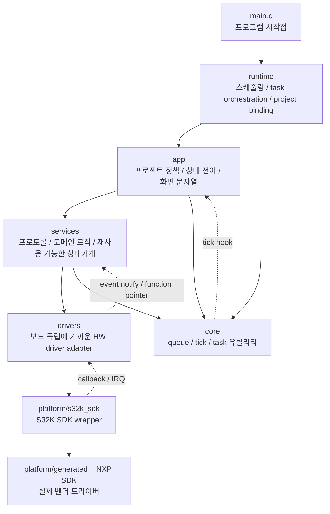
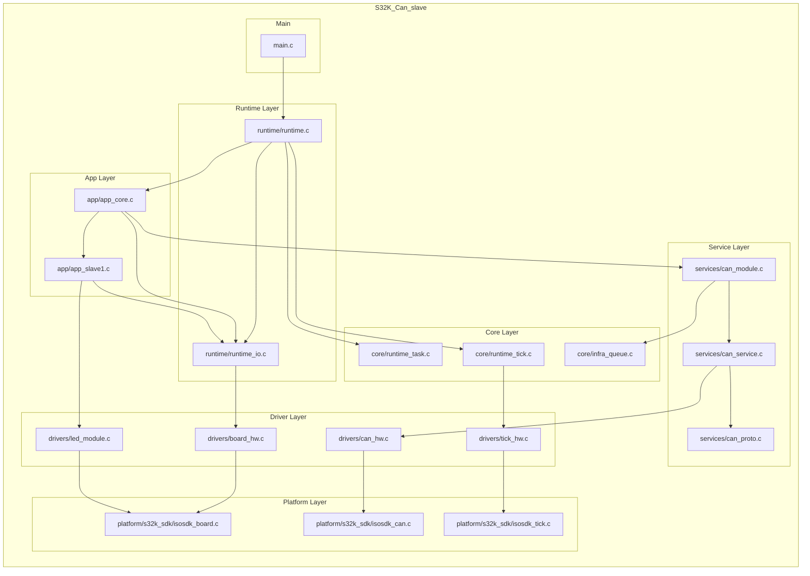
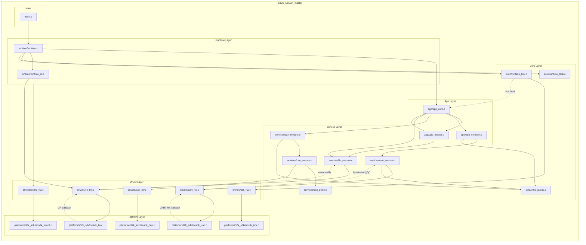
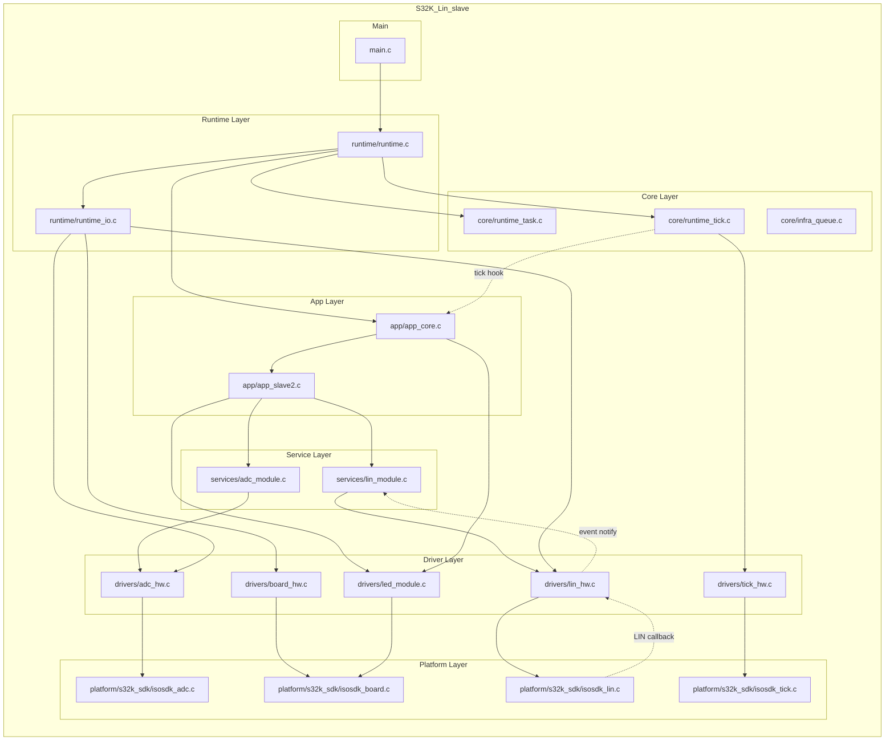

# S32K 레이어 분리 다이어그램

이 문서는 [`s32k_project_onepage_diagrams.md`](./s32k_project_onepage_diagrams.md)를 바탕으로,
이번에는 "함수 흐름"보다 한 단계 위에서 레이어 분리가 어떻게 되어 있는지 보이도록 정리한 문서다.

## 공통 레이어 구조

### 공통적으로 보이는 분리 포인트

- `main.c`는 시작만 하고 실제 조립은 `runtime`으로 넘긴다.
- `runtime`은 task table, tick hook 등록, `runtime_io`를 통한 project binding을 맡는다.
- `app`은 프로젝트별 정책을 담고, 직접 SDK를 부르지 않고 `services`나 `runtime_io`를 통해 내려간다.
- `services`는 프로토콜과 상태기계를 담는다.
- `drivers`는 보드/주변장치 수준 API를 정리해 주고, 실제 S32K SDK 호출은 `platform/s32k_sdk`에 몰아둔다.
- `core`는 여러 레이어가 함께 쓰는 기반 유틸리티 레이어다.

### 의존성 역전이 일어나는 대표 지점

- `RuntimeTick_RegisterHook(AppCore_OnTickIsr)` : `core/runtime_tick`이 나중에 `app` 함수를 호출한다.
- `LinModule` binding : `services/lin_module`이 function pointer로 `drivers/lin_hw`를 사용한다.
- `IsoSdk_Lin*` callback : `platform -> drivers -> services` 방향으로 이벤트가 다시 올라온다.
- `IsoSdk_Uart*` callback : `platform -> drivers/uart_hw -> services/uart_service`로 RX 이벤트가 올라온다.

---

## S32K_Can_slave 레이어 분리

### 이 프로젝트에서 레이어가 나뉘는 느낌

- `app_core.c`, `app_slave1.c`가 정책 레이어다.
- CAN 프로토콜과 transport는 `services`로 내려가 있고, 실제 FlexCAN mailbox 처리는 `drivers/can_hw.c`로 한 번 더 분리되어 있다.
- `runtime_io.c`는 "이 프로젝트에서 어떤 보드 자원을 쓸지" 조립하는 binding 레이어 역할을 한다.
- 이 프로젝트는 LIN/UART가 빠져 있어서 레이어 구조가 가장 단순하다.

### 분리 포인트 한 줄 요약

- `app -> can_module -> can_service -> can_hw -> isosdk_can`
- `app -> runtime_io -> board_hw -> isosdk_board`
- `core/runtime_tick -> tick_hw -> isosdk_tick`

---

## S32K_LinCan_master 레이어 분리

### 이 프로젝트에서 레이어가 나뉘는 느낌

- `app_core.c`가 전체 orchestration의 중심이다.
- `app_master.c`는 정책 판단만 담당하고, 실제 통신은 `lin_module`, `can_module`, `app_console` 같은 하위 레이어에 맡긴다.
- `services/lin_module.c`는 비교적 잘 분리된 portable state machine이다. 실제 HW 접근을 function pointer binding으로 외부에서 주입받는다.
- `services/uart_service.c`는 service 레이어지만 `drivers/uart_hw.c`와 밀접하게 붙어 있는 편이다.
- `runtime_io.c`가 master 프로젝트 전용 LIN 설정과 attach 동작을 맡아서, 프로젝트 조립점 역할이 분명하다.

### 분리 포인트 한 줄 요약

- `app -> app_console -> uart_service -> uart_hw -> isosdk_uart`
- `app -> can_module -> can_service -> can_hw -> isosdk_can`
- `app/app_master -> lin_module -> lin_hw -> isosdk_lin`
- `runtime_tick -(hook)-> app_core -(OnBaseTick)-> lin_module`

---

## S32K_Lin_slave 레이어 분리

### 이 프로젝트에서 레이어가 나뉘는 느낌

- `app_slave2.c`는 센서 노드 정책 레이어고, 실제 ADC 해석은 `adc_module.c`로 분리되어 있다.
- `adc_module.c`는 꽤 잘 분리된 service 레이어다. 샘플 함수와 init 함수만 config로 받아서 HW에서 독립적인 편이다.
- `lin_module.c`도 master 쪽과 같은 방식으로 분리되어 있어, slave 역할 차이는 설정과 event 처리 쪽에 집중된다.
- `runtime_io.c`가 ADC threshold, LIN PID, OK token 같은 프로젝트별 상수를 모아 조립하는 역할을 한다.

### 분리 포인트 한 줄 요약

- `app -> adc_module -> adc_hw -> isosdk_adc`
- `app -> lin_module -> lin_hw -> isosdk_lin`
- `app -> led_module / runtime_io -> board_hw -> isosdk_board`
- `runtime_tick -(hook)-> app_core -(OnBaseTick)-> lin_module`

---

## 레이어 분리 관점에서 보면

### 비교적 잘 분리된 부분

- `platform/s32k_sdk` 아래로 실제 S32K SDK 호출을 몰아둔 점
- `runtime_io`를 두어서 프로젝트별 조립 지점을 만든 점
- `lin_module`, `adc_module`처럼 config/binding 기반으로 분리된 상태기계

### 상대적으로 결합이 남아 있는 부분

- `can_service`는 `can_hw`를 직접 안고 있어서 완전한 transport interface 분리는 아니다.
- `uart_service`도 `uart_hw`와 직접 연결되어 있어, LIN 쪽만큼 느슨한 binding 구조는 아니다.

### 발표나 문서에서 표현하기 좋은 한 줄

- "이 코드베이스는 `main -> runtime -> app -> services -> drivers -> platform`의 하향 레이어 구조를 기본으로 하고, tick hook과 peripheral callback에서만 제한적으로 상향 이벤트가 올라오는 형태다."

