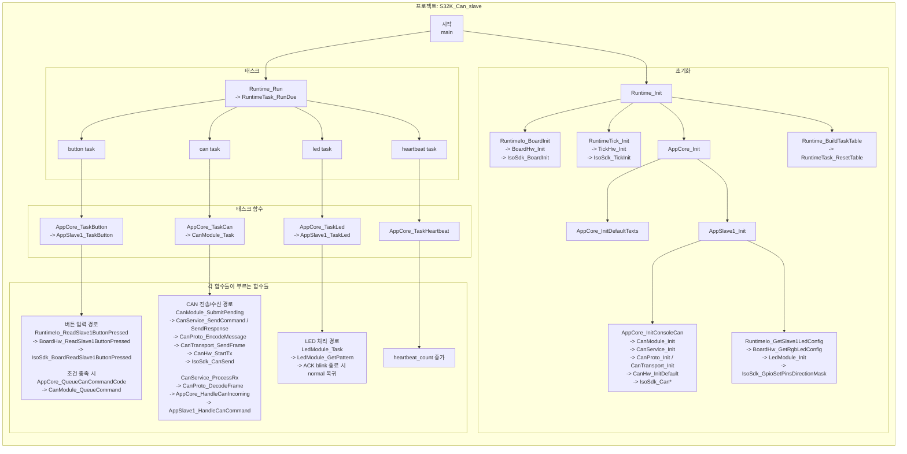
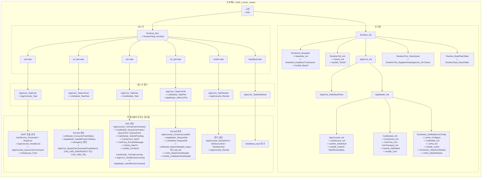
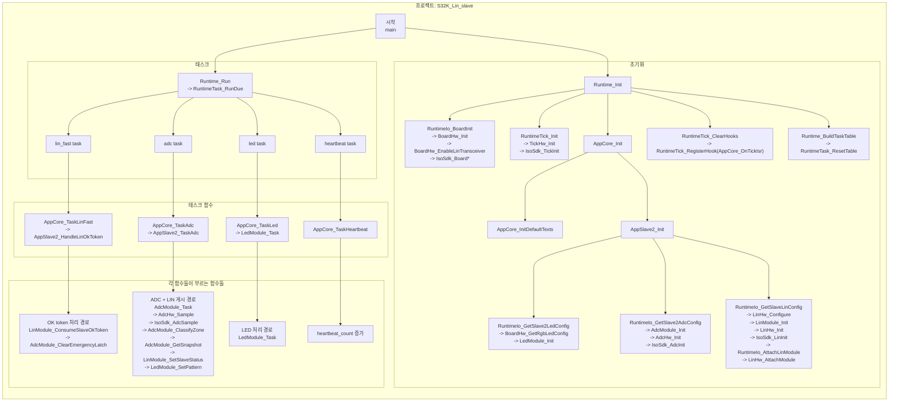

# S32K 프로젝트별 한장 다이어그램

이 문서는 프로젝트마다 한 장씩, 아래 순서로 흐름을 묶어서 보여준다.

- 프로젝트
- 시작
- 초기화
- 태스크
- 태스크 함수
- 각 함수들이 부르는 함수들

세부 caller/callee 표는 [`s32k_call_flow_report.md`](./s32k_call_flow_report.md)를 보면 된다.

---

## S32K_Can_slave

---

## S32K_LinCan_master

---

## S32K_Lin_slave

