# S32K 태스크 기준 레이어 호출 맵

이 문서는 아래 형태로 정리했다.

`태스크 -> 모듈 -> 그 모듈이 부르는 함수들을 레이어별로 구분`

읽는 법:

- 가장 왼쪽은 `Runtime Layer`의 태스크 진입점이다.
- 가운데는 실제 정책이 들어 있는 `App Layer` 모듈이다.
- 오른쪽으로 갈수록 `Service -> Driver -> Platform` 순으로 내려간다.
- 콜백이나 hook처럼 다시 위로 올라오는 경로는 점선으로 표시했다.

세부 함수 전수표는 [`s32k_call_flow_report.md`](./s32k_call_flow_report.md)를 보면 된다.

---

## S32K_Can_slave

### button task

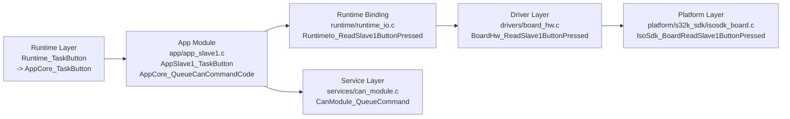

### can task

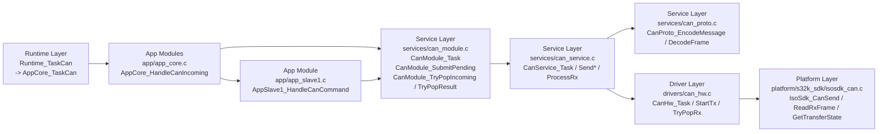

### led task

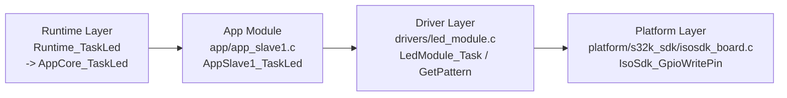

### heartbeat task

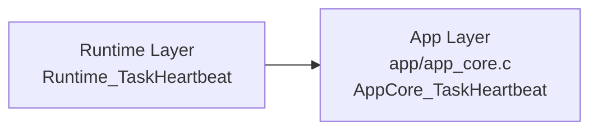

---

## S32K_LinCan_master

### uart task

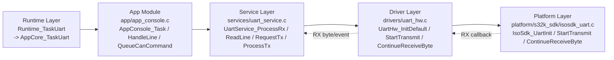

### can task

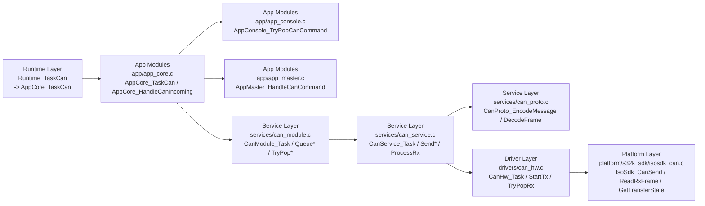

### lin_fast task

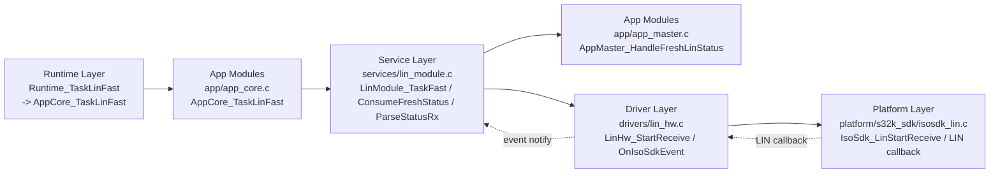

### lin_poll task

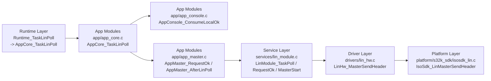

### render task

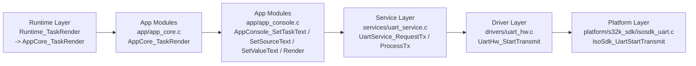

### heartbeat task

### tick hook / callback 보조 흐름

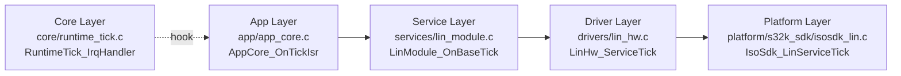

---

## S32K_Lin_slave

### lin_fast task

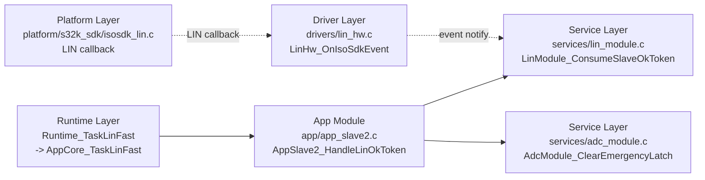

### adc task

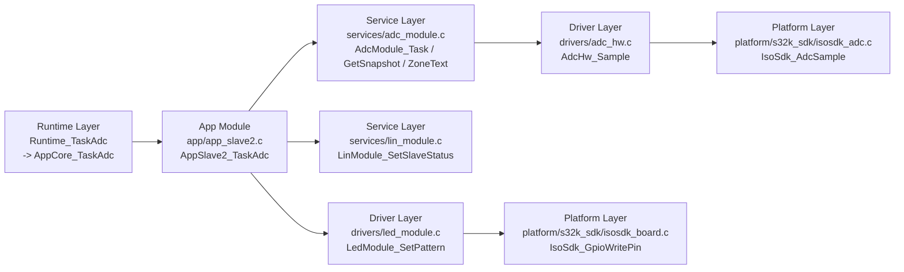

### led task

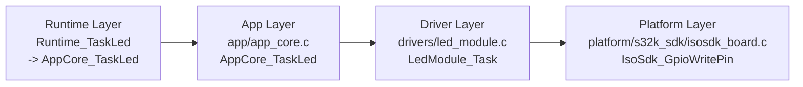

### heartbeat task

### tick hook / callback 보조 흐름

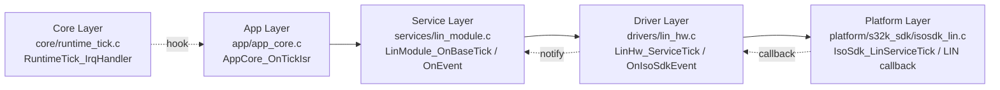

