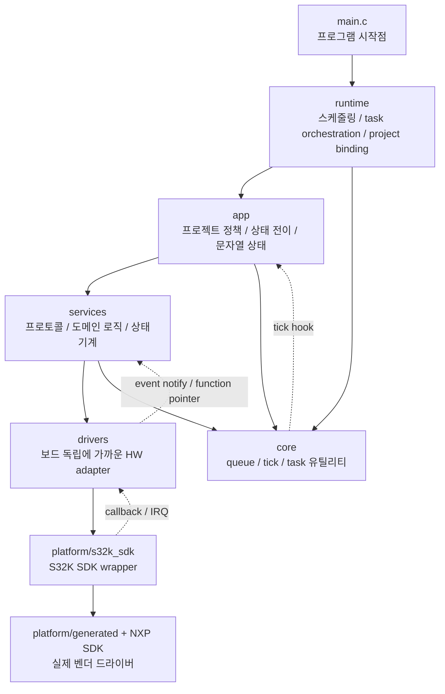
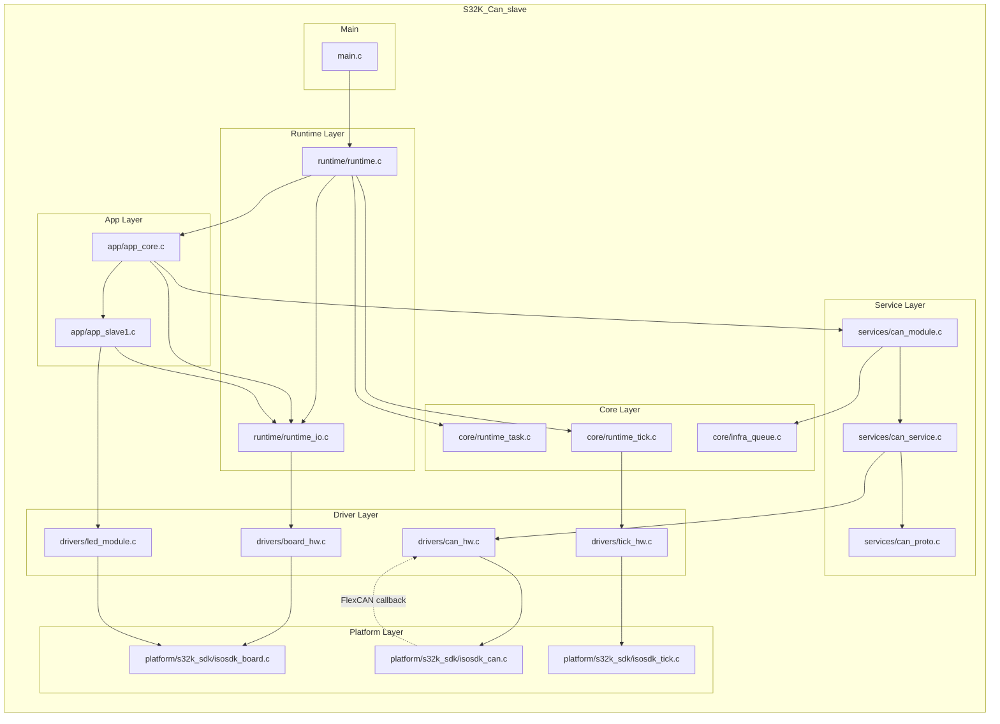
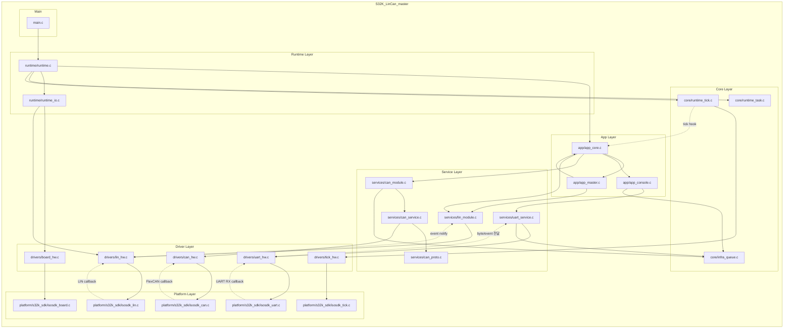
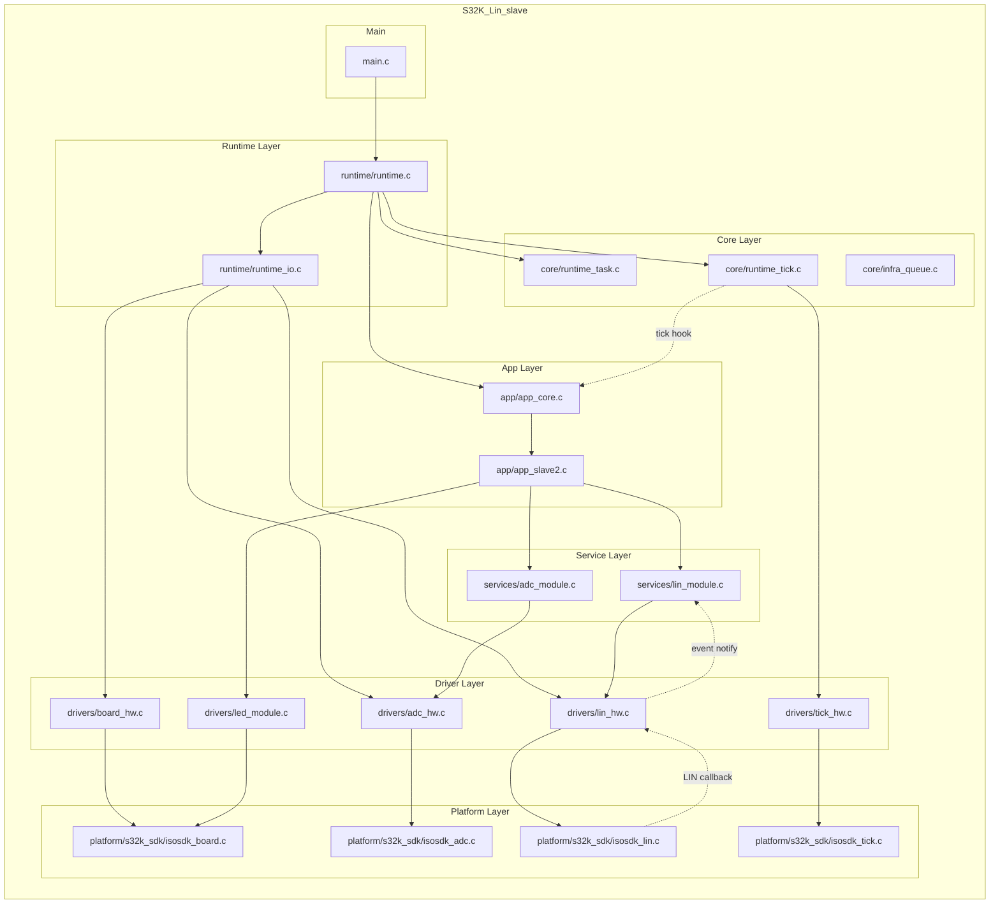

# S32K 레이어 분리 다이어그램

이 문서는 `re_5`의 세 프로젝트를 기준으로, 함수 호출 세부보다 한 단계 위에서
레이어가 어떻게 분리되어 있는지 보이도록 정리한 문서다.

보조 자료:
- [s32k_task_layer_maps.md](./s32k_task_layer_maps.md)
- [s32k_project_function_variable_outline.md](./s32k_project_function_variable_outline.md)

## 공통 레이어 구조

### re_5에서 특히 봐야 할 분리 포인트

- `RuntimeTick_RegisterHook(AppCore_OnTickIsr)`로 `core -> app` 역방향 호출이 있다.
- `LinModule`은 function pointer binding으로 `services -> drivers` 의존을 느슨하게 만든다.
- UART RX는 `platform -> drivers/uart_hw -> services/uart_service`로 callback이 올라온다.
- CAN RX는 `re_5`에서 `platform/s32k_sdk/isosdk_can -> drivers/can_hw` callback이 먼저 들어오고, 이후 task 문맥에서 service가 queue를 drain한다.

---

## S32K_Can_slave 레이어 분리

### 이 프로젝트에서 레이어가 나뉘는 느낌

- `app_core.c`, `app_slave1.c`가 정책 레이어다.
- CAN protocol/transport는 `services`에 있고, 실제 mailbox 처리와 callback 수신은 `drivers/can_hw.c`가 맡는다.
- `re_5`에서는 CAN RX 완료가 `platform -> driver` callback으로 먼저 올라온다는 점이 `re_4`와 다르다.
- `runtime_io.c`는 프로젝트 전용 보드 binding을 묶어 주는 조립점이다.

---

## S32K_LinCan_master 레이어 분리

### 이 프로젝트에서 레이어가 나뉘는 느낌

- `app_core.c`가 전체 orchestration 중심이다.
- `app_master.c`는 정책 판단, `app_console.c`는 operator UI, `services`는 실제 protocol/state machine을 맡는다.
- LIN/UART뿐 아니라 CAN도 callback 보조 경로가 있어 역방향 흐름이 가장 많다.
- `runtime_io.c`는 master 전용 LIN binding과 보드 조립을 맡는다.

---

## S32K_Lin_slave 레이어 분리

### 이 프로젝트에서 레이어가 나뉘는 느낌

- 센서 해석은 `services/adc_module.c`, LIN protocol은 `services/lin_module.c`로 분리되어 있다.
- `app/app_slave2.c`는 두 service를 조합해서 정책을 만든다.
- tick hook과 LIN callback이 있어 단순해 보여도 역방향 흐름은 분명하다.

---

## 빠른 비교

- `S32K_Can_slave`
  - 가장 단순한 구조지만 `re_5`에서는 CAN RX callback 경로가 분명히 존재한다.

- `S32K_LinCan_master`
  - 레이어 수는 같지만 callback 종류가 가장 많아서 실제 구조는 가장 입체적이다.

- `S32K_Lin_slave`
  - ADC + LIN 두 축만 보면 되어서 구조를 읽기 가장 쉽다.
