# S32K 태스크 기준 레이어 호출 맵

이 문서는 `re_5` 기준으로 아래 형태를 정리한다.

`태스크 -> 앱 정책 -> 서비스 -> 드라이버 -> 플랫폼`

읽는 법:

- 가장 왼쪽은 `Runtime Layer`의 태스크 진입점이다.
- 가운데는 실제 정책이 들어 있는 `App Layer`와 `Service Layer`다.
- 오른쪽으로 갈수록 `Driver -> Platform` 순으로 내려간다.
- `re_5`에서는 CAN RX가 polling 완료 확인이 아니라 `FlexCAN callback` 기반이므로, CAN 쪽에는 점선 callback 경로를 같이 표시했다.

함수 단위 상세 흐름은 [s32k_project_function_variable_outline.md](./s32k_project_function_variable_outline.md)를 보면 된다.

---

## S32K_Can_slave

### button task

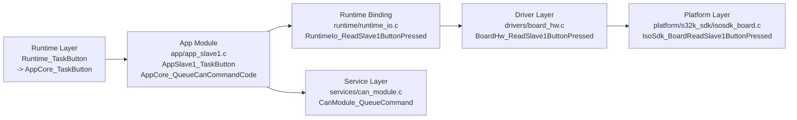

### can task

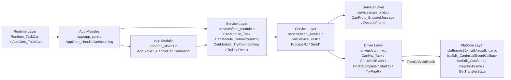

### led task

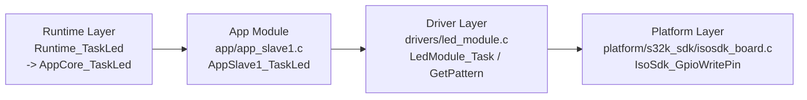

### heartbeat task

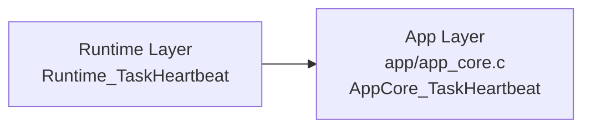

### can callback / IRQ 보조 흐름

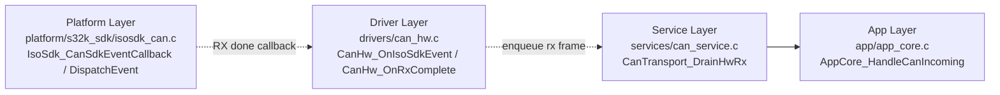

---

## S32K_LinCan_master

### uart task

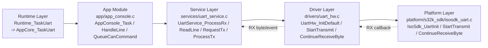

### can task

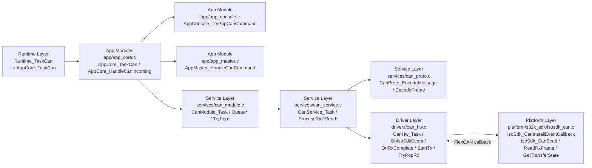

### lin_fast task

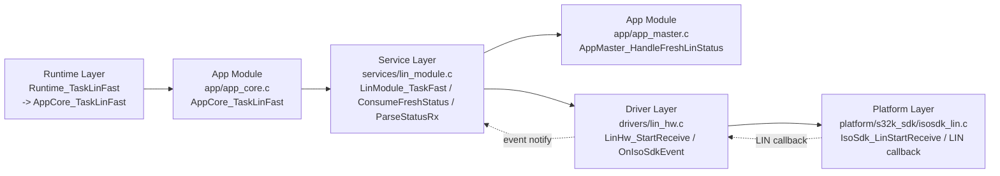

### lin_poll task

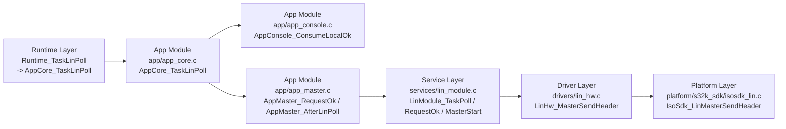

### render task

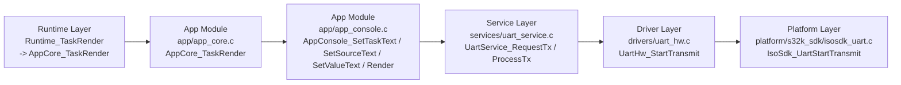

### heartbeat task

### tick hook / callback 보조 흐름

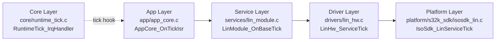

### can callback / IRQ 보조 흐름

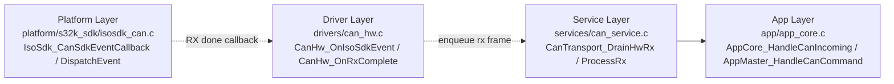

---

## S32K_Lin_slave

### lin_fast task

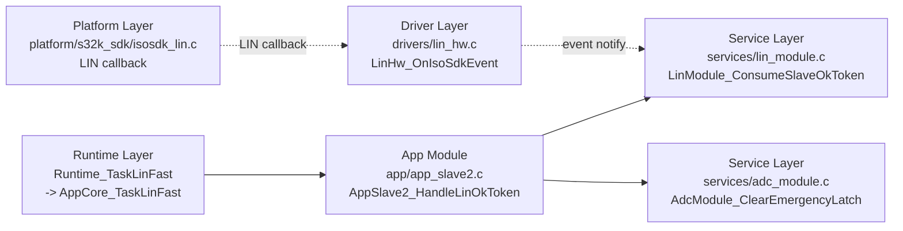

### adc task

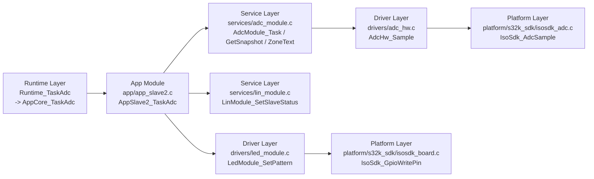

### led task

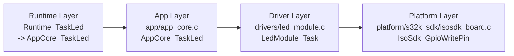

### heartbeat task

### tick hook / callback 보조 흐름

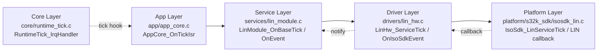

---

## 빠른 요약

- `S32K_Can_slave`
  - 버튼과 CAN 명령을 받아 LED와 CAN 응답으로 반응한다.
  - `re_5`에서는 CAN RX 완료가 callback으로 `drivers/can_hw.c`에 먼저 들어온다.

- `S32K_LinCan_master`
  - UART console, CAN, LIN을 모두 엮는 orchestration 중심 노드다.
  - CAN/LIN/UART 모두 callback 또는 hook 보조 흐름이 있어 레이어 역방향 경로가 가장 많다.

- `S32K_Lin_slave`
  - ADC 해석 결과를 LIN 상태로 게시하는 센서 노드다.
  - 레이어 구조는 가장 단순하지만 tick hook + LIN callback 흐름은 분명히 존재한다.
